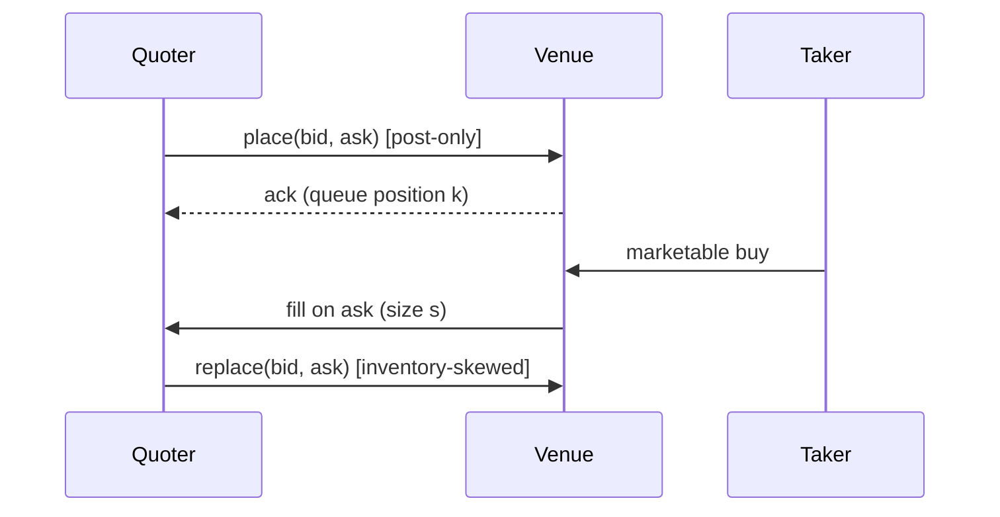

# 0. Course charter & sources

!!! abstract "Where this chapter fits"
    **Read first.** This chapter defines the source-tiering rule that every later citation relies on. Without it, the "Tier-A / Tier-B / Tier-C" labels in [§1–§7](01-introduction.md) and the [appendices](appendix-b-sources.md) lose their meaning. It also names the seven papers that the rest of the course presumes you will at least skim — if you remember nothing else from this chapter, remember §0.4.
    **Continue with:** [§1 — what market making actually is](01-introduction.md) for the framing, then [§2 microstructure foundations](02-microstructure.md).

## 0.1 What this course is, and what it is not

Electronic market making is one of the most over-promised topics in quantitative finance, in roughly the same way and for roughly the same reasons that statistical arbitrage is. On any given week the internet will hand you a "delta-neutral quoter that prints money from the bid-ask spread" and ask you to take it on faith. Most of those quoters do not survive ten minutes of careful examination — they assume away adverse selection, they price queue position as zero, they ignore inventory risk, or they backtest against trade prints rather than against a reconstructed limit order book. If anyone tells you their market-making course will make you rich on default parameters, they are either lying or have not run a calibrated LOB-replay backtest.

There is also a real, working version of the field. Its math is settled and has been since [Glosten & Milgrom (1985)](appendix-b-sources.md), [Kyle (1985)](appendix-b-sources.md), and [Ho & Stoll (1981)](appendix-b-sources.md). Its modern operational form was written down by [Avellaneda & Stoikov (2008)](appendix-b-sources.md) and extended in closed form by [Guéant, Lehalle & Fernandez-Tapia (2013)](appendix-b-sources.md). The textbook synthesis is [Cartea, Jaimungal & Penalva (2015)](appendix-b-sources.md). What changes year to year is not the math — it is the *venue plumbing*: tick sizes, fee schedules, queue priority rules, message-rate caps, post-only flags, the difference between FIFO and pro-rata matching engines. This course teaches the math the field has agreed on and the operational discipline that makes the math survive contact with a real venue. It is the companion to [the stat-arb course](../stat-arb/00-charter-and-sources.md), same voice, same rules, same refusal to ship equity curves as proof.

This is **not** a textbook. A textbook would prove every result; we cite where the proof is and say which proofs are worth reading end-to-end versus which to skim. Read [Cartea, Jaimungal & Penalva (2015)](appendix-b-sources.md) cover-to-cover; skim [Avellaneda & Stoikov (2008)](appendix-b-sources.md) once you have implemented the closed-form quotes twice. It is also **not** a "secrets revealed" pitch — the math is public, the edge is in latency, queue position, inventory control, and the operational stack the math sits inside. We are not teaching the latency arms race; see the [home page](index.md) for who the course is and is not for.

## 0.2 The source-tiering rule

Every claim in this course should be traceable to one of three tiers. The tiering matters because the most common way to be wrong in market making is exactly the same as the most common way to be wrong in stat arb: read one practitioner thread, treat it as gospel, and never check whether the underlying claim survives a peer-reviewed treatment. Market making attracts even more practitioner folklore than stat arb because the operational tempo is faster and the stack is more proprietary — so the discipline has to be tighter, not looser.

| Tier | Description | Examples | What it can support |
|---|---|---|---|
| **A — Foundational literature** | Peer-reviewed papers, monographs, or textbooks. Verified citations with full bibliographic detail. The proof of the underlying mathematical claim lives here. | Glosten & Milgrom (1985), Kyle (1985), Ho & Stoll (1981), Avellaneda & Stoikov (2008), Guéant–Lehalle–Fernandez-Tapia (2013), Cartea–Jaimungal–Penalva (2015), Stoikov & Saglam (2009) | Any claim. These are the load-bearing citations. |
| **B — Reference implementations** | Open-source code we can read. URLs verified before citing. The *implementation* of a Tier-A result lives here, with all the corner cases the paper glossed over. | `nautilus_trader`, `hummingbot`, `mbt-gym`, the `frbny-dsge`-style LOB simulators, `lobster`-format parsers, `roq-trading` examples. | "Here is one way to implement claim X." Cannot support a claim about *what is true* — only "what one project did." |
| **C — Practitioner commentary** | Blog posts, X threads, podcasts, conference talks, exchange engineering blogs. Useful for venue plumbing and operational sharpness; never load-bearing on its own. Always marked unverified until the source is fetched and cross-checked against Tier A. | The Hummingbot foundation's strategy notes; the Deribit / Binance exchange-engineering posts; practitioner threads from named, accountable handles. | "Here is operational lore worth knowing." Only cited when paired with a Tier-A mapping that supports the underlying mathematical or microstructural claim. |

**Promotion rule (what wins when they disagree).** A Tier-C source is never the sole support for a claim in this course. It can illustrate something Tier A already proves, or operationalise something Tier A states abstractly, but if it *contradicts* Tier A then Tier A wins. A peer-reviewed paper has been scrutinised by trained reviewers; an exchange engineering blog has been scrutinised by the exchange's marketing department. Both can be right; only one has been checked by adversarial reviewers with no commercial stake. When a venue engineering post contradicts [Glosten & Milgrom (1985)](appendix-b-sources.md) on something like "adverse selection only matters at extreme tick sizes," the paper wins and the venue post is recorded as a hypothesis to test — usually against the venue's own data.

**Why this matters in market making specifically.** A lot of folklore confuses *venue-specific* claims with *general* claims. "Post-only orders never get adversely selected" is a venue-specific statement about a matching engine; the *general* claim — that adverse selection follows from information asymmetry between maker and marketable counterparty, independent of order flag — is [Glosten & Milgrom (1985)](appendix-b-sources.md). The venue claim is a *consequence* of the general claim under specific rules, not a counter-example. Keep the levels of abstraction separate and the folklore stops being confusing.

## 0.3 Source-collection method

Same method as the [stat-arb course](../stat-arb/00-charter-and-sources.md), with one addition specific to market making.

**Step one: list before reading.** Before reading a paper, we list it with a one-line "what claim does this support." This forces the question "do we actually need this paper, or are we citing it because it sounds impressive?" The seven canonical papers in §0.4 all earn their place by supporting a *specific* claim the course makes.

**Step two: read with the claim in mind.** A paper's abstract often does not match the claim we need. Glosten & Milgrom is read for the *adverse-selection-component-of-the-spread* result, not the full equilibrium derivation. Avellaneda-Stoikov is read for the *closed-form optimal quotes under inventory aversion*, not the dynamic-programming exposition. We note the section the claim lives in and the assumptions it relies on — those assumptions are usually what breaks in production.

**Step three: cross-check open-source implementations.** Most Tier-A market-making papers have at least one Tier-B reference implementation. The implementation will have made every corner-case decision the paper deferred. Where the two disagree, we note it.

**Step four (new for market making): record the venue assumptions.** Every market-making result is stated under venue assumptions: tick size, fee schedule, matching rule (FIFO vs pro-rata), message-rate cap, maker rebate, self-trade prevention. Papers state these abstractly; the course records the *specific* venue parameters under which each claim has been tested, so you know whether to expect it to transfer to your venue.

**Step five: archive Tier-C, do not just link.** Timelines rot, blogs go behind paywalls, exchange engineering teams rotate. Every promoted Tier-C source is archived in `_archive/` with a fetch date — same discipline as the [stat-arb course's RohOnChain archive](../stat-arb/00-charter-and-sources.md).

## 0.4 The canonical market-making papers you must read

If you read nothing else from the course's bibliography, read these seven. Each is load-bearing for at least one chapter and is cited by short tag throughout the rest of the course.

- **GM85** — [Glosten & Milgrom, "Bid, Ask and Transaction Prices in a Specialist Market with Heterogeneously Informed Traders"](appendix-b-sources.md) (Journal of Financial Economics, 1985). The foundational *adverse-selection* model. Where the bid-ask spread comes from when some counterparties are better-informed than the market maker. Load-bearing for §2's spread decomposition.

- **K85** — [Kyle, "Continuous Auctions and Insider Trading"](appendix-b-sources.md) (Econometrica, 1985). The model of how a single informed trader's order flow moves price. Load-bearing for the *price-impact / Kyle-lambda* result in §2.6 and the adverse-selection cost calibration in §5.4.

- **HS81** — [Ho & Stoll, "Optimal Dealer Pricing under Transactions and Return Uncertainty"](appendix-b-sources.md) (Journal of Financial Economics, 1981). The foundational *inventory* model. Where the inventory-skew term in a market maker's quotes comes from. Load-bearing for the motivation of §3 and the historical framing of why Avellaneda-Stoikov looks the way it does.

- **AS08** — [Avellaneda & Stoikov, "High-Frequency Trading in a Limit Order Book"](appendix-b-sources.md) (Quantitative Finance, 2008). The modern canonical formulation: HJB-derived optimal bid and ask quotes for a risk-averse market maker holding inventory, in closed form for the linear-utility approximation. Load-bearing for the entire §3 derivation and the code shapes in Appendix A.

- **GLFT13** — [Guéant, Lehalle & Fernandez-Tapia, "Dealing with the Inventory Risk: A Solution to the Market Making Problem"](appendix-b-sources.md) (Mathematics and Financial Economics, 2013). The closed-form fix to Avellaneda-Stoikov's "terminal time $T$" awkwardness; gives the *infinite-horizon* asymptotic that practitioners actually quote with. Load-bearing for §3.5.

- **CJP15** — [Cartea, Jaimungal & Penalva, *Algorithmic and High-Frequency Trading*](appendix-b-sources.md) (Cambridge University Press, 2015). The textbook synthesis of the whole field through 2015. The honourable exception to the rule that market-making textbooks ship no code. Load-bearing as the *reference treatment* for §2 through §5 — when this course differs from CJP, we say why.

- **SS09** — [Stoikov & Saglam, "Option Market Making under Inventory Risk"](appendix-b-sources.md) (Review of Derivatives Research, 2009). The extension of the Avellaneda-Stoikov framework to non-linear instruments (options) and, more generally, the cleanest treatment of *risk-aversion calibration* — how to choose the $\gamma$ parameter in AS08 without hand-waving. Load-bearing for the calibration discussion in §3.7 and §5.6.

Tier-B repos and Tier-C practitioner sources used by individual chapters are catalogued in [Appendix B](appendix-b-sources.md). The seven papers above are the *non-negotiable* reading; everything else is reference-as-needed.

## 0.5 Course conventions

**Math.** All math is rendered with MathJax via `pymdownx.arithmatex`. Inline math uses `$...$` (for example, the inventory-skew term in Avellaneda-Stoikov is $\delta^a - \delta^b \propto q$). Display math uses `$$...$$`. We use the same notational conventions as [Cartea, Jaimungal & Penalva (2015)](appendix-b-sources.md) wherever possible — $S_t$ for the mid-price, $q_t$ for signed inventory, $\delta^{a,b}$ for the ask/bid quote distances from mid, $\gamma$ for the maker's risk aversion, $\sigma$ for mid-price volatility, $\lambda$ for the order-arrival intensity — so that you can read this course and CJP side by side without translating.

The Avellaneda-Stoikov reservation price, which we will derive in §3.3, looks like this in display:

$$
r(s, q, t) = s - q \gamma \sigma^2 (T - t)
$$

and the optimal half-spread is

$$
\delta^a + \delta^b = \gamma \sigma^2 (T - t) + \frac{2}{\gamma} \ln\!\left(1 + \frac{\gamma}{k}\right).
$$

If those two formulas are unfamiliar now, that is fine — §3 derives them step by step. They appear here so you can verify the rendering works in your build.

**Code.** All code blocks are TypeScript unless flagged otherwise, mirroring the shapes used in the Meridian Markets engine. A typical shape:

```typescript
interface Quote {
  readonly side: 'bid' | 'ask';
  readonly price: number;      // venue-tick-rounded
  readonly size: number;       // venue-lot-rounded
  readonly postOnly: boolean;  // default true for makers
}

interface IQuoter {
  quote(state: MarketState, inventory: number): readonly [Quote, Quote];
}
```

We do not ship runnable end-to-end systems in the course body. The code blocks are *shapes*: interfaces, pure functions, invariants. For a fully runnable reference, chapters cross-link to the relevant Tier-B repo (Hummingbot's `pure_market_making` is the easiest entry point) and to the Meridian engine's adapters.

**Diagrams.** Mermaid for sequence diagrams (§2.3), state machines (§5.7), and flow diagrams (§7.2). The canonical quote-time interaction:



Convention: interactions between components get a Mermaid; state evolution over time gets math. The reader should be able to verify the diagram matches the math without ambiguity.

**Admonitions.** mkdocs-material admonitions: "abstract" (chapter-fit summary), "warning" (failure modes), "success" (verified citations), "info" (notational reminders). The vocabulary is restricted on purpose.

## 0.6 Relationship to the stat-arb sister course

This course and [the stat-arb course](../stat-arb/00-charter-and-sources.md) are written to be read together, in either order, by the same reader. They share three things:

- **The voice and source discipline.** Same tiering rule, same promotion discipline, same flat tone, same refusal to ship equity curves. If you have read [stat-arb §0](../stat-arb/00-charter-and-sources.md) you can skip to §0.4 above.
- **The infrastructure layer.** The execution abstraction (`ITradingVenue`), the risk module (kill switches, inventory caps), and the backtest harness are shared. Both courses' §4 (execution) and §5 (risk) deliberately use the same chapter numbers for the shared concerns.
- **The reader.** Same baseline — undergrad linear algebra and probability, stochastic processes through Itô's lemma, comfort reading code.

They differ in three places:

- **The signal.** Stat arb's signal is a mean-reverting spread between cointegrated instruments; the bet is that the spread reverts. Market making's signal is the bid-ask spread itself; the bet is that the spread compensates for inventory risk and adverse-selection cost. The machinery differs: stat arb uses cointegration tests and OU fits ([§2–§3 of stat-arb](../stat-arb/02-cointegration.md)); market making uses Hamilton-Jacobi-Bellman equations and Poisson order-arrival models ([§3 here](03-avellaneda-stoikov.md)).
- **The operational tempo.** Hours-to-weeks vs milliseconds-to-minutes. A stat-arb desk can afford a one-second polling loop and human review; a market-making desk cannot. Stat-arb §7 is about *capital-ramp discipline*; market-making §7 is about *latency budgets and circuit breakers*.
- **What kills you.** Stat-arb books die when cointegration breaks (§3 and §5 of stat-arb). Market-making books die when toxic flow finds them (§2.7 and §5.4 of this course). Stat arb is about *recognising regime change*; market making is about *recognising adversaries in real time*.

The cleanest path for a reader new to both: stat-arb §0–§3, then market-making §0–§3, then both courses' §4–§7 in parallel.

## Sources for this chapter

This chapter is methodology; its citations are to the seven canonical papers it asks you to read and to the sister course it builds on. Full bibliographic detail in [Appendix B](appendix-b-sources.md).

- **Tier A — the seven canonical papers** (named in §0.4): Glosten & Milgrom (1985, *JFE*); Kyle (1985, *Econometrica*); Ho & Stoll (1981, *JFE*); Avellaneda & Stoikov (2008, *Quantitative Finance*); Guéant, Lehalle & Fernandez-Tapia (2013, *Mathematics and Financial Economics*); Cartea, Jaimungal & Penalva (2015, *Algorithmic and High-Frequency Trading*, Cambridge University Press); Stoikov & Saglam (2009, *Review of Derivatives Research*).

- **Tier B — open-source reference implementations**: `hummingbot/hummingbot` (the `pure_market_making` strategy is the easiest Avellaneda-Stoikov starting point); `nautilus_trader` (the cleanest open-source backtest harness with LOB-replay support); `mbt-gym` (academic reinforcement-learning environment built around the Avellaneda-Stoikov model). URLs and verification dates in [Appendix B](appendix-b-sources.md).

- **Tier C — practitioner commentary**: deferred. None promoted into this chapter's body. The chapter is methodology; practitioner folklore enters in §2 (microstructure operational lore) and §5 (kill-switch design) and is archived in `_archive/` per §0.3 step five.

- **Sister course**: [Meridian stat-arb course, §0 charter and sources](../stat-arb/00-charter-and-sources.md). Read in parallel.

Next: [§1 — what market making actually is](01-introduction.md).
