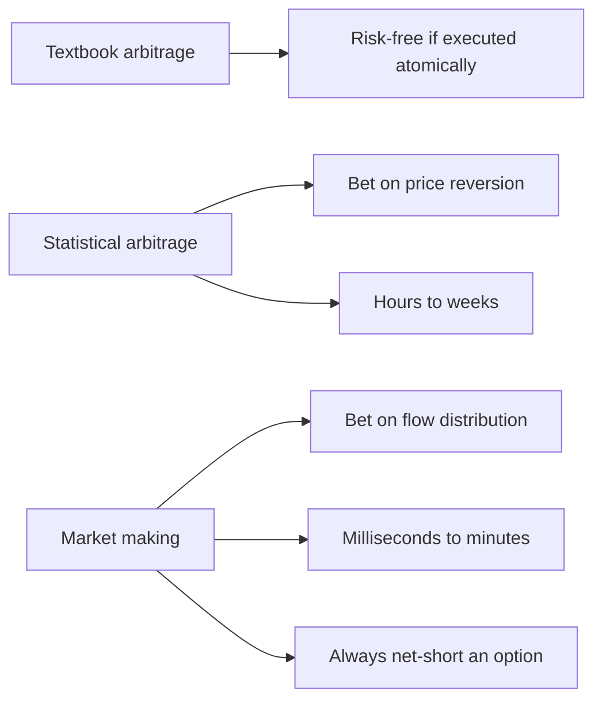
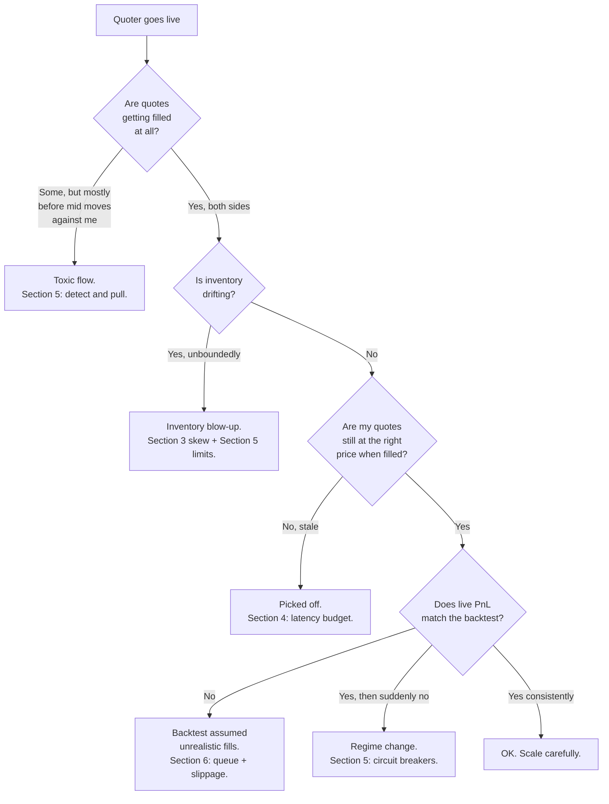

# 1. What market making actually is

!!! abstract "Where this chapter fits"
    **Feeds in from:** [§0 — course charter](00-charter-and-sources.md). Read §0 first if you haven't seen the source-tiering rule. If you haven't read the sister course's §1, the comparison table below carries enough of it to make this chapter stand alone.
    **Feeds into:** [§2 microstructure](02-microstructure.md) (the limit-order-book mechanics this chapter takes for granted) and [§3 Avellaneda-Stoikov](03-avellaneda-stoikov.md) (the first inventory-aware quoting model); [§5 risk](05-risk.md) (the failure modes named here become the kill-switch list there); [§7 production](07-production.md) (the operational envelope this whole thing has to fit inside).
    **Read alone if:** you want a one-sitting "is market making worth my engineering time?" overview — §1 + [§7](07-production.md) is enough.

## 1.1 The one-paragraph definition

Market making is **selling immediacy at a price.** You post a bid and an ask. Whoever wants to buy *now* lifts your ask; whoever wants to sell *now* hits your bid. The price they pay for the service of trading immediately, rather than waiting and negotiating, is the **spread** — the gap between your bid and your ask. Your gross revenue is the spread times the number of round-trip fills you collect. Your costs are (a) the venue's fees minus its rebates, (b) the inventory you accumulate when one side fills more than the other, and (c) the losses you take when the trader who hit you was right and the price moves against your new position before you can unload it. The third cost — **adverse selection** — is what separates a viable quoter from a subsidy. Market making is the business of pricing the spread wide enough to cover all three.

A worked example to anchor the definition. BTC/USDT is trading at a mid of \$65,000. You post a bid at 64,990 and an ask at 65,010 — a 20-dollar quoted spread, ten dollars either side of mid. Over the next minute, suppose 100 takers cross your bid and 100 takers cross your ask. You collected the 20-dollar spread 100 times, your gross is \$2,000, inventory is roughly flat, and life is good. Now suppose the next minute is different: the market is about to print a bad CPI number, smart traders know it, and 150 takers hit your bid while only 50 lift your ask. Your inventory is now long 100 BTC at an average price near 64,990. The price drops to 64,500 in five seconds. The 20-dollar spread per fill does not cover a 490-dollar adverse move on 100 BTC. The spread is the revenue. The inventory is the risk. The traders who pick off your stale side are the cost.

The market-making bet is therefore on a **flow distribution**, not a price reversion. You are not betting that BTC reverts to 65,000. You are betting that the *mix* of informed and uninformed flow that crosses your quotes pays more in spread than it costs you in adverse selection. The rest of the course is about (a) sizing the spread for the flow you face, (b) skewing quotes when inventory drifts so you do not accumulate one-sided risk, (c) detecting toxic flow fast enough to widen or pull, and (d) running the machinery on a latency budget that lets you cancel a stale quote before someone else trades against it.

Market making is **not** arbitrage. It is **not** stat arb either. The risk is structural and continuous: every quote you have resting in the book is a free option you have written to the rest of the market. If you forget that, the rest of the market reminds you.

## 1.2 What's new vs textbook arbitrage and vs stat arb



Textbook arbitrage is simultaneous, riskless, and gone the moment a computer finds it. Stat arb is a bet on the *expectation* that a synthesized spread mean-reverts, paid out over positions held for hours to weeks. Market making is the third kind, structurally different from both:

1. **The bet is on a flow distribution, not on a price.** You are not predicting where BTC will go. You are predicting that the *composition* of takers — the ratio of uninformed to informed flow — pays you more in spread than it costs you in adverse selection. See **GM85** (Glosten & Milgrom, 1985) for the canonical formalisation of this idea.
2. **The position is involuntary.** You did not choose to be long 100 BTC after the bad CPI print; the flow chose for you. Stat arb's positions are deliberately constructed; market-making positions are a byproduct of providing liquidity. The whole point of inventory-aware quoting (§3) is to *steer* this involuntary accumulation by skewing quotes.
3. **You are always net-short an option.** Every quote in the book is a free option you have written. A taker with better information than you exercises that option by trading against your stale side. The width of your spread is the option premium. See **CO95** (Copeland & Galai, 1983; the 1995 republication is the convenient one) for the formalisation of quote-as-option.
4. **The operational tempo is microseconds.** Stat arb runs on bar data and rebalances on an hourly to daily clock. Market making runs on tick data and cancels-and-replaces quotes on a millisecond clock. The infrastructure is heavier because the consequence of being slow is being picked off in real time, not in a quarterly review.

Three pieces of machinery that have no analogue in stat arb:

- **Queue position.** When you post a limit order at a price level, you join the back of the queue of orders already resting there. You only get filled after every order in front of you is filled or cancelled. This is the structural reason latency matters even when you are not racing for the trade itself — you race for the *queue slot*. See **MM12** (Moallemi & Yuan, 2012) for the canonical queue-position model.
- **Inventory accounting in real time.** A stat-arb book reviews inventory at the end of every bar. A market-making book has to know its inventory *every quote-update tick* because the optimal bid and ask are functions of current inventory, not yesterday's. The Avellaneda-Stoikov reservation price in §3 is exactly this dependence made explicit.
- **Adverse-selection detection.** A stat-arb book has the luxury of refitting its cointegration test on a weekly cadence; if the spread is degrading you find out next Tuesday. A market-making book has to detect that the flow has become toxic *while the toxic fills are still arriving* — typically by watching realised post-fill PnL on a rolling window and widening or pulling when it goes negative. See **HS01** (Hasbrouck, 2001) and **EHO02** (Easley, Hvidkjaer & O'Hara, 2002) for the empirical literature.

That is why market-making desks employ engineers as well as quants, and why the ratio of operations work to research work is much higher than on a stat-arb desk. The math is settled. The implementation is the job.

## 1.3 The three components of the bid-ask spread

The single most important framing in this course is the decomposition of the spread into three components: order-processing cost, inventory cost, and adverse selection. The decomposition is the load-bearing idea of **S78** (Stoll, 1978) and **GM85** (Glosten & Milgrom, 1985), and every quoting model in the rest of the course is some refinement of how it allocates premium across the three.

| Component | What it is | Sketch | Where it's covered |
|---|---|---|---|
| **Order-processing cost** | Fees you pay the venue, infrastructure cost (colo, market-data feed, engineering), the irreducible operational cost of being in business at all | Per-fill: $c_{\text{op}} \approx \text{taker fee} - \text{maker rebate} + \text{amortised infra} / N$ where $N$ is fills per period | [§2.3](02-microstructure.md), [§4](04-execution.md) |
| **Inventory cost** | The risk you carry when fills are asymmetric and you accumulate a one-sided position; the opportunity cost of capital tied up in that position; the expected variance of the position before you can unload it | Per-quote: $c_{\text{inv}} \approx \gamma \sigma^2 q (T - t)$ where $\gamma$ is risk aversion, $\sigma^2$ is mid-price variance, $q$ is current inventory, $(T-t)$ is the time horizon. This is the Avellaneda-Stoikov reservation-price shift; see §3 | [§3](03-avellaneda-stoikov.md), [§5](05-risk.md) |
| **Adverse selection** | The losses you take when the trader who hit you knew more than you did and the mid moves against your new position before you can unload it | Per-fill: $c_{\text{adv}} \approx \mathbb{E}[\Delta m \mid \text{fill on side } s] \cdot s$ — the expected mid move conditional on having been hit, signed by which side was hit. Glosten-Milgrom derives this in closed form for a stylised informed-uninformed model | [§2.5](02-microstructure.md), [§3.5](03-avellaneda-stoikov.md), [§5](05-risk.md) |

The decomposition is operational, not just theoretical. Every component shows up on a real desk's PnL attribution dashboard, and every component has its own circuit breaker.

Visually, the quoted half-spread is a **stack** — each component is a slice of premium the maker must collect just to break even on that source of cost:

```
   the quoted HALF-SPREAD, decomposed into the premium each cost demands
   │
   ├─ order-processing   ▓▓                 known in advance: fees − rebate + infra/N   (§4)
   ├─ inventory          ▓▓▓▓               grows with |q|, σ², and time held           (§3)
   └─ adverse selection  ▓▓▓▓▓▓▓▓▓▓         the big, variable, dangerous one            (§2, §9)
                         └──────────────────────────────────────────────────────►
                          premium you must earn per fill to break even
```

Set your half-spread *below* this stack and you are quoting at a loss on every fill. The engineering job — the rest of the course — is to shrink each slice without giving away the premium, and the largest, most dangerous slice is the third one. **Chapter 9 is the discovery that adverse selection on a real venue routinely exceeds the *entire* half-spread, and that the fix is not a wider spread but a better-priced one.**

The order-processing component is the easy one because it is *known in advance*. The venue's fee schedule is public; the cost per fill is arithmetic. The mistake here is forgetting that your *minimum profitable spread* must clear $2 \times c_{\text{op}}$ (you pay it on both legs of a round trip). On a venue with 5 bps maker rebate and 10 bps taker fee, a quote-then-take round trip costs you 5 bps net; a maker-maker round trip earns you 10 bps in rebates. The choice of which round trips you target shapes the §4 infrastructure stack.

The inventory component is the one **AS08** (Avellaneda & Stoikov, 2008) made tractable, and it is the math of §3. As inventory drifts long, the *next* bid-fill is worth less to you than the *next* ask-fill, because the bid-fill increases your position risk and the ask-fill decreases it. The response is to skew quotes — bid lower, ask lower — so the next ask-fill is more likely than the next bid-fill, and inventory drifts back toward zero. The skew is proportional to inventory, time horizon, and risk aversion.

The adverse-selection component is what **GM85** formalised and what kills naive quoters. The Glosten-Milgrom setup is two types of traders: uninformed (noise) traders who arrive randomly, and informed traders who arrive only when they have a signal about true value. The maker cannot tell them apart at the moment of the fill. The maker's best response is to set the bid and ask such that, conditional on being hit on the bid, the expected revision of belief about true value compensates for the loss. As the proportion of informed traders goes to one, the spread goes to infinity and the maker stops quoting. Real desks measure realised adverse selection by computing the mid-price move over a fixed window after each fill (typically 10 to 60 seconds) and weighting by side; the rolling average is a live dashboard in §5.

The honest version of why a desk exists at all: the spread is wide enough to cover the *worst plausible* mix of those three components, and the engineering work is to make all three smaller without giving away the spread. Lower infra costs lets you quote tighter. Tighter inventory control lets you carry more flow at the same risk. Better adverse-selection detection lets you pull or widen *exactly when* toxic flow arrives.

## 1.4 The five families this course will cover (or reference)

Market making is a family of strategies, not a single strategy. The five most commonly named flavours — and the ones you will see referenced in the rest of the course — are:

| Family | What it is | Coverage |
|---|---|---|
| **Symmetric quoting** | Post a bid and ask equidistant from mid at a fixed half-spread; cancel-and-replace as the mid moves; do not adjust for inventory | [§3](03-avellaneda-stoikov.md) (as the textbook baseline the rest of §3 improves on) |
| **Avellaneda-Stoikov inventory-aware quoting** | The same baseline, but with a reservation price $r(s, q, t) = s - q \gamma \sigma^2 (T - t)$ and optimal half-spread that depends on inventory, time horizon, and order-arrival intensity | [§3](03-avellaneda-stoikov.md) (the full chapter) |
| **Multi-level / book-building quoting** | Post a *ladder* of quotes at multiple levels of the book simultaneously, with size and price adjusted by level — captures more fills but accumulates inventory faster | [§4.6](04-execution.md) (mentioned; the production extension of §3) |
| **Cross-venue MM / latency arb** | Quote on venue A and hedge fills on venue B; profit from the latency-adjusted spread between the two venues | Out of scope. This is a fundamentally different game — the edge is in the network and the colocation, not in the quoting model. We mention it in §2 only to define what we are *not* doing. |
| **Options market making** | Quote bid and ask on options; manage greeks (delta, gamma, vega) rather than just inventory; hedge against the underlying continuously | Out of scope. Separate course. The math is **AS08** plus an additional layer of hedging that warrants its own treatment. |

The first three sit on a single continuum — same math, increasing realism. The last two are different games. Cross-venue market making is in the same business as triangular FX arb: the edge is structurally about being faster than the next-fastest participant, and the engineering investment to get there is qualitatively different from the engineering investment in a single-venue quoter. Options market making layers an additional state variable (the greeks) on top of the same Avellaneda-Stoikov core, but the hedging machinery and the model risk on the underlying volatility surface deserve their own course.

This course goes deep on the first two because those are the strategies whose math is most distinctively new — the reservation price, the optimal half-spread, the inventory skew — and whose infrastructure composes into the third and fourth. If you understand the Avellaneda-Stoikov model and the LOB-replay backtest, you can build a multi-level quoter as a straightforward extension. If you want to build a latency-arb cross-venue book, you need a different course and a different employer.

## 1.5 Why bother — the honest pitch

Market making is **the strategy family that pays the other half of the rent** on modern quant desks, but it is the half with the heavier engineering bill and the more brutal operational tempo. The decision to build a market-making capability rather than (or in addition to) a stat-arb capability is a deliberate one. The honest case for it has three parts.

1. **The infrastructure forces you to build is durable.** A market-making stack needs an LOB replay engine, per-tick inventory accounting, fill-probability calibration, latency monitoring at sub-millisecond granularity, and a venue abstraction that does not lie about queue position. Those pieces are *also* what every later, more exotic strategy needs — basis trades, funding-carry, options market making, options-implied vol surfaces, cross-venue, you name it. The infrastructure is the durable asset; the quoting model that runs on it is interchangeable.
2. **The track record is statistically stronger.** A symmetric quoter on a liquid pair on Binance can collect hundreds to thousands of round-trip fills per day. A stat-arb book is doing well to make tens of round-trips per week. The variance of monthly PnL on the market-making book is much lower for the same Sharpe — fundamental-law-of-active-management math (**GK99**, Grinold & Kahn 1999, ch. 6) — and that lower variance translates directly into faster statistical convergence on the question "does this strategy actually have an edge?" A year of audited market-making returns is genuinely more credible than a year of audited stat-arb returns, holding strategy quality fixed.
3. **Capital efficiency is high *if* you have queue position and latency.** A market-making book quoting on a liquid pair turns over its capital many times per day. The same dollar of inventory budget generates orders of magnitude more revenue than the same dollar in a stat-arb book holding for days. *If* you are competitive on queue and latency.

The italics in point 3 are doing all the work. The honest negative pitch, because fairness demands it:

- *If* you are **not** competitive on queue position and latency, market making is **a great way to subsidize informed traders**. Your quotes get hit only when they are stale, your inventory drifts in the wrong direction systematically, and your realised spread is consistently negative. The literature on this is empirical and unforgiving — **HS01** (Hasbrouck 2001) and **EHO02** (Easley, Hvidkjaer & O'Hara 2002) document that the adverse-selection component of the spread is large enough on retail-accessible venues that an unsophisticated quoter loses money in expectation even before fees.
- The operational tempo is brutal. The stat-arb book reviews state hourly to daily. The market-making book reviews state every quote tick. The on-call rotation is heavier, the monitoring stack is heavier, and the consequence of a late deploy is being picked off in real time. Two operators per book is a sensible minimum.
- The capital-efficiency advantage evaporates on a thin pair. The math assumes a deep book with continuous flow. On a pair with sporadic flow your inventory clears slowly and your effective capital efficiency drops to (or below) a stat-arb book's.

The decision to build market-making infrastructure should be driven by the durability of the infrastructure, the strength of the track record, and the capital-efficiency profile *for the pairs and venues you actually have access to* — not by the headline returns of a Citadel Securities or a Jump Trading. Those firms operate on a fundamentally different latency tier; their numbers do not generalise.

## 1.6 The standard failure modes

The single best way to learn market making is to study how the strategies fail. There are roughly five canonical failure modes, each tied to a specific chapter of this course. The diagram below maps them:



Each failure mode maps to a chapter where the fix lives:

- **"Toxic flow"** → [§5](05-risk.md). The flow that hits you knows something you do not. Most commonly: an information event (earnings, macro print, hack, exchange outage) is about to cause a directional move, and informed traders are positioning ahead of it. The defensive response is to widen quotes, then pull entirely, and only re-engage when realised post-fill PnL stabilises. The detection machinery — rolling realised PnL by side, tagged by flow source where possible — is one of the operational dashboards in §5.
- **"Inventory blow-up"** → [§3](03-avellaneda-stoikov.md), [§5](05-risk.md). Inventory drifts long, the next bid-fill is even worse for you than the last, but a naive quoter does not adjust. The Avellaneda-Stoikov inventory skew (§3) is the principled fix; the hard inventory limit (§5) is the backstop when the skew is not enough.
- **"Quote stale, gets picked off"** → [§4](04-execution.md). The mid moved while your quote was resting and you did not cancel-and-replace in time. The latency budget — measured from market-data tick to outgoing cancel — is the parameter that determines your survival rate against informed flow.
- **"Backtest assumed unrealistic fills"** → [§6](06-backtesting.md). The single most common pathology in market-making backtests is assuming that every order at the quoted price gets filled with no queue penalty. Real venues fill in queue order; an LOB-replay backtest that does not model queue position will overstate fills by an order of magnitude on a liquid pair. The cure is a real LOB-replay engine, a calibrated fill-probability model, and a published list of the assumptions the backtest is *not* relaxing.
- **"Regime change"** → [§5](05-risk.md). The volatility profile, the flow composition, or the venue's matching rules change, and a previously profitable quoter starts losing. Detection is rolling-window PnL gating; the response is the same kill-switch / shadow-mode pipeline as §7's deployment ramp run in reverse.

The chapters compose. If you skip §3, your inventory will blow up. If you skip §4, your quotes will be stale. If you skip §5, a toxic-flow event will erase a month of spread capture. If you skip §6, your backtest will overstate the edge by an order of magnitude. The order matters; the discipline matters more.

A pragmatic note about the order: most newcomers want to skip ahead to "the model" (§3) and treat the rest as operational housekeeping. That is the wrong order. The Avellaneda-Stoikov model is forty pages of public mathematics and a hundred public reference implementations; the operational discipline is the part that is hard, the part that takes time to build, and the part that determines whether a quarter of market-making is a clean compounding curve or a noisy disaster.

Anyone showing you their market-making backtest as proof should be asked to also show you the 47 they didn't show you. The same multiple-testing pathology that **MLDP18** (López de Prado, 2018) documents for stat-arb backtests applies here with equal force; the deflated Sharpe ratio in §6 is the formal correction.

## 1.7 Glossary of the terms you'll see in the rest of the course

Market making has its own vocabulary, partly inherited from time-series microstructure, partly from execution research, partly from the field's own internal lore. The terms below are the ones you will see in §2–§7 used without further introduction; pin them now so the chapters read smoothly.

- **Quote.** A pair of orders, one bid and one ask, posted by the market maker. The "quote" is the unit of action.
- **Bid.** The price at which the market maker is willing to *buy*. The maker's bid sits below the mid.
- **Ask** (also **offer**). The price at which the market maker is willing to *sell*. The maker's ask sits above the mid.
- **Mid.** The midpoint between the best bid and best ask in the order book. The reference price relative to which the maker's own quotes are offset.
- **Spread.** The gap between the maker's bid and ask, in price units or in basis points of the mid. The revenue per round-trip fill, before fees.
- **Quoted spread vs realised spread.** Quoted spread is the gap between your bid and ask at the moment of quoting. Realised spread is the gap you actually capture after accounting for the post-fill adverse mid-move on each leg. The two are different by exactly the adverse-selection component.
- **Depth.** The total quantity available at and near the best bid or best ask. A "deep" book has large quantities resting at multiple levels; a "thin" book does not.
- **LOB.** Limit Order Book. The data structure the venue uses to match orders. The whole microstructure layer of §2 is about reading and modelling the LOB.
- **Queue position.** The position of your resting order in the FIFO queue at a given price level. Orders at the front of the queue are filled first. Queue position is observable on most venues by tracking the cumulative size ahead of your order at submission time minus subsequent fills and cancels.
- **Inventory** (also **position**). The signed net quantity the maker currently holds. Long inventory ($q > 0$) is exposure to the asset; short inventory ($q < 0$) is short exposure. Inventory is the state variable the Avellaneda-Stoikov reservation price depends on.
- **Fill probability.** The probability that a quote at a given offset from mid is filled within a given time horizon. Modelled in §3 as a Poisson process with intensity $\lambda(\delta) = A e^{-\kappa \delta}$ where $\delta$ is the offset from mid.
- **Adverse selection.** The expected loss conditional on having been filled, signed by the side of the fill. Operationally, the rolling mean of (mid move in the $\tau$ seconds after a fill) times (signed fill side), where $\tau$ is the chosen horizon.
- **Toxic flow.** Flow that is on average adversely selected against you. A specific counterparty, a specific time-of-day, a specific market state can produce flow that is reliably toxic; the §5 dashboards exist to identify and gate it.
- **Maker rebate.** A payment from the venue to the maker for *adding* liquidity (posting a resting limit order that gets filled). Typical sizes: 0 to 3 bps on liquid venues, sometimes higher on illiquid ones. Negative on some venues (taker rebate, maker fee — the inverted fee schedule).
- **Taker fee.** A charge from the venue to the taker for *consuming* liquidity (sending a marketable order that crosses a resting limit order). Typical sizes: 1 to 10 bps depending on venue and tier.
- **Reservation price.** In the Avellaneda-Stoikov model (§3), the price at which the maker is indifferent between holding the current inventory $q$ and having zero inventory. Equal to mid when $q = 0$; lower than mid when $q > 0$; higher than mid when $q < 0$. The bid and ask are placed symmetrically around the reservation price, not around the mid.
- **Optimal spread** (also **optimal half-spread**). In the Avellaneda-Stoikov model, the half-spread $\delta^*$ that maximises expected utility of terminal wealth given the order-arrival intensity, the maker's risk aversion, and the time horizon. Closed-form in **AS08**; we derive it in §3.
- **Inventory skew.** The shift in the reservation price (and therefore in the bid and ask) caused by non-zero inventory. The component of the quote that steers inventory back toward zero. Proportional to $q$, $\gamma$, $\sigma^2$, and $(T - t)$ in the Avellaneda-Stoikov closed form.
- **$\kappa$ (kappa).** The decay rate of the fill-probability function with respect to distance from mid. Larger $\kappa$ means thicker / faster-decaying flow — a quote one cent away from mid is filled much more often than a quote five cents away. Estimated empirically from the venue's tick data; see §3.3.
- **$\gamma$ (gamma).** The maker's risk-aversion parameter. Larger $\gamma$ means the maker dislikes inventory more, so the inventory skew is larger and the optimal half-spread is wider. A free parameter chosen to match the maker's risk appetite; we recommend sweep-then-pick in §3.7.
- **Sharpe ratio.** Annualised excess return divided by annualised return volatility. The standard single-number summary. Same caveats and same deflation (§6) as the stat-arb course.
- **Drawdown.** The peak-to-trough decline in NAV. Same definition, same role as in stat arb. The kill-switch threshold in §5.
- **Shadow mode.** A deployment phase where the quoter runs against live data but quotes are not actually placed — every order it *would* have submitted is logged and scored against a synthetic-fill model. The first step of the §7 deployment ramp.
- **Cancel-and-replace.** The atomic (or as-atomic-as-the-venue-supports) operation of cancelling a resting quote and posting a new one at a different price. Cancel-and-replace latency is the single most important latency metric for a quoter; see §4.

These will all be introduced more carefully in the chapters that own them, but you will see them used cross-chapter, and the glossary is what lets a chapter say "the inventory skew from §3.2" without breaking your concentration.

## 1.8 Sources

- §1.1 and §1.3's decomposition of the spread is the standard formulation from **S78** (Stoll, 1978) and **GM85** (Glosten & Milgrom, 1985). The two papers together are the load-bearing foundation of every quoting model in this course.
- §1.2's framing of the quote as a written option is from **CO95** (Copeland & Galai, 1983, republished 1995). The framing is also implicit in **K85** (Kyle, 1985), which treats the informed-trader-versus-market-maker problem as a strategic game and derives the equilibrium price-discovery rate.
- §1.3's adverse-selection component formalisation is **GM85**; the empirical decomposition of realised spreads into the three components on real data is **HS01** (Hasbrouck, 2001).
- §1.4's Avellaneda-Stoikov family is **AS08** (Avellaneda & Stoikov, 2008); the multi-level extension is treated in **CJP15** (Cartea, Jaimungal & Penalva, 2015) ch. 10 and is mentioned in §4.6.
- §1.5's "track record converges faster" argument is the practitioner version of the fundamental-law-of-active-management treatment in **GK99** (Grinold & Kahn, 1999) ch. 6 — same calculation as the stat-arb course's §1.4, applied to the higher-frequency market-making case.
- §1.5's negative pitch about toxic flow on retail-accessible venues is supported empirically by **EHO02** (Easley, Hvidkjaer & O'Hara, 2002), who estimate the probability of informed trading (the PIN measure) on a cross-section of equity venues and show it is large enough to dominate naive-quoter PnL.
- §1.6's failure-mode flowchart is original to this course; the underlying failure modes are documented across the empirical microstructure literature and the operational write-ups from market-making practitioners — the same lineage as the stat-arb course's §1.6.

Full citations in [Appendix B](appendix-b-sources.md).
