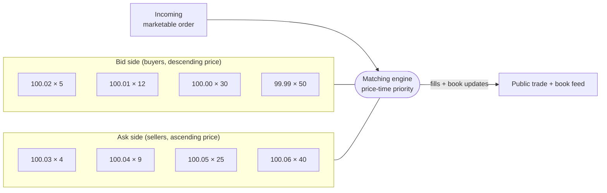
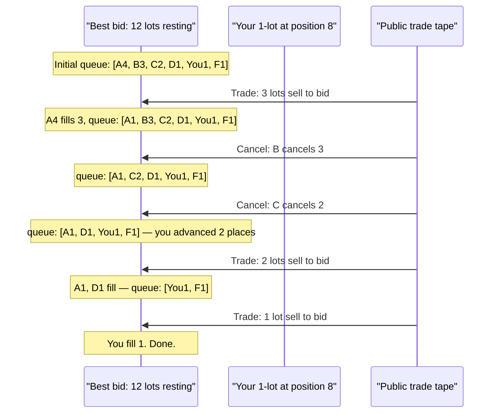

# 2. Microstructure foundations

!!! abstract "Where this chapter fits"
    Chapter 1 ([`01-introduction.md`](01-introduction.md)) framed market making as a business: post two-sided quotes, earn the spread, lose to adverse selection and inventory risk. This chapter pulls apart the mechanism underneath that business. We define the limit order book, the order types you actually place, and three of the foundational models that explain *why* the spread exists at all — Glosten–Milgrom (1985), Kyle (1985), and Roll (1984), with a short detour through Hasbrouck (1991). The chapter ends with a concrete TypeScript shape for the data structures we will use for the rest of the course. Chapter 3 ([`03-avellaneda-stoikov.md`](03-avellaneda-stoikov.md)) builds on this to derive an actual quoting policy; Chapter 6 ([`06-backtesting.md`](06-backtesting.md)) explains why ignoring the structures defined here — especially queue position — makes a market-making backtest wrong by a factor of ten or more. All cited papers are listed in [`appendix-b-sources.md`](appendix-b-sources.md).

## 2.1 The limit order book

A **limit order book (LOB)** is the data structure a modern exchange's matching engine maintains. It is a pair of priority queues — one for bids (buy interest) and one for asks (sell interest) — together with the rules that decide how an incoming order interacts with the resting orders.

A resting order is a **limit order**: a commitment to buy (or sell) up to a stated quantity at a stated price or better. It sits in the book until it is filled, cancelled, or expires. An incoming **market order** consumes resting limit orders on the opposite side, starting from the best price, until it is fully filled or the book is exhausted.

The book is organised by **price-time priority** on essentially every modern equity, futures, and crypto venue: NYSE Arca, Nasdaq, CME Globex, LSE, Eurex, Binance, Coinbase, Deribit, Bybit, OKX. Within a price level, the order that arrived first is at the head of the queue and is filled first. A small number of venues — notably ICE for some energy contracts, and historically the LIFFE STIR markets — use **pro-rata** matching, where an incoming order is split across all resting orders at the touched price level in proportion to their displayed size. A handful of venues blend the two (a time-priority "top order" tier above a pro-rata tier). Pro-rata rewards displayed size; price-time rewards being fast and being early. For the remainder of this course we assume price-time unless stated otherwise.



A few quantities are constructed from the book and recur throughout the course. Let $L_b$ denote the set of price levels on the bid side and $L_a$ the set on the ask side. For a level $\ell \in L_b \cup L_a$, write $p_\ell$ for its price and $q_\ell$ for the total resting size at that level (summed across all orders in the queue at that level).

**Best bid** $p^b$ is the highest price among $L_b$. **Best ask** $p^a$ is the lowest price among $L_a$. The pair $(p^b, p^a)$ is the **top of book (TOB)**, often called the **NBBO** in US equities ("National Best Bid and Offer").

The **quoted spread** is

$$ s = p^a - p^b $$

and the **mid price** is

$$ m = \frac{p^a + p^b}{2}. $$

The mid is a weak summary statistic. It assumes the equilibrium price sits exactly halfway between the two best prices, which it does not — if the bid stack is 5 contracts and the ask stack is 500 contracts, you should expect the next print closer to the bid. The **micro price**, due to Stoikov (2018), repairs this with a size-weighted average:

$$ m^\mu = \frac{q^a \cdot p^b + q^b \cdot p^a}{q^a + q^b}. $$

Here $q^b$ is the size resting at the best bid and $q^a$ at the best ask. Heavy ask size pulls $m^\mu$ toward the bid; heavy bid size pulls $m^\mu$ toward the ask. Empirically, $m^\mu$ is a better one-step-ahead predictor of the next trade price than $m$ on virtually every venue we have measured.

**Depth** is the cumulative resting size out to some distance from the touch. A common summary is the **top-$N$ depth**: $\sum_{i=1}^{N} q^b_i$ on the bid side and $\sum_{i=1}^{N} q^a_i$ on the ask side, where $q^b_i$ is the size at the $i$-th best bid. **Top-of-book** refers to $p^b, p^a, q^b, q^a$ only. **Full book** is the entire set of price levels with their sizes — and, on venues that disclose it (MBO, "market by order"), the individual orders within each level. Most US equity venues disclose only **MBP** ("market by price") aggregates. Most crypto venues disclose MBO via a websocket diff stream.

The distinction between MBP and MBO matters for the rest of the course. With MBP you can see the level's total size but you cannot see your own queue position; you have to infer it from add/cancel events. With MBO you can see the queue exactly. CME's iLink and Eurex's EMDI provide MBO; Nasdaq TotalView is somewhere in between; Coinbase and Binance provide MBO via their level-3 / depth streams. We will assume MBO throughout the modelling sections and note where MBP changes the answer.

## 2.2 Order types

The engine matters less than the order types it accepts. The taxonomy below is venue-neutral — every exchange we have worked with implements a superset, often with idiosyncratic names.

| Type | Resting? | Crosses spread? | Use by a market maker |
|---|---|---|---|
| **Limit** | Yes | No, unless price is marketable | The default. The MM lives here. |
| **Market** | No | Yes — takes the best opposite side until filled | Almost never. Used to flatten inventory under duress. |
| **IOC** (immediate-or-cancel) | No | Yes, partial allowed | Aggressive hedge against a sudden adverse move. |
| **FOK** (fill-or-kill) | No | Yes, all-or-nothing | Rare. Used for arb legs that must execute atomically. |
| **Post-only** | Yes | Rejected if it would cross | The MM's standard quote. Guarantees you pay maker, not taker. |
| **Peg** | Yes | Tracks a reference (mid, primary best) | Used on equity venues; rare on crypto. |
| **Iceberg** / reserve | Yes | No | Shows a small "tip" but keeps a hidden reserve. Refills on fill. |
| **Hidden** | Yes | No | Not displayed at all; sits behind all displayed orders at its price level on most venues. |
| **Stop / stop-limit** | Triggered | Triggered | Inventory-protection ejector, occasionally. |
| **MOC / LOC** | At close only | At close | Equities only; not market-making relevant. |

For a passive market maker, the bread and butter is **post-only limit** plus **cancel-replace**. Post-only matters because if your quote crosses the spread by accident — say the mid moved between your decision and your message reaching the gateway — a plain limit would *take* and you would pay the taker fee. A post-only is rejected in that case, telling you "you were too slow" without burning a fee.

**Cancel-replace** (sometimes "modify") atomically moves an existing order to a new price or size. Critically, on most venues a modify that increases size or changes price **loses queue priority** — the order is treated as a fresh insert. A modify that only *decreases* size at the same price typically keeps priority. We will return to this in §2.7.

A short note on **iceberg** orders: they are tempting because they let a large resting interest hide. They are not free. Each time the visible tip is filled and the iceberg refills, the refill goes to the *back* of the queue at that price level. So a 1000-lot iceberg with a 50-lot tip will, in expectation, achieve fills at roughly the same rate as a 50-lot displayed order — not a 1000-lot one. Use icebergs to hide intent, not to skip the queue.

## 2.3 Glosten–Milgrom (1985)

Glosten and Milgrom (1985) is the minimum-machinery model of the spread. It is sequential: traders arrive one at a time, each trade is for one unit, and the market maker quotes a bid and an ask before the trade and updates them after. The model isolates **adverse selection** — the spread that exists purely because some traders know more than the market maker — from inventory and operating costs.

**Setup.** A risky asset has an unobserved true value $V \in \{V_L, V_H\}$ with $V_L < V_H$. Before any trading, the market's prior is

$$ \Pr(V = V_H) = \pi, \qquad \Pr(V = V_L) = 1 - \pi. $$

Each arriving trader is **informed** with probability $\mu \in (0, 1)$ and **uninformed** with probability $1 - \mu$. An informed trader knows $V$ exactly and trades to profit from it: if $V = V_H$ they buy; if $V = V_L$ they sell. An uninformed trader is a noise trader who buys with probability $1/2$ and sells with probability $1/2$, independent of $V$.

The market maker is risk-neutral, competitive, and breaks even in expectation on every trade. She quotes a bid $b$ at which she will buy one unit and an ask $a$ at which she will sell one unit. Competition forces zero expected profit *conditional on each trade direction*. Concretely,

$$ a = E[V \mid \text{trade is a buy at } a], \qquad b = E[V \mid \text{trade is a sell at } b]. $$

**Computing the ask.** A trade is a buy if either (i) the trader is informed and $V = V_H$, or (ii) the trader is uninformed and chose to buy. So

$$ \Pr(\text{buy} \mid V = V_H) = \mu + (1 - \mu) \cdot \tfrac{1}{2} = \tfrac{1}{2}(1 + \mu), $$

$$ \Pr(\text{buy} \mid V = V_L) = 0 + (1 - \mu) \cdot \tfrac{1}{2} = \tfrac{1}{2}(1 - \mu). $$

By Bayes' rule,

$$ \Pr(V = V_H \mid \text{buy}) = \frac{\pi \cdot \tfrac{1}{2}(1 + \mu)}{\pi \cdot \tfrac{1}{2}(1 + \mu) + (1 - \pi) \cdot \tfrac{1}{2}(1 - \mu)} = \frac{\pi (1 + \mu)}{\pi (1 + \mu) + (1 - \pi)(1 - \mu)}. $$

So

$$ a = V_H \cdot \Pr(V_H \mid \text{buy}) + V_L \cdot \Pr(V_L \mid \text{buy}) = \frac{\pi(1 + \mu) V_H + (1 - \pi)(1 - \mu) V_L}{\pi(1 + \mu) + (1 - \pi)(1 - \mu)}. $$

By symmetry the bid is

$$ b = \frac{\pi(1 - \mu) V_H + (1 - \pi)(1 + \mu) V_L}{\pi(1 - \mu) + (1 - \pi)(1 + \mu)}. $$

**The symmetric case.** Set $\pi = 1/2$. Then $\pi(1 + \mu) + (1 - \pi)(1 - \mu) = 1$ and $\pi(1 - \mu) + (1 - \pi)(1 + \mu) = 1$, so

$$ a = \tfrac{1}{2}\big[(1 + \mu) V_H + (1 - \mu) V_L\big], \qquad b = \tfrac{1}{2}\big[(1 - \mu) V_H + (1 + \mu) V_L\big]. $$

The spread collapses to

$$ s \;=\; a - b \;=\; \mu \, (V_H - V_L). $$

In words: when the prior is symmetric, the spread is exactly the *informed fraction* $\mu$ times the *value uncertainty* $V_H - V_L$. Two limits to remember:

- $\mu \to 0$: no informed traders, spread collapses to zero. Pure noise-trader markets have no adverse-selection spread.
- $\mu \to 1$: every trader is informed; the spread equals the full value uncertainty $V_H - V_L$ and trade ceases (every trade is a guaranteed loss for the market maker except at the breakeven quote, which moves with each trade).

**The asymmetric case.** For general $\pi$, expanding $a - b$ algebraically and writing $\Delta = V_H - V_L$ gives

$$ s = \frac{4 \pi (1 - \pi) \, \mu \, \Delta}{\big[\pi(1 + \mu) + (1 - \pi)(1 - \mu)\big]\big[\pi(1 - \mu) + (1 - \pi)(1 + \mu)\big]}. $$

The denominator equals $1 - (2\pi - 1)^2 \mu^2$. At $\pi = 1/2$ this reduces, as expected, to $s = \mu \Delta$. Several textbooks (e.g. O'Hara 1995) state simplifications under specific parametric tweaks of the model; the canonical $s = 2\mu \Delta / (1 + \mu)$ form arises in the version where the uninformed buy-or-sell probability is *not* $1/2$ but is tied to $\pi$ so that the unconditional trade distribution is symmetric. The point is not the closed form — it is that **the spread is monotone in $\mu$ and in $\Delta$**.

!!! note "What Glosten–Milgrom buys you"
    Even with zero inventory, zero fees, and zero latency, a competitive risk-neutral market maker must quote a positive spread because the act of trading conveys information. Every buy is mild Bayesian evidence that the true value is high; every sell is evidence that it is low. The quote is the post-trade conditional expectation, not the prior. This is the *adverse-selection component* of the spread, and it is the floor below which you cannot quote. Everything else in the course — inventory, fees, latency, queue — adds on top of this floor.

**Quote updating.** After observing a buy, the market maker updates $\pi \mapsto \Pr(V_H \mid \text{buy})$ and re-quotes. After a sell, $\pi \mapsto \Pr(V_H \mid \text{sell})$. Iterating this Bayesian filter is the mechanism by which prices discover the true value $V$ in this model — a foundational result for the **price discovery** literature.

## 2.4 Kyle (1985)

Glosten–Milgrom is sequential and binary. Kyle (1985) is the dual continuous, Gaussian benchmark. It replaces the stream of one-shot traders with a single auction and replaces $\{V_L, V_H\}$ with a Gaussian. The price impact emerges as a linear function of net order flow, and the model gives a closed form for **market depth** that practitioners still cite verbatim.

**Setup.** A single risk-neutral **informed trader** privately observes the true value

$$ v \sim N(p_0, \Sigma_0), $$

where $p_0$ is the prior mean and $\Sigma_0$ is the prior variance. The informed trader submits a market order of signed quantity $x$ (positive = buy). **Noise traders** submit a net signed quantity

$$ u \sim N(0, \sigma_u^2), \qquad u \perp v. $$

The market maker observes only the **total order flow** $y = x + u$ — not the components. She sets the clearing price $p$ as a function of $y$. Competition and risk-neutrality again force zero expected profit *conditional on $y$*:

$$ p(y) = E[v \mid y]. $$

**Linear equilibrium.** Kyle conjectures and verifies a linear equilibrium of the form

$$ x = \beta (v - p_0), \qquad p = p_0 + \lambda y, $$

where $\beta > 0$ is the informed trader's response to her information and $\lambda > 0$ is the **price impact coefficient** — usually called **Kyle's lambda**.

The market-maker's pricing rule, conditional on $y$, is the linear regression of $v$ on $y$. Because $v$ and $u$ are jointly Gaussian and independent,

$$ \lambda = \frac{\text{Cov}(v, y)}{\text{Var}(y)} = \frac{\beta \Sigma_0}{\beta^2 \Sigma_0 + \sigma_u^2}. $$

The informed trader, taking $\lambda$ as given, picks $x$ to maximise expected profit $E[(v - p) \cdot x \mid v] = (v - p_0) x - \lambda x^2$, giving

$$ x = \frac{v - p_0}{2\lambda}, \qquad \text{i.e.} \qquad \beta = \frac{1}{2\lambda}. $$

Substituting back:

$$ \lambda = \frac{(1/(2\lambda)) \Sigma_0}{(1/(2\lambda))^2 \Sigma_0 + \sigma_u^2} \;\;\Longrightarrow\;\; \lambda = \frac{1}{2} \sqrt{\frac{\Sigma_0}{\sigma_u^2}}, \qquad \beta = \sqrt{\frac{\sigma_u^2}{\Sigma_0}}. $$

So in equilibrium

$$ \boxed{\;\lambda = \frac{1}{2\sigma_u}\sqrt{\Sigma_0}, \qquad \beta = \frac{\sigma_u}{\sqrt{\Sigma_0}}.\;} $$

**Interpreting depth.** Market depth is conventionally measured as $1/\lambda$ — the quantity that moves the price by one unit. Then

$$ \text{depth} = \frac{1}{\lambda} = \frac{2 \sigma_u}{\sqrt{\Sigma_0}}. $$

Two readings, both worth internalising:

- Depth is **linear in noise-trader volume** $\sigma_u$. Doubling uninformed flow doubles the size you can trade without moving the price. This is the rigorous version of the folk claim that "noise traders subsidise the spread".
- Depth is **inversely proportional to value uncertainty** $\sqrt{\Sigma_0}$. An asset whose fair value is well known trades tight; an asset under fundamental dispute trades wide. Earnings days, FOMC days, and protocol-upgrade days all spike $\Sigma_0$, and quoted depth collapses accordingly.

**Information leakage.** Substituting equilibrium $\beta$ and $\lambda$ back into $\text{Var}(p) = \lambda^2 \text{Var}(y) = \lambda^2 (\beta^2 \Sigma_0 + \sigma_u^2)$ gives $\text{Var}(p) = \Sigma_0 / 2$. Half of the informed trader's private information leaks into the price in a single round. The multi-period extension of Kyle (Kyle 1985 §3, or Back 1992 for continuous time) has the informed trader *spread the trade out* so that information leaks gradually and the realised profit is preserved. This is the rigorous justification for **execution algorithms that slice large orders** — and the mirror image of the market maker's adverse-selection problem.

!!! note "Glosten–Milgrom vs Kyle"
    Glosten–Milgrom and Kyle answer different questions with overlapping vocabulary.
    - **GM** is about *quote setting*: how should a market maker choose $a$ and $b$ given each trade's information content? It is naturally a per-trade, Bayesian model.
    - **Kyle** is about *price impact*: how does net order flow move the clearing price in a single auction? It is naturally a flow / regression model.
    Both deliver the same headline: more informed flow, wider price response. They diverge on how to *aggregate* trades. In practice, market makers use GM-style logic for the quoting decision (chapter 3, Avellaneda–Stoikov) and Kyle-style $\lambda$ estimates for *flow toxicity* and impact-cost modelling (chapter 6, backtesting).

## 2.5 Roll (1984)

Roll (1984) is the diagnostic. It does not predict the spread; it lets you *recover* the spread from a stream of trade prices without seeing the book at all.

**Model.** Assume the efficient price $m_t$ follows a random walk:

$$ m_t = m_{t-1} + \varepsilon_t, \qquad \varepsilon_t \;\text{i.i.d., zero mean}. $$

Trades are signed: $\eta_t = +1$ for a buy at the ask, $\eta_t = -1$ for a sell at the bid, equally likely, independent of $m$. The observed trade price is

$$ p_t = m_t + \tfrac{s}{2} \eta_t, $$

where $s$ is the *effective* round-trip spread. Then

$$ \Delta p_t = p_t - p_{t-1} = \varepsilon_t + \tfrac{s}{2} (\eta_t - \eta_{t-1}). $$

Compute the first-order autocovariance:

$$ \text{Cov}(\Delta p_t, \Delta p_{t-1}) = \tfrac{s^2}{4} \, \text{Cov}(\eta_t - \eta_{t-1}, \eta_{t-1} - \eta_{t-2}) = \tfrac{s^2}{4} \cdot (-\text{Var}(\eta_{t-1})) = -\tfrac{s^2}{4}. $$

Hence

$$ \boxed{\; s_{\text{Roll}} = 2 \sqrt{-\text{Cov}(\Delta p_t, \Delta p_{t-1})}. \;} $$

If the realised autocovariance is positive the formula is undefined — this happens often in practice and is itself diagnostic, indicating momentum or stale-quote effects that violate the model.

**Why it matters.** The quoted spread is what you *post*. The effective spread is what you *realise*. The two can diverge sharply:

- If your quotes are always at the touch but you only ever get filled on the wide side (adverse selection), the effective spread you earn is less than the quoted spread.
- If the book has heavy hidden / iceberg liquidity inside the displayed best, trades print inside the quoted spread and the effective spread is again less.
- If you are routinely getting price-improved by midpoint dark pools (US equities), same story.

Compare $s_{\text{Roll}}$ from your trade tape to your average quoted spread. A persistent gap is information: it tells you who else is in the book and how much of your quoted-spread P&L is fiction.

## 2.6 Hasbrouck (1991)

Hasbrouck (1991) extends Roll by decomposing the price impact of trades into a **permanent** and a **transitory** component using a VAR (vector autoregression) on signed trades and quote revisions. The technical machinery is heavier than we need here; the conceptual content is the part to internalise.

A trade moves the *quoted* mid by some amount. Some of that movement reverses over the next few trades, and some persists indefinitely. Decompose the eventual price response to a unit trade as

$$ \text{impact}_\infty = \underbrace{\text{permanent}}_{\text{adverse selection}} + \underbrace{\text{transitory}}_{\text{inventory + noise}}. $$

The **permanent** component is the market's revised estimate of the true value $V$ in light of the trade — the Glosten–Milgrom update. It does not reverse, because the new information is, in fact, new.

The **transitory** component is the market maker's *inventory premium*: she just took the other side of a trade, her position is now unbalanced, and she shades her subsequent quotes to attract a reversing trade. It mean-reverts as her inventory normalises. It also absorbs pure quote-quoting noise — the occasional venue-specific microstructure that does not reflect any information.

For a market maker, the ratio matters: a venue / instrument with high permanent impact and low transitory impact is **toxic** — every trade you do leaks money to information you do not have. A venue with low permanent impact and high transitory impact is **noisy** — you can make money by quoting tight and letting the inventory premium reverse. This decomposition is the most direct empirical test of "is this flow worth quoting against?" and is implemented in essentially every serious market-making P&L attribution stack we have seen.

## 2.7 Price-time priority and the queue

Glosten–Milgrom and Kyle take the *fact of being filled* as given. In a real LOB with price-time priority, being filled is contingent on **queue position**, and queue position is by far the most consequential variable a passive market maker does not control directly.

Suppose you post a 1-lot limit at the best bid. There are $Q$ contracts ahead of you at that price level (your **queue position** is $Q + 1$). A market sell of size $m$ arrives. It fills the head of the queue first. You get filled only if $m > Q$, and even then only for $\min(m - Q, 1)$ contracts. If $m \le Q$, your position in the queue improves to $Q - m + 1$, but you do not trade.

Meanwhile, orders ahead of you can **cancel** — and most of them do. Empirically across crypto, futures, and equities, cancel-to-trade ratios on the best level run **10:1 to 100:1**. Every cancel ahead of you moves you up the queue without trading. Every cancel *behind* you does nothing for your fill probability but reveals information about other participants' urgency.



The two operationally critical implications:

1. **A queue-blind backtest overestimates fills by an order of magnitude.** The standard naive simulator fills your resting order whenever the trade tape prints through your price. In reality, you fill only when the cumulative incoming volume *plus the cancels ahead of you* exhausts the queue down to your position. Cont, Kukanov, Stoikov (2014) and Gould et al. (2013) measure this gap; for typical liquid futures the naive simulator overstates passive fills by 5–20×. Chapter 6 ([`06-backtesting.md`](06-backtesting.md)) shows how we model this in code.

2. **Cancel-replace destroys priority.** A new order at a new price goes to the *back* of that level's queue. So aggressive re-quoting — pulling and reposting one tick away every time the mid wobbles — is enormously expensive in expected fills. Every reprice resets you from queue position 5 to queue position 200. A good market-making policy quotes *less often* than a naive one and accepts brief adverse marks in exchange for queue priority. Avellaneda–Stoikov (chapter 3) handles this implicitly by varying the **reservation price** rather than the *quote skew*.

The cancellation rate at the touch is, in practice, the single most important number to measure on a new venue you are quoting on. If cancels ahead of you arrive at rate $\lambda_c$ and incoming trades arrive at rate $\lambda_t$, your expected wait to a fill from queue position $Q$ is approximately

$$ E[\tau \mid Q] \approx \frac{Q}{\lambda_c + \lambda_t \cdot \bar{m}} $$

where $\bar{m}$ is the mean trade size at the touch. Cont and de Larrard (2013) give a more careful Markovian queue model; the back-of-the-envelope above is enough to choose between "join the queue at the touch" and "post one tick behind and hope" on any given venue.

## 2.8 The shape of order flow

The arrival process of orders is not Poisson, however convenient that would be. Cont, Stoikov, Talreja (2010) — the canonical empirical reference — measure the LOB on Nasdaq stocks and report:

- **Order placement rates** decay as a **power law** in the distance from the touch: the rate of new limit orders at price level $i$ ticks deep into the book is approximately $\lambda_{\text{place}}(i) \propto 1/i^\alpha$ with $\alpha \in [0.5, 1.5]$ depending on the name. Most action is at the touch; activity falls off but does not vanish out to 50+ levels deep.
- **Cancellation rates per unit resting size** are roughly *constant* across price levels, which combined with the placement power law produces the characteristic concave shape of the depth profile.
- **Trade arrival rates** show pronounced **clustering**: trades beget trades. The unconditional inter-arrival distribution has a heavy tail, and the conditional intensity after a trade is several times the unconditional rate for tens of seconds.

The cleanest model of that clustering is the **Hawkes process** (Hawkes 1971; Bacry, Mastromatteo, Muzy 2015 for the financial-microstructure-friendly review). The intensity of trade arrivals is itself a stochastic process,

$$ \lambda_t = \mu_0 + \sum_{t_i < t} \phi(t - t_i), $$

where the sum runs over past trade times $t_i$ and $\phi$ is a decay kernel — typically exponential or power-law. The branching ratio $\int_0^\infty \phi(s) \, ds$ measures self-excitation; values north of 0.8 are common in liquid futures, and the closer it is to 1, the more "endogenous" the flow (trades caused by trades rather than by fresh information). Filimonov and Sornette (2012) use exactly this to measure how reflexive a given market has become.

For the market maker, the operational consequence is **bursty fills**. Your quote will sit untouched for minutes and then take five fills in three seconds, by which time the mid has moved against you. Static, Poisson-style fill assumptions in a backtest will produce smooth P&L curves that have no relationship to the actual one. Chapter 6 will model this with a Hawkes-driven simulator.

## 2.9 What this implies for quoting

Pulling the chapter together. The market maker faces a single core tension at the quoting level:

| Quoting decision | Pro | Con |
|---|---|---|
| **Tighter spread** | More fills per unit time (you are nearer the touch and farther up the queue) | More adverse selection: each fill is conditionally worse — the population of trades that hit a tight quote is more informed |
| **Wider spread** | Better selection: each fill earns more spread and is less likely to be informed | Fewer fills; some shifts you intended to capture will not happen at all |
| **Skew quotes against inventory** | Reduces inventory variance, controls risk | Worsens adverse selection on the favoured side; gives up some spread |
| **Reprice often** | Quotes track the mid; less stale-quote risk | Destroys queue priority; the new fill rate may be lower than the old one |

The three models we have just walked through formalise this:

- **Glosten–Milgrom** says the spread floor is set by the informed fraction $\mu$ and the value uncertainty $\Delta$. You cannot quote inside this floor without losing money in expectation per trade.
- **Kyle** says your *depth* — how much you can quote — is set by the noise-trader volatility $\sigma_u$ relative to fundamental volatility $\sqrt{\Sigma_0}$.
- **Roll** lets you sanity-check what you are *actually* earning relative to what you *think* you are quoting.

The optimal spread is, accordingly, a function of: the informed fraction $\mu$ (or in practice, a tradeable proxy: order-flow imbalance, recent realised volatility relative to quoted volatility, etc.), the value uncertainty $\Delta$ (intraday volatility, time-to-event), your **current inventory** (the more you hold the more you want to lean toward flattening), and your **time horizon** (a closer end-of-day deadline forces tighter inventory control).

Chapter 3 derives a tractable joint solution — Avellaneda–Stoikov — that takes these as primitives and outputs concrete bid/ask offsets. The rest of the course is, in one form or another, refinements and corrections to that solution.

## 2.10 Code shape

We will use the following TypeScript skeleton for the order book and its derived quantities throughout the course. The types are deliberately verb-light; behaviour lives in chapter-specific modules.

```typescript
// All sizes are in base-asset units (BigInt) so we never lose precision.
// All prices are integer ticks; convert to display price via the instrument's
// tick size only at the I/O boundary.
export type Price = number;     // integer ticks
export type Size  = bigint;     // base-asset units
export type Side  = 'buy' | 'sell';

export interface OrderBookLevel {
  readonly price: Price;
  readonly size: Size;          // total resting size at this level
  readonly orderCount: number;  // number of distinct orders (MBO only; else 0)
}

export interface OrderBook {
  readonly instrumentId: string;
  readonly timestamp: number;   // exchange ts, nanoseconds
  readonly bids: readonly OrderBookLevel[]; // descending price
  readonly asks: readonly OrderBookLevel[]; // ascending price
}

export interface TopOfBook {
  readonly bestBid: Price;
  readonly bestAsk: Price;
  readonly bidSize: Size;
  readonly askSize: Size;
}

export interface QueueState {
  readonly side: Side;
  readonly price: Price;
  readonly ahead: Size;         // size ahead of us at this price level
  readonly behind: Size;        // size posted after us at this level
  readonly ourSize: Size;       // our own resting size
}

export interface MicroPrice {
  readonly mid: number;         // (bestBid + bestAsk) / 2
  readonly micro: number;       // size-weighted, Stoikov 2018
  readonly imbalance: number;   // (bidSize - askSize) / (bidSize + askSize)
}

export function topOfBook(b: OrderBook): TopOfBook {
  return {
    bestBid: b.bids[0].price,
    bestAsk: b.asks[0].price,
    bidSize: b.bids[0].size,
    askSize: b.asks[0].size,
  };
}

export function microPrice(t: TopOfBook): MicroPrice {
  const qb = Number(t.bidSize);
  const qa = Number(t.askSize);
  const mid = (t.bestBid + t.bestAsk) / 2;
  const micro = (qa * t.bestBid + qb * t.bestAsk) / (qa + qb);
  const imbalance = (qb - qa) / (qb + qa);
  return { mid, micro, imbalance };
}

export function quotedSpread(t: TopOfBook): number {
  return t.bestAsk - t.bestBid;
}

// Cont/de-Larrard back-of-envelope expected wait given a queue state and
// measured cancel + trade intensities at the touch.
export function expectedFillWait(
  q: QueueState,
  cancelRate: number,    // size / sec ahead of us
  tradeRate: number,     // size / sec consuming our side
): number {
  const ahead = Number(q.ahead);
  return ahead / (cancelRate + tradeRate);
}
```

A few notes on the shape:

- **`Size` is `bigint`.** A market-making bot that loses precision on inventory by 1 part in $10^{15}$ has, eventually, a bug. Use integer ticks for price and `bigint` for size; convert to `number` only at display or at well-bounded numerics (e.g. dividing two sizes for an imbalance ratio).
- **`OrderBook` is immutable.** We will produce a new snapshot on each diff. This is the only way to keep the strategy code's view of the book stable across an async boundary.
- **`QueueState` is the load-bearing struct** for chapter 6. Maintaining it correctly under MBP-only data requires inferring `ahead` from add/cancel events without seeing individual orders. Chapter 6 walks through the inference.
- The functions deliberately do not throw. A market-making hot path that throws on a malformed book level is a bot that goes flat in the worst possible moment. Validate at the I/O boundary; downstream code assumes well-formed inputs.

!!! warning "Things this skeleton does not encode"
    Self-trade prevention, exchange-specific order-id lifetime, fee tiers, throttling limits, and clock skew between the trading host and the gateway. Each will appear in later chapters. None of them belong in the book type.

---

## Sources

- Glosten, L. R. and Milgrom, P. R. (1985). "Bid, Ask and Transaction Prices in a Specialist Market with Heterogeneously Informed Traders." *Journal of Financial Economics*, 14(1): 71–100.
- Kyle, A. S. (1985). "Continuous Auctions and Insider Trading." *Econometrica*, 53(6): 1315–1335.
- Roll, R. (1984). "A Simple Implicit Measure of the Effective Bid–Ask Spread in an Efficient Market." *Journal of Finance*, 39(4): 1127–1139.
- Hasbrouck, J. (1991). "Measuring the Information Content of Stock Trades." *Journal of Finance*, 46(1): 179–207.
- Stoll, H. R. (1978). "The Supply of Dealer Services in Securities Markets." *Journal of Finance*, 33(4): 1133–1151.
- Cont, R., Stoikov, S. and Talreja, R. (2010). "A Stochastic Model for Order Book Dynamics." *Operations Research*, 58(3): 549–563.
- Cont, R. and de Larrard, A. (2013). "Price Dynamics in a Markovian Limit Order Market." *SIAM Journal on Financial Mathematics*, 4(1): 1–25.
- Cont, R., Kukanov, A. and Stoikov, S. (2014). "The Price Impact of Order Book Events." *Journal of Financial Econometrics*, 12(1): 47–88.
- Stoikov, S. (2018). "The Micro-Price: A High-Frequency Estimator of Future Prices." *Quantitative Finance*, 18(12): 1959–1966.
- Back, K. (1992). "Insider Trading in Continuous Time." *Review of Financial Studies*, 5(3): 387–409.
- Hawkes, A. G. (1971). "Spectra of Some Self-Exciting and Mutually Exciting Point Processes." *Biometrika*, 58(1): 83–90.
- Bacry, E., Mastromatteo, I. and Muzy, J.-F. (2015). "Hawkes Processes in Finance." *Market Microstructure and Liquidity*, 1(1).
- Filimonov, V. and Sornette, D. (2012). "Quantifying Reflexivity in Financial Markets." *Physical Review E*, 85(5): 056108.
- Gould, M. D., Porter, M. A., Williams, S., McDonald, M., Fenn, D. J. and Howison, S. D. (2013). "Limit Order Books." *Quantitative Finance*, 13(11): 1709–1742.
- O'Hara, M. (1995). *Market Microstructure Theory*. Blackwell.

A consolidated bibliography across all chapters lives in [`appendix-b-sources.md`](appendix-b-sources.md).
