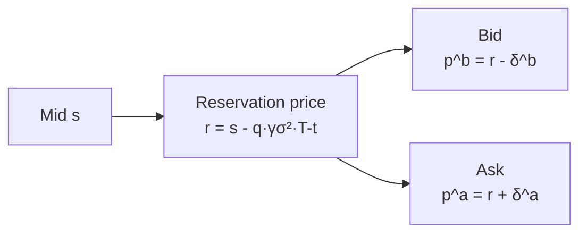
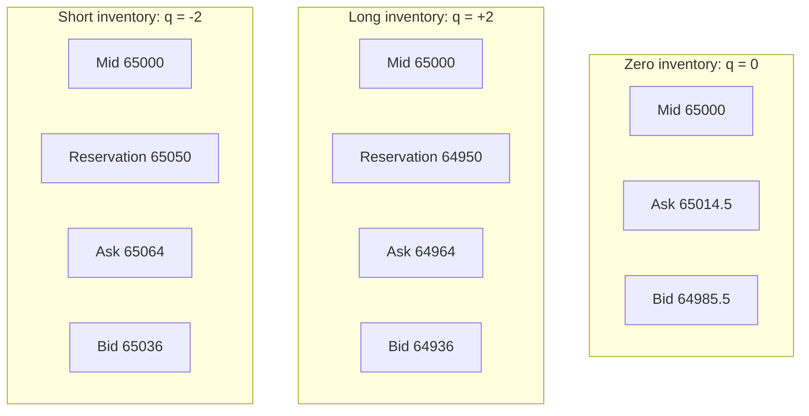

# 3. Avellaneda-Stoikov & inventory-aware quoting

!!! abstract "Where this chapter fits"
    **Feeds in from:** [§1.3](01-introduction.md) (the three-component decomposition of the spread; this chapter is what *inventory cost* and *adverse selection* look like when written down as math). [§2 microstructure](02-microstructure.md) (the LOB mechanics the quoting model presumes; in particular [§2.5](02-microstructure.md) on adverse selection, which is the empirical reality the model abstracts into a single $\gamma\sigma^2$ term).
    **Feeds into:** [§4 execution](04-execution.md) (the quotes derived here are what the execution layer cancels-and-replaces; the latency budget in §4.2 is what determines whether the closed form survives contact with a real venue). [§5 risk](05-risk.md) (the inventory cap $Q$, the volatility-shrinkage, and the `min(γ, …)` adjustments in §3.12 become explicit circuit breakers in §5).
    **Read alone if:** you already know the LOB mechanics from §2 and you want the canonical model derivation and the practical tweaks every desk makes to it before deployment. This chapter is the theoretical centrepiece; §4 and §5 are how it survives.
    **Code shape:** the `AvellanedaStoikovQuoter` interfaces in §3.11 sketch the production shape; the calibration function in §3.7 is a pure function over a fills-vs-distance table.

## 3.1 The Avellaneda-Stoikov (2008) setup

The single most influential market-making paper of the last twenty years is **AS08** — Avellaneda & Stoikov (2008), *High-Frequency Trading in a Limit Order Book*. It is influential not because it is the first inventory-aware quoting model (that honour belongs to **HS81** — Ho & Stoll 1981) and not because its assumptions hold in practice (they do not, see §3.10), but because it is the first model whose closed-form quotes are *operationally usable*: short enough to fit in a function, parameterised by quantities you can actually measure from a venue's tick data, and structured in a way that decomposes neatly into a "reservation price" and a "half-spread" — two knobs that map directly onto the two operational decisions a maker makes every quote tick.

The math is from §§2–3 of **AS08**, restated in the notation of [Cartea, Jaimungal & Penalva (2015)](appendix-b-sources.md) (**CJP15**) chapter 10 — same equations, cleaner variable names.

### 3.1.1 The model in seven assumptions

The model is best read as seven assumptions, each *wrong* in some specific way that matters in production. By §3.10 we will have a list of every patch a real desk applies.

1. **Mid-price dynamics.** The mid-price $S_t$ follows arithmetic Brownian motion with constant volatility $\sigma$:
   $$ dS_t = \sigma\, dW_t $$
   where $W_t$ is a standard Wiener process. Note the absence of a drift term — the maker is assumed to have no view on direction. *In production:* $\sigma$ is not constant (it is regime-dependent — see §3.10) and a drift term sneaks in via inventory accumulation against trend.

2. **Quoting protocol.** The market maker continuously posts a single bid at distance $\delta^b \geq 0$ below mid and a single ask at distance $\delta^a \geq 0$ above mid:
   $$ p^b_t = S_t - \delta^b_t, \qquad p^a_t = S_t + \delta^a_t. $$
   The quotes are updated continuously; there is no cancel-and-replace latency. *In production:* there is always cancel-and-replace latency (§4.2) and there are always tick-size and lot-size constraints (§2.2), so the maker quotes on a coarse grid, not a continuum.

3. **Order-arrival intensity.** Buy market orders (which hit the maker's ask) arrive as a Poisson process with intensity $\lambda^a(\delta^a)$; sell market orders (which hit the maker's bid) arrive at intensity $\lambda^b(\delta^b)$. Both intensities decay exponentially with distance from mid:
   $$ \lambda^a(\delta) = A e^{-k \delta}, \qquad \lambda^b(\delta) = A e^{-k \delta} $$
   for constants $A > 0$ and $k > 0$, with $A$ the same on both sides and $k$ the same on both sides. The interpretation: $A$ is the *gross flow rate* — how many marketable orders arrive per unit time if the maker quoted at mid; $k$ is the *decay rate* — how fast fill probability drops off as the maker pulls quotes away from mid. *In production:* $A$ and $k$ are not equal on bid and ask in skewed-flow regimes; see §3.12.4.

4. **Trade size.** Every marketable order is of unit size. The maker's inventory $q_t$ moves up by one on each filled bid and down by one on each filled ask. *In production:* trades arrive in heterogeneous sizes, which is handled either by re-scaling $\lambda$ to "fills per dollar of notional" or by carrying an explicit size distribution; **CJP15** §10.4 treats the size-aware version.

5. **No fees and no rebates.** The model treats fills as exact: a bid-fill credits the maker with one unit of inventory at price $p^b_t$, an ask-fill debits the maker. *In production:* a maker rebate $r$ adds to revenue per fill; a taker fee on the takers' side is not the maker's concern but raises the empirical $k$ because takers cross less often. See §3.7 on how this gets absorbed into the calibration.

6. **Risk-aversion utility.** The maker has CARA (constant absolute risk aversion) utility with parameter $\gamma > 0$ over terminal wealth:
   $$ U(x) = -\exp(-\gamma x). $$
   The maker maximises the expected utility of mark-to-market wealth at terminal time $T$:
   $$ \max_{\delta^a_t, \delta^b_t}\; \mathbb{E}\bigl[\,U(X_T + q_T S_T)\,\bigr] $$
   where $X_T$ is cash and $q_T S_T$ marks remaining inventory at the terminal mid. The CARA form is what makes the HJB tractable — the closed-form quotes drop out specifically because exponential utility factors through the dynamic programming recursion. *In production:* the maker does not actually have CARA utility (no one does), but the CARA solution is operationally usable because the *shape* of the inventory penalty — linear in $q$, quadratic in $\sigma$, linear in $(T-t)$ — is what shows up empirically even when the utility specification is changed.

7. **Terminal time $T$.** The model has a fixed terminal time $T$ at which mark-to-market is taken. The reservation-price formula in §3.3 contains $(T-t)$ explicitly, meaning the inventory penalty *vanishes* as $t \to T$. *In production:* there is no terminal time — the maker quotes indefinitely. The fix is either the **GLFT13** infinite-horizon extension (§3.8) or the "rolling horizon" tweak in §3.12.1.

The seven assumptions decompose neatly: 1–4 are about the *market*, 5–6 about the *maker*, 7 about the *clock*. Each chapter §3.10 violation maps onto one of these seven assumptions.

### 3.1.2 The objective in words before we write the HJB

Wealth at any moment is cash $X_t$ plus signed inventory $q_t$ marked at the current mid $S_t$. The maker chooses, continuously, the bid distance $\delta^b_t$ and the ask distance $\delta^a_t$. The choice trades off two things:

- **Wider quotes** capture more spread *per fill* but get filled less often (because $\lambda$ decays in $\delta$). Revenue per unit time is "spread × fill rate," with an interior maximum in $\delta$.
- **Narrower quotes** capture less spread per fill but get filled more often, accumulating inventory faster. Faster inventory accumulation means more exposure to the $\sigma\,dW_t$ noise on the mid — which is what the maker is risk-averse about.

The maker is solving a *joint* optimisation: pick the half-spread to balance revenue against fill rate, *and* skew the midpoint of the quotes (the reservation price) to discourage further accumulation when inventory is already large. The two decisions are coupled — the inventory state changes the optimal skew, and the skew changes the inventory-fill rates — and that coupling is what the HJB unwinds in closed form.

```mermaid
flowchart LR
  A[Mid price S_t<br/>arithmetic BM] --> B[Quoting choice<br/>δ^a, δ^b]
  C[Inventory q_t] --> B
  B --> D[Fill rates<br/>λ^a(δ), λ^b(δ)]
  D --> E[Inventory drift<br/>+1 on bid-fill, -1 on ask-fill]
  E --> C
  D --> F[Cash drift<br/>+p^a on ask-fill, -p^b on bid-fill]
  F --> G[Wealth at T<br/>X_T + q_T S_T]
  C --> G
  G --> H[Maker utility<br/>-exp(-γ · wealth)]
  H -.optimise.-> B
```

The objective function — maximise $\mathbb{E}[-\exp(-\gamma(X_T + q_T S_T))]$ — is what the HJB solves.

## 3.2 The HJB equation and value function

The Hamilton-Jacobi-Bellman equation is the dynamic-programming PDE that the value function of an optimal-control problem satisfies. We sketch the derivation; **AS08** §2 and **CJP15** §10.2 contain the full version. The point is to see exactly where each parameter ($\sigma$, $\gamma$, $A$, $k$) enters, so the closed-form result in §3.3–§3.5 is not magic.

### 3.2.1 Defining the value function

Let $u(t, x, q, s)$ be the *value function* of the maker — the maximum expected utility of terminal wealth, given the current time $t$, cash $x$, inventory $q$, and mid $s$:

$$
u(t, x, q, s) = \sup_{\delta^a_{[t,T]}, \delta^b_{[t,T]}}\; \mathbb{E}\bigl[\,-\exp(-\gamma(X_T + q_T S_T))\,\big|\, X_t=x, q_t=q, S_t=s\,\bigr].
$$

The optimisation is over *trajectories* of bid and ask distances from $t$ to $T$. At terminal time, the value is just utility of mark-to-market:

$$
u(T, x, q, s) = -\exp(-\gamma(x + q s)).
$$

That is the boundary condition the HJB will be solved against.

### 3.2.2 Writing down the HJB

Bellman's principle gives the HJB. In the time interval $[t, t+dt]$, the maker chooses $\delta^a, \delta^b$ and three things can happen:

- *Nothing* (probability $1 - (\lambda^a + \lambda^b)\,dt$): cash and inventory unchanged; mid moves by $\sigma\,dW_t$.
- *Ask fill* (probability $\lambda^a(\delta^a)\,dt = A e^{-k\delta^a}\,dt$): cash increases by the ask price $s + \delta^a$; inventory decreases by 1.
- *Bid fill* (probability $\lambda^b(\delta^b)\,dt = A e^{-k\delta^b}\,dt$): cash decreases by the bid price $s - \delta^b$; inventory increases by 1.

Apply Itō's lemma to the mid evolution (Brownian, no drift) and assemble:

$$
\frac{\partial u}{\partial t}
+ \frac{1}{2}\sigma^2 \frac{\partial^2 u}{\partial s^2}
+ \sup_{\delta^a}\Bigl\{ A e^{-k\delta^a}\bigl[u(t, x + s + \delta^a, q - 1, s) - u(t, x, q, s)\bigr] \Bigr\}
+ \sup_{\delta^b}\Bigl\{ A e^{-k\delta^b}\bigl[u(t, x - s + \delta^b, q + 1, s) - u(t, x, q, s)\bigr] \Bigr\}
= 0.
$$

That is the HJB. The first term is the time decay of the value function; the second is the diffusion from mid-price motion; the third and fourth are the optimal-control terms over the two quoting decisions. Each sup is an *instantaneous* optimisation — at every instant $t$, the maker picks the $\delta^a$ and $\delta^b$ that maximise the expected utility increment.

### 3.2.3 The CARA factoring trick

The HJB above is intractable in its full generality, but CARA utility — assumption 6 — lets us reduce it to a tractable form by *factoring out the wealth dependence*. Specifically, we guess that the value function takes the form

$$
u(t, x, q, s) = -\exp(-\gamma x)\cdot \exp(-\gamma q s)\cdot \exp\bigl(-\gamma\,\theta(t, q, s)\bigr)
$$

for some function $\theta(t, q, s)$ that does not depend on $x$. This *ansatz* is justified by exponential utility's property that adding a constant to wealth multiplies the utility by a constant; the cash dependence factors out cleanly.

Substituting back into the HJB and cancelling the common factor of $-\exp(-\gamma x)\cdot\exp(-\gamma q s)$ gives a new PDE for $\theta$ alone. After some algebra (laid out in **AS08** §2.2 — read it once, never again), $\theta$ separates further into a function of $(t, q)$ and a quadratic term in $s$ that drops out. The remaining problem in $\theta(t, q)$ is the one that has the explicit closed-form solution we use.

The reduction is the whole reason CARA utility is the standard choice. Any other utility function — power utility, log utility, mean-variance — produces an HJB that does not admit this factoring, and the resulting quoting model has to be solved numerically. The cost of the modelling assumption is that the maker's *risk-aversion parameter* $\gamma$ no longer has an obvious dollar interpretation (CARA risk aversion is dimensional but not directly interpretable as "I won't tolerate more than $X drawdown"); the benefit is closed-form quotes.

!!! note "What the HJB does and does not tell you"
    The HJB above is a PDE in four variables ($t, x, q, s$). The CARA factoring reduces it to a PDE in two variables ($t, q$). The closed form in §3.3–§3.5 is obtained by *linearising* the reduced PDE around small inventory and short horizons — strictly speaking, **AS08** §3 derives the closed form as an *asymptotic expansion* in $q$ and $(T-t)$, not as an exact solution. The expansion is accurate to leading order, which is what makes the closed form usable; it is *not* accurate at large $|q|$ near terminal time, which is one of the reasons §3.12 patches the model with a hard inventory cap and a rolling horizon.

## 3.3 The reservation (indifference) price

The first key output of the model is the *reservation price* — the price at which the maker would be indifferent between holding the current inventory $q$ and holding zero inventory. Formally, the reservation price $r(s, q, t)$ is defined implicitly by the equation

$$
u(t, x, q, s) = u(t, x + r - s\cdot q, 0, s)
$$

— i.e. the value function at inventory $q$ and cash $x$ equals the value function at zero inventory and the *equivalent* cash $x + (r - s)q$. The reservation price is the maker's *true* valuation of one unit of the asset given the current state.

Solving for $r$ using the CARA-factored value function from §3.2.3 (the algebra is in **AS08** §3.1) yields the closed form:

$$
\boxed{\; r(s, q, t) = s - q\,\gamma\,\sigma^2\,(T - t) \;}
$$

This is the central formula of the chapter. Stare at it for a minute.

### 3.3.1 Interpretation

The reservation price is the mid $s$ shifted by an inventory-dependent term:

- **Zero inventory** ($q = 0$): $r = s$. The maker's true valuation is the mid. There is no inventory to penalise.
- **Long inventory** ($q > 0$): $r < s$. The maker's true valuation is *below* the mid. The maker is already long; one more unit of inventory is worth less than the mid suggests, because the maker now bears one more unit of mid-noise risk for the remaining time $(T-t)$.
- **Short inventory** ($q < 0$): $r > s$. The maker's true valuation is *above* the mid. The maker is already short; covering one unit of inventory is worth more than the mid suggests.

The size of the shift is the product of four quantities:

1. $q$ — the signed inventory. Linear: doubling inventory doubles the shift.
2. $\gamma$ — the maker's risk aversion. Linear: doubling risk aversion doubles the shift.
3. $\sigma^2$ — the *variance* of the mid (not the volatility). Quadratic in volatility: doubling $\sigma$ quadruples the shift.
4. $(T - t)$ — the remaining time horizon. Linear: the shift vanishes as $t \to T$. (This is the "terminal-time pathology" §3.12.1 patches.)

The intuition for why $\sigma^2$ and not $\sigma$ is the right scale: the maker's *risk* on a unit of inventory over the horizon $(T-t)$ is proportional to the *variance* of the mid over that horizon, which is $\sigma^2 (T-t)$. CARA utility penalises variance, not standard deviation; the inventory penalty is therefore in variance units, scaled by risk aversion.

### 3.3.2 What the reservation price is *for*

The reservation price is the *centre of the maker's quotes*. The bid and ask are placed symmetrically around the reservation price, *not* around the mid. This is the core operational insight of the model:



When the maker is long ($q > 0$), the reservation price is below mid, so both the bid and the ask are also shifted below mid relative to where they would sit at zero inventory. The bid moves further from the mid (becomes less competitive — less likely to be filled), and the ask moves closer to the mid (becomes more competitive — more likely to be filled). The asymmetric fill probability drives inventory back toward zero. This is what "inventory-aware quoting" *means*: the model does not adjust the *spread*; it adjusts the *midpoint of the quotes*.

This is also why the model is operationally compelling: it separates two concerns that pre-AS08 quoting heuristics conflated. The spread (§3.4) is about what to charge for immediacy; the reservation-price shift (§3.3) is about what to charge for taking on additional inventory risk. The maker tunes them independently — the spread reacts to $\sigma$, $\gamma$, and $k$; the reservation-price shift reacts to $q$.

## 3.4 The optimal bid-ask spread

The second key output of the model is the *optimal total spread* — the sum $\delta^a + \delta^b$ that maximises expected utility. The closed form, derived in **AS08** §3.2 (again as an asymptotic expansion to leading order in $q$ and $(T-t)$), is:

$$
\boxed{\; \delta^a + \delta^b = \gamma\,\sigma^2\,(T - t) + \frac{2}{\gamma}\ln\!\left(1 + \frac{\gamma}{k}\right) \;}
$$

Note the structure: the optimal *total* spread is the sum of two terms:

1. **The inventory-risk term** $\gamma\sigma^2(T-t)$. Same as the reservation-price shift coefficient. Compensation for the risk of carrying inventory over the remaining horizon.
2. **The arrival-decay term** $(2/\gamma)\ln(1 + \gamma/k)$. Compensation for the trade-off between fill probability (which favours narrow quotes) and per-fill revenue (which favours wide quotes). Larger $k$ — faster decay — means quotes have to be tighter to get filled; larger $\gamma$ means the trade-off is resolved more conservatively (wider quotes); the log function captures the diminishing return of widening past the natural decay scale $1/k$.

### 3.4.1 The independence-from-inventory result

The single most surprising fact in **AS08** is that **the optimal total spread does not depend on inventory $q$**. The spread is the same whether the maker is flat, long ten units, or short ten units. Inventory only shifts the *midpoint* (via the reservation price); it does *not* widen or narrow the bid-ask range itself.

This is counter-intuitive on a first reading. The naive intuition is: "if I'm already long, I should widen the bid to discourage further buys, and narrow the ask to encourage sells, and that means widening the spread." But that conflates two things. Widening the bid *relative to the mid* and narrowing the ask *relative to the mid* is exactly what the reservation-price shift does — and the shift is symmetric in $q$, so it changes the relative *positions* of the bid and ask but not the *distance between them*.

The deeper reason — and this is what **AS08** §3.2 makes precise — is that the arrival-intensity decay is *symmetric in $\delta^a$ and $\delta^b$* under assumption 3. The trade-off "spread vs fill probability" is therefore the same on both sides, and the solution to that trade-off is the same on both sides. Inventory does not enter the trade-off; it enters the *placement* of the quotes around the trade-off-optimal midpoint. When we drop assumption 3 in §3.12.4 (asymmetric flow), the spread *does* become inventory-dependent.

### 3.4.2 Two sanity-check limits

The formula has two limits worth checking by hand, because they catch most of the implementation bugs.

**Limit 1: $T - t \to 0$ (close to terminal time).** The inventory-risk term vanishes; the spread collapses to $(2/\gamma)\ln(1 + \gamma/k)$, which is the time-independent floor set by the arrival-decay trade-off. *Interpretation:* at the very end of the horizon, there is no inventory risk left to compensate for (the maker will mark-to-market in an instant), so only the fill-vs-revenue trade-off matters. This is fine as a mathematical limit; in §3.12.1 we explain why it is *not* fine to let production code anywhere near this limit.

**Limit 2: $\gamma \to 0$ (risk-neutral maker).** The inventory-risk term vanishes (no risk aversion); the arrival-decay term is $\lim_{\gamma\to 0} (2/\gamma)\ln(1 + \gamma/k) = 2/k$ by L'Hôpital. *Interpretation:* a risk-neutral maker has spread $2/k$ — the inverse of the arrival-decay rate. This is the natural scale of the order-flow decay: a quote at distance $1/k$ from mid has $1/e$ of the fill rate of a quote at mid. A risk-neutral maker simply optimises revenue per unit time, which the AS08 calculation shows lands at exactly that scale.

### 3.4.3 Asymmetric split

The total spread is set; how does it split between $\delta^a$ and $\delta^b$ individually? The whole of the split is governed by inventory, and the mechanism is a single move: **the two quotes are placed symmetrically around the reservation price $r$, not around the mid $s$.** Each sits a distance $\tfrac{1}{2}(\delta^a + \delta^b)$ from $r$. Since §3.3 fixed $r = s - q\,\gamma\sigma^2(T-t)$ — below the mid when the maker is long, above it when short — placement that is symmetric *around $r$* renders asymmetric *around the mid*. That asymmetry is the entire inventory skew:

- **Long inventory ($q > 0$).** $r$ sits below the mid, so both quotes shift down. The ask moves *toward* the mid (a more competitive, eager-to-sell offer) and the bid moves *away* from it (a reluctant, uncompetitive bid). The maker leans on the side that sheds inventory.
- **Short inventory ($q < 0$).** The mirror image: $r$ sits above the mid, both quotes shift up, the bid turns aggressive (eager to buy back) and the ask retreats.
- **Flat ($q = 0$).** $r = s$ and the split is symmetric about the mid — equal half-spreads on each side.

So the two results compose cleanly: §3.4.1 says the *width* $\delta^a + \delta^b$ is inventory-independent, and §3.4.3 says the *placement* of that fixed width — which side is the aggressive one — is pure inventory skew. The maker never widens to manage inventory; it only slides the fixed-width quote up or down the price axis. The §3.5 formulas make the magnitudes explicit and §3.5.2 works a numerical example end to end.

## 3.5 Optimal bid and ask separately

Combining §3.3's reservation-price shift and §3.4's optimal spread, the *individual* bid and ask quotes are:

$$
\boxed{\;\; p^a = s + \left(\tfrac{1}{2} - q\right)\gamma\sigma^2(T - t) + \frac{1}{\gamma}\ln\!\left(1 + \frac{\gamma}{k}\right) \;\;}
$$

$$
\boxed{\;\; p^b = s + \left(-\tfrac{1}{2} - q\right)\gamma\sigma^2(T - t) - \frac{1}{\gamma}\ln\!\left(1 + \frac{\gamma}{k}\right) \;\;}
$$

These are equation (3.7) of **AS08**, restated in the **CJP15** §10.2 notation. The half-spread on each side is $\delta^a = (\frac{1}{2})\gamma\sigma^2(T-t) + (1/\gamma)\ln(1 + \gamma/k)$ measured *from the reservation price*, not from the mid; but the formulas above give the quotes directly relative to the mid, with the $-q$ term inside the parentheses being the reservation-price shift.

### 3.5.1 The four moving pieces

Each of the bid and ask formulas has four moving pieces. It is worth reading them out loud:

- **$s$** — the mid. The baseline.
- **$\pm\tfrac{1}{2}\gamma\sigma^2(T-t)$** — half of the inventory-risk premium, with the sign determining which side of the reservation price we are on (ask above, bid below). When $\sigma$ is large or $\gamma$ is large or the horizon is long, both sides of the quote move further from mid.
- **$-q\gamma\sigma^2(T-t)$** — the reservation-price shift. Identical on both sides (same magnitude, same sign), because it shifts the *midpoint* of the bid and ask. When the maker is long ($q > 0$), the term is negative, and *both* the bid and the ask are pulled down — the bid becomes less competitive, the ask becomes more competitive.
- **$\pm(1/\gamma)\ln(1 + \gamma/k)$** — half of the arrival-decay premium. The "natural" spread that exists even at zero inventory and zero remaining horizon.

The first and third pieces depend on the *state* ($s$, $q$); the second and fourth depend only on the *parameters* ($\gamma$, $\sigma$, $k$, $T-t$). On a quote-tick clock, the maker updates the state-dependent pieces every tick and the parameter-dependent pieces only when the parameters are re-calibrated.

### 3.5.2 Worked numerical example

Pin the abstraction with numbers. Take BTC/USDT at mid $s = 65{,}000$. Suppose calibration (§3.7) returns $\sigma = 50$ per $\sqrt{\text{hour}}$ (annualised: $\sigma \approx 50\cdot\sqrt{24\cdot 365} \approx 4{,}680$ per $\sqrt{\text{year}}$, plausible for crypto); $A = 1.5$ fills per minute at zero distance; $k = 0.5$ per dollar. The maker has $\gamma = 0.01$ and a rolling horizon $T - t = 60$ minutes $= 1$ hour. Inventory $q = +2$ (two BTC long).

Plug in:

- Inventory-risk premium: $\gamma\sigma^2(T-t) = 0.01 \cdot 50^2 \cdot 1 = 25$. Half-premium per side: $12.5$.
- Reservation-price shift: $-q\gamma\sigma^2(T-t) = -2 \cdot 25 = -50$.
- Arrival-decay term: $(1/\gamma)\ln(1 + \gamma/k) = (1/0.01)\ln(1 + 0.01/0.5) = 100 \cdot \ln(1.02) \approx 100 \cdot 0.0198 = 1.98$.

Therefore:

- Reservation price: $r = 65{,}000 - 50 = 64{,}950$.
- Ask: $p^a = 65{,}000 + 12.5 - 50 + 1.98 = 64{,}963.98$.
- Bid: $p^b = 65{,}000 - 12.5 - 50 - 1.98 = 64{,}935.52$.
- Total spread: $\delta^a + \delta^b = 25 + 2 \cdot 1.98 \approx 28.96$.

Observations:

1. Both quotes are *below* the mid because the maker is long. The bid sat at $-64.48$ from mid (very uncompetitive); the ask sat at $-36.02$ from mid (sitting *inside* the bid-ask spread on the venue, almost certainly the most competitive ask in the book).
2. The total spread of $\approx 29$ is dominated by the inventory-risk term ($25$ of the $29$); the arrival-decay term ($\approx 4$ total) is small. This is typical at long horizons and modest $\gamma$.
3. If the maker drops to $q = 0$, the reservation-price shift vanishes, the ask becomes $65{,}012.5 + 1.98 \approx 65{,}014.5$, the bid becomes $64{,}987.5 - 1.98 \approx 64{,}985.5$. Symmetric around mid, as expected at zero inventory.

### 3.5.3 Visualising the skew



Long-inventory case: both quotes pulled down, ask sitting below mid (aggressive ask, attracts buyers). Short-inventory case: both quotes pushed up, bid sitting above mid (aggressive bid, attracts sellers). In each case the spread is the same; only the midpoint moves.

## 3.6 Interpretation — the three knobs

The model has, in operational terms, three knobs the maker tunes:

| Knob | What it represents | Effect on spread $\delta^a + \delta^b$ | Effect on inventory skew per unit $q$ |
|---|---|---|---|
| $\gamma$ | Risk aversion | Increases — but with diminishing return (the arrival-decay term has a $\ln$ in $\gamma$, so doubling $\gamma$ less-than-doubles the term) | Linear in $\gamma$ — the skew per unit inventory scales with $\gamma$ |
| $\sigma$ | Mid-price volatility | Increases quadratically — doubling $\sigma$ quadruples the inventory-risk term | Quadratic in $\sigma$ — same scaling |
| $k$ | Arrival decay rate | Decreases when $k$ increases — wider $k$ means tighter quotes (because flow is concentrated near the mid) — wait, *increases*: larger $k$ means fill probability decays faster, so the maker has to quote *tighter* to capture flow. The arrival-decay term $(2/\gamma)\ln(1 + \gamma/k)$ *decreases* as $k$ increases; total spread decreases. | Zero — $k$ does not enter the reservation-price shift |

The third row is worth stating carefully because the direction trips people up on first reading. $k$ is the *decay rate* of fill probability with distance from mid. Large $k$ means fill probability falls off quickly — i.e. flow is concentrated very close to the mid. The maker's best response to concentrated flow is to *quote tighter*, which is why the arrival-decay term shrinks as $k$ grows. Small $k$ means flow is spread out (fills happen even at large distances) — the maker can quote wider and still get filled, so the arrival-decay term is larger.

### 3.6.1 The three-knob calibration matrix

A useful mental model for how the three knobs move quotes:

| | Spread (total) | Reservation shift per $q$ |
|---|---|---|
| $\gamma$ up (more risk-averse) | wider | larger skew |
| $\sigma$ up (more volatile) | wider | larger skew |
| $k$ up (sharper flow decay) | tighter | unchanged |

The pattern: $\gamma$ and $\sigma$ are *risk* parameters and affect both spread and skew; $k$ is a *flow* parameter and affects only the spread.

### 3.6.2 The order-flow knob $A$ does not appear

Notice that $A$ — the gross arrival rate at zero distance — does not appear in any of the closed-form quotes. Only $k$ does. This is because the *shape* of the optimal trade-off depends only on the decay rate, not on the level. If $A$ doubled (twice as much flow at every distance), the maker would get filled twice as often at any given $\delta$, but the *optimal* $\delta$ would be unchanged — the trade-off between spread and fill rate scales by the same factor on both sides.

This is operationally convenient: $A$ is the harder of the two parameters to calibrate stably (gross flow rates vary by time of day, day of week, market event), and the fact that it does not enter the quotes means imprecision in $A$ does not directly affect quote placement. It does, however, enter the *expected P&L* per unit time, so $A$ matters for sizing decisions and for the kill-switch logic in §5.

## 3.7 Calibrating $A$, $k$, $\sigma$ from real data

The three parameters $A$, $k$, $\sigma$ are estimated empirically from the venue's tick data. (The fourth parameter $\gamma$ is *chosen*, not estimated — it represents the maker's risk preferences, not a market quantity. See §3.7.4.)

### 3.7.1 Estimating $\sigma$

$\sigma$ is the volatility of mid-price changes. The standard estimator is the realised volatility on a chosen sampling frequency. Pick a bar size $\Delta t$; compute log-returns $r_t = \log(S_t / S_{t-1})$ for each bar; the unbiased estimator of $\sigma^2$ on the bar-size scale is

$$
\hat{\sigma}^2_{\text{bar}} = \frac{1}{N-1}\sum_{t=1}^{N} (r_t - \bar{r})^2.
$$

Then scale to the desired unit. If the bar size is $\Delta t$ in whatever time unit you want $\sigma$ in (years, hours, minutes), $\hat{\sigma}_{\text{annualised}} = \hat{\sigma}_{\text{bar}} / \sqrt{\Delta t}$ (under the standard "square-root-of-time" scaling, valid because the AS08 model is Brownian).

Two practical points:

- **Bar size.** Too small (sub-second), microstructure noise inflates $\sigma$ (the so-called *signature plot* problem — see Hansen & Lunde 2006 for the classical treatment). Too large (hours), the estimate is too noisy. For crypto, 1-minute bars are a reasonable default for the volatility input to AS08; **CJP15** §3.4 covers the bias-variance trade-off in detail.
- **Robustness.** Realised volatility is heavy-tailed in crypto. Use a shrinkage estimator (§3.12.3) or a median-based alternative (median absolute deviation, scaled) for production; the spread is roughly linear in $\sigma$, so a 20% overestimate of $\sigma$ widens the spread by 20% and you stop trading.

### 3.7.2 Estimating $k$ and $A$ from fills vs. distance

$k$ and $A$ are estimated by fitting $\lambda(\delta) = A e^{-k\delta}$ to a histogram of *observed fill rates as a function of distance from mid at the moment of quoting*.

**The data.** Every quote the maker has previously posted, with the columns:

1. $\delta$ — the distance from mid at the moment of quoting (in price units, e.g. dollars).
2. $\tau$ — the time the quote rested before being filled or cancelled (in seconds).
3. $\mathbb{1}[\text{filled}]$ — 1 if filled, 0 if cancelled or expired.

**The empirical intensity.** Group quotes by $\delta$ into bins. For each bin, compute the empirical intensity:

$$
\hat{\lambda}(\delta_{\text{bin}}) = \frac{\sum \mathbb{1}[\text{filled in bin}]}{\sum \tau \,\text{(quote-time in bin)}}.
$$

This gives an empirical pair $(\delta_i, \hat{\lambda}_i)$ for each bin $i$. The empirical intensities can vary by several orders of magnitude across bins, so the next step is critical.

**The regression.** Take logs to linearise:

$$
\log \hat{\lambda}(\delta) = \log A - k \delta + \varepsilon.
$$

OLS regression of $\log \hat{\lambda}_i$ on $\delta_i$ gives intercept $\log \hat{A}$ and slope $-\hat{k}$. Two adjustments to plain OLS that production code should apply:

1. **Weight by bin count.** Bins with few observations are noisy; weight the regression by $\sqrt{N_i}$ (the standard correction when the dependent variable is a log of a rate).
2. **Drop empty bins.** Bins with zero fills have $\log\hat{\lambda} = -\infty$; either drop them or add a small constant. The cleaner approach is to fit by Poisson regression rather than OLS-on-logs, which handles zero counts natively.

```mermaid
flowchart LR
  A[Historical quotes<br/>(δ, τ, filled?)] --> B[Bin by δ]
  B --> C[Empirical intensity<br/>λ̂(δ) = fills / quote-time]
  C --> D[Regress<br/>log λ̂ on δ]
  D --> E[Slope = -k<br/>Intercept = log A]
```

**Sample size.** A reasonable fit needs $O(10^4)$ fills spread across $O(10)$ distance bins. On a liquid crypto venue, this is hours of quoting; on a thin venue, days to weeks. For a cold-start quoter with no historical fills, the bootstrap is to post small-size, wide-spread quotes for a calibration window before any real sizing — the maker explicitly accepts that the first few thousand fills are paid as the price of calibration.

### 3.7.3 Re-fitting cadence

The calibrated $(A, k)$ are not constant — they shift with time of day, day of week, and regime. The right re-fit cadence is the same logic as the OU fit cadence in the [stat-arb course](../../stat-arb/docs/03-ou-process.md): refit on a rolling window with length set by the typical regime duration. For most venues, daily re-fits with a trailing 7–14 day window is a reasonable starting point. Track the rolling parameters over time; sudden jumps mean the regime has changed and the model is mis-specified.

### 3.7.4 Choosing $\gamma$

$\gamma$ is *not* estimated from data — it is chosen by the maker. The standard heuristic:

- Pick a target "dollar exposure equivalent" $E_{\text{target}}$ — the dollar amount of inventory the maker is willing to carry as an upper-quartile event. For a desk with $1M of capital and a comfort level of 10% deployed as inventory, $E_{\text{target}} = \$100{,}000$.
- The reservation-price shift at inventory $q$ moves the quotes by $q\gamma\sigma^2(T-t)$. The maker wants this shift to fully discourage further accumulation at $|q\cdot S| = E_{\text{target}}$ — i.e. the shift at that inventory should be roughly equal to half the spread the desk is comfortable quoting.

Pin the algebra: at $q = E_{\text{target}}/S$, want $q\gamma\sigma^2(T-t) \approx \delta_{\text{target}}$ (half the comfortable spread). Solve for $\gamma$:

$$
\gamma \approx \frac{\delta_{\text{target}}\cdot S}{E_{\text{target}}\,\sigma^2(T-t)}.
$$

For the §3.5.2 numerical example with $S = 65{,}000$, $E_{\text{target}} = 100{,}000$, $\sigma^2(T-t) = 2500$, and $\delta_{\text{target}} = 15$ (comfortable half-spread of $\$15$), $\gamma \approx (15\cdot 65000)/(100000\cdot 2500) \approx 0.0039$. The example used $\gamma = 0.01$, which corresponds to a more risk-averse maker who would be uncomfortable at $E_{\text{target}}\approx \$39{,}000$. Pick the version that matches your appetite.

**SS09** (Stoikov & Saglam 2009) treats $\gamma$-calibration more rigorously by tying it to a target maximum-drawdown probability under the model's Gaussian dynamics. For production we use the heuristic above as a starting point and tune with shadow-mode P&L; SS09's formal calibration is worth reading once but is too sensitive to the model's Gaussian assumption to use as a primary procedure.

## 3.8 The Guéant-Lehalle-Fernandez-Tapia (2013) extension

**AS08** has an awkward terminal-time dependence: the reservation-price shift contains $(T-t)$, which vanishes as $t \to T$. In production there is no terminal time; the maker quotes indefinitely. The §3.12.1 patch is to use a *rolling* horizon (always treat the horizon as a fixed window into the future), but the principled fix is the **GLFT13** infinite-horizon extension — Guéant, Lehalle & Fernandez-Tapia (2013), *Dealing with the Inventory Risk: A Solution to the Market Making Problem*.

**GLFT13** keeps the AS08 setup but adds a *hard inventory bound* $|q| \leq Q$ and takes the limit $T \to \infty$. The result is a closed-form quoting rule that is *stationary* — does not depend explicitly on $t$ — and respects the inventory bound. The reservation price and spread now depend on the inventory state $q$ via *non-linear* functions $\eta(q)$ and $\xi(q)$ (rather than the linear-in-$q$ AS08 form), and the quoting rule is:

$$
\delta^a(q) = \frac{1}{\gamma}\ln\!\left(1 + \frac{\gamma}{k}\right) + \frac{2q+1}{2}\sqrt{\frac{\sigma^2\gamma}{2 k A}\left(1 + \frac{\gamma}{k}\right)^{1 + k/\gamma}},
$$

$$
\delta^b(q) = \frac{1}{\gamma}\ln\!\left(1 + \frac{\gamma}{k}\right) - \frac{2q-1}{2}\sqrt{\frac{\sigma^2\gamma}{2 k A}\left(1 + \frac{\gamma}{k}\right)^{1 + k/\gamma}}.
$$

(These are the asymptotic expressions; the exact forms involve a system of $2Q+1$ coupled equations that **GLFT13** §3 solves.) The structure mirrors AS08: a constant arrival-decay term, plus an inventory-dependent skew. The differences from AS08:

1. **No $(T-t)$ dependence.** The skew is finite and bounded for all $t$.
2. **The skew saturates at the inventory bound $\pm Q$.** Near $|q| = Q$, the quote on the "wrong" side (bid when long, ask when short) widens dramatically and the quote on the "right" side narrows. The hard bound is respected by construction — the maker simply cannot accumulate more inventory than $Q$.
3. **The arrival-rate parameter $A$ now enters the quotes** (via the square-root factor). Recall AS08 has $A$ absent from the quotes; GLFT13 brings $A$ back in because the inventory-bound trade-off depends on how fast inventory can be unwound, which depends on flow rate.

The operational upshot: **GLFT13 is what production desks actually use** when they implement AS08-style quoting beyond toy-example fidelity. The closed form is slightly more complex but removes the terminal-time pathology and includes the inventory cap as a first-class constraint rather than an external clip. **CJP15** chapter 10 contains a side-by-side comparison.

In this course we derive AS08 explicitly because the structure of the closed form — reservation price + arrival-decay spread — is the cleanest way to *understand* what inventory-aware quoting is. For *implementation*, prefer GLFT13. The interfaces in §3.11 are general enough to swap between the two.

## 3.9 The Cartea-Jaimungal-Penalva (2015) book extension

**CJP15** — Cartea, Jaimungal & Penalva, *Algorithmic and High-Frequency Trading* — is the textbook synthesis of the field. Chapter 10 generalises AS08 and GLFT13 in several directions worth knowing about, even if we do not derive them here:

- **Asymmetric fill intensities.** The bid and ask sides can have different $A$ and $k$; the closed form for the quotes generalises with $A^a, k^a, A^b, k^b$ as separate parameters. This is the §3.12.4 patch made rigorous.
- **Mid-price drift.** Allowing $dS_t = \mu\,dt + \sigma\,dW_t$ with non-zero $\mu$ adds a drift-dependent skew to the quotes. Operationally, the maker who *believes* the mid will drift up will quote higher on both sides, which is the rigorous version of "incorporate a directional signal into the quoting".
- **Risk-neutral and ambiguity-averse extensions.** §10.5 of **CJP15** treats the model under maker objectives other than CARA-with-known-$\sigma$ — including robust quoting under ambiguity about $\sigma$ (which gives a wider spread, mathematically formalising the §3.12.3 volatility-shrinkage tweak).
- **Multi-level quoting.** Posting a ladder of bids and asks at multiple levels. The optimal sizes-and-distances pair across levels is the formal model behind the operational "book-building quoter" mentioned in §1.4.

The pattern across all these extensions is the same: the basic AS08 structure — reservation price plus arrival-decay spread — survives, with the closed form gaining additional terms that handle the relaxation. The *qualitative* operational behaviour (inventory skew, time-and-volatility-dependent spread) does not change. **CJP15** is the load-bearing reference for any production extension of the model.

## 3.10 When the model breaks

The seven assumptions in §3.1.1 are all wrong in some specific way. The first thing a maker should do after implementing AS08 (or GLFT13) is enumerate the violations and decide which to patch in the quoting model versus which to patch in the surrounding risk infrastructure. The three most operationally consequential violations:

### 3.10.1 $\sigma$ regime change → stale quotes

**Assumption violated:** 1 (constant $\sigma$).

**Symptom:** the calibrated $\sigma$ was from a benign period; the market enters a volatile regime; the maker's spread is too tight for the new $\sigma$; fills accumulate inventory faster than the inventory skew can defend; the maker takes a $\sigma^2(T-t)$-sized loss every minute until the calibration catches up.

**Why it happens:** $\sigma$ in crypto is wildly regime-dependent. Realised volatility can rise by a factor of 3–5 in minutes around macro prints or exchange events. The rolling calibration in §3.7 lags by the window length; if the window is 24 hours, the maker is operating on yesterday's $\sigma$ for the first 24 hours of a new regime.

**Detection:** monitor the realised mid-price volatility on a rolling 5-minute window. When it exceeds the model's $\sigma$ by a factor of $\alpha$ (typical $\alpha = 1.5$–$2$), the regime has changed.

**Defence:** the §3.12.3 *volatility shrinkage* — always use the *maximum* of (calibrated $\sigma$, recent realised $\sigma$). Plus the §5 kill switch on rolling P&L.

### 3.10.2 Order flow becomes non-Poisson (Hawkes-clustered)

**Assumption violated:** 3 (Poisson arrivals with constant intensity).

**Symptom:** fills bunch in time — a burst of fills on one side, then quiet, then a burst on the other side. Inventory accumulates faster than the model expects because Poisson dynamics assume fills are spread evenly; in clustered dynamics they arrive in clumps.

**Why it happens:** real order flow exhibits *self-exciting* behaviour — a trade triggers more trades, formalised by the Hawkes process (Hawkes 1971, Bowsher 2007, Bacry-Mastromatteo-Muzy 2015). The triggers can be informational (one trader detects an opportunity and others follow), mechanical (passive funds rebalance in concert), or structural (latency arbitrageurs converge on a venue after a price move on another venue).

**Detection:** plot the inter-arrival time distribution of fills. Under Poisson, inter-arrivals are exponential. Under Hawkes, the distribution has *more very-short inter-arrivals* than exponential — a heavier left tail.

**Defence:** the §3.12.2 *hard inventory cap*. The model's natural inventory defence is the skew; the operational defence is a cap that pulls quotes when inventory exceeds a threshold, regardless of what the skew is doing. Hawkes-clustered fills can blow through the skew faster than the skew can update; the cap is the backstop.

### 3.10.3 Adverse selection becomes large

**Assumption violated:** 3 *and* 1 (the implicit assumption that flow is *un-informed* and that the mid is a martingale).

**Symptom:** fills happen mostly on the side that turns out to be wrong. The maker's bid fills just before the mid drops; the maker's ask fills just before the mid rises. Realised spread is negative — the maker pays for the privilege of providing liquidity.

**Why it happens:** in **GM85**'s formulation, the proportion of *informed* traders among the takers is high, either persistently (a venue with predominantly informed flow) or in bursts (an information event). AS08 treats all flow as uninformed; the maker's losses to informed flow are absorbed into the maker's empirical spread but not modelled directly.

**Detection:** the *realised spread* monitor in [§2.5](02-microstructure.md). Compute the post-fill mid move on a fixed horizon (10–60 seconds) for every fill; the rolling mean signed by fill side is the realised adverse selection.

**Defence:** there is no in-model defence — AS08 simply does not have an informed-flow term. The defence is the §5 kill switch on realised-spread degradation, and the §3.12.4 *asymmetric $k$ for bid vs ask* when the flow becomes one-sidedly informed.

### 3.10.4 Tick size and lot size

**Assumption violated:** 2 (continuous quoting).

**Symptom:** the closed-form quotes are real numbers; the venue accepts only tick-rounded prices and lot-rounded sizes. Rounding the quotes shifts the maker's position in the queue (§2.4), which changes the effective fill probability away from the model's $\lambda(\delta)$.

**Why it matters:** on a venue with a coarse tick, several distinct $\delta$ values from the closed form may all round to the same posted price. The maker's effective quoting grid is coarser than the model assumes, and the fill probability at each level is a *step function* in the underlying $\delta$, not a continuous decay.

**Defence:** absorb the discretisation into the calibration. The empirical $\lambda(\delta)$ in §3.7.2 is fit on the *posted* (tick-rounded) prices, so the calibrated $k$ already reflects the tick. The maker treats the quoting decision as a choice over discrete price levels, and the AS08 formula gives the level *closest* to the closed-form optimum. **CJP15** §10.3 has the discrete-level version.

## 3.11 Code shape

The AS08 closed form, in production code, decomposes into three pieces: a calibration step that returns $\{\sigma, A, k\}$, a state-update step that maintains $q$ and the rolling time-to-horizon, and a quote step that produces the current bid and ask. The shape:

```typescript
// quoter/avellaneda-stoikov.ts

/**
 * Parameters of the AS08 closed form. γ is chosen; σ, A, k are calibrated.
 * See §3.7 for calibration; see §3.7.4 for choosing γ.
 */
export interface AvellanedaStoikovParams {
  readonly gamma: number;   // risk aversion (chosen by maker, §3.7.4)
  readonly sigma: number;   // mid-price volatility per √(time unit) (§3.7.1)
  readonly A: number;       // gross arrival rate at δ = 0 (§3.7.2)
  readonly k: number;       // arrival-decay rate per price unit (§3.7.2)
  readonly horizonSeconds: number;  // rolling T−t window (§3.12.1)
}

/**
 * The state the quoter mutates between calls.
 */
export interface QuoterState {
  inventory: number;          // signed inventory q, in units of the asset
  midPrice: number;           // last observed mid s_t
  lastQuoteTime: number;      // ms since epoch
}

/**
 * The output of one quote call.
 */
export interface QuotePair {
  readonly bid: number;       // posted bid price (tick-rounded externally)
  readonly ask: number;       // posted ask price
  readonly reservationPrice: number;  // r(s, q, t), for logging
}

/**
 * Calibrate σ, A, k from historical quotes + fills.
 * γ is chosen separately and passed in as the only non-calibrated parameter.
 * See §3.7 for the estimation procedure.
 */
export function calibrate(
  history: ReadonlyArray<{ delta: number; restTimeMs: number; filled: boolean }>,
  midPriceSeries: ReadonlyArray<{ ts: number; mid: number }>,
  gamma: number,
  horizonSeconds: number,
): AvellanedaStoikovParams {
  const sigma = estimateSigma(midPriceSeries);                  // §3.7.1
  const { A, k } = estimateArrivalIntensity(history);           // §3.7.2
  return { gamma, sigma, A, k, horizonSeconds };
}

/**
 * Produce the AS08-optimal bid and ask, given current state + parameters.
 * Pure function; no I/O. Tick-rounding and lot-sizing happen one layer up.
 */
export function quote(
  state: QuoterState,
  params: AvellanedaStoikovParams,
  nowMs: number,
): QuotePair {
  const { gamma, sigma, k, horizonSeconds } = params;
  const { inventory: q, midPrice: s } = state;

  // Rolling-horizon time-to-go (§3.12.1): always treat the horizon as a fixed
  // window into the future. Never let T−t → 0.
  const T_minus_t = horizonSeconds;

  const inventoryRisk = gamma * sigma * sigma * T_minus_t;
  const arrivalDecayHalf = (1 / gamma) * Math.log(1 + gamma / k);

  const reservationPrice = s - q * inventoryRisk;
  const ask = s + (0.5 - q) * inventoryRisk + arrivalDecayHalf;
  const bid = s + (-0.5 - q) * inventoryRisk - arrivalDecayHalf;

  return { bid, ask, reservationPrice };
}
```

The interface is deliberately minimal. The real production version layers on:

- The §3.12 tweaks (rolling horizon, hard inventory cap, volatility shrinkage, asymmetric $k$).
- Tick-and-lot rounding, which lives in a separate adapter so the pure function stays pure.
- A swap-out for the GLFT13 closed form, behind the same interface, when the desk wants the infinite-horizon version.

The shape mirrors the rest of the Meridian engine — pure signal functions, state injected, side effects pushed to the edge. See [Appendix A](../../stat-arb/docs/appendix-a-code-shapes.md) of the sister course for the same pattern in the stat-arb context.

## 3.12 Practical tweaks every desk makes

The closed form as written in §3.5 is a *model output*, not a production rule. Every desk that uses AS08 (or GLFT13) layers practical tweaks on top. The four that matter most:

### 3.12.1 Rolling horizon — never let $(T-t) \to 0$

**The pathology:** as $t \to T$, the inventory-risk term $\gamma\sigma^2(T-t) \to 0$. The reservation-price shift vanishes; the quotes become symmetric around mid regardless of inventory. A maker who is long ten units near terminal time will quote *as if* she is flat, which is exactly when she should be quoting most aggressively to unload.

**The fix:** treat the horizon as a *rolling window* into the future. Instead of a fixed terminal time $T$, define $T - t \equiv \tau$ for some constant $\tau$ (typical: 15 minutes to 1 hour). The quoter always behaves as if it has $\tau$ seconds of remaining inventory risk to compensate for — no matter the wall-clock time. This is the most common tweak; if you ever see a production AS08 quoter that does not do this, the maker has not run it for more than an hour.

**The trade-off:** the rolling horizon is *not* the GLFT13 infinite-horizon solution; it is an ad-hoc patch that produces the right qualitative behaviour. If you want the rigorous version, switch to GLFT13.

### 3.12.2 Hard inventory caps

**The pathology:** the inventory skew is the model's defence against inventory accumulation, but it is *gradual* — the skew at $q$ is linear in $q$. Under Hawkes-clustered flow (§3.10.2), inventory can grow faster than the skew can defend; the maker can end up at $|q|$ far beyond the comfortable limit.

**The fix:** a hard inventory cap $Q_{\max}$. If $q \geq Q_{\max}$, do not quote a bid (the maker refuses to take on more long inventory). If $q \leq -Q_{\max}$, do not quote an ask. The remaining side (ask when long, bid when short) is quoted aggressively to unload.

**Choosing $Q_{\max}$:** tie it to the desk's risk budget. If the desk has $1M of capital and a 10% inventory cap, $Q_{\max}\cdot S = \$100{,}000$. Distinct from the soft target $E_{\text{target}}$ in §3.7.4 — $Q_{\max}$ is the hard ceiling, $E_{\text{target}}$ is where the skew should be strong enough to discourage further accumulation in normal flow.

**In GLFT13 this is built in;** in AS08 the cap is an external clip.

### 3.12.3 Volatility shrinkage

**The pathology:** the calibrated $\sigma$ is from a rolling window. When volatility spikes, the calibrated estimate lags. The quoter under-prices inventory risk during the regime change.

**The fix:** *shrink* the model's $\sigma$ toward the maximum of (a rolling long-window estimate, a short-window realised estimate). Concretely:

```typescript
function shrunkSigma(sigmaLongWindow: number, sigmaShortWindow: number): number {
  // Use the maximum: be conservative during regime spikes.
  return Math.max(sigmaLongWindow, sigmaShortWindow);
}
```

The asymmetry is deliberate — the maker pays for a too-large $\sigma$ in wider spread (lost flow, but no catastrophic loss), and pays for a too-small $\sigma$ in inventory blow-ups. The max-rule is the conservative bet.

A more rigorous version is the **CJP15** §10.5 *robust quoting under ambiguity*, which gives a closed-form widening of the spread that is mathematically justified by uncertainty about $\sigma$. The max-rule above is the operational simplification.

### 3.12.4 Asymmetric $k$ for bid vs ask

**The pathology:** assumption 3 says $\lambda^a$ and $\lambda^b$ have the same $A$ and $k$. In practice, in any directional regime (trend up: more sell-side flow than buy-side flow at the same distance; trend down: vice versa), one side has higher fill rate than the other. The symmetric-$k$ model under-prices the directional risk on the heavy-flow side.

**The fix:** calibrate $k^a$ and $k^b$ separately, using the §3.7.2 regression independently on bid-fills and ask-fills. Use the asymmetric values in a generalised quoting rule:

$$
\delta^a = \frac{1}{\gamma}\ln\!\left(1 + \frac{\gamma}{k^a}\right) + \text{(inventory-risk half-term)} + \text{(inventory-skew term)}
$$

with the analogous formula for $\delta^b$ with $k^b$. The arrival-decay term is now side-specific; the inventory-risk and inventory-skew terms are still symmetric because they come from the maker's risk preferences, not from the order flow.

**The downstream effect:** when bid-side $k^b$ is high (lots of marketable sells near the bid — flow is one-sidedly hitting the bid), $\delta^b$ tightens (the maker quotes a higher bid, attracting flow); when ask-side $k^a$ is high (lots of marketable buys near the ask), $\delta^a$ tightens. The asymmetric calibration lets the model exploit one-sided flow in a regime-aware way.

The **CJP15** §10.4 treatment makes this rigorous; for production purposes, separate-side calibration with the simple substitution above is sufficient.

### 3.12.5 The composite picture

A production AS08-style quoter, with all four tweaks layered on:

```mermaid
flowchart TB
  A[Calibrate σ_long, σ_short<br/>k^a, k^b, A] --> B[Shrunk σ = max(σ_long, σ_short)]
  C[Choose γ from §3.7.4 heuristic] --> D[Rolling horizon τ = const]
  B --> E[Compute inventoryRisk = γ σ² τ]
  D --> E
  C --> E
  F[Current inventory q] --> G{|q| ≥ Q_max?}
  G -- yes, long --> H[Suppress bid<br/>Quote ask only]
  G -- yes, short --> I[Suppress ask<br/>Quote bid only]
  G -- no --> J[Quote both with<br/>asymmetric k^a, k^b]
  E --> J
  E --> H
  E --> I
```

These four tweaks are not optional. AS08 without them is an academic exercise; AS08 with them is a production quoter. **GLFT13** subsumes tweaks 1 (rolling horizon → infinite horizon) and 2 (hard cap → built-in inventory bound) into the closed form; tweaks 3 and 4 still apply.

## Sources

Tier-A (foundational):

- **AS08** — Avellaneda, M., & Stoikov, S. (2008). *High-Frequency Trading in a Limit Order Book.* Quantitative Finance, 8(3), 217–224. The canonical reference for the closed-form quotes in §§3.1–3.5.
- **HS81** — Ho, T., & Stoll, H. R. (1981). *Optimal Dealer Pricing under Transactions and Return Uncertainty.* Journal of Financial Economics, 9(1), 47–73. The foundational inventory model that AS08 generalises; cited in §3.1 for historical context.
- **GLFT13** — Guéant, O., Lehalle, C.-A., & Fernandez-Tapia, J. (2013). *Dealing with the Inventory Risk: A Solution to the Market Making Problem.* Mathematics and Financial Economics, 7(4), 477–507. The infinite-horizon extension with hard inventory bounds; §3.8.
- **CJP15** — Cartea, Á., Jaimungal, S., & Penalva, J. (2015). *Algorithmic and High-Frequency Trading.* Cambridge University Press. Chapter 10 is the textbook synthesis of AS08 + GLFT13 and the source for §3.9's extensions.
- **SS09** — Stoikov, S., & Saglam, M. (2009). *Option Market Making under Inventory Risk.* Review of Derivatives Research, 12(1), 55–79. Cited in §3.7.4 for the rigorous $\gamma$-calibration framework.

Adjacent literature (cited in passing):

- **GM85** — Glosten, L. R., & Milgrom, P. R. (1985). *Bid, Ask and Transaction Prices in a Specialist Market with Heterogeneously Informed Traders.* Journal of Financial Economics, 14(1), 71–100. The adverse-selection foundation referenced in §3.10.3.
- Hawkes, A. G. (1971). *Spectra of some self-exciting and mutually exciting point processes.* Biometrika, 58(1), 83–90. The self-exciting point process model cited in §3.10.2.
- Hansen, P. R., & Lunde, A. (2006). *Realized variance and market microstructure noise.* Journal of Business & Economic Statistics, 24(2), 127–161. The standard reference on the bias-variance trade-off in realised-volatility estimation, cited in §3.7.1.

Full citations with verification status in [Appendix B](appendix-b-sources.md).
