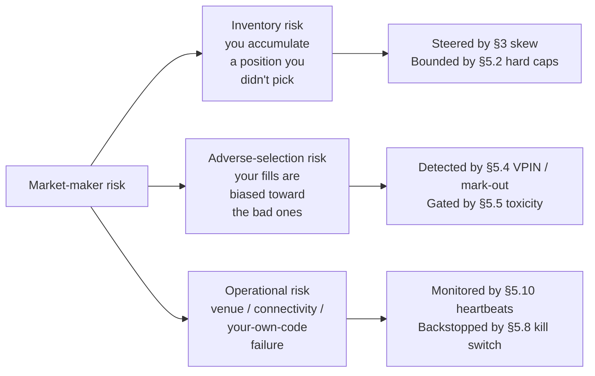
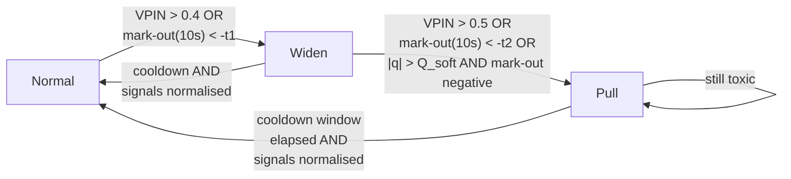

# 5. Risk, inventory, kill switches

!!! abstract "Where this chapter fits"
    **Feeds in from:** [§2 microstructure](02-microstructure.md) (the LOB mechanics whose pathologies this chapter polices); [§3 Avellaneda-Stoikov](03-avellaneda-stoikov.md) (the inventory state variable whose hard limits live here and whose skew is the *soft* version of the same machinery); [§4 execution](04-execution.md) (the latency and connectivity numbers this chapter gates on).
    **Feeds into:** [§6 backtesting](06-backtesting.md) (the risk gates must be replayed in the backtest, not just bolted on at production time — backtests that omit the gates over-state PnL because the gates pull capital out of the bad days); [§7 production](07-production.md) (the kill switch is the operational primitive the deployment ramp depends on; the connectivity heartbeats are the on-call dashboard).
    **Sister course:** [stat-arb §5 risk](../../stat-arb/docs/05-risk.md) — the drawdown-gate and Kelly-sizing material is shared; this chapter cross-references rather than restates. Read it once if you have not.
    **Read alone if:** you are auditing an existing quoter and want the checklist of "what circuit breakers should this thing have." §5.7 is the matrix; §5.12 is the code shape; the rest is the justification.

## 5.1 The three risk axes of a market maker

A stat-arb book has one risk axis worth a chapter: *the spread does not mean-revert on the timescale your sizing assumed*. Everything else — venue failure, drawdown, regime change — is operational scaffolding around that single bet. A market maker has three, and they are structurally different from each other. Conflating them is the most common analytical mistake on a young quoting desk.



**Inventory risk** is the risk you accumulate a position you did not pick. Every fill on the bid increases inventory; every fill on the ask decreases it. If flow is symmetric, inventory drifts back to zero on its own. If flow is asymmetric — and at the moment toxic flow arrives, it always is — inventory drifts in the direction the informed traders are about to pay you to be wrong. The Avellaneda-Stoikov skew in [§3](03-avellaneda-stoikov.md) is the *soft* response: tilt your quotes so the next fill is more likely to come from the side that flattens you. The hard limits in §5.2 are the *backstop* for when the soft response is too slow or too weak.

**Adverse-selection risk** is the risk that your fills are biased toward the ones you should not have taken. This is structurally different from inventory risk, even though they correlate in practice. A maker can be inventory-flat at the end of the minute and still be down money on the minute: 100 fills on the bid at 64,990 and 100 fills on the ask at 65,010 nets to zero inventory and a quoted spread of \$20 per round trip, but if every bid-fill was followed by the mid dropping 30 dollars and every ask-fill was followed by the mid rising 30 dollars, the maker just paid 10 dollars per round trip to provide liquidity. That is **GM85** (Glosten & Milgrom, 1985) made operational: the spread is wide enough on average, but the *conditional* expected mid move given a fill is adverse on every leg, and the realised spread is negative.

**Operational risk** is the risk that the venue, the connectivity, or your own code fails while orders are live. A market-making book has hundreds to thousands of orders resting in the book at any given moment. A connectivity loss that prevents you from cancelling those orders while the mid moves five basis points is a five-basis-point loss times the *gross* notional resting in the book, not the net. The asymmetry matters: when the venue is healthy you are net-short an option *per quote* (§1.2); when the venue is unhealthy you are net-short an option *per quote times the duration of the outage*. The §5.8 kill switch and the §5.10 heartbeat machinery are the discipline that bounds this risk.

The three axes are *not* additive in any simple way. A single bad minute typically hits two or three of them at once: a venue glitch (operational) freezes your cancels right as a CPI print arrives (adverse selection) and your inventory drifts long (inventory) before you can pull. The risk layer therefore does not run as three independent checks; it runs as a single gate that takes the *minimum* of the three permissions. The §5.12 code shape is exactly this: `Allow` only if all three axes say `Allow`; `Deny` or `Pause` if any one of them objects.

## 5.2 Inventory limits — the asymmetric quoting rule

The cleanest hard limit on inventory risk is the *asymmetric quoting rule*. State it as two lines of code and an inequality:

$$
\begin{aligned}
\text{if } q \geq Q_{\max} &\quad\Rightarrow\quad \text{do not post bid} \\
\text{if } q \leq -Q_{\max} &\quad\Rightarrow\quad \text{do not post ask}
\end{aligned}
$$

That is, when long inventory hits the cap you stop bidding (you only let the market take from you on the ask, which reduces inventory); when short inventory hits the cap you stop offering (you only let the market sell to you on the bid, which reduces inventory in the other direction). You do *not* pull both quotes — pulling both means zero flow, which means zero ability to flatten, which means the cap is a one-way ratchet against you. The asymmetric rule is the standard formulation in **CJP15** (Cartea, Jaimungal & Penalva, 2015) ch. 10 and is the version every real desk implements.

**Sizing $Q_{\max}$.** The cap is set by the answer to a single question: *how much inventory can the maker absorb at the worst plausible mid move over the timescale it takes to flatten the position?* The arithmetic is:

$$ Q_{\max} = \frac{C_{\text{loss}}}{\sigma_{\text{horizon}} \cdot z} $$

where $C_{\text{loss}}$ is the maximum acceptable loss from a single inventory blow-up (a fraction of NAV), $\sigma_{\text{horizon}}$ is the mid-price standard deviation over the horizon needed to flatten, and $z$ is the tail multiplier (3 for a 99.7% confidence under normality, larger for fat-tailed regimes — and crypto is fat-tailed, so $z = 4$ to $5$ is more honest). The horizon-to-flatten depends on the venue's depth: a deep BTC/USDT book on Binance lets you flatten 10 BTC in seconds; a thin altcoin pair lets you flatten 10 units in minutes, and the implied $Q_{\max}$ for the altcoin is therefore much smaller.

**Why asymmetric and not symmetric.** The naïve alternative is "if $|q| \geq Q_{\max}$, pull both sides." That sounds safer and is in fact more dangerous, for the same reason a stop-loss that *exits to flat* is more dangerous than one that *exits via the resting book*. Pulling both quotes means you no longer have an automated channel for inventory to drain; you are now relying on a market order on the opposite side, which pays the spread *and* the impact cost. The asymmetric rule keeps the drain channel open at zero cost (someone else's market order, your maker rebate) and only stops the *accumulation* channel.

The asymmetric rule composes with the [§3](03-avellaneda-stoikov.md) skew. The skew is the smooth response: as $q$ grows, the bid quote tightens (lower price, less attractive) and the ask quote loosens (lower price, more attractive). The skew is in continuous use; the asymmetric hard cap is a discrete fallback for when the skew has not been fast enough. In a well-tuned quoter the hard cap should fire rarely — daily-frequency rarely, not minute-frequency.

## 5.3 Inventory unwind policies — when soft thresholds trip

Below the hard cap $Q_{\max}$ sits a *soft* threshold $Q_{\text{soft}} < Q_{\max}$. Above $Q_{\text{soft}}$ the quoter is in a degraded mode. There are three named policies, and most production desks blend them.

**Policy A — Skew more aggressively.** The Avellaneda-Stoikov skew (§3) is parameterised by the risk-aversion coefficient $\gamma$. When inventory crosses $Q_{\text{soft}}$, you multiply $\gamma$ by a factor (typically 2× to 5×), which widens the skew and steers harder against the inventory. The advantage is that you stay in the market on both sides; the disadvantage is that the wider skew narrows your edge on the *productive* side. If you are long and you skew aggressively, your ask gets fills (good — inventory drains) but at a worse realised spread than your steady-state ask. You are paying spread to unwind.

**Policy B — Cross the spread proactively.** If inventory crosses $Q_{\text{soft}}$, send a market order on the wrong side to flatten some or all of the excess. The advantage is that the unwind is immediate; the disadvantage is the cost — you pay both the spread and the taker fee, and on a thin book you also pay impact. This is the right answer when the adverse-selection signal (§5.4) is *also* lit, because the model is telling you the flow is informed and waiting is more expensive than crossing. It is the wrong answer when the inventory drift was a temporary asymmetry that would have reverted on its own.

**Policy C — Pause and wait.** Pull both quotes for a fixed window (typically 10 to 60 seconds), let the LOB normalise, then re-engage. The advantage is zero direct cost; the disadvantage is the opportunity cost of being out of the market during a period that might have been profitable, plus the obvious risk that the mid moves *against* the inventory while you are sitting on it doing nothing. This is rarely the right answer alone but is sometimes the right answer combined with B: cross to flatten partially, then pause briefly before re-engaging.

**The blended default.** Most desks blend A and B with a tilt set by the §5.4 toxicity signal:

- If toxicity is *low* (the flow looks uninformed, you got unlucky with a random run): use **Policy A** only. Skew harder; let the inventory drain through the asymmetric maker flow. Cheapest.
- If toxicity is *medium*: blend A and B. Skew harder *and* cross some fraction (typically 25% to 50% of the excess inventory). Expensive but bounded.
- If toxicity is *high*: full **Policy B**. Cross immediately. Then transition into the §5.5 toxicity-gate state, which usually means pause and wait for a window before re-engaging at all.

The blended policy reads in code as a small lookup table indexed by $\{$inventory bucket, toxicity bucket$\}$. The lookup is a parameter you tune in the backtest (§6); the *categories* — inventory bucket and toxicity bucket — are the load-bearing decisions, not the exact numbers in the table.

## 5.4 Adverse-selection metrics — VPIN and mark-out

The signal that flow has become toxic is the second-by-second *fastest-moving* input to the risk layer. There are two metrics worth running in parallel, because they fail in different ways.

### 5.4.1 VPIN — Volume-synchronised Probability of Informed Trading

VPIN, from **ELO12** (Easley, López de Prado & O'Hara, 2012), is the volume-clock version of the older PIN estimator. The idea is that calendar-clock measurements of order imbalance are noisy because volume itself is bursty; if you instead bucket trades by *equal volume*, the imbalance within each bucket is a more stable estimate of informed flow. The formula is:

$$ \text{VPIN} = \frac{\sum_{i=1}^{N} |V_i^B - V_i^S|}{\sum_{i=1}^{N} (V_i^B + V_i^S)} $$

where $V_i^B$ and $V_i^S$ are the buyer-initiated and seller-initiated volume in the $i$-th volume bucket, and $N$ is the number of buckets in the rolling window. The numerator is the sum of imbalances; the denominator is total volume. VPIN is bounded in $[0, 1]$. The classification of trades into buyer-initiated vs seller-initiated uses the bulk-volume classification (BVC) rule in the original paper: trades that print at or above the prevailing mid are buyer-initiated, trades that print at or below are seller-initiated, with a fractional allocation for trades printing exactly at mid.

**Reading it.** VPIN in normal conditions on a liquid pair sits around 0.15 to 0.3. Values above 0.4 indicate a meaningful skew in flow; values above 0.5 indicate the flow is dominated by one side and is likely informed. The original paper documents VPIN spiking before the May 2010 flash crash; the practitioner replication on crypto pairs shows the same qualitative pattern around exchange outages and large-cap macro prints.

**The critique.** **AB14** (Andersen & Bondarenko, 2014) is the load-bearing critique: they argue that VPIN's apparent forecasting power for volatility is largely an artefact of the volume-clock and the bulk-volume classifier rather than a real informed-trader signal, and that on resampled data the predictive power evaporates. The critique is partially answered in **ELO14** (Easley, López de Prado & O'Hara, 2014, the rebuttal), but the honest position is that VPIN is a *useful* but not a *clean* informed-flow signal. Run it as one input to a composite gate (§5.5), not as the sole trigger.

### 5.4.2 Short-horizon mark-out

The mark-out is the operationalisation of adverse selection in its simplest form: *how much does the mid move against me in the $\tau$ seconds after I get filled?* The formula:

$$ \text{MarkOut}(\tau) = \text{sign}(\text{fill}) \cdot (m_{t+\tau} - m_t) $$

where $\text{sign}(\text{fill}) = +1$ for an ask-fill (you sold, you want the mid to drop) and $-1$ for a bid-fill (you bought, you want the mid to rise), $m_t$ is the mid at fill time, and $m_{t+\tau}$ is the mid $\tau$ seconds later. A *positive* mark-out means the mid moved in your favour — uninformed flow. A *negative* mark-out means the mid moved against you — informed flow.

The rolling mean of $\text{MarkOut}(\tau)$ over the last $N$ fills, for $\tau$ in $\{1\text{s}, 10\text{s}, 60\text{s}\}$, is the single most important dashboard a market-making desk has. The horizons matter: 1-second mark-out picks up latency-arb pickoff; 10-second mark-out picks up event-driven informed flow; 60-second mark-out picks up regime change. A healthy quoter shows a flat-or-slightly-negative mark-out at 1 second (you are paying a small amount of adverse selection on every fill — this is the GM85 cost the spread is meant to cover) and zero-or-positive at 60 seconds (the longer-horizon mid is not systematically against you).

**Why mark-out beats VPIN as the primary gate.** VPIN is a forecast; mark-out is a measurement. The mark-out is computed from *your own* fills, not from the venue's tape, so it captures exactly the population you care about — the flow that is hitting *your* quotes specifically — rather than the population-level informed-trader rate. The VPIN may flash on a CPI print before any of your quotes are picked off; the mark-out will not light up until your quotes are actually being picked off. The right combination is to use VPIN as the *forward-looking widen* signal (pre-emptive) and mark-out as the *backward-looking pull* signal (reactive).

## 5.5 The toxicity gate

The toxicity gate is the single composite signal that combines inventory pressure and adverse-selection metrics into a $\{$normal, widen, pull$\}$ output. The gate is a three-state machine, not a continuous score, because the operational responses are discrete.



The numerical thresholds $t_1$ and $t_2$ are pair-specific and calibrated in the backtest (§6); the *structure* — three states, asymmetric promotion (it is harder to leave a worse state than to enter it), explicit cooldown windows — is the load-bearing decision.

- **Normal.** Quote at the Avellaneda-Stoikov optimum with the configured $\gamma$ and configured $\delta^*$. This is the steady state.
- **Widen.** Quote at $1.5\times$ to $2\times$ the optimum half-spread. You are still in the market, but you are charging more for the liquidity. The toxic flow either accepts the wider spread (in which case you are at least getting paid for the adverse selection) or it goes elsewhere (in which case you stop bleeding without paying impact to flatten).
- **Pull.** Cancel all resting quotes. Do not post new ones for the duration of the cooldown window (typically 60 to 300 seconds). Re-evaluate at the end of the cooldown.

The promotion rules are asymmetric on purpose. Promotion from Normal to Widen is fast (a single signal trip) because the cost of being in Widen when you didn't need to be is small — you just get fewer fills. Promotion from Widen to Pull is slower (two simultaneous signals, or one strong signal *plus* an inventory condition) because the cost of being in Pull when you didn't need to be is the entire spread-capture opportunity for the cooldown window. Demotion (returning to a better state) requires both the trigger signals to have normalised *and* the cooldown to have elapsed — you do not flip back the moment VPIN ticks down.

The toxicity gate is the place where the soft-skew machinery and the hard-cap machinery meet. The skew runs in Normal and Widen (with $\gamma$ scaled up in Widen). The hard cap runs in all states. The cooldown in Pull is the discrete analogue of an infinite spread.

## 5.6 Drawdown gates

Drawdown gating is the load-bearing reason a market-making desk does not go out of business in one bad week. It is the *same* machinery, with the same justification, as the stat-arb course's [§5 drawdown gates](../../stat-arb/docs/05-risk.md) — peak-to-trough P&L decline tracked at three nested horizons (intraday, weekly, cumulative), each with its own halt threshold.

We cross-reference rather than restate. Read the sister chapter once and import the pattern. The market-making-specific differences are small but worth flagging:

1. **The intraday window is shorter.** A stat-arb desk reviews intraday at end-of-session; a market-making desk reviews intraday on a rolling 60-minute window because the trade frequency is two orders of magnitude higher and a 60-minute window contains thousands of fills (statistically meaningful) versus tens of trades for the stat-arb book.
2. **The drawdown number is dominated by realised-spread P&L, not mark-to-market on inventory.** Stat-arb drawdown is mostly mark-to-market on open positions. Market-making drawdown is mostly *realised* — the inventory is usually small and the dominant signal is the sum of completed round-trips. This means market-making drawdown is *less noisy* than stat-arb drawdown and the gate can be set tighter for the same false-positive rate.
3. **The halt action is different.** Stat-arb halt means "stop opening new positions; let existing ones run their course." Market-making halt means "cancel every resting order and stop quoting." There is no analogue of "let it run its course" because the positions are not deliberate.

The halt thresholds (1% intraday, 3% weekly, 8% cumulative are reasonable defaults; calibrate to your NAV and your investor mandate) are pair-agnostic at the book level and quoter-agnostic at the strategy level. They are the last numerical layer above the kill switch.

## 5.7 The circuit-breaker matrix

The §5 circuit breakers are the *named* automated halts, each tied to a specific named condition. The matrix below is the full list. Every row is implemented; every row is testable in the backtest; every row has a corresponding row in the §7 monitoring dashboard.

| # | Trigger | Threshold (defaults) | Auto / Manual | Action | Cooldown |
|---|---|---|---|---|---|
| 1 | Inventory > $Q_{\max}$ | $\|q\| \geq Q_{\max}$ | Auto | Asymmetric quote rule (§5.2): suppress the accumulation side | Continuous |
| 2 | Inventory > $Q_{\text{soft}}$ | $\|q\| \geq Q_{\text{soft}}$ | Auto | Aggressive skew (§5.3 Policy A) + optional partial cross (Policy B) | Until $\|q\| < 0.5 Q_{\text{soft}}$ |
| 3 | VPIN spike | $\text{VPIN} > 0.4$ for 30s | Auto | Widen quotes (§5.5 Widen state) | 5 min after $\text{VPIN} < 0.3$ |
| 4 | Negative mark-out | $\text{MarkOut}(10\text{s}) < -t_2$ over rolling 100 fills | Auto | Pull quotes (§5.5 Pull state) | 60–300s configurable |
| 5 | Intraday drawdown | rolling 60-min P&L $< -1\%$ of NAV | Auto | Pull all quotes; alert on-call | 60 min after recovery |
| 6 | Weekly drawdown | week-to-date P&L $< -3\%$ of NAV | Manual | Pull all quotes; pause book; review with on-call senior | Manual re-arm |
| 7 | Cumulative drawdown | peak-to-trough $< -8\%$ | Manual | Pull all quotes; pause book; review with desk head | Manual re-arm |
| 8 | Venue connectivity loss | heartbeat gap $> 2$s OR WS reconnect failed | Auto | Trigger kill switch (§5.8); cancel-all-orders on reconnect | Until heartbeat stable for 60s |
| 9 | Sequence gap | LOB update sequence number skipped | Auto | Pull quotes; rebuild book from snapshot; do not re-quote until verified | Until book verified |
| 10 | Mid-price jump | $\|\Delta m / m\| > X$ in 1s ($X$ pair-specific, 50 bps for BTC, 200 bps for alt) | Auto | Pull quotes for 30s; re-evaluate VPIN and mark-out before re-engaging | 30s |
| 11 | Order-ack latency degraded | P99 > 200 ms over last 60s | Auto | Widen quotes by additional factor; if P99 > 500 ms, pull | Until P99 < 100 ms for 60s |
| 12 | Rate-limit hit | venue 429 or equivalent | Auto | Pause new orders for $\geq$ the venue's stated retry-after; alert | Per venue |
| 13 | Funding-rate spike (perp) | $\|r_{\text{funding}}\| > 100$ bps annualised over last hour | Auto | Pull quotes if directional inventory would be carrying the funding | Until normalised |
| 14 | Operator concern | manual button | Manual | Kill switch (§5.8) | Manual re-arm |

Two notes on reading the matrix. First, the *auto* rows are the daily-frequency dashboards; they fire frequently in normal operation (especially rows 1, 2, 3, 11). That is fine and expected — they are the soft response. The *manual* rows (6, 7, 14) should fire approximately never in normal operation. If row 6 or 7 fires more than once a quarter, something is wrong with the model, not with the gate. Second, the cooldowns matter as much as the thresholds. A gate without a cooldown is a gate that thrashes; a gate that thrashes is a gate that operators learn to ignore.

## 5.8 The kill switch

The kill switch is the operational primitive of last resort. It is one call. It does one thing. It is the single most important piece of code in the §7 production stack.

```typescript
// risk/kill-switch.ts
export class KillSwitch {
  private engaged = false;

  async engage(reason: string, operatorId: string): Promise<void> {
    if (this.engaged) return; // idempotent
    this.engaged = true;

    // 1. Cancel every open order on every venue.
    await this.venue.cancelAll();

    // 2. Stop the quoting loop.
    await this.quoter.stop();

    // 3. Emit the event for the audit log and the alerting pipeline.
    await this.events.emit({
      type: 'KILL_SWITCH_ENGAGED',
      reason,
      operatorId,
      timestamp: Date.now(),
      inventorySnapshot: await this.inventory.snapshot(),
    });

    // 4. Do NOT liquidate inventory. That is a separate manual decision.
  }

  async disengage(operatorId: string): Promise<void> {
    if (!this.engaged) return;
    this.engaged = false;
    await this.events.emit({ type: 'KILL_SWITCH_DISENGAGED', operatorId, timestamp: Date.now() });
  }

  get isEngaged(): boolean {
    return this.engaged;
  }
}
```

Four properties make this load-bearing.

1. **Idempotent.** Calling `engage` twice is the same as calling it once. The on-call operator must be able to mash the button without worrying about state.
2. **Cancels orders, does *not* liquidate inventory.** This is the single most important design decision in the whole risk layer. Liquidation is a *separate* decision that requires a *separate* judgment: in a venue-outage scenario, you do not want the kill switch to also try to market-sell your inventory into a thin book or a broken matching engine. The kill switch makes the maker *stop adding risk*. Reducing the existing risk is a human-in-the-loop decision that follows.
3. **Emits an event with the inventory snapshot.** The event is the input to the post-incident review. Without a snapshot at engage-time, the post-mortem has to reconstruct state from logs, which is fragile and error-prone.
4. **Has a separate disengage.** Re-arming is not automatic. After the kill switch fires, an operator inspects the state, decides what to do with the inventory, and only then re-arms. The disengage call is the explicit "we have reviewed the situation" signal. There is no auto-disengage based on timers.

The kill switch is wired to *every* manual-tier circuit breaker (rows 6, 7, 14 in the §5.7 matrix), to the connectivity-loss breaker (row 8), and to a literal button on the operator's screen. It is the single function that every other piece of risk machinery falls back to.

## 5.9 Position sizing under Kelly with an adverse-selection penalty

The market-making sizing question is *not* "how big should each fill be?" — fill size is set by the venue's tick size and the maker's per-quote size, both of which are configured per pair. The sizing question is "*how much aggregate inventory budget should this quoter run with?*" — the cap $Q_{\max}$ from §5.2 — and the answer is a Kelly fraction shrunken by the adverse-selection penalty.

The stat-arb course's [§5.2 fractional Kelly](../../stat-arb/docs/05-risk.md) derives the basic form: $f^* = (\mu - r_f) / \sigma^2$, used at quarter strength to absorb estimation error. The market-making version replaces $\mu$ with the *realised-spread-per-unit-time* and $\sigma^2$ with the *inventory-variance-per-unit-time*, but the bigger correction is the adverse-selection penalty:

$$ f^*_{\text{MM}} = \frac{1}{4} \cdot \frac{\mu_{\text{realised}} - r_f - \lambda_{\text{adv}}}{\sigma^2_{\text{inv}}} $$

where:

- $\mu_{\text{realised}}$ is the *realised* spread capture per unit time (not the *quoted* spread — realised is quoted minus the average mark-out, exactly the §5.4 decomposition).
- $\lambda_{\text{adv}}$ is the *additional* adverse-selection drag from inventory-correlated flow — the term that captures the fact that running a bigger book attracts proportionally more informed flow because informed traders specifically prefer to trade against deeper, slower-to-cancel quotes.
- $\sigma^2_{\text{inv}}$ is the variance of inventory P&L on the timescale of the quote-update loop.
- $1/4$ is the quarter-Kelly multiplier from the stat-arb course's §5.2 — same justification, same arithmetic, same defensibility.

**The $\lambda_{\text{adv}}$ correction matters a lot.** A naïve sizing that uses *quoted* spread for $\mu$ and ignores $\lambda_{\text{adv}}$ over-sizes by a factor of 2 to 5 on a typical crypto venue. The realised-spread correction is in **HS01** (Hasbrouck, 2001); the inventory-attracts-informed-flow correction is in **GR07** (Glosten & Harris, the relevant updated treatment; **CJP15** ch. 10 gives the textbook derivation). The combined correction is the difference between a quoter that compounds quietly and a quoter that blows up in its third month.

**Default in practice.** Set $Q_{\max}$ at quarter-Kelly using the corrected formula above. Run the quoter for a month at quarter-Kelly. Use the live realised-spread and mark-out numbers to refit $\mu_{\text{realised}}$ and $\lambda_{\text{adv}}$. Only *then* consider raising to half-Kelly. The discipline is the same as the stat-arb [§5.2 / §5.9 cross-reference](../../stat-arb/docs/05-risk.md): under-size first, measure, scale slowly.

## 5.10 Connectivity and venue health

The connectivity layer is the part of the risk stack that gets the least attention in the literature and the most attention on a real desk. A quoter is only as safe as the channel through which it sends cancels.

The three load-bearing metrics:

1. **Heartbeat.** Most venues publish a heartbeat on the WebSocket feed at a known cadence (Binance: every 3 seconds for user data streams; FTX-class venues: 15–30 seconds for market data). Missing two consecutive heartbeats is a connectivity loss; one missed heartbeat is noise. The §5.7 row 8 breaker is wired to this signal. The implementation detail that bites everyone: the heartbeat *gap* must be measured by the maker's wall clock, not the venue's published timestamps, because if the venue is sick its timestamps are unreliable.
2. **Sequence-gap detection.** Every LOB update on every venue carries a sequence number. Sequence numbers are monotone. A gap (the next update's sequence number is more than 1 above the previous one's) means the maker missed an update; the local book is now out of sync with the venue's book. The right response is to pull all quotes immediately, fetch a fresh snapshot, rebuild the local book, and re-quote only after the rebuild succeeds. The §5.7 row 9 breaker is wired to this signal.
3. **Order-ack latency, P50 / P95 / P99.** Every order submission has a round-trip time: maker sends, venue acks. The distribution of those times is the single best leading indicator of trouble. P50 in a healthy state on a colocated quoter is 1–10 ms; P95 is typically 2–3× P50; P99 is typically 5–10× P50. When the P99 spikes to 100 ms or 200 ms without the P50 moving, the *venue* is degrading. When the P50 *and* P99 both spike, the *connectivity* is degrading. The §5.7 row 11 breaker fires on the P99; the underlying numbers are sampled on a rolling 60-second window.

The dashboard for these three metrics is the §7 operational top-line. If the heartbeat is steady, the sequence numbers are gap-free, and the P99 is within 5× of the P50, the connectivity layer is healthy and the strategy layer is the only thing that can break. If any of the three is degraded, the strategy layer is *not* allowed to act on its own signals — the toxicity gate and the drawdown gate both inherit from a healthy connectivity assumption.

## 5.11 Operational discipline — the three rules

There are three operational rules that every market-making book runs without exception. They are not mathematically derived; they are the residue of every incident write-up the field has accumulated, and they are non-negotiable.

**Rule 1 — No quoting in the first $N$ minutes after start.** Warmup. The quoter needs to subscribe to feeds, populate the local LOB, fit the $\kappa$ and $\gamma$ parameters on the most recent window, and calibrate the §5.4 metrics from a fresh population of trades. None of those steps is instantaneous, and quoting before they complete is quoting from a stale or empty state. Typical $N$: 5 to 15 minutes, depending on how long the metric windows are. The warmup is not optional even after a restart that the operator believes is fast — the cost of an extra 10 minutes of not quoting is rounding error against the cost of one bad fill from a half-warmed model.

**Rule 2 — No quoting in the last $M$ minutes before shutdown.** Winddown. Before a planned restart or maintenance window, the quoter cancels all resting orders and stops re-quoting $M$ minutes before the cutoff. This is the inverse of warmup: it gives in-flight orders time to either fill or cancel cleanly, gives the connectivity layer time to drain the ack queue, and gives the operator a clean state to verify before the restart. Typical $M$: 2 to 5 minutes. Unplanned shutdowns (the kill switch) skip this rule, by design — the kill switch is for when waiting is itself the problem.

**Rule 3 — No quoting when $\sigma$ jumps > $X$ in a 60-second window.** Volatility shock. A sudden volatility spike means *something just changed*. The change might be benign (a large but legitimate trade), informed (a leak ahead of a print), or operational (a venue outage causing a price gap). The quoter does not know which, and it is exposed to all three. The right response is to pull quotes for a cooldown (typically 60 to 120 seconds), re-evaluate VPIN, mark-out, and the §5.10 connectivity metrics, and only re-engage when the picture is clean. Calibrating $X$ is pair-specific: 50 bps in 60 seconds is normal for BTC, abnormal for a low-vol stable pair, and rounding error for a microcap altcoin. The rule's *structure* — pull on sudden $\sigma$ jump — is universal; the *threshold* is per-pair.

These three rules are *complementary* to the toxicity gate (§5.5) and the circuit-breaker matrix (§5.7), not substitutes. The matrix handles steady-state degradation. The three rules handle the discrete state transitions — startup, shutdown, regime break — that the matrix does not naturally cover.

## 5.12 Code shape: the `RiskGate`

The risk layer composes into a single class with a single entry point. The entry point takes a candidate order request and the current state, and returns one of three values: `Allow`, `Deny`, `Pause`. The three values map to the three operational responses: `Allow` means submit, `Deny` means do not submit and do not retry this side this tick, `Pause` means do not submit and *also* halt the quoting loop for a cooldown window.

```typescript
// risk/risk-gate.ts
export type RiskDecision =
  | { type: 'Allow' }
  | { type: 'Deny'; reason: string }
  | { type: 'Pause'; reason: string; cooldownMs: number };

export interface OrderRequest {
  side: 'bid' | 'ask';
  price: number;
  size: number;
  pair: string;
}

export interface RiskState {
  inventory: number;
  qMax: number;
  qSoft: number;
  vpin: number;            // rolling, [0,1]
  markOut10s: number;      // rolling, signed, basis points
  drawdownIntraday: number; // fraction of NAV, signed
  heartbeatHealthy: boolean;
  sequenceGapDetected: boolean;
  ackLatencyP99Ms: number;
  msSinceStart: number;
  msUntilShutdown: number | null;
  sigmaJump60s: number;    // bps move over rolling 60s
  killSwitchEngaged: boolean;
}

export class RiskGate {
  constructor(private readonly cfg: {
    warmupMs: number;
    winddownMs: number;
    sigmaJumpThresholdBps: number;
    ackLatencyHardMs: number;
    drawdownIntradayHaltPct: number;
    vpinPullThreshold: number;
    markOutPullBps: number;
  }) {}

  check(req: OrderRequest, st: RiskState): RiskDecision {
    // 1. Kill switch trumps everything.
    if (st.killSwitchEngaged) return { type: 'Deny', reason: 'kill_switch_engaged' };

    // 2. Connectivity: any degradation halts.
    if (!st.heartbeatHealthy) return { type: 'Pause', reason: 'heartbeat_lost', cooldownMs: 60_000 };
    if (st.sequenceGapDetected) return { type: 'Pause', reason: 'sequence_gap', cooldownMs: 30_000 };
    if (st.ackLatencyP99Ms > this.cfg.ackLatencyHardMs)
      return { type: 'Pause', reason: 'ack_latency_high', cooldownMs: 30_000 };

    // 3. Operational discipline: warmup, winddown, sigma shock.
    if (st.msSinceStart < this.cfg.warmupMs)
      return { type: 'Deny', reason: 'warmup' };
    if (st.msUntilShutdown !== null && st.msUntilShutdown < this.cfg.winddownMs)
      return { type: 'Deny', reason: 'winddown' };
    if (st.sigmaJump60s > this.cfg.sigmaJumpThresholdBps)
      return { type: 'Pause', reason: 'sigma_shock', cooldownMs: 60_000 };

    // 4. Drawdown gate.
    if (st.drawdownIntraday < -this.cfg.drawdownIntradayHaltPct)
      return { type: 'Pause', reason: 'drawdown_intraday', cooldownMs: 60 * 60_000 };

    // 5. Toxicity gate (composite, see §5.5).
    if (st.vpin > this.cfg.vpinPullThreshold && st.markOut10s < -this.cfg.markOutPullBps)
      return { type: 'Pause', reason: 'toxicity_pull', cooldownMs: 120_000 };

    // 6. Asymmetric inventory rule (§5.2).
    if (req.side === 'bid' && st.inventory >= st.qMax)
      return { type: 'Deny', reason: 'inventory_cap_long' };
    if (req.side === 'ask' && st.inventory <= -st.qMax)
      return { type: 'Deny', reason: 'inventory_cap_short' };

    // All gates passed.
    return { type: 'Allow' };
  }
}
```

The shape is deliberate. The kill switch is checked first because nothing else matters if it is engaged. Connectivity is checked second because every downstream signal is unreliable on a degraded channel. Operational discipline is checked third because warmup and winddown are deterministic boundaries that have nothing to do with market state. Drawdown is fourth, toxicity fifth, inventory last. The ordering is the priority ordering: a connectivity loss during a drawdown event halts on the connectivity reason, not the drawdown reason, because the connectivity reason has the shorter cooldown and the cleaner remediation. The `reason` strings are stable identifiers used in the §7 dashboards and the audit log.

A note on what is *not* in this class. The risk gate does not size orders (the quoter does that, using the Kelly-with-penalty math in §5.9). The risk gate does not select what to quote (the Avellaneda-Stoikov layer in §3 does that). The risk gate does not unwind inventory (the §5.3 policy module does that, called from the quoter when the soft threshold trips). The risk gate is a *filter* — it says yes or no to an order the rest of the system has already proposed. That separation of concerns is what lets each layer be tested in isolation and what makes the audit log readable after an incident.

## 5.13 Sources

- §5.2 and §5.3's inventory-limit and unwind-policy material is the operational version of the inventory framework in **HS81** (Ho & Stoll, 1981), **AS08** (Avellaneda & Stoikov, 2008), and **CJP15** (Cartea, Jaimungal & Penalva, 2015) ch. 10. HS81 is the original inventory-control paper; AS08 is the closed-form skew the soft-policy layer uses; CJP15 is the modern textbook treatment.
- §5.4's VPIN formula and the volume-bucketing interpretation is **ELO12** (Easley, López de Prado & O'Hara, 2012). The empirical critique is **AB14** (Andersen & Bondarenko, 2014), and the rebuttal is **ELO14** (Easley, López de Prado & O'Hara, 2014). The honest position in this chapter — use VPIN as one input, not a sole trigger — is informed by reading all three.
- §5.4's short-horizon mark-out as the operational adverse-selection metric is the empirical formalisation in **HS01** (Hasbrouck, 2001). The use of multiple horizons (1s, 10s, 60s) is practitioner discipline rather than a single paper.
- §5.5's three-state toxicity gate (Normal / Widen / Pull) is the operational distillation of **GM85** (Glosten & Milgrom, 1985) — the spread should widen as informed-trader probability rises and go to infinity as it approaches one. Three states is the discrete approximation.
- §5.6's drawdown gate cross-references the stat-arb course's [§5 drawdown material](../../stat-arb/docs/05-risk.md), which is itself derived from the standard treatment in **GK99** (Grinold & Kahn, 1999).
- §5.9's Kelly-with-adverse-selection-penalty is the standard fractional Kelly (**Kelly 1956**, **Thorp 2006**, **MTZ11** = MacLean, Thorp & Ziemba, 2011) with the realised-spread correction from **HS01** and the inventory-attracts-informed-flow correction from **CJP15** ch. 10.
- §5.10's connectivity and venue-health discipline is operational practitioner lore, not a single paper. The closest published treatment is in **CJP15** ch. 11.
- §5.11's three operational rules (warmup, winddown, sigma shock) are residue of the post-incident literature — most concretely the post-mortems of the May 2010 flash crash, Knight Capital 2012, and the various crypto-venue outages of 2020–2022. **ELO12** uses the flash crash as the motivating example for VPIN; the operational lessons generalise.

Full citations in [Appendix B](appendix-b-sources.md).
