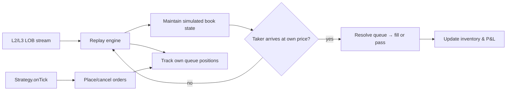
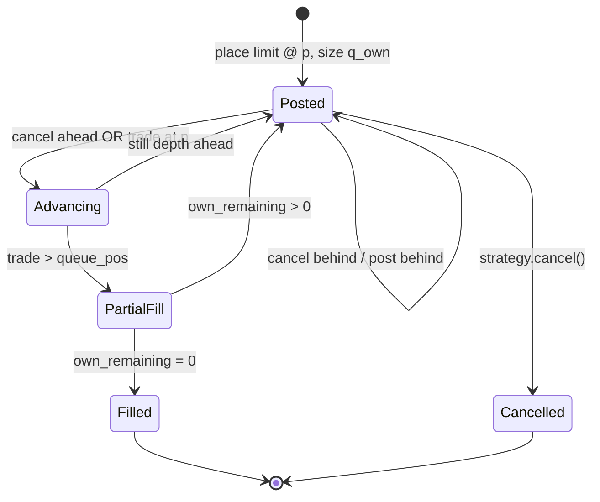
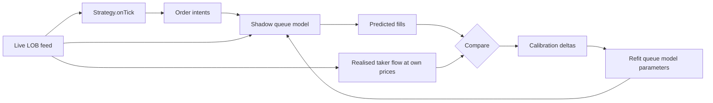

# 6. Backtesting & LOB replay

!!! abstract "Where this chapter fits"
    **Feeds in from:** [§2 microstructure](02-microstructure.md) (the LOB mechanics this chapter replays), [§3 Avellaneda-Stoikov](03-avellaneda-stoikov.md) (the quoting model whose fill rate we are trying to predict), and [§4 execution](04-execution.md) (the cancel-replace machinery whose costs we must charge against the backtest). Without §2's queue-priority rules and §3's reservation price, the harness in [§6.11](#611-code-shape-the-lobreplayharness-skeleton) has nothing to simulate.
    **Feeds into:** [§7 production](07-production.md) — the shadow-mode loop in [§7.1](07-production.md#71-the-four-execution-postures) is the live extension of [§6.4](#64-calibrating-the-fill-model-against-shadow-mode)'s calibration discipline, and the deflated-Sharpe gate in [§6.8](#68-sharpe-ratio-for-market-making) is the only number worth promoting from backtest to capital.
    **Sister course:** read [stat-arb §6 backtesting](../../stat-arb/docs/06-backtesting.md) first if you have not — the look-ahead, multiple-testing, and purged-k-fold discipline there is the *minimum* baseline. Everything in this chapter is *more demanding* than the stat-arb version, for the reasons in [§6.1](#61-why-mm-backtesting-is-harder-than-stat-arb-backtesting).
    **Read alone if:** you already have a stat-arb backtest harness and want to know what extra discipline an MM harness needs. [§6.1](#61-why-mm-backtesting-is-harder-than-stat-arb-backtesting) + [§6.10](#610-the-three-pathologies-that-ship-undetected) + [§6.11](#611-code-shape-the-lobreplayharness-skeleton) is the minimum self-contained read.

## 6.1 Why MM backtesting is harder than stat-arb backtesting

A stat-arb backtest is a price-prediction backtest. It asks: *given the prices that printed, what would my P&L have been if I had taken the positions my signal indicated, paying realistic costs?* The price tape is exogenous — the strategy is small enough that its own orders did not change what subsequently printed — and the only honest questions are about look-ahead, survivorship, multiple-testing, and slippage. The sister course's [§6](../../stat-arb/docs/06-backtesting.md) is the canonical treatment of those four, and we presume them here. They are the easy half of the discipline.

A market-making backtest is a different beast. It is a *fill-rate* backtest, and the fill rate is not a function of the tape alone. The fill rate depends on three things the tape does not record, and that no amount of cleaner tape data can recover. They are why honest MM backtesting is materially harder than honest stat-arb backtesting, and why a desk that ships an MM strategy on a vectorised-tape backtest is shipping a guess dressed in plotly:

1. **Fills depend on queue position, which depends on every other participant's behaviour.** When you post a limit order at a price level, you join the back of the queue of orders already resting at that price. You only get filled after every order ahead of you is either filled or cancelled. Whether a market order that arrives at your price reaches *you* is a question about how many orders were ahead of you when you posted, how many cancelled in the interim, and how big the incoming taker order is. None of that is in the trade tape. **MM12** (Moallemi & Yuan, 2012) is the canonical formalisation of why queue position dominates short-horizon market-making P&L, and it is the reason §6.3's queue model is the load-bearing piece of the whole harness.

2. **Your own quote moves the market.** Every quote you post adds depth at a price level, displacing the marginal flow that would otherwise have crossed there. Every cancel removes depth and reshapes what the next taker sees. In stat arb you can pretend your orders are infinitesimal; in market making you *are* the LOB at the prices you quote. **K85** (Kyle, 1985) and the price-impact literature it spawned (**ATHL05** Almgren-Thum-Hauptmann-Li, **OW13** Obizhaeva-Wang, **CJP15** §6) all formalise this for *taker* impact; the *maker* version — your own quote changes what subsequently fills — is the same idea applied to the resting side and is mathematically harder because the response is in the cancel and place rates of other participants, not in the price.

3. **Fill rate matters more than P&L per fill, and it is the noisiest thing to estimate.** A stat-arb strategy can be evaluated on the expected return per trade and the trade frequency; both are estimable from the tape. An MM strategy's expected return per fill is a small number — a few basis points at most after costs — and the total P&L is dominated by how *many* fills you collect. The fill rate is a property of the queue model, the cancel-replace policy, and the flow distribution; it has none of the convenient statistical properties of a price return. The standard error of a fill-rate estimate from a backtest is large enough that two strategies whose backtested fill rates differ by 20% may have indistinguishable true fill rates, and the only way to find out is shadow mode ([§6.4](#64-calibrating-the-fill-model-against-shadow-mode)).

The implication is operational. A stat-arb desk can run a backtest, run a paper-trading round, and ship. An MM desk must run a backtest, then a shadow-mode calibration round, then a paper-trading round, then a min-capital live round, and only then ship. The shadow-mode step is the one that has no analogue in stat arb and is non-negotiable in market making. Skipping it is the single most common reason MM strategies that look good in backtest die in live; the queue model was wrong, the backtest did not know, and no amount of in-sample re-tuning could have told you.

## 6.2 The three classes of MM backtest

There are roughly three classes of MM backtest in practical use, ordered by fidelity. Each is appropriate for a different stage of the research lifecycle; using a lower-fidelity class for a later stage is the textbook way to ship a strategy that backtests well and loses money in live.

### 6.2.1 Trade-tape backtest — sanity check only

The simplest MM backtest replays the *trade tape* (the public time-and-sales feed) and assumes you are filled if the trade prints at or through your quote. If your bid is at 64,990 and a trade prints at 64,985, you assume you were filled at 64,990 for the size of the trade. If a trade prints at 64,995, you assume you were not.

This is always wrong, in a direction that is always optimistic. The trade tape records *which* prices traded; it does not record whether the resting order at that price was *yours* or someone else's. If 100 orders were ahead of you at 64,990 and the incoming taker was for 10 BTC, none of them fills you — but the trade-tape backtest will book you 10 BTC of fills anyway. Worse, the directional bias is structural: the tape records fills *only* when there was enough flow to consume some resting depth, so the events the tape records are exactly the events where queue position matters most.

A trade-tape backtest is useful for one thing and one thing only: it bounds the *upper limit* of what your fill rate could possibly be. If your strategy looks unprofitable in a trade-tape backtest, no amount of better queue modelling will save it. The reverse direction — strategy looks profitable in trade-tape, therefore worth a real backtest — is the use case. Anything beyond that is mis-using the tool.

**How badly does fill-on-touch overstate, in practice?** This desk measured it directly against a real Hyperliquid L2 tape with real per-trade aggressor flow — the queue-aware harness ([§8.5](08-the-meridian-desk-stack.md#85-queue-aware-fills-stop-trusting-fill-on-touch)) reports `queueFills` (honest) vs `touchFills` (fill-on-touch). The overstatement depends *entirely on where you quote*:

```
   fill count:  queue-aware (honest)  vs  fill-on-touch (optimistic)

   top-of-book quote,   2h capture     queue     3  ┆ touch       9     →  3× overstated
   into the stack (5bps deep)          queue     0  ┆ touch      21     →  ∞  (never fills)
   sub-second cadence,  8h             queue 3,350  ┆ touch 141,991     → 42× overstated
```

The pattern *is* the lesson: fill-on-touch lies **most exactly where you most want to believe it** — on the wide, "safe" quotes deep in the book, where the cumulative queue above you never clears in reality. A backtest that books those fills is inventing an edge. (Full read in [§8.5](08-the-meridian-desk-stack.md#85-queue-aware-fills-stop-trusting-fill-on-touch); the consequence for *strategy* design is [§9](09-the-fair-value-result.md).)

### 6.2.2 LOB-replay with queue model — the standard

The standard MM backtest replays every level-2 (or level-3, when available) LOB update — every post, every cancel, every modify, every trade — and tracks a simulated queue position for each of your own resting orders. When a taker arrives at your price level, the backtest determines whether enough orders ahead of you have cleared (filled or cancelled) for the taker to reach you, and partially or fully fills you if so. The queue-position model is the load-bearing piece — §6.3 derives it in detail — and the LOB data feed is the cost-driving input ([§6.5](#65-lob-data-sources-and-the-data-problem)).



This is what every serious MM desk uses, and it is what the rest of this chapter assumes when it says "the backtest." The two failure modes — the queue model is too optimistic, and the LOB feed is missing data — are the §6.10 pathologies.

### 6.2.3 Agent-based simulation — out of scope

The most-fidelity class simulates not just the LOB but the *other participants* — a population of takers, makers, informed traders, and noise traders, each with their own response function. When your strategy posts a quote, the agent-based simulator updates the other agents' state, which changes what they subsequently post and what flow arrives. This is the only class that correctly captures the second point in §6.1 — your own quote moves the market — and the only one that closes the loop between your behaviour and the data your queue model needs.

It is also enormously expensive to build, calibrate, and validate. Serious shops have one; the rest of us cite it. **WHB22** (Wang, Hua & Buehler, 2022, "JPMorgan's Multi-Agent Simulator") and the academic **ABIDES** simulator (Byrd, Hybinette & Balch, 2020) are the canonical references. **MBT-GYM** (Jerome et al., 2022) is a more accessible open-source RL environment in this lineage. You should know agent-based simulation exists, you should know what problem it solves that LOB replay does not, and you should know that you are almost certainly not going to build one. If your edge depends on simulating other participants' responses to your quotes, you are either a top-five MM firm or you have miscalibrated your edge.

## 6.3 The queue-position model

The load-bearing piece of an LOB-replay backtest is the queue-position model. Get this wrong and every fill the backtest books is fictional; get it right and the backtest's fill rate can predict live to within a few percent.

The setup. You post a limit buy order of size $q_{\text{own}}$ at price $p$ at time $t_0$. At that instant the book has $Q_0$ units of resting buy depth ahead of you at $p$ (orders posted before yours). Your initial queue position is $Q_0$ — that is the amount of depth in front of you. Over time three things happen at your price level:

- **Cancels** ahead of you reduce $Q$. Each cancelled order in front of you advances you in the queue.
- **Trades** at price $p$ consume depth from the front of the queue. A taker sell of size $s$ arriving at your bid consumes $\min(s, Q)$ from the front, advancing you by that amount; if $s > Q$, the remainder $s - Q$ fills your order partially or fully.
- **New posts** at price $p$ go to the *back* of the queue, behind you. They do not affect your queue position, but they do mean the next time you see the L2 snapshot's total depth at $p$, the change is the sum of (cancels ahead of you) + (new posts behind you) − (trades), which is *not* directly observable as a single number.

The third point is the one that makes naive queue tracking fail. The L2 feed gives you the *total* depth at a price; it does not tell you which of the change is in front of you and which is behind you. The queue model has to allocate the changes between the two regions, and the allocation is the modelling assumption. The two standard assumptions are:

1. **Pessimistic (Cont-Stoikov-Talreja 2010 style).** All cancels at your price come from *behind* you in the queue; all trades consume from the front. This is the conservative assumption — it minimises your queue advancement and therefore minimises your fill rate. Use it for risk-sided sanity checks.
2. **Proportional.** Cancels are distributed proportionally between the front and back of the queue according to the share of total depth each region holds. This is the standard production assumption — it matches the empirical observation in **CST10** (Cont, Stoikov & Talreja, 2010) that cancel rates are roughly uniform across queue positions for short-tenure orders, with a heavier tail for old orders.

The pseudo-code for the proportional model:

```text
queue_pos = Q_0                          # depth ahead of you at post time
own_remaining = q_own

on lob_update(price, delta, kind):
    if price != own_price: return
    if kind == "trade":
        # taker consumed `|delta|` from front of queue
        consumed = min(|delta|, queue_pos)
        queue_pos -= consumed
        spillover = |delta| - consumed
        if spillover > 0:
            fill = min(spillover, own_remaining)
            own_remaining -= fill
            book_fill(fill, price)
    elif kind == "cancel":
        # allocate |delta| proportionally
        total_depth = queue_pos + own_remaining + behind
        ahead_share = queue_pos / total_depth
        queue_pos -= |delta| * ahead_share
        behind   -= |delta| * (1 - ahead_share)
    elif kind == "post":
        # all new posts go behind you
        behind += delta
```

The state machine, drawn:



Two refinements are worth knowing about and implementing if your strategy is sensitive to them:

- **L3 reconstruction.** Some venues (Coinbase, OKX historical) publish per-order updates rather than per-level. With L3 you do not have to model the front/back allocation — you know exactly where each order sits. The trade-off is data volume (L3 is one to two orders of magnitude larger than L2) and venue coverage (most crypto venues are L2-only in their public feeds). When L3 is available, use it. **HFY15** (Huang, Lehalle & Rosenbaum, 2015) is the canonical L3-aware queue paper.
- **Self-trade prevention.** When your own bid sits in the same queue as your own ask on the other side of mid, and the spread narrows enough that a taker could in principle hit both, the venue's STP rule decides what happens — most venues will cancel one of your two orders rather than self-trade. Model the cancel, not the trade. Forgetting this is one of the more embarrassing backtest bugs and shows up as a free P&L bump that does not survive live.

The honest summary. The queue model is the single largest source of backtest-vs-live divergence in MM, and it has to be calibrated against shadow-mode data ([§6.4](#64-calibrating-the-fill-model-against-shadow-mode)) rather than assumed correct from the textbook. The textbook gives you the structural form; the magnitude of the fill rate is an empirical question.

## 6.4 Calibrating the fill model against shadow-mode

The only honest way to know whether your queue model is right is to run the strategy in **shadow mode**: same code path, same `onTick` calls, same `place` and `cancel` decisions, but the orders are *not* sent to the venue. Instead, the backtest's simulated queue position is computed in parallel with the live LOB feed, and at each tick the harness logs:

- The orders the strategy *would* have placed.
- The simulated queue position those orders *would* have had.
- The predicted fill events the queue model says *would* have happened.

After two weeks of shadow-mode logs, you have a paired sample: predicted fills (from the queue model) versus the actual flow that crossed those price levels in live data. The calibration is straightforward:

$$
\text{realised fill rate}(p, \Delta t) = \frac{\#\,\{\text{shadow orders at } p \text{ that the live taker flow would have reached}\}}{\#\,\{\text{shadow orders at } p\}}
$$

Compare to the queue model's prediction. The model is calibrated when the two are within a small tolerance (a few percent) across price levels and across time windows. If the model is systematically too optimistic — predicted fill rate higher than realised — you have either (a) under-estimated queue depth at post time, (b) over-counted cancels-from-the-front, or (c) ignored some structural cost (rate limits, post-only rejects) that prevents your orders from being where the model says they are. Each is a known fix and §6.10 names them.

The shadow-mode calibration loop, drawn:



Two important disciplines. (1) Shadow mode is not a "paper trading" round — paper trading is the *next* step, where simulated orders are placed against the real venue and partially fill against simulated flow. Shadow mode is *purely observational*: no orders, no flow disturbance, just queue-model prediction vs realised flow. The two are different tools for different questions. (2) Calibrate per venue and per pair. The cancel-rate distribution on Binance BTC/USDT is not the same as the cancel-rate distribution on Coinbase ETH/USD, and a queue model calibrated on one will be systematically wrong on the other.

The sister course's [§6.4](../../stat-arb/docs/06-backtesting.md#64-calibrating-the-fee-slippage-model-the-audit-loop) does the analogous calibration for stat arb's slippage model. The MM version is structurally similar but more demanding because the quantity being calibrated (fill rate) has higher variance than the stat-arb quantity (slippage in basis points) and requires more shadow-mode data to converge.

## 6.5 LOB data sources and the data problem

Every LOB-replay backtest is bottlenecked by the quality of the underlying L2/L3 data. The data sources for crypto are reasonable and cheap; the data sources for equities are exchange-licensed, expensive, and gated. We tier them here using the same Tier-A/B/C discipline as [§0.2](00-charter-and-sources.md#02-the-source-tiering-rule).

| Source | Asset class | Coverage | Cost | Tier | Notes |
|---|---|---|---|---|---|
| **Kaiko** | Crypto (200+ venues, L2) | Comprehensive, normalized | $$$ (institutional pricing) | B (verified vendor) | Standard for institutional crypto research. Historical depth-of-book back to ~2017 on major pairs. |
| **Tardis.dev** | Crypto (90+ venues, L2 + some L3) | Comprehensive, raw feed | $$ (per-month or per-day) | B | The de-facto crypto-LOB tape for independent quants. Pay-as-you-go pricing makes it the cheapest serious option. L3 on Coinbase, BitMEX, Deribit, OKX. |
| **Binance / Coinbase / OKX public WebSockets** | Crypto | L2 deltas live, no history | Free (record yourself) | C (operational) | If you want history you must run a recorder for the time period you want. The data is real; the operational cost is non-trivial (storage, gaps, reconnects). The "record it yourself" path is how most independent desks start. |
| **Crypto-Lake (on AWS Open Data)** | Crypto (Binance, Coinbase, OKX, others) | L2 archive | Free (S3 egress only) | B | The cheapest historical crypto L2 archive that is *not* a recording effort of your own. Coverage is patchy on smaller venues but excellent on the majors. |
| **LOBSTER** | US equities (Nasdaq ITCH) | L3 reconstructed from ITCH | Free for research; commercial requires license | A/B (academic standard) | The canonical academic LOB dataset for US equities. Used by **CST10**, **HFY15**, and most of the equity-MM literature. Not legally usable for production trading without a separate Nasdaq license. |
| **Refinitiv Tick History / DataScope** | Equities (global), FX, futures | L1/L2 | $$$$ (enterprise) | B | Standard equity vendor. Expensive and exchange-licensed; assume you cannot get it as an independent. |

The asymmetric statement: **crypto LOB data is cheap and equity LOB data is expensive**, and this materially affects which asset class an independent MM researcher should be working in. If you are an independent or a small desk, the entry tier is "record Binance/Coinbase/OKX WS yourself, fill historical gaps from Crypto-Lake, upgrade to Tardis when you need a venue you do not record." If you are an academic or a well-funded shop, LOBSTER + Tardis or LOBSTER + Kaiko is the standard. Equity exchange-licensed feeds are not a serious option for a course-sized research effort and are not what this course assumes.

One subtlety that bites everyone: **clock alignment between LOB and trade tape**. Some vendors timestamp at the *exchange* (matching engine), some at the *gateway* (vendor's collector), and the difference is non-trivial — tens of milliseconds. If your queue model uses exchange timestamps but your trade tape uses gateway timestamps, you will have order-of-arrival bugs that are invisible in summary statistics but devastate fill-rate accuracy. The first thing to check in any new LOB dataset is the timestamp convention; both Tardis.dev and Kaiko document theirs.

## 6.6 The path-dependence problem

Section §6.1's second reason — *your own quote moves the market* — has a precise consequence for LOB-replay backtests that most practitioners ignore and that the agent-based-simulation literature was created to address. The replay engine treats the LOB feed as exogenous. It assumes the cancels, posts, and trades that arrive *would have arrived* even if your strategy's quotes had been resting in the book. They would not have.

The mechanism. When you post a bid at 64,990, the marginal taker who was about to cross at 64,989 now has the option of stopping at 64,990 and saving a tick. Some takers will. Their orders, in the real world, would never have reached 64,989 — but in the replay, they *do* reach 64,989, because the LOB feed records what happened in the absence of your quote. The replay over-counts the flow that crossed below your bid, and your simulated queue position drains faster than it would have in reality.

A symmetric effect on the other side. When you cancel a bid at 64,990, depth at that price drops. In the real world, a taker who was about to sell to your bid may now sell at 64,989 instead, consuming someone else's order. In the replay, that taker's sell still arrives at 64,989 (the LOB feed records what happened *without* your bid being cancelled at that instant), but the queue model now has no reason to believe it should have stopped at 64,990 — because it does not see your cancelled bid as a counterfactual. The backtest under-counts the cancels-saved-by-being-hit and over-counts the trades-going-deeper.

Both effects are systematically *optimistic* for the backtest. They increase the apparent flow at your prices and they make the queue-clearing rate look higher than it would be live. This is the *path-dependence* problem, and it is the structural reason an LOB-replay backtest can be calibrated against historical data and still be wrong about the live fill rate.

There are two honest responses:

1. **Bound the error.** Estimate how much of the flow at your prices is *marginal* — i.e. would have gone elsewhere if your quote had not been there. **CST10** §4 gives a stylised model. The bound is a function of (a) your quote's depth relative to total depth at the price, (b) the spread, and (c) the tick size. Small posts (your depth is a fraction of total) on tight ticks: the error is small. Large posts on coarse ticks: the error is large. Report the bound alongside the backtest's headline fill rate.
2. **Use an agent-based simulator.** This is the literature's response (**WHB22**, **ABIDES**, **MBT-GYM**) and the only one that correctly closes the loop. If you are building a serious quoter on a thin pair, this is the right answer. If you are running a small-fraction-of-book quoter on a deep major-pair venue, the bound in (1) is sufficient and the agent-based simulator is overkill.

For most desks running on top-five-by-volume crypto pairs, the path-dependence error is small enough that LOB-replay with the §6.10 pathology audits gives a fill-rate estimate that is correct to within 20–30%, and the residual error is closed by shadow-mode calibration ([§6.4](#64-calibrating-the-fill-model-against-shadow-mode)). The bound matters and the math should be reported; the agent-based simulator is the next step *only* if the bound is too wide for the strategy to clear its hurdle.

## 6.7 Walk-forward validation

The cross-validation discipline for MM is structurally the same as for stat arb — purged k-fold cross-validation with an embargo, exactly as in [stat-arb §6.3](../../stat-arb/docs/06-backtesting.md#63-purged-k-fold-cross-validation-worked-example) — but with two MM-specific twists.

**Twist one: the purge buffer must be at least one inventory-mean-reversion half-life.** A stat-arb strategy's labels span the trade-holding period (days to weeks); the purge buffer is set to that horizon. An MM strategy's "label" is fuzzier — the realised P&L from a quote is a sum of many fill events over an inventory-clearing horizon — but the structural quantity is the *time it takes for inventory to revert to neutral*. From §3, the Avellaneda-Stoikov inventory half-life is roughly:

$$
t_{1/2} \approx \frac{\ln 2}{\gamma \sigma^2 \lambda}
$$

where $\gamma$ is risk aversion, $\sigma^2$ is mid variance, and $\lambda$ is the per-side fill intensity. On a major crypto pair at typical parameters this is on the order of minutes to tens of minutes. The purge buffer in your k-fold split must be at least $t_{1/2}$ — anything shorter and the test fold's first quote inherits the training fold's last inventory state, which is a form of look-ahead.

**Twist two: walk-forward must respect the venue-state cycle.** Crypto venues have funding-rate cycles (eight hours on most perps), maintenance windows, and weekly fee-tier resets. An MM strategy's behaviour is materially different around these events — funding payments compress spreads, maintenance pauses break the cancel-replace loop, fee-tier crossings change the rebate economics. A walk-forward split that puts an entire funding-rate cycle in the training fold and a different cycle in the test fold is fine; a split that bisects a single cycle is not. Align the fold boundaries to venue-state cycle boundaries.

The combined recipe:

1. Choose fold size = $\max(\text{calendar week}, 10 \times t_{1/2})$. Calendar week is usually the binding constraint for sensible MM parameters.
2. Align fold boundaries to UTC midnight on a Monday (or your venue's natural weekly boundary).
3. Purge $t_{1/2}$ bars before each test fold.
4. Embargo at least $t_{1/2}$ bars after each test fold.
5. Report mean and standard error of fill rate, gross spread, adverse selection, net P&L across folds.

The standard error across folds is the load-bearing number — it tells you whether the strategy's edge is a property of the data window or a property of the strategy. Stat arb has the same discipline; the MM-specific tightness is on the purge and embargo lengths.

## 6.8 Sharpe ratio for market making

The single number most often quoted to evaluate an MM strategy is the Sharpe ratio. The single number most often *misquoted* is the Sharpe ratio. There are two MM-specific pitfalls in computing it honestly, both of which the stat-arb course flags ([stat-arb §6.5](../../stat-arb/docs/06-backtesting.md#65-deflated-sharpe-ratio-the-multiple-testing-aware-sharpe)) and both of which are *worse* for MM than for stat arb.

**Pitfall one: clustered trades overstate significance.** An MM strategy collects many fills per day, but the fills are not independent — they cluster in bursts when flow arrives. The Hawkes-process literature (**BMM15** Bacry-Mastromatteo-Muzy, 2015) is the canonical formalisation of how high-frequency trade arrivals self-excite. The naive Sharpe assumes IID returns; clustered returns have a higher variance than the IID assumption, so the naive Sharpe over-states statistical significance by a factor that depends on the clustering. A Hawkes-corrected effective sample size is the honest fix; in practice, dividing the naive Sharpe by $\sqrt{1 + 2\rho}$ where $\rho$ is the lag-1 autocorrelation of per-fill returns is a serviceable first-order correction.

**Pitfall two: many trades inflate naive Sharpe.** A strategy that collects 10,000 fills per day will have a higher annualised Sharpe than a strategy that collects 100 fills per day, even if the expected return per fill is identical, because the high-frequency strategy averages out idiosyncratic noise faster. This is not an edge — it is an artefact of trade frequency. The fix is to report Sharpe per-fill (the expected return per fill divided by its standard deviation) alongside annualised Sharpe, and to use **deflated Sharpe** (López de Prado, 2014, **LdP14**) when comparing strategies across different trade frequencies. The deflated Sharpe correction accounts for both clustered returns and multiple-testing inflation, and it is the only single-number summary worth promoting from backtest to live capital.

The deflated Sharpe formula, for reference:

$$
\widehat{SR}_0 = \widehat{SR} \cdot \sqrt{T - 1} \cdot \left(1 - \gamma_3 \widehat{SR} + \frac{\gamma_4 - 1}{4} \widehat{SR}^2\right)^{-1/2}
$$

where $\widehat{SR}$ is the naive Sharpe estimate, $T$ is the effective sample size (clustering-corrected), $\gamma_3$ is the skewness of returns, and $\gamma_4$ is their kurtosis. **LdP14** derives the form and the corresponding test statistic. The sister course's [§6.5](../../stat-arb/docs/06-backtesting.md#65-deflated-sharpe-ratio-the-multiple-testing-aware-sharpe) walks through the multiple-testing piece in detail; the MM-specific piece is the clustering correction in $T$.

The honest reporting standard for an MM backtest: report **naive annualised Sharpe**, **deflated Sharpe**, **per-fill Sharpe**, and **the standard error of each across walk-forward folds**. Anything less is selling.

## 6.9 P&L decomposition

The single most useful thing an MM backtest report can produce is a P&L decomposition. The headline number — net P&L — is too aggregate to debug. The decomposition that the [§1.3](01-introduction.md#13-the-three-components-of-the-bid-ask-spread) spread-component framing demands is:

$$
\text{Net P\&L} = \underbrace{S_{\text{captured}}}_{\text{gross spread}} - \underbrace{A_{\text{adv}}}_{\text{adverse selection}} - \underbrace{C_{\text{inv}}}_{\text{inventory carry}} - \underbrace{F_{\text{net}}}_{\text{fees − rebates}}
$$

Each term has a precise computation:

| Term | Definition | Sign on a healthy MM strategy |
|---|---|---|
| **$S_{\text{captured}}$ (gross spread)** | Sum over fills of $(p_{\text{fill}} - m_{t_{\text{fill}}}) \cdot \text{side}$, i.e. how much above mid you sold or below mid you bought, at the moment of fill | Positive (this is your gross revenue) |
| **$A_{\text{adv}}$ (adverse selection)** | Sum over fills of $(m_{t_{\text{fill}} + \tau} - m_{t_{\text{fill}}}) \cdot \text{side}$ where $\tau$ is a horizon (e.g. 30 seconds) — i.e. how much the mid moved against your new position in the window after fill | Positive (it is a *cost*, subtracted from gross) |
| **$C_{\text{inv}}$ (inventory carry)** | Time-weighted absolute inventory × an inventory cost-of-capital rate (basis points per hour) — i.e. the funding/borrow cost of carrying inventory | Small positive |
| **$F_{\text{net}}$ (fees minus rebates)** | Sum of taker fees paid minus maker rebates earned, plus any post-only-reject costs ([§4.2](04-execution.md#42-post-only-orders-and-why-a-market-maker-uses-nothing-else)) | Sign depends on the venue's rebate schedule; on rebate venues this is negative (you earn rebate) |

A worked example, on a hypothetical week of BTC/USDT quoting on a venue with a 1 bp maker rebate and a 5 bp taker fee:

| Term | Value (USD) | Per fill (bps) | Notes |
|---|---|---|---|
| Gross spread captured | +$48,200 | +6.0 bps | 100,000 fills × ~$0.48 average |
| − Adverse selection (30s) | −$31,500 | −3.9 bps | The cost of being picked off |
| − Inventory carry | −$1,200 | −0.15 bps | Mostly hedging-cost on residual inventory |
| − Fees net of rebates | +$8,000 | +1.0 bps | Maker rebate on round trips |
| **Net P&L** | **+$23,500** | **+2.9 bps** | The number to compare to the §6.8 Sharpe |

The decomposition makes the strategy debuggable. If gross spread is high but adverse selection is higher, the strategy is quoting too tight and being picked off — widen the half-spread or shorten the cancel-replace latency ([§4.3](04-execution.md#43-the-cancel-replace-decision)). If inventory carry is high, the inventory-skew term in §3 is under-weighting risk aversion — increase $\gamma$. If fees net is negative when it should be positive, the strategy is crossing the spread too often (using marketable orders instead of patient posts) — review the §4 execution policy. None of these diagnoses is available from the net-P&L number alone.

The honest reporting standard: every MM backtest reports all four terms, both in absolute dollars and in bps-per-fill, both in-sample and out-of-sample (walk-forward), and with the §6.8 standard errors. **CJP15** §10.4 has the canonical treatment.

## 6.10 The three pathologies that ship undetected

Three failure modes account for the great majority of MM backtest-to-live divergence. Each is invisible in a summary backtest report and each has a specific diagnostic test that should be run before any strategy ships.

### 6.10.1 Queue model too optimistic → live fill rate is 30% of backtested

The most common pathology. The queue model in §6.3 has a knob — the fraction of cancels allocated to in-front vs behind your order — and the textbook default (proportional allocation) is often too optimistic on real crypto venues, where short-tenure orders are cancelled at a higher rate than long-tenure orders (the **cancel-rate decay** effect, documented empirically in **CST10** §4 and **HFY15** §3). When this is true, the cancels-in-front rate is *lower* than your model thinks, your queue position drains *slower* than predicted, and your live fill rate is a fraction of the backtested value.

**Diagnostic.** During shadow mode, log the simulated queue position trajectory alongside the realised L2 depth trajectory at your price. Compute the realised cancels-in-front rate by attribution: when total depth at your price drops, how much was a cancel (no trade printed) vs a trade (trade printed at or through). Compare to your model's assumed cancel-rate-by-position. If the realised rate is lower than the model assumes, refit the cancel-allocation parameter against the shadow-mode log before going live. The fill-rate gap between backtest and live should close to within 10–15%; if it doesn't, the queue model has a deeper structural problem and §6.6's path-dependence may dominate.

### 6.10.2 Mid-price snapshot taken at the wrong instant → forward-looking bias of single milliseconds

A subtler pathology. The backtest needs a "mid-price at the moment of the decision" to compute the reservation price and the quote distances. If the mid-price snapshot is taken *after* the LOB update that triggered the strategy decision, the strategy has effectively peeked at the next millisecond's information. Single-millisecond look-ahead does not sound like much, but on a sub-second cancel-replace cadence it is enough to bias the adverse-selection component of P&L by 10–20% in the *optimistic* direction.

**Diagnostic.** Build the backtest to *only* expose pre-update state to the strategy. The LOB update event triggers the strategy callback; the callback receives a snapshot of the book *as of immediately before* the update. Compare backtest P&L with this discipline against backtest P&L with the snapshot taken after the update; if the gap is more than 1 bp per fill, you had a look-ahead bug. **CJP15** §10.2 names this the "synchronised-clock pitfall" and it is the MM-specific version of the [stat-arb course's look-ahead discipline](../../stat-arb/docs/06-backtesting.md#61-why-honest-backtesting-is-hard).

### 6.10.3 Rate-limit and cancel-replace costs ignored → backtest assumes infinite refresh

The third pathology. The backtest assumes that whenever the strategy wants to cancel and re-post, the cancel and the new post are both executed instantly. In live, every venue has a message-rate cap (Binance: 300 weight/second across endpoints; Coinbase: 50 requests/second per user; OKX: 60 requests/2 seconds per endpoint) and every cancel-replace is two messages, sometimes three (cancel + new + ack). A strategy that wants to refresh quotes 10 times per second across 5 price levels is asking for 100 messages per second, which on Binance is one-third of the budget — and one third is enough to start triggering rate-limit responses during flow bursts.

**Diagnostic.** Add a message-rate accountant to the backtest. Every cancel, place, and modify the strategy issues consumes some weight from the venue's rate budget. When the budget is exhausted, the next message is delayed by the venue's recovery time (typically 1–10 seconds depending on venue and rule). The delay materially affects the cancel-replace latency budget ([§4.3](04-execution.md#43-the-cancel-replace-decision)) and the adverse-selection cost — a stale quote that you wanted to cancel but couldn't is a stale option you wrote. Re-run the backtest with the rate-limit accountant and compare net P&L; if the gap is large, the strategy is over-quoting and §4's execution policy should be revisited.

The honest summary of §6.10: a backtest that does not have all three diagnostics applied is a backtest that has not earned the right to promote to live capital. The sister course's [§6.10](../../stat-arb/docs/06-backtesting.md) version is shorter because stat arb's pathologies are gentler; the MM version is the load-bearing pre-flight checklist for the [§7 production](07-production.md) decision to deploy.

## 6.11 Code shape: the `LobReplayHarness` skeleton

The TypeScript skeleton below is the shape of the LOB-replay harness used by the rest of the course. It is deliberately under-specified — the queue model implementation, the strategy implementation, and the venue-rate-limit model are all injected — but the orchestration loop is the load-bearing piece. The full implementation is in [Appendix A.10](appendix-a-code-shapes.md#a10-lobreplayharness) (sister-course pattern); here we sketch the contract.

```typescript
// backtest/lob-replay-harness.ts (sketch — ~80 lines)

export interface LobUpdate {
  ts: number;                 // epoch millis
  symbol: string;
  side: "bid" | "ask";
  price: number;
  delta: number;              // signed: + add depth, - remove depth
  kind: "post" | "cancel" | "trade";
}

export interface OwnOrder {
  id: string;
  side: "bid" | "ask";
  price: number;
  qty: number;
  queuePos: number;           // depth ahead of us when posted
  remaining: number;
  placedAt: number;
}

export interface FillEvent {
  orderId: string;
  ts: number;
  price: number;
  qty: number;
}

export interface PnlAttribution {
  grossSpread: number;
  adverseSelection: number;
  inventoryCarry: number;
  feesNet: number;
  net: number;
}

export class LobReplayHarness {
  private book = new BookState();
  private ownOrders = new Map<string, OwnOrder>();
  private fills: FillEvent[] = [];
  private inventory = 0;
  private cash = 0;
  private msgBudget: RateLimitAccountant;

  constructor(
    private readonly strategy: IStrategy,
    private readonly queueModel: IQueueModel,
    private readonly costs: ICostModel,
    msgBudget: RateLimitAccountant,
  ) {
    this.msgBudget = msgBudget;
  }

  step(update: LobUpdate): void {
    // 1. Snapshot pre-update book — strategy sees this, not post-update.
    const preSnapshot = this.book.snapshot();

    // 2. Apply update to book state.
    this.book.apply(update);

    // 3. Update queue positions for own resting orders.
    for (const order of this.ownOrders.values()) {
      this.queueModel.applyUpdate(order, update);
    }

    // 4. Resolve fills if a taker reached own orders.
    this.fillIfQualified(update);

    // 5. Hand control to strategy with the *pre-update* snapshot.
    const intents = this.strategy.onTick(preSnapshot, this.inventory, update.ts);

    // 6. Apply strategy intents subject to rate-limit budget.
    for (const intent of intents) {
      if (!this.msgBudget.consume(intent.weight)) break; // hit rate limit
      this.applyIntent(intent);
    }
  }

  private fillIfQualified(update: LobUpdate): void {
    if (update.kind !== "trade") return;
    for (const order of this.ownOrders.values()) {
      if (order.side === "bid" && update.side === "bid" && update.price <= order.price) {
        const fill = this.queueModel.resolveTrade(order, update);
        if (fill > 0) this.bookFill(order, fill, update.ts);
      }
      // symmetric for ask side
    }
  }

  private bookFill(order: OwnOrder, qty: number, ts: number): void {
    this.fills.push({ orderId: order.id, ts, price: order.price, qty });
    order.remaining -= qty;
    this.inventory += order.side === "bid" ? qty : -qty;
    this.cash += order.side === "bid" ? -qty * order.price : qty * order.price;
    if (order.remaining <= 0) this.ownOrders.delete(order.id);
  }

  pnlAttribution(mids: MidTrajectory): PnlAttribution {
    // gross = sum_fills (price - mid_at_fill) * side
    // adverseSelection = sum_fills (mid_at_fill_plus_tau - mid_at_fill) * side
    // inventoryCarry = integral |inventory(t)| * carryRate dt
    // feesNet = costs.feesNetOf(this.fills)
    return decompose(this.fills, mids, this.costs);
  }
}
```

The contract the skeleton enforces:

1. **Strategy sees pre-update state only.** The `preSnapshot` is captured before the book mutates. This closes the §6.10.2 look-ahead pathology by construction.
2. **Queue model is injected.** Swapping the queue model (proportional vs pessimistic vs L3-aware) does not require changing the harness. Calibration in §6.4 produces an updated model instance.
3. **Rate-limit budget is enforced.** Strategy intents that exceed the message budget are silently dropped, simulating the venue's rate-limit response. The §6.10.3 pathology is closed.
4. **P&L decomposition is the reporting interface.** The harness returns the four-term decomposition from §6.9 rather than a single net number. This makes every backtest report debuggable.

The same `IStrategy` interface is used in [§7 production](07-production.md)'s `LiveRunner` — the byte-similarity argument in [stat-arb §6.2](../../stat-arb/docs/06-backtesting.md#62-event-driven-beats-vectorised) applies here too. Backtest and live differ only in the `LobReplayHarness` vs the live `LobStreamRouter`, the `IQueueModel` vs the real venue, and the `RateLimitAccountant` vs the venue's actual rate-limit headers. Anything else that differs between backtest and live is a bug in the loop, not a property of the strategy.

---

## Sources

- **CST10** (Tier A) — Cont, R., Stoikov, S. & Talreja, R., "A stochastic model for order book dynamics," *Operations Research* 58(3), 2010, 549–563. The canonical queue-dynamics model; the proportional-cancel allocation in [§6.3](#63-the-queue-position-model) and the cancel-rate-decay diagnostic in [§6.10.1](#6101-queue-model-too-optimistic-live-fill-rate-is-30-of-backtested) are both due to this paper.
- **AS08** (Tier A) — Avellaneda, M. & Stoikov, S., "High-frequency trading in a limit order book," *Quantitative Finance* 8(3), 2008, 217–224. The inventory-skew quoting model whose fill rate the harness is trying to predict. Load-bearing for §3 and referenced here in §6.7's inventory-half-life formula.
- **LdP14** (Tier A) — López de Prado, M. & Lewis, M.J., "The Deflated Sharpe Ratio: Correcting for Selection Bias, Backtest Overfitting and Non-Normality," *Journal of Portfolio Management* 40(5), 2014, 94–107. The deflated-Sharpe correction in [§6.8](#68-sharpe-ratio-for-market-making) is from this paper; the sister-course [stat-arb §6.5](../../stat-arb/docs/06-backtesting.md#65-deflated-sharpe-ratio-the-multiple-testing-aware-sharpe) walks through the multiple-testing piece.
- **CJP15** (Tier A) — Cartea, Á., Jaimungal, S. & Penalva, J., *Algorithmic and High-Frequency Trading*, Cambridge University Press, 2015. §10.2 (synchronised-clock pitfall) and §10.4 (P&L decomposition) are the canonical textbook treatments of [§6.10.2](#6102-mid-price-snapshot-taken-at-the-wrong-instant-forward-looking-bias-of-single-milliseconds) and [§6.9](#69-pl-decomposition).
- **MM12** (Tier A) — Moallemi, C.C. & Yuan, K., "A model for queue position valuation in a limit order book," working paper, Columbia, 2012. The canonical formalisation of why queue position dominates short-horizon market-making P&L.
- **HFY15** (Tier A) — Huang, W., Lehalle, C.-A. & Rosenbaum, M., "Simulating and analyzing order book data: the queue-reactive model," *Journal of the American Statistical Association* 110(509), 2015, 107–122. The L3-aware queue-reactive model referenced in [§6.3](#63-the-queue-position-model)'s refinements and [§6.10.1](#6101-queue-model-too-optimistic-live-fill-rate-is-30-of-backtested)'s diagnostic.
- **BMM15** (Tier A) — Bacry, E., Mastromatteo, I. & Muzy, J.-F., "Hawkes processes in finance," *Market Microstructure and Liquidity* 1(1), 2015. The canonical reference for clustered-trade arrival modelling; the clustering correction to the naive Sharpe in [§6.8](#68-sharpe-ratio-for-market-making) is grounded here.
- **WHB22** (Tier A) — Wang, J., Hua, R. & Buehler, H., "Deep hedging and the multi-agent simulator," JPMorgan AI Research working paper, 2022. Agent-based simulation reference for [§6.2.3](#623-agent-based-simulation-out-of-scope) and the path-dependence response in [§6.6](#66-the-path-dependence-problem).
- **ABIDES** (Tier B) — Byrd, D., Hybinette, M. & Balch, T., "ABIDES: Towards High-Fidelity Multi-Agent Market Simulation," *SIGSIM-PADS '20*. The standard academic agent-based market simulator; open-source. Cited as the Tier-B implementation of the agent-based class in [§6.2.3](#623-agent-based-simulation-out-of-scope).
- **MBT-GYM** (Tier B) — Jerome, J., Sabate-Vidales, M. & Šiška, D., "Mbt-gym: Reinforcement learning for model-based trading," 2022. Open-source RL environment for market-making research; the most accessible code-shape reference for [§6.2.3](#623-agent-based-simulation-out-of-scope).
- **LOBSTER docs** (Tier B) — `https://lobsterdata.com/info/DataStructure.php` — Nasdaq ITCH L3 reconstruction documentation. The academic standard for equity LOB data; cited in [§6.5](#65-lob-data-sources-and-the-data-problem) as the Tier-B reference dataset.
- **Tardis.dev docs** (Tier B) — `https://docs.tardis.dev/` — crypto L2/L3 historical data vendor. Cited in [§6.5](#65-lob-data-sources-and-the-data-problem) as the de-facto crypto-LOB tape for independent quants.
- **Kaiko docs** (Tier B) — `https://docs.kaiko.com/` — institutional crypto market-data vendor. Cited in [§6.5](#65-lob-data-sources-and-the-data-problem) as the institutional-tier reference.
