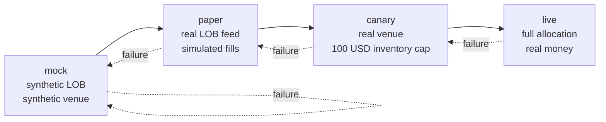

# 7. From paper to production

!!! abstract "Where this chapter fits"
    **Feeds in from:** [§4 execution](04-execution.md) — the venue abstraction, the latency budget, and the cancel-and-replace machinery are the moving parts this chapter learns to deploy and gate. [§5 risk](05-risk.md) — every circuit breaker and inventory limit named here is the live instance of §5's catalogue. [§6 backtesting](06-backtesting.md) — every acceptance band in this chapter is calibrated against §6's predicted distributions, and every divergence is reason to recalibrate §6's cost / queue / fill model.
    **Feeds into:** the live operation of any market-making book. The on-call posture in [§7.7](#77-the-on-call-posture-when-mm-may-and-may-not-run-unattended) and the demotion gates in [§7.10](#710-what-demotes-a-strategy-from-live) are the binding constraints under which every later strategy you bolt on (multi-level, cross-venue, basis, options) inherits its operational envelope.
    **Reads cleanly on its own:** if you are deciding whether to build a market-making capability at all, [§1](01-introduction.md) + §7 together gives you the cost-benefit picture without needing the math in between. The sister course's [stat-arb §7](../../stat-arb/docs/07-production.md) is the matching chapter for the slower-tempo bookend; reading them side by side is the cleanest way to see what the higher operational tempo of MM actually costs.

## 7.1 The four execution postures

Meridian Markets exposes four execution postures, selected by two engineering switches — `EXECUTION_MODE` and `FEED_SOURCE` — with one additional arming flag for real money (`LIVE_TRADING_ARMED`). The same four postures map directly onto a market-making deployment. They are not legal categories. They are not business categories. They are *engineering* categories: each posture answers a different question about whether the quoter survives contact with reality, and each is gated by a specific acceptance band that promotes (or demotes) to the next.



| Posture | `EXECUTION_MODE` | `FEED_SOURCE` | What it answers |
|---|---|---|---|
| **mock** | `mock` | `mock` | Does the quoter's *logic* match the math? Unit-test deterministic, offline, no clock. |
| **paper** | `paper` | `binance` (or other real feed) | Does the quoter's logic survive *live data*? Real LOB ticks, but the venue is a `PaperVenue` that simulates fills against the calibrated queue / cost model from §6.4. |
| **canary** | `canary` | `binance` | Does the *quoter end-to-end* survive a real matching engine — with a hard inventory cap, a hard daily P&L floor, and a hard daily quote cap that limit the maximum damage to roughly one round of lunch? |
| **live** | `live` | `binance` | Does the quoter survive at *meaningful size*? Full allocation, all the risk machinery from §5 hot, all the dashboards from §7.6 watched. |

The signal that distinguishes a serious desk from a hobbyist is not the cleverness of the model. It is whether the desk treats these four postures as *gates* (each requires the previous to have passed a written acceptance test) or as *settings* (the developer flips them based on whether the strategy is "ready," without writing down what "ready" means).

**mock** is the cheapest. It runs in a unit-test harness, against a deterministic synthetic LOB generator (a compound Poisson process for arrivals plus a clipped-Gaussian for cancels and size, parameterised to mimic Binance BTC/USDT mid-day flow). The synthetic venue is a no-network in-process `MockVenue` that matches orders against an in-memory book. Time is virtual. There is no network. The only thing under test is the quoter's logic — does it produce the right bid and ask given an inventory state? does the cancel-and-replace path correctly thread queue position? does the kill-switch fire under the right gate condition?

**paper** is the same code, with two adapters swapped. The `FEED_SOURCE` factory yields a real-WebSocket-backed `IBarFeed` (or, for MM, a real LOB feed — the level-2 stream from the venue's WebSocket). The `EXECUTION_MODE` factory yields a `PaperVenue` that, for every `placeOrder` call, computes a synthetic fill against the live LOB plus the calibrated queue-position model and cost model from §6.4. The quoter sees a venue that *looks* real; the quoter's P&L is the calibrated counterfactual. **Paper is the most under-rated of the four postures.** It is the only posture where you can run for weeks at zero capital risk and still get a real measurement of whether your fill model is honest.

**canary** is the first posture where money is involved. `EXECUTION_MODE=canary` routes a small slice of inventory through a real venue adapter. The arming flag `LIVE_TRADING_ARMED=true` must be set, and the inventory cap, daily P&L floor, and daily quote cap from §7.3 must all be configured. The whole point of canary is that *the worst plausible outcome is a known small loss*. You are paying that worst-case loss to find out whether the quoter survives a real matching engine — which is to say, whether the queue-position model from §6.4 generalises, whether the cancel-and-replace latency budget from §4 actually clears, whether the venue's matching rules (FIFO vs pro-rata, post-only behaviour, self-trade prevention) match your assumptions.

**live** is canary with the inventory cap, P&L floor, and quote cap relaxed in a ramp (§7.4). Same code, same venue adapter, same risk machinery — only the bounds change. There is no "live mode" code path; live is canary with bigger numbers.

Promotion between postures is governed by *acceptance bands*, not by judgement. The bands for each transition are spelled out in §7.2, §7.3, and §7.9. **Anti-pattern: promoting because the strategy "looks ready."** If you cannot point at the metric that crossed its threshold for the duration specified, you are not promoting; you are gambling.

The four-posture pattern is the same one [Meridian Markets `docs/PAPER_TRADING.md`](https://github.com/meridian-markets/meridian-markets/blob/master/docs/PAPER_TRADING.md) documents for the stat-arb engine, applied to the higher-tempo MM case. The seams are the same — `IBarFeed`/`IPriceSource` for data, `ITradingVenue` for execution — and the safe-default discipline is the same: ship the mock implementation as the default, leave the real adapter dormant until its arming preconditions hold.

A worked example of the factory shape (TypeScript, mirroring the Meridian engine):

```typescript
// src/quoter/venue.factory.ts
import { Injectable, Inject } from '@nestjs/common';
import { AppConfig } from '../config/app-config.interface';
import { ITradingVenue } from './trading-venue.interface';
import { MockVenue } from './mock.venue';
import { PaperVenue } from './paper.venue';
import { RealBinanceVenue } from './real-binance.venue';

@Injectable()
export class TradingVenueFactory {
  constructor(@Inject('AppConfig') private readonly cfg: AppConfig) {}

  create(): ITradingVenue {
    const mode = this.cfg.execution.mode;        // 'mock' | 'paper' | 'canary' | 'live'
    const armed = this.cfg.execution.liveArmed;  // boolean

    if (mode === 'mock') return new MockVenue();
    if (mode === 'paper') return new PaperVenue(this.cfg.execution.queueModel);
    if (mode === 'canary' || mode === 'live') {
      if (!armed) {
        throw new Error(
          `EXECUTION_MODE=${mode} requires LIVE_TRADING_ARMED=true. ` +
          `Refusing to start.`
        );
      }
      return new RealBinanceVenue(this.cfg.execution.binance);
    }
    throw new Error(`Unknown EXECUTION_MODE: ${mode}`);
  }
}
```

The `if (!armed) throw` is not a stylistic flourish. It is the safe-default discipline made concrete: the only way to reach a real-money code path is to set a second flag, and the second flag is not in the default `.env`. The boot guard fires before any quote is sent. The same shape is enforced in the Meridian engine's `ExecutionModeBootGuard`.

## 7.2 The shadow-mode discipline

Paper mode (the second posture in §7.1) is what the stat-arb course calls *shadow mode*. The discipline is the same; the duration and the diagnostics differ because MM trades at a higher tempo and the failure modes are different.

**Minimum duration: four weeks of wall-clock time.** Not four weeks of trading days. Four calendar weeks. The reason is that MM is sensitive to flow-regime changes that only show up across the calendar — the weekend bid-ask widening on a CEX, the APAC vs US-session liquidity profile, the daily funding-rate print on perp venues, the occasional >2σ move that toxic flow rides in on. A two-week paper run that happens to land in a quiet stretch will tell you exactly nothing about how the quoter behaves when the flow turns.

The four-week minimum should span at least:

- **One weekend.** Saturday and Sunday flow looks different from weekday flow. Spreads widen, retail flow increases as a share of total flow, and adverse-selection costs typically drop *if* the venue's matching engine behaves normally. A quoter that has never quoted on a Sunday has never seen its weekend behaviour.
- **One full US session and one full APAC session.** Most major venues have measurably different flow profiles in those windows. APAC overnight is often where the "weird flow" arrives.
- **One volatility-regime change.** A >2σ move on the underlying. This is the regime where adverse selection spikes and where the quoter's worst behaviour shows up. If the four-week window does not contain a single >2σ move, *extend the paper run* until it does, or until you have a clear statement of "this strategy has not been tested in a vol-spike regime."

**The acceptance band: KL divergence between paper P&L distribution and backtest P&L distribution.** The backtest from §6 emits a daily P&L distribution under its calibrated fill, queue, and cost model. Paper mode emits a realised daily P&L distribution against live data. The two should agree.

The diagnostic is not "is paper profitable" — paper can be profitable for the wrong reasons (a lucky window) or unprofitable for the right ones (a vol spike the backtest also predicted). The diagnostic is *distributional agreement*. The Kullback-Leibler divergence between the paper-mode empirical distribution and the backtest's predicted distribution, computed over the four-week window, is the single number that says whether the fill model is honest.

```typescript
// src/observability/kl-divergence.ts
// Discretised KL on histograms of daily P&L.
// Both distributions binned into the same buckets, smoothed with epsilon
// to avoid log(0) where the paper sample has no support.

export function klDivergence(
  paperPnl: readonly number[],
  backtestPnl: readonly number[],
  bins = 20,
  epsilon = 1e-6,
): number {
  const all = [...paperPnl, ...backtestPnl];
  const lo = Math.min(...all);
  const hi = Math.max(...all);
  const w = (hi - lo) / bins;

  const histogram = (xs: readonly number[]): number[] => {
    const h = new Array(bins).fill(0);
    for (const x of xs) {
      const i = Math.min(bins - 1, Math.floor((x - lo) / w));
      h[i] += 1;
    }
    const total = xs.length;
    return h.map((c) => c / total + epsilon);
  };

  const p = histogram(paperPnl);
  const q = histogram(backtestPnl);
  // Renormalise after epsilon smoothing.
  const pSum = p.reduce((a, b) => a + b, 0);
  const qSum = q.reduce((a, b) => a + b, 0);
  return p.reduce(
    (acc, pi, i) => acc + (pi / pSum) * Math.log((pi / pSum) / (q[i] / qSum)),
    0,
  );
}
```

**The threshold.** For a four-week paper run with 20-bin histograms, a KL divergence above roughly **0.5 nats** is the gate to recalibrate. Below 0.5 nats the distributions are statistically indistinguishable for this sample size. Above 0.5 nats *something* is wrong with the fill model — usually the queue-position decay is over-optimistic, or the post-fill adverse-selection horizon is too short. The number is empirical; see §6.4 for the calibration loop that closes around it.

**What to do when KL diverges.** Do not promote to canary. Go back to §6.4's audit loop. Re-fit the queue-position model on the four weeks of paper data you just collected. Re-fit the adverse-selection horizon. Re-run the backtest with the recalibrated cost model. If the recalibrated backtest's predicted distribution now matches the paper distribution, fine — start the four-week paper clock again under the new model. If the recalibration introduces a contradiction (the new model predicts the four weeks well but fails an earlier backtest window), you have found a *regime split* in your fill behaviour, and either the strategy needs a regime gate or the venue's matching behaviour has changed. Either way: do not skip to canary.

**Acceptance band summary for paper-to-canary promotion:**

| Metric | Band |
|---|---|
| Wall-clock duration | $\geq$ 4 weeks |
| Sessions covered | $\geq$ 1 weekend, $\geq$ 1 US session, $\geq$ 1 APAC session, $\geq$ 1 vol-regime change ($>2\sigma$ move on underlying) |
| KL divergence (paper P&L vs backtest P&L, 20-bin histogram) | $< 0.5$ nats |
| Fill rate (paper observed vs backtest predicted) | within $\pm 20\%$ |
| Mark-out at 60s post-fill (paper observed vs backtest predicted) | within $\pm 30\%$ |
| Quote-update rate | $< 95\%$ of venue's published message-rate cap |

The message-rate band catches a specific failure: a quoter that paper-trades fine because the `PaperVenue` does not enforce rate limits but would be throttled on the real venue. The band forces the quoter to live within the venue's actual rate cap during paper, not during canary.

## 7.3 The canary band

Canary is the first posture where the quoter sees a real matching engine. The point of canary is **bounded discovery**: there are things you can only learn against a real venue (matching-engine micro-behaviour, latency-tail distribution, self-trade prevention, post-only flag semantics, withdrawal-and-deposit reconciliation), and the only way to learn them is to run real money through the real path. Canary is the smallest envelope that lets you learn those things without paying tuition you cannot afford.

**The canary envelope** (for a single MM strategy on a single venue, on a major pair like BTC/USDT):

| Cap | Value | Rationale |
|---|---|---|
| **Hard inventory cap** | $\pm 100$ USDT *net inventory* | If you accidentally lose all 100 USDT to adverse selection, it is lunch. Not enough to learn from a bigger blow-up. |
| **Daily P&L floor** | $-50$ USDT | Below this, the quoter auto-flattens for the day. Half your inventory cap. If you hit it, you have learned something — there will be a post-mortem (§7.11). |
| **Daily quote cap** | $10{,}000$ quote updates | About one update every 8–9 seconds averaged over a 24-hour day. For an MM strategy this is *low*, deliberately — the cap forces you to learn whether your cancel-and-replace logic is profligate before you discover it at scale. |
| **Single-quote size cap** | $1\%$ of the inventory cap = $1$ USDT notional | At this size you are never the entire top of book on a major pair, so you do not learn anything about market-impact that does not generalise. You learn fill behaviour. |
| **Duration at canary** | 2 weeks wall-clock | Long enough to see weekend, US session, APAC session, and at least one mid-day volatility blip. Short enough that the bounded loss is bounded. |

The numbers are *binding* during the canary phase. They are enforced in code, not in the operator's head:

```typescript
// src/risk/canary-limits.guard.ts
@Injectable()
export class CanaryLimitsGuard implements ITradingGuard {
  constructor(
    @Inject('AppConfig') private readonly cfg: AppConfig,
    private readonly positionStore: IPositionStore,
    private readonly pnlStore: IDailyPnlStore,
    private readonly quoteCounter: IQuoteCounter,
  ) {}

  async preFlightCheck(order: PlaceOrderRequest): Promise<void> {
    if (this.cfg.execution.mode !== 'canary') return;

    const position = await this.positionStore.netInventoryUsdt();
    const wouldBe = position + order.signedSize * order.price;
    if (Math.abs(wouldBe) > 100) {
      throw new InventoryCapBreachError(
        `Canary inventory cap: would-be ${wouldBe} USDT, cap ±100`
      );
    }

    const todaysPnl = await this.pnlStore.todayUsdt();
    if (todaysPnl < -50) {
      throw new DailyPnlFloorBreachError(
        `Canary daily P&L floor: ${todaysPnl} USDT, floor -50`
      );
    }

    const todaysQuotes = await this.quoteCounter.today();
    if (todaysQuotes >= 10_000) {
      throw new DailyQuoteCapBreachError(
        `Canary daily quote cap: ${todaysQuotes}, cap 10000`
      );
    }

    if (order.price * Math.abs(order.signedSize) > 1) {
      throw new SingleQuoteSizeCapBreachError(
        `Canary single-quote size cap: notional > 1 USDT`
      );
    }
  }
}
```

**Pass criteria for the two-week canary run** (these are the gates to live):

| Metric | Pass band |
|---|---|
| Daily P&L $> 0$ | in $\geq 70\%$ of sessions |
| Cumulative P&L over 14 sessions | $> 0$ |
| Average daily inventory peak | $< 50\%$ of inventory cap (i.e. peak net inventory typically $< 50$ USDT) |
| Kill-switch events | 0 |
| Daily P&L floor breaches | 0 |
| Daily quote cap breaches | 0 |
| Fill rate (canary realised vs paper predicted) | within $\pm 20\%$ |
| Cancel-and-replace round-trip latency p99 | $< $ venue's published median + 50 ms |
| Reconciliation breaks (local position vs venue API) | 0 unresolved at any UTC close |

**The "70% of sessions positive" band deserves a note.** It is not "the strategy is profitable 70% of the time." It is "the strategy survives 70% of sessions without losing money." Those are different claims and the second is much weaker. A symmetric quoter on a quiet liquid pair will hit the 70% bar trivially — most sessions there are net positive at small size. The bar exists to *exclude* strategies whose P&L is dominated by occasional large wins and frequent small losses, because those are the strategies most likely to be hiding an unmeasured adverse-selection cost that will surface at larger size. The pass criterion is *consistency*, not magnitude.

The "cumulative P&L > 0" band is the magnitude check. Combined, the two say: "the strategy is profitable in the small at this scale, and it is profitable consistently enough that you are not just sampling a single lucky session." Either band on its own is gameable; both together are the minimum honest bar.

**Failing canary.** If any pass band fails, the strategy goes back to paper. *Not* back to mock. The thing that failed is almost certainly a fill-model issue (the paper model predicted fills that did not arrive, or did not predict adverse selection that did) or a latency issue (the venue's matching engine behaves differently from your assumptions). Both are diagnosable from a recalibration pass on the four weeks of paper data plus the two weeks of canary data. Do not skip back to mock and do not retune the model parameters in canary — the only thing canary's data is good for is fitting the cost model used in paper.

## 7.4 The full-live ramp

Canary establishes that the strategy survives at $100$ USDT of inventory. The ramp to full allocation is a sequence of *doubling steps*, each gated on the previous step having held its acceptance bands for the stated duration.

| Level | Inventory cap | Daily quote cap | Min. duration at level | Gating |
|---|---|---|---|---|
| Canary | $100$ USDT | $10{,}000$ | 2 weeks | §7.3 pass criteria |
| L1 | $200$ USDT | $20{,}000$ | 1 week | All §7.3 bands + daily-P&L distribution still within KL $< 0.5$ of paper |
| L2 | $500$ USDT | $40{,}000$ | 1 week | Same + reconciliation breaks = 0 |
| L3 | $1{,}000$ USDT | $80{,}000$ | 1 week | Same + p99 latency band still holds |
| L4 | $2{,}500$ USDT | $160{,}000$ | 2 weeks | Same + portfolio-VaR check ($\S 5$) passes |
| L5 | $5{,}000$ USDT | $300{,}000$ | 2 weeks | Same + capacity-utilisation gate (§7.8) $< 80\%$ |
| Full | per strategy budget (often $10{,}000$ – $50{,}000$ USDT per strategy in a $50{,}000$ – $250{,}000$ MM book) | continuous monitoring | indefinite | All daily and weekly checks (§7.5) |

The ramp is *roughly 2x per week*, with pause-and-reassess at each level. The pause is not optional — a strategy that has been at L3 for one clean week is not automatically promoted to L4 the next morning. The operator runs the §7.5 weekly checklist, confirms every band held, and *then* promotes. The clock starts at the new level after the explicit promotion.

**Why the doubling, why the weekly cadence.** The cadence reflects two empirical facts. First: the dominant operational failure modes of a market-making book — venue rate limits, withdrawal-API edge cases, reconciliation drift between local and venue position, message-rate cap surprises — appear once a week or so, not once a day. A one-week dwell at each level is the minimum for one of those to surface. Second: the dominant *market-data* failure modes — toxic flow events, regime changes, weekend bid-ask widening — recur on roughly the calendar-week scale. A strategy that survives one week at L3 has seen one weekend; that is meaningful but not conclusive. Two weeks at L4 is two weekends, which is closer to conclusive.

**Doubling is fast but defensible.** A 2x weekly ramp from $100$ USDT to $5{,}000$ USDT takes about six weeks. A 1.5x ramp would take about ten. A 3x ramp would take about four but typically fails L2 — the operational discipline does not have time to catch up. The 2x cadence is the empirical middle and matches the stat-arb course's [§7.3](../../stat-arb/docs/07-production.md) ramp curve.

**Anti-pattern: scaling because the strategy is making money.** Strategies make money in regime-favourable weeks regardless of edge. The ramp is gated on *acceptance bands holding*, not on P&L. A strategy that nets $+200$ USDT in a week at L2 but had two reconciliation breaks does not promote. A strategy that nets $-5$ USDT at L2 but had clean reconciliation and held its KL band promotes on schedule. The discipline is to ignore the equity curve and stare at the diagnostics.

**Anti-pattern: re-tuning parameters during the ramp.** If you find yourself nudging $\gamma$ or $\kappa$ to make the next level work, you have re-entered §3 territory. Go back to §6, re-fit the parameters on data that includes the new level, re-run the backtest, re-paper, re-canary. Do not tune in production.

## 7.5 The operational rhythm

A market-making book operates on four checklists: pre-open, in-session, close, and weekly review. The cadence is much faster than the stat-arb book's daily checklist because the failure modes show up faster. Each list is read top-to-bottom; nothing is skipped.

**Pre-open** (UTC 23:30 in 24-hour markets is "pre-open" of the next calendar day; for venues with a daily snapshot, it is the literal session open):

- [ ] Confirm the previous day's NAV reconciled within tolerance. Any unresolved break: do not start.
- [ ] Confirm no kill-switch is currently tripped from yesterday's session (§5.6).
- [ ] Confirm the quoter's parameters (γ, κ, half-spread floor, inventory cap) match the configuration in version control. Drift here is the most common silent failure.
- [ ] Confirm the venue's overnight WebSocket uptime $\geq 99\%$. Below that, start in paper for a half-day to verify the feed is healthy before risking real quotes.
- [ ] Confirm the funding-rate print (perp venues) is within the calibrated range. A $>50$ bps funding print is a sizing input, not just a flag.
- [ ] Confirm any planned venue maintenance windows are noted; auto-flatten triggers configured to pre-empt them.
- [ ] Confirm the operator is at a terminal. The on-call posture (§7.7) forbids unattended starts.

**In-session** (rolling watch, not a fixed-time check):

- [ ] Quote-update rate vs daily cap. If on track to exceed cap, throttle or pull.
- [ ] Realised half-spread vs target half-spread. Material divergence ($>20\%$) is a sign of regime change.
- [ ] Mark-out at 60 seconds, rolling 30-minute window. Degradation $>2\sigma$ vs the running median is the *toxic-flow alert*; widen quotes or pull.
- [ ] Inventory vs cap. Approaching 80% of cap, force inventory-clearing skew.
- [ ] Cancel-and-replace round-trip p99 latency. Above the calibrated ceiling, the quoter is *probably already being picked off*; investigate the latency before doing anything else.
- [ ] Venue health indicators (WebSocket lag, REST 429s, order-rejection rate). Any sustained anomaly is escalated.

**Session close** (at end of the operator's working window, before un-attended hours):

- [ ] Auto-flatten triggered (per §7.7) — confirm inventory at $0$ at close.
- [ ] Confirm all open orders are cancelled at close.
- [ ] Run the position reconciliation: local DB vs venue API. Any break is logged and either resolved before logging off, or escalated overnight.
- [ ] Snapshot the day's P&L, fill count, quote count, realised half-spread, average inventory, mark-out, and cap utilisation. Write to the daily-ops log.
- [ ] Confirm the kill-switch state is `clear` for tomorrow's open.
- [ ] Operator initials and timestamps the close checklist.

**Weekly review** (Monday morning, before pre-open):

- [ ] Recompute the rolling 4-week P&L distribution and the KL divergence vs the backtest's predicted distribution. Above 0.5 nats: open a recalibration ticket against §6.4.
- [ ] Recompute the rolling 4-week mark-out distribution. Drift $>2\sigma$ vs the rolling median: investigate adverse-selection regime change.
- [ ] Review the venue's published rule changes and fee-schedule notices for the past week. Material changes (tick size, fee, matching rule, message cap, post-only flag semantics) require a paper rerun before live continues.
- [ ] Review the week's reconciliation log. Trend in unresolved breaks: pause the strategy.
- [ ] Run the disaster-recovery dry-run once per month inside the weekly slot — exercise the kill switch, confirm flatten works, confirm shutdown is clean.
- [ ] Decide on this week's ramp step. If the strategy is in the §7.4 ramp, the weekly review *is* the promotion decision.

The pre-open and close lists are typically 15 minutes each when nothing flags; 1–3 hours when something does. The weekly review is typically 60–90 minutes. The discipline is to *always run them*, not to skip the easy days.

## 7.6 The observability stack

A quoter that you cannot see is a quoter you cannot operate. The observability stack is **structured event logging** plus a small number of derived dashboards. There is no production market-making operation that gets by with `console.log`.

**Structured event logging.** Every significant event in the quoter's lifecycle emits a JSON line to a structured log. The minimum schema:

```json
{
  "ts": "2026-05-31T14:23:41.182Z",
  "ts_mono_ns": 1748703821182000000,
  "level": "info",
  "event": "fill",
  "strategy": "as-btcusdt-v3",
  "venue": "binance",
  "symbol": "BTCUSDT",
  "side": "ask",
  "price": 65124.30,
  "size": 0.00015,
  "notional_usdt": 9.77,
  "mid_at_fill": 65123.85,
  "queue_position_at_submit": 14,
  "queue_position_at_fill": 0,
  "post_only": true,
  "maker": true,
  "order_id": "0xa83b...c91",
  "client_order_id": "as-btcusdt-v3-1748703820734-42",
  "latency_submit_to_ack_us": 1832,
  "latency_ack_to_fill_us": 487213,
  "inventory_before_usdt": -41.22,
  "inventory_after_usdt": -31.45,
  "session_pnl_usdt": 7.31,
  "kill_switch_state": "clear",
  "trace_id": "01HXG9Z..."
}
```

The schema is a *contract* between the quoter, the dashboards, and the post-mortem analysis. Adding a field is free; renaming or removing one is a breaking change and is treated as such. The schema lives in version control alongside the quoter; a CI check rejects any quoter change that emits a field not in the schema.

The two timestamps — wall-clock (`ts`) and monotonic-nanosecond (`ts_mono_ns`) — are both required. Wall-clock is what humans read; monotonic is what latency math requires (because wall-clock can step backward across NTP adjustments). The same dual-timestamp convention runs through the Meridian engine's event logs.

The `trace_id` field links every log line for a single quoter decision — from the market-data tick that triggered it, through the policy evaluation, through the order placement, through the ack, through the fill. A toxic-flow event observable at the dashboard level is debuggable at the trace-id level by reconstructing the full decision path. Without trace IDs, an operational post-mortem is archaeology.

**Dashboards.** Five dashboards. Not more, not fewer. Each answers a specific operational question.

1. **P&L curve.** Cumulative session P&L vs time, with realised and unrealised components separately. The 30-day distribution overlaid as a fan chart for context. The question this dashboard answers is "is today within normal range." The kill-switch firing is the same dashboard with a different threshold.

2. **Fill rate and mark-out.** Two paired panels: fill rate (fills per quote-update, rolling 30-minute window) and mark-out at 60 seconds post-fill (rolling 30-minute window). The question this dashboard answers is "is the strategy capturing spread or paying adverse selection." A degrading mark-out before a P&L drawdown is the leading indicator; treat it as the actionable signal.

3. **Inventory and cap utilisation.** Net inventory vs time, with the cap drawn as a horizontal line. Inventory utilisation distribution over the day. The question this dashboard answers is "is the inventory-skew machinery working." A quoter that sits at 80% of cap for hours is one whose skew is mis-calibrated and one whose adverse-selection cost is about to materialise.

4. **Venue health.** WebSocket uptime, REST-429 rate, order-reject rate, p50/p99 cancel-and-replace round-trip latency. The question this dashboard answers is "is the venue cooperating." A venue with degraded health is one to pull from; the quoter does not get to vote.

5. **Quote-update profile.** Quote-updates per minute (overlaid against the daily cap), updates split by reason (mid moved, inventory changed, time-based, manual override). The question this dashboard answers is "is the quoter being efficient with its message budget." A quoter that burns 50% of its daily cap by 4 PM is one that will spend the evening with no rate budget when it needs it.

The dashboards are read in the order above. P&L is the headline; fill rate and mark-out are the leading indicators; inventory and venue health are the operational state; quote-update profile is the capacity check.

**No equity curves on the home page.** This is the same discipline as the stat-arb course. The P&L curve is on its own panel, not the top-level overview, because watching it twitch is the single fastest path to bad decisions. The top-level overview is the kill-switch state, the venue-health summary, and the mark-out trend.

## 7.7 The on-call posture

Market making is structurally an *attended* activity. Every quote in the book is a free option you have written; the longer it is open without supervision, the higher the probability that an information event arrives and your option is exercised before you can pull. A market-making book that runs unattended overnight without 24/7 alerting is a market-making book that is paying for the operator's sleep with adverse selection.

**The default posture for a small desk: scheduled hours only, with auto-flatten and shutdown at end of session.** Concretely:

- **Operating window:** a fixed daily window during which the operator is at a terminal — typically a 6–10 hour window aligned with the operator's working day. Extension to 24-hour operation is a *capability investment*, not a default.
- **Pre-session arm:** the quoter starts only after the pre-open checklist (§7.5) is signed off. Boot guard refuses to start otherwise.
- **In-session monitoring:** the operator is at the dashboard. Alerts fire to the operator's screen, not to a queue.
- **End-of-session auto-flatten:** at a configured wall-clock time, the quoter cancels all resting orders, posts marketable orders to bring inventory to zero, and shuts down. This is the *default*, not a button the operator presses.
- **Out-of-hours posture:** the quoter is off. The venue accounts are still funded, but no orders are resting. Adverse-selection risk during sleep is structurally zero because there is nothing to adversely select against.

This posture is conservative. It leaves money on the table — the 8 hours per day the quoter is off are 8 hours of spread the strategy could have collected. The conservatism is bought with a *much* lower operational tail risk. The single overnight catastrophe — an information event arrives, the quoter does not pull, inventory blows through the cap, the kill switch fires but not before $5{,}000$ USDT of adverse selection has accumulated — pays for many months of "extra" spread the quoter would have collected.

**Extending to 24-hour operation** is a capability investment with three required pieces:

1. **24/7 alerting** — a paging stack (PagerDuty, OpsGenie, or equivalent) that wakes a human within 5 minutes of any kill-switch event, any kill-switch *near-miss* (e.g. inventory at $> 90\%$ of cap), any sustained venue-health degradation, any sustained mark-out spike.
2. **A primary and a backup on-call operator** — single-operator on-call is a single point of failure. The backup is paged if the primary does not acknowledge within a defined window.
3. **A documented runbook for every alert** — the alert that wakes the operator at 3 AM must come with a runbook that says exactly what to check, what to escalate, and what authority the on-call operator has to flatten or kill the strategy unilaterally. Runbook-less alerts are unprofessional and produce worse decisions than no alert at all.

Without all three pieces, the default posture is correct.

**Auto-flatten shape** (TypeScript, the failure-default contract):

```typescript
// src/quoter/auto-flatten.scheduler.ts
@Injectable()
export class AutoFlattenScheduler {
  constructor(
    @Inject('AppConfig') private readonly cfg: AppConfig,
    private readonly venue: ITradingVenue,
    private readonly positionStore: IPositionStore,
    private readonly logger: IStructuredLogger,
  ) {}

  @Cron('0 22 * * *')  // 22:00 operator local time
  async endOfSessionFlatten(): Promise<void> {
    this.logger.event('auto_flatten_start', {});

    await this.venue.cancelAllOrders();

    const inventory = await this.positionStore.netInventoryUsdt();
    if (Math.abs(inventory) > 0.01) {
      const side = inventory > 0 ? 'sell' : 'buy';
      const size = Math.abs(inventory);
      await this.venue.placeMarketOrder({
        side, size, reason: 'auto_flatten_eos',
      });
      this.logger.event('auto_flatten_market_order', { side, size });
    }

    this.logger.event('auto_flatten_complete', {
      final_inventory_usdt: await this.positionStore.netInventoryUsdt(),
    });
  }
}
```

The shape encodes the discipline: cancel first, flatten residual second, log every step. Operator can verify the next morning that the flatten ran by reading the log; if it did not run, the next pre-open checklist catches it before the next session arms.

## 7.8 Capacity planning

Market-making strategies are *capacity-limited before they are P&L-limited*. That is the dominant fact about scaling an MM book and it is the reason a strategy that looks fantastic at $100$ USDT can be unremarkable at $10{,}000$ USDT and unprofitable at $100{,}000$ USDT — *not because the edge degrades*, but because the volume you would need to capture at the larger size does not exist at the prices you would need to capture it at.

The right question to ask before scaling is therefore not "is the strategy profitable" but "what fraction of the available top-of-book volume does the strategy already consume, and what would happen if it consumed 5x more."

**The queue-position model from §3 gives the estimate.** Recall the Poisson order-arrival intensity at offset $\delta$ from mid is $\lambda(\delta) = A e^{-\kappa \delta}$. The strategy's expected fill rate at its current half-spread $\delta^*$ is $\lambda(\delta^*)$ orders per unit time, of which a fraction proportional to queue position is actually filled. The strategy's *capacity*, in volume terms per unit time, is then:

$$
V_{\text{strategy}} \approx \lambda(\delta^*) \cdot \bar{s}_{\text{order}} \cdot p_{\text{queue}}
$$

where $\bar{s}_{\text{order}}$ is the average arriving order size and $p_{\text{queue}}$ is the probability of being filled given a quote is posted (which depends on queue position).

The venue's *total* top-of-book volume in the same offset range is observable from the LOB feed: it is the number of trades that hit the top of book per unit time, times the average trade size. Call that $V_{\text{venue}}$. The ratio $V_{\text{strategy}} / V_{\text{venue}}$ is the strategy's *current capacity utilisation*.

**The capacity question for a 5x scale-up.** If you scale the strategy 5x, what changes? Not the venue volume $V_{\text{venue}}$ — that is structural. Not the parameters $A$ and $\kappa$ — those are properties of the flow, not the strategy. What changes is the strategy's *required* fill rate, by a factor of 5. The strategy now needs to capture 5x more flow at the same half-spread. There are exactly three places that extra flow can come from:

1. **Quoting tighter half-spread** — pull the half-spread $\delta^*$ in, fill more often, accept lower revenue per fill. Quantitatively: a quoter at $\delta^* = 5$ bps in a flow with $\kappa = 0.4$ bps$^{-1}$ doubles its fill rate by moving to $\delta^* \approx 3.3$ bps (since $\lambda$ is exponential in $\delta$). The revenue per fill drops by $\sim 30\%$, but the fill rate doubles, so gross spread revenue rises $\sim 40\%$. This is the easy lever, until you hit the *minimum profitable half-spread* — the level at which spread no longer covers your three-component cost (§1.3).
2. **Quoting more aggressively in the queue** — improve queue position by faster cancel-and-replace, lower latency, post-only at the touch rather than one tick back. The fill rate at the same half-spread rises in proportion to the queue-position improvement, but this is *also* the lever that exposes you to adverse selection (you fill earlier, including on the toxic fills).
3. **Adding venues or pairs** — diversify across more order books. The total addressable volume grows linearly with venues; the operational complexity grows super-linearly. This is the lever that wins at scale.

**Most MM strategies cap out at $5$–$15\%$ of top-of-book volume on a single pair on a single venue.** Above that, each marginal fill is increasingly likely to be informed (because you are the only liquidity at the touch and the smart traders know it) and the strategy's adverse-selection cost rises faster than its spread revenue. The 5–15% range is empirical and venue-dependent; the dashboard from §7.6 panel 5 is where you watch it.

**The capacity-planning practice.** At every ramp level (§7.4), compute the strategy's capacity utilisation. If utilisation crosses 5% of top-of-book volume, the next ramp step is *not* automatic — the question becomes "is the additional capacity available on this venue, or do we need to add venues or pairs." A strategy that is happily profitable at L3 with 4% utilisation and would be at 20% utilisation at L5 is *not a strategy you ramp to L5* — it is a strategy you split across two venues, or two pairs, or one venue at L4. Most MM strategies have a hard capacity ceiling well below their notional risk budget, and the productive engineering work above that ceiling is adding venues and pairs, not pushing harder on the existing one.

The capacity question is also the *honest* answer to "how big can this strategy get." The answer is rarely the risk budget the desk has allocated. It is usually some multiple of $V_{\text{venue}} \cdot 0.1$ on the best-fit venue, summed across the venues the strategy is willing to operate on. That number, computed honestly, is the realistic ceiling. The rest is allocation work to other strategies.

## 7.9 What promotes a strategy from canary to live

The promotion checklist is the *binding* set of acceptance criteria. Every box must be checked; the promotion ticket is reviewed by a second operator (not the strategy author) before the `EXECUTION_MODE` flag flips.

- [ ] **Canary duration met.** $\geq 14$ calendar days of canary running. No skipped days.
- [ ] **Daily P&L band.** $> 0$ in $\geq 70\%$ of canary sessions.
- [ ] **Cumulative P&L band.** $> 0$ over the canary window.
- [ ] **Inventory band.** Average daily peak inventory $< 50\%$ of canary cap.
- [ ] **Kill-switch record.** Zero kill-switch firings during canary.
- [ ] **Daily-floor record.** Zero daily-P&L-floor breaches.
- [ ] **Quote-cap record.** Zero daily-quote-cap breaches.
- [ ] **Fill-rate fidelity.** Canary observed fill rate within $\pm 20\%$ of paper predicted.
- [ ] **Mark-out fidelity.** Canary observed 60-second mark-out within $\pm 30\%$ of paper predicted.
- [ ] **Reconciliation.** Zero unresolved reconciliation breaks at any UTC close during canary.
- [ ] **Latency.** p99 cancel-and-replace round-trip $<$ venue median + 50 ms throughout canary.
- [ ] **KL divergence.** Canary P&L distribution vs paper P&L distribution $< 0.5$ nats.
- [ ] **Venue rule changes.** No material venue rule change (tick, fee, matching, message cap, post-only semantics) during the canary window that has not been re-papered.
- [ ] **Runbook.** Up-to-date runbook for every alert the strategy can fire. Reviewed by the on-call rota.
- [ ] **Dashboards.** All five §7.6 dashboards are live for the strategy. The promotion reviewer has clicked through each.
- [ ] **Code freeze.** No code change to the strategy in the 48 hours before the promotion review.
- [ ] **Second operator sign-off.** A second operator, not the strategy author, has read the canary log, sampled the trace IDs, and signed off.

The checklist takes 1–2 hours to walk through if everything is in order, and a day or more if any item flags. The point of the duration is that the cost of a bad promotion (a strategy that fails at L1 and back-offs to canary, with a non-trivial loss in the process) is much greater than the cost of an extra-careful review.

**Promotion does *not* go from canary to full live.** The next step after a passed promotion checklist is L1 of the §7.4 ramp ($200$ USDT cap). The ramp continues on the schedule from §7.4; the promotion is the gate to entering the ramp, not the gate to the top of it.

## 7.10 What demotes a strategy from live

Demotion is one-click. Promotion takes weeks. The asymmetry is deliberate: a live strategy that is misbehaving is an active hazard, and the cost of demoting one that did not need it is small (a paper rerun and re-promotion), while the cost of leaving one live that should have been demoted is unbounded.

**Any of the following triggers automatic demotion to paper:**

| Trigger | Definition | Notes |
|---|---|---|
| **Daily P&L $< -2\sigma$ for 3 sessions in 5** | Where $\sigma$ is the rolling 30-day daily P&L standard deviation. | The 3-in-5 window is to distinguish persistent degradation from a single bad day. |
| **60-second mark-out shifts $> 2\sigma$ vs rolling 30-day median** | Mark-out is the leading indicator of adverse-selection regime change. | Triggers demotion *before* the P&L band fires. |
| **Reconciliation break unresolved at UTC close** | Local position $\neq$ venue API position by more than $1\%$ of inventory cap. | Cannot continue trading with an unreconciled book. |
| **Kill-switch event** | Any §5.6 kill-switch firing, regardless of cause. | Strategy is off until post-mortem (§7.11) closes. |
| **Venue incident** | Venue declares an incident (matching engine disruption, withdrawals frozen, withdrawal-API rate-limit anomaly, official status-page incident). | Strategy stays off until venue declares all-clear. |
| **Operator concern** | An operator on the rota expresses a written concern about the strategy's behaviour. | The bar is intentionally low. "I do not like what I am seeing" is sufficient to demote; the post-mortem will resolve whether the concern was warranted. |
| **Material parameter drift** | The realised $\kappa$ or $\sigma$ on live data drifts $> 25\%$ from the calibration value used at promotion. | The strategy's optimal $\delta^*$ is conditioned on those parameters; drift means the quotes are no longer optimal. |
| **Material venue rule change** | Tick, fee, matching, message cap, post-only semantics — any change announced by the venue. | Paper rerun required before re-arming. |

**One-click demotion.** The demotion mechanism is a single command that flips `EXECUTION_MODE` from `live` (or `canary`) to `paper`, cancels all open orders, and runs the auto-flatten from §7.7. There is no committee, no review, no "let's see if it recovers." The operator who triggers the demotion files a post-mortem (§7.11) within 24 hours; the strategy stays in paper until the post-mortem is closed and a re-promotion checklist (§7.9) is run.

**Anti-pattern: not demoting because the strategy might recover.** Strategies in live that are showing demotion-criteria behaviour do *occasionally* recover. The cost of demoting a strategy that would have recovered is small — perhaps a week of foregone spread revenue. The cost of *not* demoting a strategy that does not recover is unbounded: the longer it runs while the regime is against it, the more inventory it accumulates and the more adverse selection it pays. Demote first, diagnose second.

**Anti-pattern: re-arming without a closed post-mortem.** A strategy that was demoted because of an operator concern, ran in paper for a week, looked fine again, and was re-armed without writing down *what was actually wrong* is a strategy that will demote again. The post-mortem is the mechanism for converting an incident into a permanent change in the codebase or the runbook. Skipping it is skipping the only thing that prevents recurrence.

## 7.11 The post-mortem template

Every demotion triggers a post-mortem. The post-mortem is six fields, no more, no less. The constraint is deliberate: a long-form post-mortem is one that does not get written.

```yaml
# postmortems/2026-05-31-as-btcusdt-v3-demotion-001.yaml

incident:
  strategy: as-btcusdt-v3
  venue: binance
  symbol: BTCUSDT
  demoted_at: 2026-05-31T14:23:41.182Z
  demoted_by: operator-rendel
  trigger: mark_out_shift_2sigma

what_happened:
  # 1-3 paragraphs. Just the facts. What did the dashboards show?
  # What was the timeline? What were the symptoms?
  # Reference trace IDs and event log lines, do not paraphrase.

root_cause:
  # The actual cause, not the trigger. The trigger is the alert that fired;
  # the root cause is the thing that made the alert fire.
  # If you cannot name a root cause, say "unknown" and list candidates.

contributing_factors:
  # What made this incident worse than it could have been? Or what made the
  # detection later than it could have been? These are the things to fix
  # before recurrence.

what_we_changed:
  # The concrete code, configuration, or runbook changes made in response.
  # If nothing changed, say so explicitly — "no changes; root cause is a
  # regime we accept will recur" is a valid entry but must be written down.
  # Reference PRs, commit hashes, or config diffs.

re_promotion_criteria:
  # The specific bands the strategy must hit in paper before it can be
  # re-promoted to canary. May be the standard §7.9 criteria, or may be
  # stricter (e.g. extended paper duration, additional dashboards).

sign_off:
  author: <operator>
  reviewed_by: <second operator>
  date: <YYYY-MM-DD>
```

The six fields are *what happened, root cause, contributing factors, what we changed, re-promotion criteria, sign-off*. Each is one or a few paragraphs. The whole post-mortem fits on a single screen. The discipline is that anyone — the strategy author, the on-call, a future hire — can read it in five minutes and come away knowing what happened and what was done about it.

Post-mortems live in the repository in a `postmortems/` directory and are version-controlled. They are read at the start of every new operator's onboarding. A desk's post-mortem archive is the truest documentation of its operational maturity.

## 7.12 Where this course ends and your desk begins

A market-making course that promised you a profitable strategy at the end would be lying. This one does not.

What you have, if you have worked the chapters end to end, is **the knowledge of a junior quoter on the bench at a mid-size desk**. You can read the canonical papers without re-deriving them. You can write an Avellaneda-Stoikov quoter that respects the closed-form math. You can build an LOB-replay backtest that does not pretend queue position is free. You can name the five failure modes from §1.6 and tie each to a specific dashboard and circuit breaker. You can stand up the four-posture deployment pipeline from §7.1 and write the acceptance bands that gate each transition. You understand why the operational tempo of an MM book is the dominant cost line on a small desk.

What you do not have, because no course can give it to you, is **a strategy that prints money on default parameters in your venue, with your latency profile, at your size, in the current regime**. That is not a thing courses produce. It is a thing desks produce, over months of running paper, weeks of running canary, and an ongoing cycle of recalibration as the venue and the flow regime evolve. The course is the part of the work that is intellectually tractable; the desk work is the part that takes time and discipline and that compounds.

The honest framing is the same as the stat-arb sister course. The math is settled and public. The reference implementations are open source. The literature is one Google Scholar query away. What is *not* public, and what the course cannot substitute for, is:

- **Calibration of $\kappa$, $\gamma$, the half-spread floor, the cap, the daily floor, the quote cap, the mark-out window, and the KL threshold, on your specific venue, with your specific flow profile, at your specific size.** The course gives you defensible starting points and the acceptance bands that say whether they are working. The fitting work is yours.
- **The operational stack — alerting, dashboards, runbook, auto-flatten, reconciliation — wired into your actual venue, your actual operator rota, your actual on-call rotation, with your actual paging vendor.** The course gives you the *shape* (the JSON schema, the five dashboards, the four checklists). The wiring is yours.
- **The capacity-aware decision of which strategies to scale, which to cap, and which to split across additional venues or pairs.** The course gives you the math of §7.8 and the discipline of staring at the 5–15% utilisation ceiling. The portfolio decision is yours.
- **The post-mortem archive that accumulates as the desk runs.** The course gives you the template (§7.11). The archive is yours; it does not exist on day one and is the most valuable thing the desk owns by year three.

Market making is a craft built on a small body of public math and a large body of private operational discipline. The course is end-to-end on the first. It is a faithful starting point on the second, but only a starting point. The desk work is where the desk work happens.

If you finish this chapter and decide *not* to build the MM capability — because the operational tempo is too heavy for the team, or because the durable infrastructure investment is not justified by the current portfolio, or because the latency tier you can realistically reach is below the threshold where the math starts paying — that is an entirely defensible decision. The honest pitch in §1.5 named the conditions under which MM pays. If those conditions are not met for your desk, the chapter has done its job by telling you so.

If you finish this chapter and decide *to* build it, the four-posture pipeline (§7.1), the shadow-mode discipline (§7.2), the canary band (§7.3), and the demotion gates (§7.10) are the binding scaffold within which everything else hangs. They are not the part of the work that is fun. They are the part of the work that survives.

## Sources

- **AS08** — Avellaneda & Stoikov (2008), *High-Frequency Trading in a Limit Order Book*, Quantitative Finance. The mathematical foundation underneath the §7.3 inventory-cap and §7.8 capacity discussion. The closed-form half-spread is what the canary's quote-update budget is calibrated against.
- **CJP15** — Cartea, Jaimungal & Penalva (2015), *Algorithmic and High-Frequency Trading*, Cambridge University Press. Chapters 10 and 11 are the reference treatments of the multi-level extensions a desk grows into after surviving the §7.4 ramp; the operational framing here is informed by their treatment of order-book diagnostics.
- **Meridian Markets `docs/PAPER_TRADING.md`** — the engine-side reference implementation of the four-posture pattern (mock / paper / canary / live) on the Meridian stack. The factory shape in §7.1, the boot guard in §7.1, and the auto-flatten in §7.7 are drawn directly from the Meridian conventions. Read it alongside this chapter for the runnable analogue.
- **Sister course** — [Meridian stat-arb course §7 — from paper to production](../../stat-arb/docs/07-production.md). The slower-tempo bookend; the shadow-phase / minimum-capital / capital-ramp pattern there is the parent of the four-posture pattern here. Read side by side.

Tier-C practitioner commentary on canary bands, demotion criteria, and post-mortem templates is scarce in public — most desks treat the operational scaffolding as proprietary. The numbers in §7.3 ($100$ USDT cap, $-50$ USDT floor, $10{,}000$ quote cap) and §7.4 (2x weekly ramp) are conservative middles of the practitioner ranges that show up in conference Q&As and private operator notes; they are not load-bearing — they are starting points. Calibrate against your venue's published rate caps, your operator rota's bandwidth, and your desk's actual loss tolerance. The discipline of having *some* binding number is what matters; the specific number is a parameter.

Full bibliographic detail in [Appendix B](appendix-b-sources.md).

Next: this is the last numbered chapter. From here the course continues in the appendices — [Appendix A — code shapes](appendix-a-code-shapes.md) and [Appendix B — sources](appendix-b-sources.md) — and the sister course's [stat-arb §7](../../stat-arb/docs/07-production.md) for the matching production chapter on the slower-tempo book.
