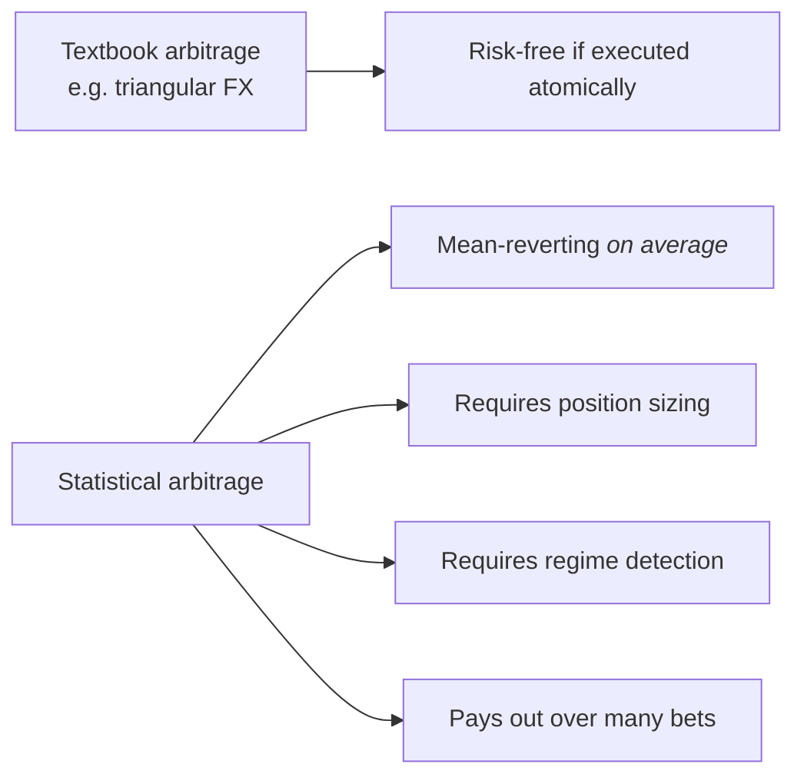
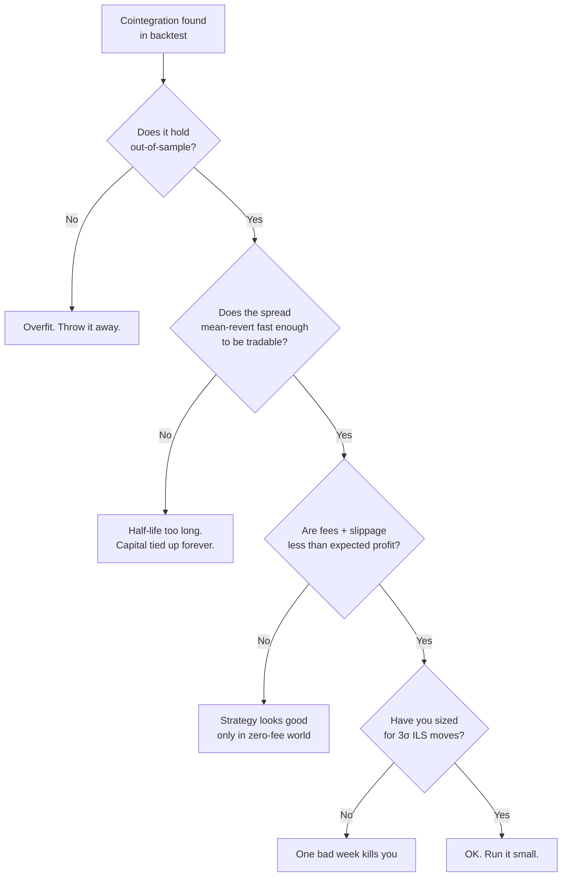

# 1. What stat arb actually is

## 1.1 The one-paragraph definition

Statistical arbitrage is **mean-reversion trading on synthesized spreads**. You construct a portfolio whose value is (statistically) stationary — a *spread* that drifts around a known mean — and bet that deviations from that mean will revert. The "statistical" qualifier matters: nothing is risk-free. The bet is that *on average across many such spreads* the mean-reverting property holds, and that the *expected return per unit of risk* beats a benchmark.

Stat arb is not arbitrage in the textbook risk-free sense. The risk is real: regime change kills cointegrated pairs, mean-reversion speed can collapse, funding can spike, venues can fail. The discipline of the field is in **measuring those risks honestly and sizing positions to survive them**.

## 1.2 What's actually new vs textbook arbitrage

Triangular FX arbitrage in a single venue with infinite liquidity is risk-free — and gone the moment you find it. Everything in this course is the second kind: an expected-value bet that becomes profitable only over many trades. The infrastructure burden is correspondingly larger because **you need the machinery to survive the bets that lose**, which textbook arbitrage doesn't have.

## 1.3 The four families we'll cover

| Family | What you bet on | Where the edge lives | Chapter |
|---|---|---|---|
| **Pairs trading** | Spread between two cointegrated assets reverts | Universe filtering + half-life discipline | [§2](02-cointegration.md) |
| **OU mean-reversion** | Synthesized spread follows an Ornstein-Uhlenbeck process | Optimal entry/exit thresholds given fit | [§3](03-ou-process.md) |
| **Funding-rate carry** | Perp funding rate is mispriced vs realised carry | Cross-venue funding spread | (treated under PHASED_PLAN.md §Phase 3 strategy 2) |
| **Basis trade** | Spot/futures basis converges at expiry | Term structure + cost of carry | (treated under PHASED_PLAN.md §Phase 3 strategy 3) |

This course goes deep on the first two because those are the ones the team has the least existing infra for. Funding-carry and basis are mentioned where their machinery overlaps; full chapters are deferred to the strategy authors' sessions.

## 1.4 Why bother — the honest pitch

Stat arb is **table stakes for the prop desk**, not a moat. The strategies are public; the literature is decades old; the edge is execution and discipline, not insight. So why include it?

1. **The infrastructure it forces.** Cointegration tests, half-life estimators, Bertram thresholds, drawdown gates, daily NAV machinery — these are what every later strategy needs and what an auditor wants to see.
2. **The track record it generates.** A year of audited returns from a portfolio of half a dozen small, uncorrelated stat-arb strategies looks far more professional to a Phase-4 LP than the same year from one or two flashy strategies. Sharpe diversification is real.
3. **The capital efficiency.** Stat arb scales down. You can run all five strategies at $50k each and the math still works. That makes Phase 3 ($5–10M trading capital per [PHASED_PLAN.md](../../../PHASED_PLAN.md)) achievable without a single concentrated bet.

## 1.5 What this course will not give you

- **A profitable strategy.** Strategies are not pasted into courses. The strategies in §2 and §3 are skeletons — running them as-is, with default thresholds, on default universes, will lose money to fees. Edge comes from the universe-filtering, regime-detection, and execution work that we do *with* these skeletons.
- **Backtest results.** Backtest plots in stat-arb courses are routinely curve-fit. We'll show the **method** for an honest backtest (§6) and trust you to run your own.
- **Magic numbers.** Where the literature suggests defaults (e.g. ADF p < 0.05 for cointegration), the number is cited. Where defaults are arbitrary (e.g. "z-score threshold of 2"), we say so. **Sensitivity-to-defaults is one of the things §6's backtesting framework lets you measure.**

## 1.6 The standard failure modes

Every box above maps to a chapter:

- "Overfit" → §6 (purged k-fold CV)
- "Half-life too long" → §2.5
- "Fees too high" → §4 (execution cost models)
- "Position-sized wrong" → §5 (Kelly + circuit breakers)

The chapters compose. If you skip one, the next is unsound.

## 1.7 Citations

- §1.1's "mean-reversion on synthesized spreads" framing is the standard formulation from **AL10** (Avellaneda & Lee, 2010).
- §1.3's families are the canonical taxonomy across textbooks; the funding-carry / basis split is crypto-specific.
- §1.5's anti-cargo-cult framing draws on **MLDP18** (López de Prado, 2018), which is essentially 350 pages of warnings about how researchers fool themselves in this exact field.

Full citations in [Appendix B](appendix-b-sources.md).
