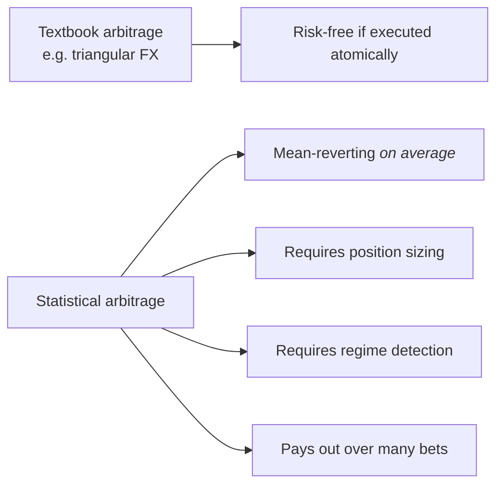
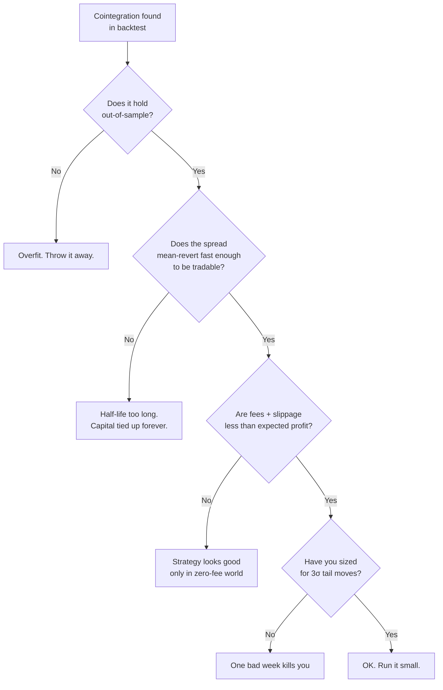

# 1. What stat arb actually is

!!! abstract "Where this chapter fits"
    **Feeds in from:** [§0 — course charter](00-charter-and-sources.md). Read §0 first if you haven't seen the source-tiering rule.
    **Feeds into:** [§2 cointegration](02-cointegration.md) and [§3 OU process](03-ou-process.md) (the two strategy families this course goes deep on); [§7 production](07-production.md) (the operational envelope this whole thing has to fit inside).
    **Read alone if:** you want a one-sitting "is stat arb worth my engineering time?" overview — §1 + [§7](07-production.md) is enough.

## 1.1 The one-paragraph definition

Statistical arbitrage is **mean-reversion trading on synthesized spreads**. You construct a portfolio whose value is (statistically) stationary — a *spread* that drifts around a known mean — and you bet that deviations from that mean will revert. The "statistical" qualifier matters: nothing here is risk-free in the textbook sense. The bet is that *on average across many such spreads* the mean-reverting property holds, and that the *expected return per unit of risk* beats a benchmark like cash or buy-and-hold.

A worked example to anchor the definition. Two large-cap tech stocks — Coca-Cola and PepsiCo, say — both wander up and down with the broader market over a decade. Neither price series is mean-reverting on its own; both have a long-run upward drift. But consider the *spread* `log(Coke) − β · log(Pepsi)`, for some hedge ratio $\beta$ that makes the spread, on average, neither rise nor fall. Empirically, that spread tends to oscillate around a stable level. When it gets unusually high — say, two standard deviations above its average — that means Coke has become unusually expensive relative to Pepsi. The trade is: short Coke, long $\beta$-units of Pepsi, and wait for the spread to come back. When it does, close both legs. Your profit is the size of the move, minus fees, minus slippage, minus whatever the spread did against you while you were waiting.

That's the whole picture. The math of the rest of the course is about (a) finding spreads that are stationary, (b) estimating how fast they revert, (c) sizing bets so a few bad spreads don't ruin you, and (d) operating the resulting machinery without lying to yourself.

Stat arb is **not** arbitrage in the textbook risk-free sense. The risk is real: regime change kills cointegrated pairs, mean-reversion speed can collapse, funding can spike against a perpetual-futures leg, venues can fail, regulators can announce something on a Thursday afternoon that breaks every spread you hold. The discipline of the field is in **measuring those risks honestly and sizing positions to survive them**.

## 1.2 What's actually new vs textbook arbitrage

Textbook arbitrage is the kind of thing finance professors put on exams: if EUR/USD trades at 1.10, USD/JPY at 150, and EUR/JPY at 167 simultaneously on a single venue with infinite liquidity, then buying EUR with USD and immediately selling EUR for JPY locks in a riskless profit. The arbitrage is *risk-free if executed atomically* — and gone the moment anyone with a computer finds it. Real exchanges close the loop within microseconds, so this kind of arbitrage exists mostly as a teaching tool.

Statistical arbitrage is the second kind of trade entirely. The bet is on an *expectation*: across many such positions, the mean-reverting property holds on average, and that average payoff exceeds the cost of putting them on. Each individual trade can lose. The strategy only makes sense in aggregate — over a portfolio of pairs, over months of trading. That's why the infrastructure burden is much larger than for textbook arbitrage: you need the machinery to survive the bets that lose, the operational discipline to scale only when the bets that win are winning for the right reasons, and the audit trail to convince yourself (and eventually a fund administrator or external investor) that the realised P&L matches the strategy's stated edge rather than masking a different bet.

Three pieces of machinery that have no analogue in textbook arbitrage:

1. **Position sizing.** Each trade has a recommended size based on the strategy's estimated edge and the variance of its outcomes — typically a fractional-Kelly calculation (§5.2). Textbook arbitrage has no sizing problem: you put on as much as the venue allows, atomically.
2. **Regime detection.** The cointegration that defines a tradeable spread can break. Detecting that break *before* P&L tells you about it requires its own diagnostic stack (§2.9, §3.6). Textbook arbitrage has no concept of regime — the trade either exists at this instant or it doesn't.
3. **Drawdown discipline.** Even a well-sized portfolio of real stat-arb strategies will lose money on bad weeks. You need a published rule for when to halt and reassess (§5.4) so that a manageable loss doesn't turn into an unmanageable one. Textbook arbitrage doesn't need a drawdown rule; the trade is risk-free.

This is the entire reason stat-arb desks employ engineers. Pairs trading on a whiteboard takes a paragraph; pairs trading in production takes the seven chapters that follow.

## 1.3 The four families we'll cover

| Family | What you bet on | Where the edge lives | Chapter |
|---|---|---|---|
| **Pairs trading** | The spread between two cointegrated assets reverts to its long-run mean | Universe filtering + half-life discipline | [§2](02-cointegration.md) |
| **OU mean-reversion** | A synthesized spread follows an Ornstein-Uhlenbeck process and reverts at a measurable speed | Optimal entry/exit thresholds given the fit | [§3](03-ou-process.md) |
| **Funding-rate carry** | A perpetual-futures funding rate is mispriced relative to realised carry on the underlying | Cross-venue funding spread; spot/perp basis | (mentioned where its machinery overlaps; full chapter deferred) |
| **Basis trade** | The spot/futures basis converges to zero at expiry | Term structure + cost of carry | (mentioned where its machinery overlaps; full chapter deferred) |

This course goes deep on the first two because those are the strategy families that need the most distinctive machinery — cointegration testing for pairs trading, OU fitting and Bertram thresholds for OU mean-reversion — and the machinery composes well into the third and fourth families if you ever want to extend.

Funding-carry and basis trades reuse the *execution* infrastructure (§4), the *risk* infrastructure (§5), and the *backtest* infrastructure (§6) without modification. Their *signal* machinery is different — a basis trade's edge is computed from term-structure data, not residuals of a regression — so they each warrant their own chapter eventually. The skeletons in §2 and §3 are deliberately the foundational two; once you understand them, the others are variations.

A note on terminology. "Stat arb" the term has migrated over the decades. In the 1990s it usually meant pairs trading on US equities. In the 2000s it broadened to include cross-sectional residual reversion (Avellaneda & Lee 2010 is the canonical paper). In the 2010s and 2020s, with the rise of crypto, the term loosely covers all four families above and a handful of others (basis, funding carry, cross-venue, liquidation cascades). When we say "stat arb" in this course we mean the family of strategies described in §1.1: synthesized stationary spreads, traded on mean reversion.

## 1.4 Why bother — the honest pitch

Stat arb is **table stakes for a quant prop desk**, not a moat. The strategies are public; the literature is decades old; the edge is execution and discipline, not insight. So why include it at all?

1. **The infrastructure it forces you to build.** Cointegration tests, half-life estimators, Bertram thresholds, drawdown gates, audited NAV machinery — these are what every later, more exotic strategy needs and what an auditor or investor wants to see. The infrastructure is the durable asset; the strategies that run on it are interchangeable.
2. **The track record it generates.** A year of audited returns from a portfolio of half a dozen small, uncorrelated stat-arb strategies is *much* more credible to an outside investor than the same year's returns from one or two flashy strategies. Statistical diversification across signals — see the Fundamental Law of Active Management treatment in [Appendix C Q11](appendix-c-practitioner-lore.md#q11-does-hedge-funds-win-by-finding-better-signals-or-by-combining-more-signals) — is real and well-documented.
3. **Capital efficiency.** Stat arb scales down. You can run all five strategies at $50K each and the math still works. That makes a real audited track record achievable without a single concentrated bet, and without needing institutional-scale capital to make the math meaningful.

The honest negative pitch, fairness demands: stat arb is *capital-inefficient* relative to directional trading in a strong trend, *operationally heavy* relative to passive index investing, and *psychologically punishing* on bad weeks. A trend-follower running long-only BTC in 2020 had an easy and beautiful year; a stat-arb book working on small reversion edges had a fine but tedious year and required two operators to keep it running. The decision to build stat-arb infrastructure should be a deliberate one — typically driven by the audit-trail and risk-attribution benefits, not by raw expected return.

## 1.5 What this course will not give you

- **A profitable strategy.** Strategies are not pasted into courses. The strategies in §2 and §3 are *skeletons* — running them as-is, with default thresholds, on a default universe, will lose money to fees and slippage. The edge comes from the universe-filtering, regime-detection, and execution work that we do *with* these skeletons. If a course tells you "here is the strategy, run it on the default parameters and make money," that course is selling you marketing material.
- **Backtest plots.** Backtest plots in stat-arb courses are routinely curve-fit. We'll show the **method** for an honest backtest (§6) and trust you to run your own. Anyone showing you an equity curve as proof should be asked to show you the 47 other backtests they ran and didn't publish — the deflated Sharpe ratio (§6.5) is the formal name for that correction.
- **Magic numbers.** Where the literature suggests defaults (e.g. ADF $p < 0.05$ for cointegration), the number is cited and motivated. Where defaults are arbitrary (e.g. "z-score threshold of 2," "refit weekly") we say so and we use the sensitivity-sweep machinery in §6.7 to measure how much the choice matters. A strategy whose performance depends critically on a single arbitrary default is not a strategy — it's a curve fit to one point.
- **A finished view of the field.** Stat arb continues to evolve, especially in crypto. The course covers the canonical core (pairs trading, OU mean-reversion) thoroughly; the newer or more exotic strategies (funding carry, basis trades, cross-venue liquidation arb, perp-perp basis) reuse the same infrastructure but have their own signal machinery. We'll mention where the bridges are; the deep chapters belong to whoever extends the course later.

## 1.6 The standard failure modes

The single best way to learn stat arb is to study how the strategies fail. There are roughly five common failure modes, each tied to a specific chapter of this course. The diagram below maps them:

Each failure mode maps to a chapter where the fix lives:

- **"Overfit"** → [§6 (purged k-fold CV)](06-backtesting.md#63-purged-k-fold-cross-validation-worked-example). Most cointegrations that look great in-sample are statistical accidents. Purged k-fold cross-validation, properly applied, eliminates almost all of them before deployment.
- **"Half-life too long"** → [§2.4](02-cointegration.md#24-half-life-of-mean-reversion). A spread that reverts on a six-month timescale is statistically real but economically dead — your capital is tied up while the rest of the market moves on. The half-life filter ($1 \leq \text{half-life} \leq 200$ bars on your trading frequency) drops most of these.
- **"Fees too high"** → [§4 (execution cost models)](04-execution.md#45-the-cost-model-is-what-makes-the-backtest-honest). A pair that's profitable at zero fees and dead at 10bps round-trip is the *most common* failure mode in practice. Calibrating the cost model is what §6.4's audit loop exists for.
- **"Position-sized wrong"** → [§5 (Kelly + circuit breakers)](05-risk.md#52-per-strategy-fractional-kelly-with-shrinkage). Even a real edge can be ruined by full-Kelly sizing — the drawdowns are punishing, and the *estimate* of edge you're sizing against is itself noisy. Quarter-Kelly is the default for a reason.
- **"Regime broke"** — not in the flowchart above because it happens *after* deployment, but every chapter covers some aspect of it. The §2.9 staleness diagnostics catch the slow break; the §3.6 $\theta$-floor kill switch catches the fast break; the §5.5 circuit breakers catch the catastrophic break.

The chapters compose. If you skip §6 you'll deploy an overfit strategy. If you skip §4 your backtest will lie to you about fees. If you skip §5 a single bad week will erase a year of returns. The order matters; the discipline matters more.

A pragmatic note about the order: most newcomers want to skip ahead to "the strategies" (§2 and §3) and treat §4–§7 as operational housekeeping. That's the wrong order. The strategies are public; the operational discipline is the part that's hard, the part that takes time to build, and the part that determines whether a year of stat-arb trading is a clean compounding curve or a noisy disaster. Read §2 and §3 for the math; read §4–§7 to understand whether you actually want to do this.

## 1.7 A glossary of the terms you'll see in the next six chapters

Stat arb has its own vocabulary, partly inherited from time-series econometrics, partly from market microstructure, partly from the field's own internal lore. The terms below are the ones you'll see in §2–§7 used without further introduction; pin them now so the chapters read smoothly.

- **Spread.** A linear combination of two or more price (usually log-price) series whose value, in aggregate, is statistically stationary. The thing you trade.
- **Hedge ratio.** The coefficient $\beta$ in a spread definition. The number of units of asset B you hold short for every unit of asset A you hold long. Recovered by OLS regression in the Engle-Granger framework; recovered as the cointegrating vector's components in the Johansen framework.
- **Stationarity.** A time series is *stationary* if its statistical properties (mean, variance, autocorrelation structure) don't change over time. Stat-arb strategies trade on the assumption that the *spread* is stationary even though its component price series are not.
- **Unit root.** A time series with a unit root drifts indefinitely — it's *non-stationary*. Tests for cointegration are tests for the absence of a unit root in the spread's residual.
- **Augmented Dickey-Fuller (ADF) test.** The standard test for stationarity. Null hypothesis: the series has a unit root (non-stationary). Rejecting the null at $p < 0.05$ is the textbook threshold for "this series is stationary." See §2.2.
- **Cointegration.** A pair (or basket) of non-stationary series is cointegrated if some linear combination of them *is* stationary. Cointegration is the formal name for "tradeable spread."
- **Half-life.** The number of bars (on your trading frequency) it takes for a deviation from the spread's mean to halve in expectation. Derived from the AR(1) coefficient of the spread. The single most useful number for deciding whether a cointegration is tradeable.
- **Mean-reversion speed ($\theta$).** The continuous-time analogue of the discrete half-life. Larger $\theta$ means faster reversion. The defining parameter of the Ornstein-Uhlenbeck process (§3).
- **Z-score.** The number of standard deviations a spread is from its mean. The simplest signal for entering and exiting a position. Upgraded to the Bertram thresholds in §3.4 when you take transaction costs into account.
- **Bertram thresholds.** The closed-form entry and exit thresholds for an OU spread that maximise expected return per unit time given a transaction cost. The principled upgrade to a fixed z-score rule.
- **Sharpe ratio.** Annualised excess return divided by annualised return volatility. The standard single-number summary of risk-adjusted return. Has well-known pathologies (sensitive to skew/kurt, biased upward by multiple testing) that §6.5's deflated Sharpe corrects for.
- **Drawdown.** The peak-to-trough decline in NAV over some window. Used both as a risk metric (max drawdown is a published statistic on every fund) and as a kill-switch threshold (the drawdown gate in §5.4).
- **Kelly criterion.** The bet-sizing rule that maximises expected log-wealth growth: $f^* = (\mu - r_f) / \sigma^2$ for a single bet. In practice always run *fractionally* (quarter-Kelly is the textbook default) because the $\mu$ you're sizing against is itself estimated with noise. See §5.2.
- **Circuit breaker.** An automated gate that pauses or unwinds positions when a specific failure condition trips (funding spike, venue health, drawdown, cointegration decay). See §5.5.
- **Kill switch.** The human-callable override that cancels every order and flattens every position. The thing you reach for when something the model didn't see is happening. See §5.6.
- **Shadow mode.** A deployment phase where the strategy runs against live data but execution is disabled — every order it *would* have placed is logged and scored against a synthetic fill price. The first step of the production pipeline (§7.1).
- **Slippage.** The difference between the price you expected to fill at and the price you actually filled at. A function of order size, book depth, and how aggressive your order type is.
- **Maker / taker.** In a limit-order-book venue, a *maker* is an order that adds liquidity to the book (rests as a quote); a *taker* is an order that consumes liquidity (matches against a resting order). Most venues charge takers and rebate (or charge less to) makers.

These will all be introduced more carefully in the chapters that own them, but you'll see them used cross-chapter, and the glossary is what lets a chapter say "the half-life floor from §2.4" without breaking your concentration.

## 1.8 Citations

- §1.1's "mean-reversion on synthesized spreads" framing is the standard formulation from **AL10** (Avellaneda & Lee, 2010).
- §1.3's families are the canonical taxonomy across textbooks; the funding-carry / basis split is crypto-specific and discussed in detail in the practitioner literature on perpetual futures structure.
- §1.4's "audit-trail benefits dominate raw-return benefits" framing is the practitioner version of the institutional-quant playbook articulated in **GK99** (Grinold & Kahn 1999) chapters 1 and 6.
- §1.5's anti-cargo-cult framing draws on **MLDP18** (López de Prado, 2018), which is essentially 350 pages of warnings about how researchers fool themselves in this exact field.
- §1.6's failure-mode flowchart is original to this course; the underlying failure modes are documented across the field's operational write-ups, including **BBLPZ14** (Bailey, Borwein, López de Prado & Zhu 2014) on backtest overfitting and **AC01** (Almgren & Chriss 2001) on execution cost realism.

Full citations in [Appendix B](appendix-b-sources.md).
