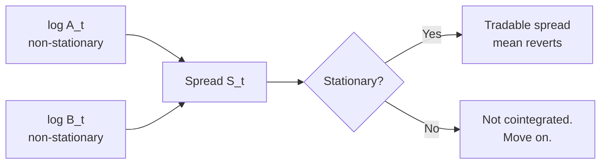

# 2. Cointegration & pairs trading

!!! abstract "Where this chapter fits"
    **Feeds in from:** [§1 — what stat arb is](01-introduction.md) (the framing); [§0.3 — source tiering](00-charter-and-sources.md#03-source-collection-method) (the EG87/J91/AL10 citations).
    **Feeds into:** [§3 OU process](03-ou-process.md) (the closed-form upgrade to §2.5's coarse z-score rule); [§4 execution](04-execution.md) (every "open / close spread" decision goes through the execution router); [§5 risk](05-risk.md) (universe size in §2.8 plugs directly into the effective-$N$ argument in §5.2); [§6 backtesting](06-backtesting.md) (the multiple-testing trap in §2.8 is what §6.5's DSR formally corrects).
    **Code shape:** [Appendix A.2 — pure signal functions](appendix-a-code-shapes.md#a2-pure-signal-functions) and [A.3 — IStrategy](appendix-a-code-shapes.md#a3-istrategy-the-canonical-strategy-interface).

## 2.1 The intuition

Two assets `A` and `B` are **cointegrated** if neither is stationary on its own (both have unit roots — they wander indefinitely) but a *linear combination* of them is stationary. That linear combination is called the *spread*:

$$ S_t = \log A_t - \beta \log B_t $$

The hedge ratio $\beta$ is whatever value makes $S_t$ stationary — i.e. makes the spread bounce around a stable long-run average rather than drifting. If such a $\beta$ exists, then a position that is **short `A` and long `β·B`** (in dollar terms) is a tradable mean-reverting position: when the spread is unusually high, the pair is "too dispersed" and is statistically likely to tighten back to its long-run average.

A concrete way to picture it. Imagine you plot the log prices of Coca-Cola and PepsiCo over the last twenty years on the same chart. Both lines wander up and to the right with the broader market; neither line, on its own, is stationary. Now plot the spread `log(KO) − β · log(PEP)` for the $\beta$ that minimises the variance of the resulting series. That third line will look very different — it will oscillate around a roughly flat level, occasionally drifting wide before snapping back. The spread is the *thing you trade*; the two prices that compose it are not. When the spread goes wide, you bet on it tightening.

Why log prices and not raw prices? Because the *returns* of an asset are roughly proportional to its log price changes (for small moves), and what we actually care about — for hedging, sizing, P&L — is *return* exposure, not raw dollar exposure. A 1% move in a $50 stock is $0.50; the same 1% move in a $500 stock is $5; raw price differences would weight expensive stocks more than cheap ones for no economic reason. Working in log space makes the spread invariant to nominal price level: doubling both legs doesn't change the spread.

Why is this called "cointegration"? In time-series econometrics, a series with a unit root is called "integrated of order 1" — denoted $I(1)$ — because you have to *difference* it once (take first differences) to get a stationary series. If two $I(1)$ series share a common stochastic trend such that a linear combination of them is stationary ($I(0)$), they are said to be *co-integrated* — they share the integrated component, which cancels out in the combination. The terminology is Engle & Granger's, 1987.



The diagram looks simple. Almost the entire rest of the chapter is about the boxes labelled "Stationary?" and "Move on." — when to believe the test, when to distrust it, and how to keep distrust calibrated across thousands of candidate pairs without drowning in false positives.

## 2.2 Engle-Granger two-step (the canonical test)

The Engle-Granger procedure (**EG87**) is the simplest and most widely-used test for cointegration. It's a *two-step* procedure because it does two separate things:

1. **Regress** $\log A_t = \alpha + \beta \log B_t + \varepsilon_t$ by ordinary least squares (OLS). The slope $\beta$ is the hedge ratio that, if cointegration exists, makes the residual stationary. The intercept $\alpha$ is the long-run *level* of the spread — usually close to zero on log-price series but not always.
2. **Test the residuals** $\hat{\varepsilon}_t = \log A_t - \alpha - \beta \log B_t$ for stationarity using an Augmented Dickey-Fuller (ADF) test. The ADF null hypothesis is "this series has a unit root (is non-stationary)"; rejecting it (typically at $p < 0.05$) means the residual is stationary, which means $A$ and $B$ are cointegrated.

If you've never run an ADF test before: it's a regression of the form $\Delta y_t = \alpha + \beta y_{t-1} + \gamma_1 \Delta y_{t-1} + \dots + \gamma_p \Delta y_{t-p} + \varepsilon_t$, where the test statistic is the t-ratio on $\beta$. Under the null of a unit root ($\beta = 0$), this statistic follows a non-standard distribution (not Student's t) whose critical values were tabulated by Dickey and Fuller in 1979. Modern statistics packages (`statsmodels.tsa.stattools.adfuller` in Python) return both the test statistic and the p-value from the correct distribution.

**Why this works.** The intuition is that the OLS regression *finds the hedge ratio that would make the residual stationary if such a ratio exists*; the ADF test then asks whether the resulting residual actually is stationary. If both steps pass at sensible thresholds, the residual is stationary, the spread is mean-reverting, and the pair is cointegrated.

**Pitfalls** — and there are several. The Engle-Granger test is not bulletproof, and treating its p-value as gospel is one of the standard ways to lose money to spurious cointegrations.

- **Direction-sensitivity.** Engle-Granger is asymmetric: regressing $A$ on $B$ produces a different hedge ratio than regressing $B$ on $A$, and in finite samples the two regressions can give different p-values. The textbook recommendation is to run both directions and require both to pass at the stricter of the two thresholds. The Johansen test (§2.3) handles this properly because it estimates the cointegrating vector symmetrically.
- **Low power in finite samples.** The ADF test has well-known low statistical power — meaning, when cointegration is genuinely present but weak, the ADF test will fail to reject the null and you'll *miss* a real cointegration. The practical implication: an ADF $p > 0.05$ is *not* strong evidence that two series are uncointegrated; it might just mean the test is underpowered for your sample size. Pair the ADF with the KPSS test (which has the opposite null: stationary is the null, non-stationary is the alternative) and look for *both* tests to agree — ADF rejecting unit root *and* KPSS failing to reject stationarity.
- **Multiple-testing trap.** This is the big one. If you test 1,000 candidate pairs at $p < 0.05$, you expect 50 false positives *purely by chance*. That's a sober statistical fact, and it's the most common reason a "we found 100 cointegrated pairs!" backtest evaporates in production. The fix is in §2.8: filter the candidate set first, then apply a stricter threshold (Bonferroni or false-discovery-rate corrected), then cross-validate on a held-out window.
- **Structural breaks.** A series that is cointegrated for ten years and then breaks for legitimate structural reasons (one of the assets gets delisted; the underlying business changes) will still show up as "cointegrated" on the full ten-year window — even though the *post-break* segment isn't. The fix is to test on a *rolling* window (§2.9) rather than a single in-sample window.

## 2.3 Johansen's test (multi-variate)

Engle-Granger handles two assets at a time. For three or more assets, the natural generalisation is Johansen's test (**J91**), which estimates *all* the cointegrating relationships in a set of $n$ series simultaneously and does so symmetrically (no choice-of-direction asymmetry).

The Johansen test fits a vector error-correction model (VECM):

$$ \Delta X_t = \Pi X_{t-1} + \sum_{i=1}^{p-1} \Gamma_i \Delta X_{t-i} + \mu + \varepsilon_t $$

where $X_t$ is a vector of the $n$ log-prices, $\Pi$ is an $n \times n$ matrix whose *rank* gives the number of cointegrating relationships among the series, and the $\Gamma_i$ matrices capture short-run dynamics. The rank of $\Pi$ is what we care about: it tells you how many distinct cointegrating vectors there are. Rank $r = 1$ means there's exactly one cointegrating combination; rank $r = 2$ means two; rank $r = 0$ means none of the series are cointegrated.

Johansen provides two hypothesis tests for the rank:

- **Trace test.** Null hypothesis: there are *at most* $r$ cointegrating vectors. Reject if the test statistic exceeds the critical value. Walk up from $r = 0$ to find the smallest $r$ at which you fail to reject.
- **Maximum eigenvalue test.** Null hypothesis: there are *exactly* $r$ cointegrating vectors, alternative is $r + 1$. Use this when you have a prior belief about the rank.

For pairs trading ($n = 2$) Engle-Granger is enough and is the conventional choice. For basket strategies ($n > 2$ — e.g. trading three correlated DeFi tokens against each other, or constructing a small-cap-versus-large-cap basket spread) Johansen is the right tool: it gives you *all* the cointegrating vectors simultaneously, which is how you discover that "stocks A, B, C are individually pairwise marginal but the three of them together support two cointegrating combinations."

**When to use which.** Default to Engle-Granger for any two-asset analysis. Switch to Johansen the moment you're looking at three or more. The Johansen output is richer (multiple cointegrating vectors, normalised eigenvectors that act as basket weights) and the math is symmetric, but it's also more sensitive to the lag-length choice $p$ in the VECM and more vulnerable to over-fitting on small samples. The textbook recommendation is to pick $p$ by an information criterion (AIC or BIC) before running the test.

In `statsmodels`, the Johansen test is `statsmodels.tsa.vector_ar.vecm.coint_johansen`; in `mlfinlab` (Tier B, URL pending verification) there is a wrapper that returns the cointegrating vectors in a more directly tradeable form.

## 2.4 Half-life of mean reversion

A spread is "tradable" only if it reverts fast enough to free capital before opportunity cost eats the trade. Fit the spread to an AR(1) model — the simplest plausible stochastic process that exhibits mean reversion:

$$ S_t = c + \rho S_{t-1} + \varepsilon_t $$

Where $S_t$ is the spread, $c$ is an intercept (the long-run mean, scaled), $\rho$ is the autoregressive coefficient, and $\varepsilon_t$ is mean-zero noise. The parameter $\rho$ is the one to watch: if $\rho = 1$, the spread has a unit root and is non-stationary; if $\rho < 1$, the spread is mean-reverting; if $\rho$ is close to zero, the spread reverts very fast (close to the mean each bar).

The **half-life** — the expected number of bars until a deviation from the mean halves — has a clean closed form:

$$ \text{half-life} = \frac{\ln 2}{-\ln \rho} $$

Where does this come from? If $\rho$ is the AR(1) coefficient, then in expectation, after one bar a deviation $d$ shrinks to $\rho d$; after two bars to $\rho^2 d$; after $k$ bars to $\rho^k d$. Solving $\rho^k = 1/2$ gives $k = \ln(1/2) / \ln \rho = \ln 2 / (-\ln \rho)$.

**Practical thresholds.** The numbers below are rules of thumb — they should be tuned to your trading frequency and universe — but they're a defensible starting point:

- **Half-life < 1 bar.** The spread reverts faster than you can trade it. Almost certainly microstructure noise (bid-ask bounce, stale-quote artifacts) leaking into the fit. Skip the pair, or upsample your bar size and re-test.
- **Half-life 1–20 bars** on your chosen trading frequency. This is the sweet spot for stat arb. Capital cycles through the trade fast enough to compound; round-trip frictions don't dominate.
- **Half-life 20–200 bars.** Tradable, but capital-intensive. The trade is open for tens to hundreds of bars on average, which means a given dollar of capital generates fewer trips per year. Size down accordingly.
- **Half-life > 200 bars.** Too slow. The cointegration may be statistically real but it's economically dead — your capital is locked up while the rest of the market moves. Skip unless you have a specific reason (e.g. running it as one of many small allocations in a heavily diversified book).

**A worked numerical example.** Suppose you fit an AR(1) on 5-minute bars and get $\rho = 0.95$. Then half-life $= \ln 2 / (-\ln 0.95) = 0.693 / 0.0513 \approx 13.5$ bars. At 5 minutes per bar, that's about 68 minutes of clock time — solidly inside the tradable range. If instead you got $\rho = 0.99$, half-life $= 0.693 / 0.01005 \approx 69$ bars (about 5.7 hours) — tradable but capital-heavy. If you got $\rho = 0.999$, half-life $\approx 693$ bars (nearly two days) — practically untradeable for a 5-minute strategy.

**Connecting half-life to the continuous-time picture.** The AR(1) coefficient $\rho$ is the discrete analogue of $e^{-\theta \Delta t}$ in the continuous-time Ornstein-Uhlenbeck process (Chapter 3). For small $\Delta t$, $\rho \approx 1 - \theta \Delta t$, so half-life $= \ln 2 / \theta$ in either formulation. The two views are the same; we use $\rho$ in §2 because the AR(1) regression is what you actually run, and we use $\theta$ in §3 because the closed-form Bertram results are derived in continuous time.

## 2.5 Z-score entry/exit

The simplest trading rule on a mean-reverting spread is a *z-score threshold rule*: open a position when the spread is more than $k$ standard deviations from its long-run mean, close it when the spread reverts to within a smaller threshold.

The z-score is the spread re-expressed in standardised units:

$$ z_t = \frac{S_t - \mu}{\sigma} $$

Where $\mu$ and $\sigma$ are estimated over a rolling window — typically 60 to 250 bars on daily-frequency data, or 300 to 1000 bars on intraday data. The choice of window is itself a hyperparameter and should be sensitivity-tested (§6.7).

The trading rules:

- **Enter short-spread** when $z_t > k_{\text{enter}}$ (typically $+2$). Short-spread means short the leg that's gone up too much and long the leg that's gone down too little — i.e. short A, long $\beta$-units of B if the spread is high.
- **Enter long-spread** when $z_t < -k_{\text{enter}}$ (typically $-2$). Inverse: long A, short $\beta$-units of B.
- **Close** the position when $|z_t| < k_{\text{exit}}$ (typically $0.5$). The trade is "done" once the spread has reverted most of the way back. You don't have to wait for $z_t = 0$ exactly because of [the entry-passive / exit-aggressive asymmetry in §4.6](04-execution.md#46-passive-vs-aggressive-entryexit-the-asymmetry) — leaving on the exit threshold captures most of the edge while avoiding the risk that the spread re-widens past your fill.
- **Stop out** if $|z_t| > k_{\text{stop}}$ (typically $4$). If the spread keeps widening past your stop, the cointegration has plausibly broken and you should flatten the position rather than ride a regime change.

**Why z-score thresholds are coarse.** They treat the spread as a memoryless mean-reverting process and don't use any of the *speed* information that fitting an OU model gives you. A spread with half-life 5 bars and a spread with half-life 50 bars get the same z-score thresholds under this rule — even though the optimal entry threshold is much smaller for the faster spread (you should be eager to enter because the round-trip is fast) and much larger for the slower spread (you need a bigger deviation to compensate for the long capital lock-up).

The Bertram (**B10**) result, covered in [§3.4](03-ou-process.md#34-bertrams-optimal-thresholds-b10), gives an *optimal* entry/exit threshold pair given the fitted OU parameters and a per-trade transaction cost. The z-score rule is a useful starting point and a defensible production fallback — but a real desk runs Bertram on the OU fit and uses z-scores only as a cross-check.

**A worked example to anchor the numbers.** Take a pair with $\mu_{\text{spread}} = 0.0$ and $\sigma_{\text{spread}} = 0.02$ (so the spread is in log-price units and a one-σ move is 2%). With $k_{\text{enter}} = 2$, the entry trigger fires at $|S_t| \geq 0.04$ — i.e. when the spread is 4% away from its mean. With $k_{\text{exit}} = 0.5$, you close at $|S_t| \leq 0.01$ (1% away). Assuming the spread reverts cleanly from $S_t = +0.04$ to $S_t = +0.01$, the trade captures 3% of spread movement. If $\beta = 1$ and you put $X$ dollars on each leg, your P&L is $X \cdot 0.03 = 3\%$ of the per-leg notional, minus round-trip fees and slippage. At a 10bp round-trip cost on each leg, your net is roughly 2.6% — and that's *if* the spread reverts cleanly, which not all of them do.

## 2.6 Code shape

The code below is the shape, not a complete implementation. The point is to make the dependencies and the boundaries explicit: signal functions are pure, strategies compose signals, and venue-aware code lives elsewhere.

```typescript
// signal/cointegration.ts (pure, no I/O)

export interface CointegrationResult {
  beta: number;          // hedge ratio
  alpha: number;         // intercept
  adfStatistic: number;
  pValue: number;
  halfLifeBars: number;  // ln(2) / -ln(rho) from residual AR(1)
}

export function engleGranger(
  logA: readonly number[],
  logB: readonly number[],
): CointegrationResult {
  // 1. OLS regress logA on logB
  // 2. ADF test on residuals
  // 3. Fit AR(1) to residuals, compute half-life
  // ...
}

// strategy/pairs-trading.strategy.ts (composes the signal)

export class PairsTradingStrategy implements IStrategy {
  onBar(bar: BarEvent, ctx: StrategyContext): Order[] {
    const spread = ctx.history.logA.map((a, i) => a - this.beta * ctx.history.logB[i]);
    const z = zScore(spread, this.windowBars);
    if (z > this.kEnter && !ctx.portfolio.hasOpen(this.pairId)) {
      return [shortSpread(this.pairId, this.notional)];
    }
    // ...
  }
}
```

Key shape notes:

- **`signal/` is pure.** No `Date`, no `process.env`, no DB. Inputs are arrays of numbers; output is a value object. This is what makes it testable with golden vectors — you can pin an input series and an expected output, and any regression breaks loudly. The pattern is documented in [Appendix A.2](appendix-a-code-shapes.md#a2-pure-signal-functions).
- **`strategy/` consumes signals.** It owns the parameters (`beta`, `kEnter`, `windowBars`) but delegates the math. Same interface as every other strategy — see [Appendix A.3](appendix-a-code-shapes.md#a3-istrategy-the-canonical-strategy-interface). The strategy is also pure modulo its own internal state — given a `BarEvent` and a `StrategyContext`, it returns a deterministic list of `Order`s.
- **No venue-aware code anywhere in here.** No exchange names, no API calls, no fee math beyond what's in the strategy's own cost model. Venue concerns belong in `execution/` ([§4](04-execution.md)) so the same strategy can be backtested deterministically and run live against multiple venues without changing the strategy code.

The decoupling between signal, strategy, and execution is the load-bearing architectural decision in the whole codebase. It's what lets you swap a `MockTradingVenue` for a real exchange without touching the strategy logic, and it's what lets a backtest produce numbers that genuinely predict live behaviour.

## 2.7 When pairs trading breaks

Even a real cointegration breaks eventually. The four most common symptoms, with their likely causes and the mitigations:

| Symptom | Likely cause | Mitigation |
|---|---|---|
| Cointegration p-value drifts $p < 0.05 \to p > 0.1$ over a few weeks | Regime change in one of the legs (catalyst, token unlock, listing change) | Re-test daily on a rolling window (§2.9); close pairs that fail two days in a row |
| Half-life doubles or triples vs initial fit | Mean-reversion speed decaying — spread is becoming "stickier" | Re-estimate weekly; tighten entry threshold; close if half-life crosses a published kill floor |
| Realised P&L diverges materially from backtest | Slippage model too optimistic, or universe-filtering changed between backtest and live | Audit execution (§4.4) by comparing realised vs modelled slippage on the last 50 trades; recalibrate the model |
| Multiple pairs lose simultaneously | Common-factor exposure leaked in (the pairs aren't independent) | Add factor neutralisation (industry / market beta / sector); recompute the portfolio-level VaR with realised correlations |

None of these is an emergency on its own. All of them, together, on the same week, are an emergency — and the response is to halt new entries, flatten open positions where feasible, and figure out which factor is leaking before re-arming.

## 2.8 Universe construction — from infinite candidate pairs to a tractable book

The §2.2–§2.5 machinery tells you *whether two specific series are cointegrated*. It says nothing about *which pairs to test*. That second problem is the bigger one operationally, and it's where most retail pairs-trading efforts quietly die.

The combinatorics are unforgiving. With $K$ candidate assets, the unordered pair count is $\binom{K}{2} = K(K-1)/2$. For the global top-150 crypto assets by liquidity, that's 11,175 candidate pairs. Test each at the standard $p < 0.05$ Engle-Granger threshold and you'll find $\approx 559$ "cointegrated" pairs **by chance alone** — the textbook multiple-testing trap. If your decision rule is "trade the 50 most cointegrated", roughly half of them are spurious before you've placed a single order.

So the operational question becomes: how do you narrow 11,000+ candidates to a few hundred *plausibly meaningful* candidates before you ever run the formal test? The buyside answer, repeated across textbooks (**AL10**) and practitioner threads, is a **funnel** — a sequence of cheap filters that each kill a layer of obvious junk:

| Stage | Filter | What it removes | Typical reduction |
|---|---|---|---|
| 1 | **Liquidity floor.** 30-day median quote volume above a fixed USD threshold (e.g. $5M/day for crypto) on both legs. | Illiquid tails where execution slippage will eat any edge regardless of cointegration. | 150 → 80 assets |
| 2 | **Sector / category bucketing.** Only pair within a defined family — L1s with L1s, DEX tokens with DEX tokens, USD stablecoins with USD stablecoins. Cross-family pairs occasionally cointegrate, but the cointegration is usually a transient macro effect with no fundamental tether — i.e. the relationship has no reason to *re-form* if it breaks. | The $\approx 80\%$ of candidate pairs that have no economic reason to track each other. | $\binom{80}{2} = 3,160$ → ~400 within-bucket pairs |
| 3 | **Correlation pre-filter.** Discard pairs whose 90-day rolling Pearson correlation on log-returns is below a floor (e.g. $\rho < 0.6$). High correlation is *necessary but not sufficient* for cointegration, and it's far cheaper to compute. | Pairs that don't move together at all. | 400 → ~120 |
| 4 | **Cointegration test.** Engle-Granger on the survivors. Apply a stricter $p < 0.01$ threshold than the textbook $p < 0.05$ because you're testing 120+ pairs; under Bonferroni adjustment $p < 0.05 / 120 \approx p < 0.0004$ if you want full familywise control, but $p < 0.01$ is a defensible practitioner compromise. | The pairs that pass-by-chance under multiple testing. | 120 → ~25 |
| 5 | **Half-life filter.** Drop pairs whose half-life falls outside the tradeable range from [§2.4](#24-half-life-of-mean-reversion) *on your bar size* — under 1 bar is microstructure noise; over 200 bars is economically dead. The 1–20-bar sweet spot is preferred; 20–200 is tradeable but capital-intensive and should be sized down. | Pairs that are statistically cointegrated but economically dead, or microstructure-noise hits. | 25 → ~15 |
| 6 | **Capacity check.** For each remaining pair, simulate $X notional through the order book at a defined slippage budget. Drop pairs where even the smaller-leg's spread plus depth makes the round-trip uneconomic at your target trade size. | Pairs that work on paper but won't survive the second-cheapest taker bot. | 15 → ~8–10 |

The book you end up trading is **single-digit pairs**, not hundreds. That's the operationally honest number — and it's roughly consistent with what published equities stat-arb desks report running (**AL10** describes O(100) pairs across the *entire US equities universe*, which is two orders of magnitude larger than crypto).

The multiple-testing problem deserves explicit treatment because it's the most common way a backtest looks brilliant in-sample and dies the moment it's flipped on. If you tested 11,175 pairs at $p < 0.05$ and reported "we found 559 cointegrated pairs!", you didn't find any edge — you found random noise. Three honest corrections:

1. **Bonferroni** divides the per-test threshold by the number of tests. Strictest; over-conservative when tests aren't independent (and most of yours aren't, because correlation pre-filters cluster the candidate set).
2. **Benjamini-Hochberg / False Discovery Rate.** Controls *expected fraction of false discoveries* rather than familywise error rate. Less aggressive than Bonferroni, defensible for stat arb. Implementations: `statsmodels.stats.multitest.multipletests(p_values, method='fdr_bh')`.
3. **Cross-validation on a held-out window.** Re-run the cointegration test on a fresh time window after the candidate set is selected. Pairs that pass in both windows are far less likely to be spurious. The cost is sample efficiency — you've now used half your data for selection rather than estimation.

!!! note "Practitioner note (from RohOnChain archive — Fundamental Law thread)"
    Roan's "50 weak signals" framing ([archive](_archive/roan-fundamental-law-active-mgmt-2026-05-26.md); cross-referenced in [Appendix C Q7](appendix-c-practitioner-lore.md#q7-how-many-independent-signals-does-my-book-actually-have)) is directly relevant here. A book of 20 cointegrated pairs in the *same* sector / family is not 20 independent bets — it's closer to 2–3 independent bets, because the pairs share regime exposure. Diversifying *across signal families* (mean-reversion + funding-carry + microstructure) raises the *effective* $N$ in the Fundamental Law of Active Management ($\text{IR} = \text{IC} \cdot \sqrt{N_{\text{eff}}}$ — see [§5.2](05-risk.md#52-per-strategy-fractional-kelly-with-shrinkage) and Grinold & Kahn 1995/1999) far more than adding more pairs within one family does. **Concrete implication for crypto stat arb:** don't build a book of 30 L1/L1 pairs and call it diversified. Build a book of 8 L1/L1 pairs, 4 DEX/DEX pairs, 4 funding-carry positions, and 2 basis trades, and trade them all at smaller size.

The full citation chain: Engle-Granger (**EG87**) gives the cointegration test; Avellaneda & Lee (**AL10**) gives the modern sector-bucketing operational lore; Clarke, de Silva & Thorley (2002) — *Portfolio constraints and the fundamental law of active management* — gives the effective-$N$ correction that the RohOnChain thread operationalises.

## 2.9 Spread-staleness diagnostics — knowing when a cointegrated pair has broken

A cointegrating relationship is an *empirical* observation, not a causal one. Two tokens that have moved together for 18 months may stop moving together tomorrow, and there's no theorem that warns you in advance. The operational machinery is therefore continuous re-testing plus a set of "the pair has gone stale" diagnostics that fire *before* you take the catastrophic loss that the stop-out would otherwise eat.

Four diagnostics, in order of how often they fire and how decisive each one is:

**1. Rolling p-value drift.** The single load-bearing check. Re-run the Engle-Granger test daily on a rolling 90-day or 180-day window. Plot the p-value over time. A healthy cointegrated pair shows p-values consistently under your threshold — say, in the $[0.001, 0.02]$ band. A breaking pair shows the p-value drifting upward over weeks: $0.01 \to 0.03 \to 0.07 \to 0.15$. **Decision rule:** close the position the moment the rolling p-value crosses your threshold for two consecutive days. One day might be noise; two days isn't.

**2. Half-life decay.** Re-fit the AR(1) on the residual every week and recompute the half-life. A breaking pair often shows the half-life *lengthening* before the p-value finally crosses the cointegration threshold — the spread is still mean-reverting, but more slowly, which is a precursor to it stopping. **Decision rule:** if the half-life doubles from its initial fit (e.g. 5 bars → 10 bars), tighten your z-score entry threshold; if it triples, close existing positions and stop entering until it recovers.

**3. Correlation collapse.** Compute the rolling 30-day Pearson correlation on log-returns of the two legs. Healthy cointegrated pairs sit above $\rho = 0.7$; a collapse to $\rho < 0.4$ in a 30-day window is almost always a precursor to cointegration failure within the next month. Correlation collapse is *faster-moving* than the rolling p-value — useful as an early warning even when the cointegration test still passes.

**4. Regime-change catalysts.** External events that *cause* cointegration to break. For crypto specifically:

| Catalyst | What it does | Pre-trade defense |
|---|---|---|
| **Token unlock event** | Sudden supply expansion on one leg shifts its price floor; the spread re-anchors and never returns to the old mean. | Maintain a calendar of unlock events for every leg in the book; close positions before a major unlock. |
| **New venue listing** | Liquidity shifts; the asset's price-discovery venue changes; old correlations break. | Same — track listing announcements; pause the pair around the listing date. |
| **Regulatory action** | One leg gets named in an enforcement action; the other doesn't. The "named" leg sells off; the spread re-anchors. | Hardest to predict. Best defense is the rolling p-value check above. |
| **Governance vote / protocol upgrade** | A DeFi protocol upgrade can change tokenomics enough to break a cointegration. | Track governance forums for legs in your book; size down around major vote dates. |
| **Stablecoin de-pegging events** | If one leg is denominated in or correlated with a stablecoin that de-pegs, the relationship breaks in seconds. | Cap exposure per stablecoin denomination. Don't run >30% of the book against any single stablecoin. |

!!! note "Practitioner note (from RohOnChain archive — Markov Hedge Fund Method)"
    Roan's regime-detection framework ([archive](_archive/roan-markov-hedge-fund-method-2026-05-26.md); cross-referenced in [Appendix C Q2](appendix-c-practitioner-lore.md#q2-why-is-the-persistence-diagonal-of-the-transition-matrix-the-most-useful-single-number-on-it)) gives a fifth diagnostic that's stronger than any of the four above: fit a Markov regime model on each *leg* individually (Bull/Sideways/Bear via a 20-day rolling-return label) and watch the transition matrices' persistence diagonals. When one leg's persistence diagonal collapses — e.g. its "stay in current regime" probability drops from 90% to 65% over a few weeks — the leg is becoming choppier *independently* of the pair's spread behavior, which is a leading indicator that a cointegration break is being driven by a regime change in just one side of the trade. Operationalised: re-fit the per-leg Markov chains weekly; if either leg's diagonal drops by >15 percentage points from its rolling baseline, close the pair regardless of what the spread is doing. Maps to Hamilton (1989) on regime-switching models.

The discipline that ties all four diagnostics together: **the kill switch fires on the *first* diagnostic to trip, not the third.** It's tempting to wait for all four to agree, on the grounds that any one might be a false positive. In practice the diagnostics that fire late are slower and the diagnostics that fire early are more decisive — by the time the rolling p-value has crossed for two days, you've often given back two weeks of profit waiting for "confirmation."

## 2.10 Citations

- **EG87**: Engle, R. F., & Granger, C. W. J. (1987). *Co-integration and error correction: representation, estimation, and testing.* Econometrica, 55(2), 251–276.
- **J91**: Johansen, S. (1991). *Estimation and hypothesis testing of cointegration vectors in Gaussian vector autoregressive models.* Econometrica, 59(6), 1551–1580.
- **AL10**: Avellaneda, M., & Lee, J.-H. (2010). *Statistical arbitrage in the U.S. equities market.* Quantitative Finance, 10(7), 761–782.
- **H89**: Hamilton, J. D. (1989). *A new approach to the economic analysis of nonstationary time series and the business cycle.* Econometrica, 57(2), 357–384. — Markov regime-switching as the formal foundation of the practitioner regime-detection framework cited in §2.9.
- **CST02**: Clarke, R., de Silva, H., & Thorley, S. (2002). *Portfolio constraints and the fundamental law of active management.* Financial Analysts Journal, 58(5), 48–66. — Effective-$N$ correction, cited in §2.8's Practitioner note.
- **BH95**: Benjamini, Y., & Hochberg, Y. (1995). *Controlling the false discovery rate: a practical and powerful approach to multiple testing.* Journal of the Royal Statistical Society B, 57(1), 289–300. — The multiple-testing correction recommended in §2.8.
- **Tier C — RohOnChain archive**: [`_archive/roan-markov-hedge-fund-method-2026-05-26.md`](_archive/roan-markov-hedge-fund-method-2026-05-26.md); [`_archive/roan-fundamental-law-active-mgmt-2026-05-26.md`](_archive/roan-fundamental-law-active-mgmt-2026-05-26.md). Practitioner threads by @RohOnChain, cited alongside Tier-A literature per §0.3's promotion rule.

Open-source reference implementations (URLs pending verification — see [Appendix B](appendix-b-sources.md)): `mlfinlab`, `arbitragelab`, `statsmodels.tsa.stattools.adfuller`, `statsmodels.tsa.vector_ar.vecm`, `statsmodels.stats.multitest.multipletests` (for FDR correction in §2.8).
