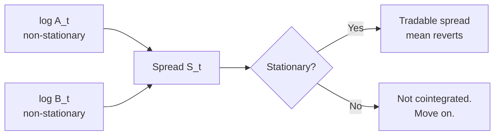

# 2. Cointegration & pairs trading

## 2.1 The intuition

Two assets `A` and `B` are **cointegrated** if neither is stationary on its own (both have unit roots — they wander) but a *linear combination* of them is stationary. That linear combination is the spread:

$$ S_t = \log A_t - \beta \log B_t $$

The hedge ratio $\beta$ is whatever makes $S_t$ stationary. If such a $\beta$ exists, then short-`A` / long-`β·B` is a tradable mean-reverting position: when the spread is unusually high, the pair is "too dispersed" and will likely tighten.



## 2.2 Engle-Granger two-step (the canonical test)

Procedure (**EG87**):

1. **Regress** $\log A_t = \alpha + \beta \log B_t + \varepsilon_t$ by OLS. The slope $\beta$ is the hedge ratio.
2. **Test the residuals** $\hat{\varepsilon}_t$ for stationarity using an Augmented Dickey-Fuller (ADF) test. The ADF null is "residual has a unit root"; rejecting it (typically at $p < 0.05$) means the residual is stationary, which means $A$ and $B$ are cointegrated.

**Pitfalls.**

- Engle-Granger is **direction-sensitive**: regressing $A$ on $B$ can give a different conclusion than $B$ on $A$ in finite samples. Run both directions; require both to pass for safety. Johansen's test (§2.3) handles this properly.
- The ADF test has **low power** in finite samples — it under-rejects the null, so you'll miss real cointegrations. The KPSS test reverses the null (null = stationary) and is sometimes run alongside.
- **Multiple comparisons.** If you test 1,000 pairs at $p < 0.05$, you expect 50 false positives. Adjust the threshold or use a higher bar like $p < 0.01$.

## 2.3 Johansen's test (multi-variate)

**J91** generalises Engle-Granger to $n$ assets. Fit a vector error-correction model (VECM):

$$ \Delta X_t = \Pi X_{t-1} + \sum_{i=1}^{p-1} \Gamma_i \Delta X_{t-i} + \mu + \varepsilon_t $$

The rank of $\Pi$ is the number of cointegrating relationships. Two tests:

- **Trace test:** null hypothesis that there are at most $r$ cointegrating vectors.
- **Maximum eigenvalue test:** null that there are exactly $r$, alternative is $r+1$.

For pairs trading ($n=2$) Engle-Granger is enough. For basket strategies ($n>2$) use Johansen; it returns *all* cointegrating vectors simultaneously and is direction-independent.

## 2.4 Half-life of mean reversion

A spread is "tradable" only if it reverts fast enough to free capital before opportunity cost eats the trade. Fit the spread to an AR(1):

$$ S_t = c + \rho S_{t-1} + \varepsilon_t $$

The half-life — the expected number of bars until a deviation from the mean halves — is:

$$ \text{half-life} = \frac{\ln 2}{-\ln \rho} $$

**Practical thresholds:**

- Half-life **< 1 bar** — probably noise or microstructure artifact; skip.
- Half-life **1–20 bars** on your trading frequency — sweet spot for stat arb.
- Half-life **20–200 bars** — tradable but capital-intensive; need careful sizing.
- Half-life **> 200 bars** — too slow; the cointegration may be statistically real but economically dead. Skip.

(Numbers are rule-of-thumb; tune per universe.)

## 2.5 Z-score entry/exit

The simplest trading rule: open when the spread is $k$ standard deviations from its mean, close when it crosses zero.

$$ z_t = \frac{S_t - \mu}{\sigma} $$

Where $\mu$ and $\sigma$ are estimated over a rolling window (often 60–250 bars on daily data).

- Enter short-spread when $z_t > k_{\text{enter}}$ (e.g. $+2$).
- Enter long-spread when $z_t < -k_{\text{enter}}$ (e.g. $-2$).
- Close on $|z_t| < k_{\text{exit}}$ (e.g. $0.5$).
- Stop out at $|z_t| > k_{\text{stop}}$ (e.g. $4$) — if reversion fails, regime probably broke.

The Bertram (**B10**) result (covered in §3) gives an *optimal* entry/exit pair given the OU parameters. Plain z-score thresholds are a coarse approximation.

## 2.6 Code shape

```typescript
// signal/cointegration.ts (pure, no I/O)

export interface CointegrationResult {
  beta: number;          // hedge ratio
  alpha: number;         // intercept
  adfStatistic: number;
  pValue: number;
  halfLifeBars: number;  // ln(2) / -ln(rho) from residual AR(1)
}

export function engleGranger(
  logA: readonly number[],
  logB: readonly number[],
): CointegrationResult {
  // 1. OLS regress logA on logB
  // 2. ADF test on residuals
  // 3. Fit AR(1) to residuals, compute half-life
  // ...
}

// strategy/pairs-trading.strategy.ts (composes the signal)

export class PairsTradingStrategy implements IStrategy {
  onBar(bar: BarEvent, ctx: StrategyContext): Order[] {
    const spread = ctx.history.logA.map((a, i) => a - this.beta * ctx.history.logB[i]);
    const z = zScore(spread, this.windowBars);
    if (z > this.kEnter && !ctx.portfolio.hasOpen(this.pairId)) {
      return [shortSpread(this.pairId, this.notional)];
    }
    // ...
  }
}
```

Key shape notes:

- **`signal/` is pure.** No `Date`, no `process.env`, no DB. Inputs are arrays of numbers; output is a value object. This is what makes it testable with golden vectors (§6.3 in [STAT_ARB_PLAN.md](../../../docs/STAT_ARB_PLAN.md)).
- **`strategy/` consumes signals.** It owns the parameters (`beta`, `kEnter`, `windowBars`) but delegates the math.
- **No venue-aware code anywhere in here.** That's `execution/` (§4).

## 2.7 When pairs trading breaks

| Symptom | Likely cause | Mitigation |
|---|---|---|
| Cointegration p-value drifts $p < 0.05 \to p > 0.1$ | Regime change in one of the legs (catalyst, token unlock, listing) | Re-test daily; close pairs that fail two days in a row |
| Half-life doubles | Mean-reversion speed decaying | Re-estimate; close if half-life crosses a kill threshold |
| Realised P&L diverges from backtest | Slippage model too optimistic, or universe-filtering changed | Audit execution (§4.4); compare realised slippage to model |
| Multiple pairs lose simultaneously | Common-factor exposure leaked in | Add factor neutralisation (industry / market β) |

## 2.8 Citations

- **EG87**: Engle, R. F., & Granger, C. W. J. (1987). *Co-integration and error correction: representation, estimation, and testing.* Econometrica, 55(2), 251–276.
- **J91**: Johansen, S. (1991). *Estimation and hypothesis testing of cointegration vectors in Gaussian vector autoregressive models.* Econometrica, 59(6), 1551–1580.
- **AL10**: Avellaneda, M., & Lee, J.-H. (2010). *Statistical arbitrage in the U.S. equities market.* Quantitative Finance, 10(7), 761–782.

Open-source reference implementations (URLs pending verification — see [Appendix B](appendix-b-sources.md)): `mlfinlab`, `arbitragelab`, `statsmodels.tsa.stattools.adfuller`, `statsmodels.tsa.vector_ar.vecm`.
