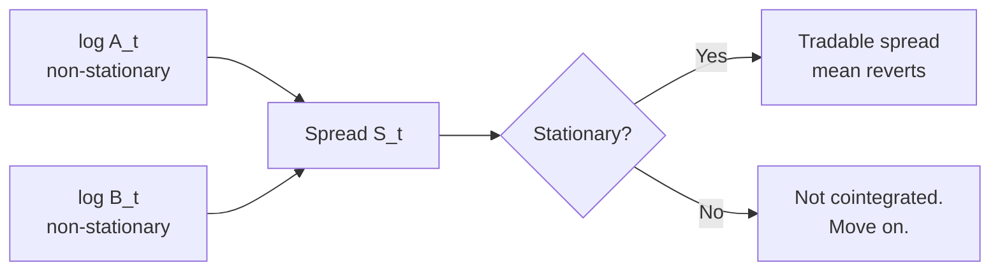

# 2. Cointegration & pairs trading

!!! abstract "Where this chapter fits"
    **Feeds in from:** [§1 — what stat arb is](01-introduction.md) (the framing); [§0.3 — source tiering](00-charter-and-sources.md#03-source-collection-method) (the EG87/J91/AL10 citations).
    **Feeds into:** [§3 OU process](03-ou-process.md) (the closed-form upgrade to §2.5's coarse z-score rule); [§4 execution](04-execution.md) (every "open / close spread" decision goes through the execution router); [§5 risk](05-risk.md) (universe size in §2.8 plugs directly into the effective-$N$ argument in §5.2); [§6 backtesting](06-backtesting.md) (the multiple-testing trap in §2.8 is what §6.5's DSR formally corrects).
    **Code shape:** [Appendix A.2 — pure signal functions](appendix-a-code-shapes.md#a2-pure-signal-functions) and [A.3 — IStrategy](appendix-a-code-shapes.md#a3-istrategy-the-canonical-strategy-interface).

## 2.1 The intuition

Two assets `A` and `B` are **cointegrated** if neither is stationary on its own (both have unit roots — they wander) but a *linear combination* of them is stationary. That linear combination is the spread:

$$ S_t = \log A_t - \beta \log B_t $$

The hedge ratio $\beta$ is whatever makes $S_t$ stationary. If such a $\beta$ exists, then short-`A` / long-`β·B` is a tradable mean-reverting position: when the spread is unusually high, the pair is "too dispersed" and will likely tighten.



## 2.2 Engle-Granger two-step (the canonical test)

Procedure (**EG87**):

1. **Regress** $\log A_t = \alpha + \beta \log B_t + \varepsilon_t$ by OLS. The slope $\beta$ is the hedge ratio.
2. **Test the residuals** $\hat{\varepsilon}_t$ for stationarity using an Augmented Dickey-Fuller (ADF) test. The ADF null is "residual has a unit root"; rejecting it (typically at $p < 0.05$) means the residual is stationary, which means $A$ and $B$ are cointegrated.

**Pitfalls.**

- Engle-Granger is **direction-sensitive**: regressing $A$ on $B$ can give a different conclusion than $B$ on $A$ in finite samples. Run both directions; require both to pass for safety. Johansen's test (§2.3) handles this properly.
- The ADF test has **low power** in finite samples — it under-rejects the null, so you'll miss real cointegrations. The KPSS test reverses the null (null = stationary) and is sometimes run alongside.
- **Multiple comparisons.** If you test 1,000 pairs at $p < 0.05$, you expect 50 false positives. Adjust the threshold or use a higher bar like $p < 0.01$.

## 2.3 Johansen's test (multi-variate)

**J91** generalises Engle-Granger to $n$ assets. Fit a vector error-correction model (VECM):

$$ \Delta X_t = \Pi X_{t-1} + \sum_{i=1}^{p-1} \Gamma_i \Delta X_{t-i} + \mu + \varepsilon_t $$

The rank of $\Pi$ is the number of cointegrating relationships. Two tests:

- **Trace test:** null hypothesis that there are at most $r$ cointegrating vectors.
- **Maximum eigenvalue test:** null that there are exactly $r$, alternative is $r+1$.

For pairs trading ($n=2$) Engle-Granger is enough. For basket strategies ($n>2$) use Johansen; it returns *all* cointegrating vectors simultaneously and is direction-independent.

## 2.4 Half-life of mean reversion

A spread is "tradable" only if it reverts fast enough to free capital before opportunity cost eats the trade. Fit the spread to an AR(1):

$$ S_t = c + \rho S_{t-1} + \varepsilon_t $$

The half-life — the expected number of bars until a deviation from the mean halves — is:

$$ \text{half-life} = \frac{\ln 2}{-\ln \rho} $$

**Practical thresholds:**

- Half-life **< 1 bar** — probably noise or microstructure artifact; skip.
- Half-life **1–20 bars** on your trading frequency — sweet spot for stat arb.
- Half-life **20–200 bars** — tradable but capital-intensive; need careful sizing.
- Half-life **> 200 bars** — too slow; the cointegration may be statistically real but economically dead. Skip.

(Numbers are rule-of-thumb; tune per universe.)

## 2.5 Z-score entry/exit

The simplest trading rule: open when the spread is $k$ standard deviations from its mean, close when it crosses zero.

$$ z_t = \frac{S_t - \mu}{\sigma} $$

Where $\mu$ and $\sigma$ are estimated over a rolling window (often 60–250 bars on daily data).

- Enter short-spread when $z_t > k_{\text{enter}}$ (e.g. $+2$).
- Enter long-spread when $z_t < -k_{\text{enter}}$ (e.g. $-2$).
- Close on $|z_t| < k_{\text{exit}}$ (e.g. $0.5$).
- Stop out at $|z_t| > k_{\text{stop}}$ (e.g. $4$) — if reversion fails, regime probably broke.

The Bertram (**B10**) result (covered in [§3](03-ou-process.md#34-bertrams-optimal-thresholds-b10)) gives an *optimal* entry/exit pair given the OU parameters. Plain z-score thresholds are a coarse approximation.

## 2.6 Code shape

```typescript
// signal/cointegration.ts (pure, no I/O)

export interface CointegrationResult {
  beta: number;          // hedge ratio
  alpha: number;         // intercept
  adfStatistic: number;
  pValue: number;
  halfLifeBars: number;  // ln(2) / -ln(rho) from residual AR(1)
}

export function engleGranger(
  logA: readonly number[],
  logB: readonly number[],
): CointegrationResult {
  // 1. OLS regress logA on logB
  // 2. ADF test on residuals
  // 3. Fit AR(1) to residuals, compute half-life
  // ...
}

// strategy/pairs-trading.strategy.ts (composes the signal)

export class PairsTradingStrategy implements IStrategy {
  onBar(bar: BarEvent, ctx: StrategyContext): Order[] {
    const spread = ctx.history.logA.map((a, i) => a - this.beta * ctx.history.logB[i]);
    const z = zScore(spread, this.windowBars);
    if (z > this.kEnter && !ctx.portfolio.hasOpen(this.pairId)) {
      return [shortSpread(this.pairId, this.notional)];
    }
    // ...
  }
}
```

Key shape notes:

- **`signal/` is pure.** No `Date`, no `process.env`, no DB. Inputs are arrays of numbers; output is a value object. This is what makes it testable with golden vectors (§6.3 in [STAT_ARB_PLAN.md](../../../docs/STAT_ARB_PLAN.md); the pattern is [Appendix A.2](appendix-a-code-shapes.md#a2-pure-signal-functions)).
- **`strategy/` consumes signals.** It owns the parameters (`beta`, `kEnter`, `windowBars`) but delegates the math. Same interface as every other strategy — see [Appendix A.3](appendix-a-code-shapes.md#a3-istrategy-the-canonical-strategy-interface).
- **No venue-aware code anywhere in here.** That's `execution/` ([§4](04-execution.md)).

## 2.7 When pairs trading breaks

| Symptom | Likely cause | Mitigation |
|---|---|---|
| Cointegration p-value drifts $p < 0.05 \to p > 0.1$ | Regime change in one of the legs (catalyst, token unlock, listing) | Re-test daily; close pairs that fail two days in a row |
| Half-life doubles | Mean-reversion speed decaying | Re-estimate; close if half-life crosses a kill threshold |
| Realised P&L diverges from backtest | Slippage model too optimistic, or universe-filtering changed | Audit execution (§4.4); compare realised slippage to model |
| Multiple pairs lose simultaneously | Common-factor exposure leaked in | Add factor neutralisation (industry / market β) |

## 2.8 Universe construction — from infinite candidate pairs to a tractable book

The §2.2–§2.5 machinery tells you *whether two specific series are cointegrated*. It says nothing about *which pairs to test*. That second problem is the bigger one operationally, and it's where most retail pairs-trading efforts quietly die.

The combinatorics are unforgiving. With $K$ candidate assets, the unordered pair count is $\binom{K}{2} = K(K-1)/2$. For the global top-150 crypto assets by liquidity, that's 11,175 candidate pairs. Test each at the standard $p < 0.05$ Engle-Granger threshold and you'll find $\approx 559$ "cointegrated" pairs **by chance alone** — the textbook multiple-testing trap. If your decision rule is "trade the 50 most cointegrated", roughly half of them are spurious before you've placed a single order.

So the operational question becomes: how do you narrow 11,000+ candidates to a few hundred *plausibly meaningful* candidates before you ever run the formal test? The buyside answer, repeated across textbooks (**AL10**) and practitioner threads, is a **funnel** — a sequence of cheap filters that each kill a layer of obvious junk:

| Stage | Filter | What it removes | Typical reduction |
|---|---|---|---|
| 1 | **Liquidity floor.** 30-day median quote volume above a fixed USD threshold (e.g. $5M/day for crypto) on both legs. | Illiquid tails where execution slippage will eat any edge regardless of cointegration. | 150 → 80 assets |
| 2 | **Sector / category bucketing.** Only pair within a defined family — L1s with L1s, DEX tokens with DEX tokens, USD stablecoins with USD stablecoins. Cross-family pairs occasionally cointegrate, but the cointegration is usually a transient macro effect with no fundamental tether — i.e. the relationship has no reason to *re-form* if it breaks. | The $\approx 80\%$ of candidate pairs that have no economic reason to track each other. | $\binom{80}{2} = 3,160$ → ~400 within-bucket pairs |
| 3 | **Correlation pre-filter.** Discard pairs whose 90-day rolling Pearson correlation on log-returns is below a floor (e.g. $\rho < 0.6$). High correlation is *necessary but not sufficient* for cointegration, and it's far cheaper to compute. | Pairs that don't move together at all. | 400 → ~120 |
| 4 | **Cointegration test.** Engle-Granger on the survivors. Apply a stricter $p < 0.01$ threshold than the textbook $p < 0.05$ because you're testing 120+ pairs; under Bonferroni adjustment $p < 0.05 / 120 \approx p < 0.0004$ if you want full familywise control, but $p < 0.01$ is a defensible practitioner compromise. | The pairs that pass-by-chance under multiple testing. | 120 → ~25 |
| 5 | **Half-life filter.** Drop pairs whose half-life falls outside the tradeable range from [§2.4](#24-half-life-of-mean-reversion) *on your bar size* — under 1 bar is microstructure noise; over 200 bars is economically dead. The 1–20-bar sweet spot is preferred; 20–200 is tradeable but capital-intensive and should be sized down. | Pairs that are statistically cointegrated but economically dead, or microstructure-noise hits. | 25 → ~15 |
| 6 | **Capacity check.** For each remaining pair, simulate $X notional through the order book at a defined slippage budget. Drop pairs where even the smaller-leg's spread plus depth makes the round-trip uneconomic at your target trade size. | Pairs that work on paper but won't survive the second-cheapest taker bot. | 15 → ~8–10 |

The book you end up trading is **single-digit pairs**, not hundreds. That's the operationally honest number — and it's roughly consistent with what published equities stat-arb desks report running (**AL10** describes O(100) pairs across the *entire US equities universe*, which is two orders of magnitude larger than crypto).

The multiple-testing problem deserves explicit treatment because it's the most common way a backtest looks brilliant in-sample and dies the moment it's flipped on. If you tested 11,175 pairs at $p < 0.05$ and reported "we found 559 cointegrated pairs!", you didn't find any edge — you found random noise. Three honest corrections:

1. **Bonferroni** divides the per-test threshold by the number of tests. Strictest; over-conservative when tests aren't independent (and most of yours aren't, because correlation pre-filters cluster the candidate set).
2. **Benjamini-Hochberg / False Discovery Rate.** Controls *expected fraction of false discoveries* rather than familywise error rate. Less aggressive than Bonferroni, defensible for stat arb. Implementations: `statsmodels.stats.multitest.multipletests(p_values, method='fdr_bh')`.
3. **Cross-validation on a held-out window.** Re-run the cointegration test on a fresh time window after the candidate set is selected. Pairs that pass in both windows are far less likely to be spurious. The cost is sample efficiency — you've now used half your data for selection rather than estimation.

!!! note "Practitioner note (from RohOnChain archive — Fundamental Law thread)"
    Roan's "50 weak signals" framing ([archive](_archive/roan-fundamental-law-active-mgmt-2026-05-26.md); cross-referenced in [Appendix C Q7](appendix-c-practitioner-lore.md#q7-how-many-independent-signals-does-my-book-actually-have)) is directly relevant here. A book of 20 cointegrated pairs in the *same* sector / family is not 20 independent bets — it's closer to 2–3 independent bets, because the pairs share regime exposure. Diversifying *across signal families* (mean-reversion + funding-carry + microstructure) raises the *effective* $N$ in the Fundamental Law of Active Management ($\text{IR} = \text{IC} \cdot \sqrt{N_{\text{eff}}}$ — see [§5.2](05-risk.md#52-per-strategy-fractional-kelly-with-shrinkage) and Grinold & Kahn 1995/1999) far more than adding more pairs within one family does. **Concrete implication for crypto stat arb:** don't build a book of 30 L1/L1 pairs and call it diversified. Build a book of 8 L1/L1 pairs, 4 DEX/DEX pairs, 4 funding-carry positions, and 2 basis trades, and trade them all at smaller size.

The full citation chain: Engle-Granger (**EG87**) gives the cointegration test; Avellaneda & Lee (**AL10**) gives the modern sector-bucketing operational lore; Clarke, de Silva & Thorley (2002) — *Portfolio constraints and the fundamental law of active management* — gives the effective-$N$ correction that the RohOnChain thread operationalises.

## 2.9 Spread-staleness diagnostics — knowing when a cointegrated pair has broken

A cointegrating relationship is an *empirical* observation, not a causal one. Two tokens that have moved together for 18 months may stop moving together tomorrow, and there's no theorem that warns you in advance. The operational machinery is therefore continuous re-testing plus a set of "the pair has gone stale" diagnostics that fire *before* you take the catastrophic loss that the stop-out would otherwise eat.

Four diagnostics, in order of how often they fire and how decisive each one is:

**1. Rolling p-value drift.** The single load-bearing check. Re-run the Engle-Granger test daily on a rolling 90-day or 180-day window. Plot the p-value over time. A healthy cointegrated pair shows p-values consistently under your threshold — say, in the $[0.001, 0.02]$ band. A breaking pair shows the p-value drifting upward over weeks: $0.01 \to 0.03 \to 0.07 \to 0.15$. **Decision rule:** close the position the moment the rolling p-value crosses your threshold for two consecutive days. One day might be noise; two days isn't.

**2. Half-life decay.** Re-fit the AR(1) on the residual every week and recompute the half-life. A breaking pair often shows the half-life *lengthening* before the p-value finally crosses the cointegration threshold — the spread is still mean-reverting, but more slowly, which is a precursor to it stopping. **Decision rule:** if the half-life doubles from its initial fit (e.g. 5 bars → 10 bars), tighten your z-score entry threshold; if it triples, close existing positions and stop entering until it recovers.

**3. Correlation collapse.** Compute the rolling 30-day Pearson correlation on log-returns of the two legs. Healthy cointegrated pairs sit above $\rho = 0.7$; a collapse to $\rho < 0.4$ in a 30-day window is almost always a precursor to cointegration failure within the next month. Correlation collapse is *faster-moving* than the rolling p-value — useful as an early warning even when the cointegration test still passes.

**4. Regime-change catalysts.** External events that *cause* cointegration to break. For crypto specifically:

| Catalyst | What it does | Pre-trade defense |
|---|---|---|
| **Token unlock event** | Sudden supply expansion on one leg shifts its price floor; the spread re-anchors and never returns to the old mean. | Maintain a calendar of unlock events for every leg in the book; close positions before a major unlock. |
| **New venue listing** | Liquidity shifts; the asset's price-discovery venue changes; old correlations break. | Same — track listing announcements; pause the pair around the listing date. |
| **Regulatory action** | One leg gets named in an enforcement action; the other doesn't. The "named" leg sells off; the spread re-anchors. | Hardest to predict. Best defense is the rolling p-value check above. |
| **Governance vote / protocol upgrade** | A DeFi protocol upgrade can change tokenomics enough to break a cointegration. | Track governance forums for legs in your book; size down around major vote dates. |
| **Stablecoin de-pegging events** | If one leg is denominated in or correlated with a stablecoin that de-pegs, the relationship breaks in seconds. | Cap exposure per stablecoin denomination. Don't run >30% of the book against any single stablecoin. |

!!! note "Practitioner note (from RohOnChain archive — Markov Hedge Fund Method)"
    Roan's regime-detection framework ([archive](_archive/roan-markov-hedge-fund-method-2026-05-26.md); cross-referenced in [Appendix C Q2](appendix-c-practitioner-lore.md#q2-why-is-the-persistence-diagonal-of-the-transition-matrix-the-most-useful-single-number-on-it)) gives a fifth diagnostic that's stronger than any of the four above: fit a Markov regime model on each *leg* individually (Bull/Sideways/Bear via a 20-day rolling-return label) and watch the transition matrices' persistence diagonals. When one leg's persistence diagonal collapses — e.g. its "stay in current regime" probability drops from 90% to 65% over a few weeks — the leg is becoming choppier *independently* of the pair's spread behavior, which is a leading indicator that a cointegration break is being driven by a regime change in just one side of the trade. Operationalised: re-fit the per-leg Markov chains weekly; if either leg's diagonal drops by >15 percentage points from its rolling baseline, close the pair regardless of what the spread is doing. Maps to Hamilton (1989) on regime-switching models.

The discipline that ties all four diagnostics together: **the kill switch fires on the *first* diagnostic to trip, not the third.** It's tempting to wait for all four to agree, on the grounds that any one might be a false positive. In practice the diagnostics that fire late are slower and the diagnostics that fire early are more decisive — by the time the rolling p-value has crossed for two days, you've often given back two weeks of profit waiting for "confirmation."

## 2.10 Citations

- **EG87**: Engle, R. F., & Granger, C. W. J. (1987). *Co-integration and error correction: representation, estimation, and testing.* Econometrica, 55(2), 251–276.
- **J91**: Johansen, S. (1991). *Estimation and hypothesis testing of cointegration vectors in Gaussian vector autoregressive models.* Econometrica, 59(6), 1551–1580.
- **AL10**: Avellaneda, M., & Lee, J.-H. (2010). *Statistical arbitrage in the U.S. equities market.* Quantitative Finance, 10(7), 761–782.
- **H89**: Hamilton, J. D. (1989). *A new approach to the economic analysis of nonstationary time series and the business cycle.* Econometrica, 57(2), 357–384. — Markov regime-switching as the formal foundation of the practitioner regime-detection framework cited in §2.9.
- **CST02**: Clarke, R., de Silva, H., & Thorley, S. (2002). *Portfolio constraints and the fundamental law of active management.* Financial Analysts Journal, 58(5), 48–66. — Effective-$N$ correction, cited in §2.8's Practitioner note.
- **BH95**: Benjamini, Y., & Hochberg, Y. (1995). *Controlling the false discovery rate: a practical and powerful approach to multiple testing.* Journal of the Royal Statistical Society B, 57(1), 289–300. — The multiple-testing correction recommended in §2.8.
- **Tier C — RohOnChain archive**: [`_archive/roan-markov-hedge-fund-method-2026-05-26.md`](_archive/roan-markov-hedge-fund-method-2026-05-26.md); [`_archive/roan-fundamental-law-active-mgmt-2026-05-26.md`](_archive/roan-fundamental-law-active-mgmt-2026-05-26.md). Practitioner threads by @RohOnChain, cited alongside Tier-A literature per §0.3's promotion rule.

Open-source reference implementations (URLs pending verification — see [Appendix B](appendix-b-sources.md)): `mlfinlab`, `arbitragelab`, `statsmodels.tsa.stattools.adfuller`, `statsmodels.tsa.vector_ar.vecm`, `statsmodels.stats.multitest.multipletests` (for FDR correction in §2.8).
