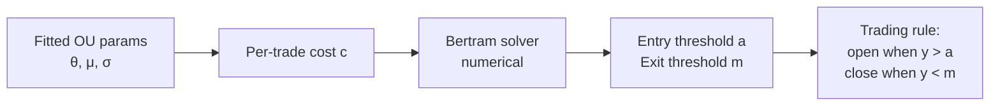

# 3. Ornstein-Uhlenbeck mean reversion

## 3.1 Why OU and not just z-score

Z-score thresholds (§2.5) are the bluntest possible trading rule on a mean-reverting series. They ignore the **speed** of mean reversion and assume static volatility. Modelling the spread as an Ornstein-Uhlenbeck process gives you:

1. A principled estimate of how fast deviations close.
2. **Closed-form optimal entry/exit thresholds** given a transaction cost (Bertram, **B10**).
3. A natural place to put a "mean reversion strength" kill switch.

## 3.2 The OU process

The continuous-time OU SDE:

$$ dX_t = \theta(\mu - X_t)\,dt + \sigma\,dW_t $$

where:

- $X_t$ is the spread at time $t$
- $\mu$ is the long-run mean the spread reverts to
- $\theta$ is the mean-reversion speed (larger $\theta$ = faster reversion)
- $\sigma$ is the diffusion (volatility)
- $W_t$ is standard Brownian motion

The half-life is $\ln(2) / \theta$ (consistent with §2.4 — the AR(1) coefficient $\rho$ is the discrete analogue of $e^{-\theta\,\Delta t}$).

## 3.3 Fitting OU from data

Discretise the SDE by Euler:

$$ X_{t+1} - X_t = \theta(\mu - X_t)\,\Delta t + \sigma \sqrt{\Delta t}\,Z_t $$

Rearranging:

$$ X_{t+1} = (\theta\mu \Delta t) + (1 - \theta\Delta t) X_t + \sigma\sqrt{\Delta t}\,Z_t $$

That's an AR(1) in $X_t$. OLS regression of $X_{t+1}$ on $X_t$ recovers:

- Slope $\beta = 1 - \theta\Delta t$ ⇒ $\theta = (1 - \beta) / \Delta t$
- Intercept $\alpha = \theta\mu\Delta t$ ⇒ $\mu = \alpha / (\theta\Delta t)$
- Residual std ⇒ $\sigma = \text{stderr} / \sqrt{\Delta t}$

In code:

```typescript
// signal/ou.ts
export interface OUParams {
  theta: number;   // mean-reversion speed
  mu: number;      // long-run mean
  sigma: number;   // diffusion
  dt: number;      // bar size in years (or whatever time unit μ is in)
}

export function ouFit(series: readonly number[], dt: number): OUParams {
  // OLS regress series[t+1] on series[t]
  // Recover θ, μ, σ from slope, intercept, residual std
  // ...
}
```

## 3.4 Bertram's optimal thresholds (B10)

Given fitted OU parameters and a per-trade transaction cost $c$ (round-trip, in the same units as the spread), Bertram derives the entry threshold $a$ and exit threshold $m$ that maximise **expected return per unit time**.

The optimisation is over a re-parameterised non-dimensional spread $y_t = (X_t - \mu) / \sigma$ (zero-mean, unit-variance OU). In those units, the optimal pair $(a, m)$ satisfies a transcendental equation that's solved numerically; **B10**'s Table 1 gives explicit solutions for a grid of transaction-cost values.



**Practical shortcut.** For zero transaction cost the optimal entry/exit collapses to: enter at the largest finite threshold (the SDE almost surely hits any level eventually), exit at the mean. Transaction cost is what pushes the optimal thresholds in finite-distance.

## 3.5 OU diagnostics — when the fit lies

OU is a *model*. The data is not actually OU. Two diagnostic checks:

1. **Residual normality.** Plot a Q-Q of residuals against $\mathcal{N}(0, 1)$. Fat tails ⇒ the diffusion is heteroscedastic or jump-driven; Bertram thresholds will be too aggressive. Use a more conservative threshold than the closed-form.
2. **Parameter stability.** Re-fit on rolling windows. If $\theta$ collapses (mean reversion dying) or jumps wildly (regime changing), close positions and stop entering until the fit stabilises.

```typescript
// signal/ou.ts — diagnostic
export function ouStability(
  series: readonly number[],
  dt: number,
  windowBars: number,
  stepBars: number,
): { thetaSeries: number[]; muSeries: number[]; sigmaSeries: number[] } {
  // Rolling OU fits across the series.
  // The returned series are what you eyeball / set kill thresholds on.
}
```

## 3.6 Code shape — full strategy

```typescript
// strategy/ou-reversion.strategy.ts

export class OUReversionStrategy implements IStrategy {
  private params: OUParams | null = null;
  private thresholds: { a: number; m: number } | null = null;

  onBar(bar: BarEvent, ctx: StrategyContext): Order[] {
    // 1. Update the spread series.
    const spread = computeSpread(ctx.history);

    // 2. Periodically re-fit OU + Bertram thresholds.
    if (ctx.bars % this.refitInterval === 0) {
      this.params = ouFit(spread, this.dt);
      if (this.params.theta < this.minTheta) {
        // Mean reversion too weak. Close and pause.
        return ctx.portfolio.openPositionsFor(this.pairId).map(closeOrder);
      }
      this.thresholds = bertramThresholds(this.params, this.txCost);
    }

    if (!this.params || !this.thresholds) return [];

    const y = (spread[spread.length - 1] - this.params.mu) / this.params.sigma;

    if (y > this.thresholds.a && !ctx.portfolio.hasOpen(this.pairId)) {
      return [shortSpread(this.pairId, this.notional)];
    }
    if (ctx.portfolio.hasOpen(this.pairId) && Math.abs(y) < this.thresholds.m) {
      return [closeSpread(this.pairId)];
    }
    return [];
  }
}
```

Notes:

- **Re-fit cadence matters.** Re-fitting every bar is overfitting noise into the parameters. Re-fitting weekly on daily bars is reasonable; tune per strategy.
- **`minTheta` is your kill switch.** When fitted $\theta$ drops below a floor, the mean reversion isn't strong enough to overcome transaction costs. Close and wait.
- **`bertramThresholds` reads B10's table or solves the transcendental equation numerically.** A lookup table for typical $(c, \theta, \sigma)$ regions is faster and accurate enough.

## 3.7 Citations

- **B10**: Bertram, W. K. (2010). *Analytic solutions for optimal statistical arbitrage trading.* Physica A: Statistical Mechanics and its Applications, 389(11), 2234–2243.
- OU process textbook treatment: **Uhlenbeck, G. E., & Ornstein, L. S. (1930).** *On the theory of the Brownian motion.* Physical Review, 36(5), 823.
- The OLS-as-OU-MLE-when-residuals-are-normal result is standard; any time-series textbook (Hamilton 1994, Tsay 2010) covers it.

Open-source: `mlfinlab.ml.optimal_mean_reverting.ornstein_uhlenbeck` (URL pending verification — [Appendix B](appendix-b-sources.md)).
