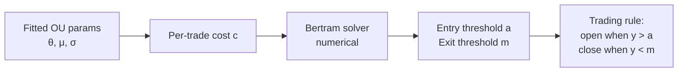

# 3. Ornstein-Uhlenbeck mean reversion

## 3.1 Why OU and not just z-score

Z-score thresholds (§2.5) are the bluntest possible trading rule on a mean-reverting series. They ignore the **speed** of mean reversion and assume static volatility. Modelling the spread as an Ornstein-Uhlenbeck process gives you:

1. A principled estimate of how fast deviations close.
2. **Closed-form optimal entry/exit thresholds** given a transaction cost (Bertram, **B10**).
3. A natural place to put a "mean reversion strength" kill switch.

## 3.2 The OU process

The continuous-time OU SDE:

$$ dX_t = \theta(\mu - X_t)\,dt + \sigma\,dW_t $$

where:

- $X_t$ is the spread at time $t$
- $\mu$ is the long-run mean the spread reverts to
- $\theta$ is the mean-reversion speed (larger $\theta$ = faster reversion)
- $\sigma$ is the diffusion (volatility)
- $W_t$ is standard Brownian motion

The half-life is $\ln(2) / \theta$ (consistent with §2.4 — the AR(1) coefficient $\rho$ is the discrete analogue of $e^{-\theta\,\Delta t}$).

## 3.3 Fitting OU from data

Discretise the SDE by Euler:

$$ X_{t+1} - X_t = \theta(\mu - X_t)\,\Delta t + \sigma \sqrt{\Delta t}\,Z_t $$

Rearranging:

$$ X_{t+1} = (\theta\mu \Delta t) + (1 - \theta\Delta t) X_t + \sigma\sqrt{\Delta t}\,Z_t $$

That's an AR(1) in $X_t$. OLS regression of $X_{t+1}$ on $X_t$ recovers:

- Slope $\beta = 1 - \theta\Delta t$ ⇒ $\theta = (1 - \beta) / \Delta t$
- Intercept $\alpha = \theta\mu\Delta t$ ⇒ $\mu = \alpha / (\theta\Delta t)$
- Residual std ⇒ $\sigma = \text{stderr} / \sqrt{\Delta t}$

In code:

```typescript
// signal/ou.ts
export interface OUParams {
  theta: number;   // mean-reversion speed
  mu: number;      // long-run mean
  sigma: number;   // diffusion
  dt: number;      // bar size in years (or whatever time unit μ is in)
}

export function ouFit(series: readonly number[], dt: number): OUParams {
  // OLS regress series[t+1] on series[t]
  // Recover θ, μ, σ from slope, intercept, residual std
  // ...
}
```

## 3.4 Bertram's optimal thresholds (B10)

Given fitted OU parameters and a per-trade transaction cost $c$ (round-trip, in the same units as the spread), Bertram derives the entry threshold $a$ and exit threshold $m$ that maximise **expected return per unit time**.

The optimisation is over a re-parameterised non-dimensional spread $y_t = (X_t - \mu) / \sigma$ (zero-mean, unit-variance OU). In those units, the optimal pair $(a, m)$ satisfies a transcendental equation that's solved numerically; **B10**'s Table 1 gives explicit solutions for a grid of transaction-cost values.



**Practical shortcut.** For zero transaction cost the optimal entry/exit collapses to: enter at the largest finite threshold (the SDE almost surely hits any level eventually), exit at the mean. Transaction cost is what pushes the optimal thresholds in finite-distance.

## 3.5 OU diagnostics — when the fit lies

OU is a *model*. The data is not actually OU. Two diagnostic checks:

1. **Residual normality.** Plot a Q-Q of residuals against $\mathcal{N}(0, 1)$. Fat tails ⇒ the diffusion is heteroscedastic or jump-driven; Bertram thresholds will be too aggressive. Use a more conservative threshold than the closed-form.
2. **Parameter stability.** Re-fit on rolling windows. If $\theta$ collapses (mean reversion dying) or jumps wildly (regime changing), close positions and stop entering until the fit stabilises.

```typescript
// signal/ou.ts — diagnostic
export function ouStability(
  series: readonly number[],
  dt: number,
  windowBars: number,
  stepBars: number,
): { thetaSeries: number[]; muSeries: number[]; sigmaSeries: number[] } {
  // Rolling OU fits across the series.
  // The returned series are what you eyeball / set kill thresholds on.
}
```

## 3.6 Reading the OU fit — diagnostics in practice

§3.5 listed the two diagnostic checks (residual normality, parameter stability). This section is the operational expansion — what the parameters actually *look like* in healthy and unhealthy regimes, when to refit, when to *not* refit, and how to spot a regime change in the parameters before the strategy's P&L tells you about it the hard way.

**What healthy $\theta$ looks like.** A pair that's genuinely mean-reverting on your trading frequency produces a fitted $\theta$ that's roughly stable across rolling re-fits. "Roughly stable" means the rolling-window estimate stays within $\pm 25\%$ of its long-run median for months at a time. The half-life $\ln(2)/\theta$ is the more interpretable form — for a pair with median half-life of 6 bars, expect the rolling estimate to wobble between 4.5 and 7.5 bars under normal market noise. Anything outside that band, sustained for more than a week, is signal not noise.

**What unhealthy $\theta$ looks like.** Three failure patterns, distinguishable by their time signature:

1. **Slow collapse.** $\theta$ drifts down (half-life drifts up) over weeks. The pair was cointegrated; it's becoming less so. This is the most common failure and the one §2.9's rolling p-value check catches first. By the time $\theta$ has halved, the cointegration test has usually already failed.
2. **Sudden break.** $\theta$ drops 50%+ in a single re-fit. Usually a regime catalyst (token unlock, listing event, regulatory action). The pre-break window's parameters are no longer a model of the post-break window — discard the old fit entirely and re-baseline if you re-enter.
3. **Wild oscillation.** $\theta$ swings wildly between re-fits with no underlying drift. Usually means your re-fit window is too short for the half-life — you're fitting noise. Lengthen the window or accept that the pair is below your tradeability floor.

The fourth case looks like a failure but isn't: $\theta$ becomes very large (half-life drops below one bar). This is microstructure noise leaking into your fit — the AR(1) is picking up bid-ask bounce or quote-update jitter rather than genuine mean reversion. **Detection:** fit on bar-close prices versus bid-ask midpoints; if $\theta$ differs significantly between the two, microstructure noise is your culprit. **Fix:** use mid-prices, lengthen the bar size, or apply a small smoothing kernel before the fit.

**When to refit and when not to.** The naive answer is "refit every bar"; that's wrong because you'll overfit your $\theta$ to the most recent ten bars and end up with a strategy whose parameters whiplash with the market. The opposite extreme — refit once at strategy launch and never again — fails the moment $\theta$ drifts. The Goldilocks rule, drawn from **AL10** (Avellaneda & Lee's PCA-window choice for equities residuals) and consistent with practitioner usage:

- **Refit cadence ≈ half-life × 4 to 8.** If your fitted half-life is 6 bars, refit every 24–48 bars. The intuition: you want at least a few mean-reversion cycles to inform the next fit, but not so many that you've missed a regime change.
- **Force a refit on any z-score that exceeds your stop-out threshold.** If $|z| > k_{\text{stop}}$ (e.g. $|z| > 4$ from §2.5), the mean has likely moved. Don't keep trading on the old $\mu$.
- **Skip the refit if the new window covers a known regime catalyst.** A token unlock, a major listing, an ETF flow event — the data point exists but it's not representative of the steady-state OU dynamics. Either drop those days from the fit window or wait until the catalyst is fully digested before refitting.

**How to spot a regime change in the parameters before P&L catches it.** The single most useful operational diagnostic is plotting all three rolling parameters — $\theta$, $\mu$, $\sigma$ — side by side over time. A genuine regime change touches all three: $\theta$ usually drops (slower reversion), $\mu$ moves to a new level (the spread is anchored differently), and $\sigma$ either expands (the spread is noisier) or contracts (the legs are moving together more, often a precursor to the cointegration becoming meaningless rather than stronger). When all three move together, that's the change. When only $\sigma$ moves but $\theta$ and $\mu$ are stable, that's typically a volatility event, not a regime change — your sizing should react but the strategy can keep running.

**The kill switch in operational terms.** From §3.7's code: `minTheta` is a floor below which the strategy refuses to enter new positions. How to pick the floor? Two anchors:

1. **Transaction-cost anchor.** Bertram (**B10**) gives the optimal entry threshold $a$ as a function of $(\theta, \sigma, c)$. There exists a $\theta_{\min}$ below which the optimal $a$ exceeds the spread's empirical range — i.e. you'd be waiting for a level the spread never reaches. That's the hard floor: $\theta < \theta_{\min}$ means even a perfectly-timed Bertram entry won't be profitable.
2. **Capacity-time anchor.** If your strategy needs to free $X capital every $T days to satisfy a portfolio-level constraint, $\theta_{\min} = \ln(2) / (T/k)$ for some $k$ (typically 2–3, so half-lives fit twice into the capacity window).

Pick the more conservative of the two. For typical crypto pairs trading on 5-minute bars, this lands in the $\theta_{\min} \in [0.05, 0.15]$ per-bar range, corresponding to half-lives of 5–14 bars (≈ 25–70 minutes of clock time).

!!! note "Practitioner note (from RohOnChain archive — Markov Hedge Fund Method)"
    Roan's framework ([archive](_archive/roan-markov-hedge-fund-method-2026-05-26.md)) treats the OU process as one of several mean-reversion-detection mechanisms and pairs it with an explicit Markov regime overlay. Three operational refinements he emphasises that map cleanly into the OU diagnostic stack above:

    - **Use the signed signal `bull_prob − bear_prob` from a regime matrix as a *gate* on OU entries.** When the regime signal contradicts the OU signal (regime says bear-trending, OU says short-the-spread which is implicitly a mean-reversion bet *against* the trend), stand down rather than fight the regime.
    - **Sort HMM latent states by mean return before reading them.** If you upgrade from observable-state regimes to a Gaussian HMM (per **R89** Rabiner 1989) to catch the regime change earlier, the latent states come out in a random order — relabel them by ascending mean daily return so Bear = 0, Bull = 2, regardless of the random seed.
    - **Fit multiple seeds.** Baum-Welch (the HMM training algorithm) finds local maxima, not global. For production, fit five-to-ten random seeds and keep the best by log-likelihood. The HMM-extension caveat is in Roan's framework verbatim and Rabiner (1989, §III.C) flags the same issue.

    The composition pattern in Roan's framework is documented in [`_archive/roan-markov-hedge-fund-method-2026-05-26.md` §C](_archive/roan-markov-hedge-fund-method-2026-05-26.md) — the regime detector emits a JSON contract with `signal`, `current_regime`, and `stationary_distribution`, and your OU strategy consumes those fields as a confirmation layer, sizing filter, or veto.

## 3.7 Code shape — full strategy

```typescript
// strategy/ou-reversion.strategy.ts

export class OUReversionStrategy implements IStrategy {
  private params: OUParams | null = null;
  private thresholds: { a: number; m: number } | null = null;

  onBar(bar: BarEvent, ctx: StrategyContext): Order[] {
    // 1. Update the spread series.
    const spread = computeSpread(ctx.history);

    // 2. Periodically re-fit OU + Bertram thresholds.
    if (ctx.bars % this.refitInterval === 0) {
      this.params = ouFit(spread, this.dt);
      if (this.params.theta < this.minTheta) {
        // Mean reversion too weak. Close and pause.
        return ctx.portfolio.openPositionsFor(this.pairId).map(closeOrder);
      }
      this.thresholds = bertramThresholds(this.params, this.txCost);
    }

    if (!this.params || !this.thresholds) return [];

    const y = (spread[spread.length - 1] - this.params.mu) / this.params.sigma;

    if (y > this.thresholds.a && !ctx.portfolio.hasOpen(this.pairId)) {
      return [shortSpread(this.pairId, this.notional)];
    }
    if (ctx.portfolio.hasOpen(this.pairId) && Math.abs(y) < this.thresholds.m) {
      return [closeSpread(this.pairId)];
    }
    return [];
  }
}
```

Notes:

- **Re-fit cadence matters.** Re-fitting every bar is overfitting noise into the parameters. Re-fitting weekly on daily bars is reasonable; tune per strategy.
- **`minTheta` is your kill switch.** When fitted $\theta$ drops below a floor, the mean reversion isn't strong enough to overcome transaction costs. Close and wait.
- **`bertramThresholds` reads B10's table or solves the transcendental equation numerically.** A lookup table for typical $(c, \theta, \sigma)$ regions is faster and accurate enough.

## 3.8 Citations

- **B10**: Bertram, W. K. (2010). *Analytic solutions for optimal statistical arbitrage trading.* Physica A: Statistical Mechanics and its Applications, 389(11), 2234–2243.
- OU process textbook treatment: **Uhlenbeck, G. E., & Ornstein, L. S. (1930).** *On the theory of the Brownian motion.* Physical Review, 36(5), 823.
- The OLS-as-OU-MLE-when-residuals-are-normal result is standard; any time-series textbook (Hamilton 1994, Tsay 2010) covers it.
- **H89**: Hamilton, J. D. (1989). *A new approach to the economic analysis of nonstationary time series and the business cycle.* Econometrica, 57(2), 357–384. — Markov regime-switching as the formal underpinning of the practitioner regime overlay cited in §3.6.
- **R89**: Rabiner, L. R. (1989). *A tutorial on hidden Markov models and selected applications in speech recognition.* Proceedings of the IEEE, 77(2), 257–286. — Canonical HMM reference; §III.C flags the Baum-Welch local-maxima issue that the practitioner archive operationalises with multi-seed fitting.
- **Tier C — RohOnChain archive**: [`_archive/roan-markov-hedge-fund-method-2026-05-26.md`](_archive/roan-markov-hedge-fund-method-2026-05-26.md). Practitioner regime-overlay framework, cited in §3.6's Practitioner note.

Open-source: `mlfinlab.ml.optimal_mean_reverting.ornstein_uhlenbeck` (URL pending verification — [Appendix B](appendix-b-sources.md)); `hmmlearn` (PyPI) for the HMM upgrade path.
