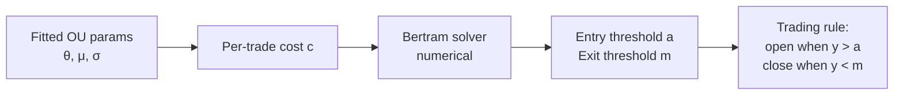

# 3. Ornstein-Uhlenbeck mean reversion

!!! abstract "Where this chapter fits"
    **Feeds in from:** [§2 cointegration](02-cointegration.md) — every OU fit in this chapter is fitted to a *spread*, and §2 is how you found a spread worth fitting. [§2.5](02-cointegration.md#25-z-score-entryexit) specifically: this chapter is the principled upgrade to the z-score thresholds in §2.5.
    **Feeds into:** [§4 execution](04-execution.md) (Bertram thresholds emit the "open / close spread" decisions that the execution router consumes; the entry-passive / exit-aggressive asymmetry in [§4.6](04-execution.md#46-passive-vs-aggressive-entryexit-the-asymmetry) is what makes Bertram's thresholds achievable in practice); [§5.5](05-risk.md#55-circuit-breakers) (the `minTheta` kill switch is the cointegration-decay circuit breaker).
    **Code shape:** [Appendix A.2 — pure signal functions](appendix-a-code-shapes.md#a2-pure-signal-functions) (the OU fit is a pure function); [A.7 — deterministic clock](appendix-a-code-shapes.md#a7-the-deterministic-clock-pattern) (the refit-cadence logic).

## 3.1 Why OU and not just z-score

The z-score thresholds in [§2.5](02-cointegration.md#25-z-score-entryexit) are the bluntest possible trading rule on a mean-reverting series. They have two specific limitations that the OU framework fixes:

1. **They ignore the speed of mean reversion.** A z-score rule says "enter at $|z| > 2$, exit at $|z| < 0.5$" regardless of whether the spread reverts in 5 bars or 50. A spread that reverts fast should have a smaller entry threshold (the round-trip is cheap; capture small deviations) and a slower spread should have a larger entry threshold (capital lock-up is expensive; only enter on big deviations).
2. **They ignore transaction cost.** With zero cost, the optimal entry is at any non-trivial threshold and the optimal exit is at the mean. With cost, the optimal entry is *further* from the mean (to compensate for the fee) and the optimal exit is *short* of the mean (to avoid the cost of waiting for the last tick). The right thresholds depend jointly on the reversion speed, the volatility, and the cost.

Modelling the spread as an Ornstein-Uhlenbeck (OU) process gives you three things the z-score rule can't:

1. A principled estimate of *how fast* deviations close — the parameter $\theta$, which has a clean interpretation as the rate of mean reversion.
2. **Closed-form optimal entry/exit thresholds** given a per-trade transaction cost — Bertram's result (**B10**, §3.4 below).
3. A natural place to put a "mean reversion strength" kill switch — the $\theta$-floor that fires when fitted mean-reversion speed drops below the level at which the strategy can pay its fees (§3.6).

The OU process is also the *standard* model for mean-reverting financial spreads. Avellaneda & Lee (2010) base their modern stat-arb formulation on OU residuals; Bertram (2010) derives closed-form thresholds in the OU framework; most mature stat-arb implementations (e.g. `mlfinlab.ml.optimal_mean_reverting.ornstein_uhlenbeck`) work in OU coordinates. If you read a stat-arb paper from the last fifteen years and it doesn't mention OU explicitly, it almost certainly uses something equivalent.

## 3.2 The OU process

The continuous-time OU stochastic differential equation (SDE):

$$ dX_t = \theta(\mu - X_t)\,dt + \sigma\,dW_t $$

where:

- $X_t$ is the spread at time $t$. (Continuous time here; in practice you'll observe it on a bar grid.)
- $\mu$ is the long-run mean — the value the spread reverts to in expectation.
- $\theta$ is the mean-reversion speed (larger $\theta$ = faster reversion). Has units of inverse time.
- $\sigma$ is the diffusion (volatility) — the per-unit-time standard deviation of the noise driving the process.
- $W_t$ is a standard Brownian motion (Wiener process) — the source of randomness.

**Reading the SDE.** Each term is a separate physical effect:

- $\theta(\mu - X_t)\,dt$ is the *drift* term. If the spread is currently below its long-run mean ($X_t < \mu$), this term is positive — pushing the spread up. If above, this term is negative — pushing the spread down. The magnitude is proportional to the distance from the mean, multiplied by $\theta$. This is what makes the process mean-reverting: deviations get an automatic "kick" back toward $\mu$ that's stronger the further away you are.
- $\sigma\,dW_t$ is the *diffusion* term. Random noise, with variance $\sigma^2 \, dt$ per increment of time. This is what keeps the spread from sitting motionless at $\mu$ — the random walks knock it around, and the drift term tries to pull it back.

The interplay between these two terms is what produces the characteristic OU shape: the spread bounces around $\mu$, occasionally drifting wide, but always being pulled back. The strength of the pull (controlled by $\theta$) and the size of the noise (controlled by $\sigma$) determine *how* it bounces.

**Stationary distribution.** Given enough time, the OU process settles into a stationary normal distribution:

$$ X_\infty \sim \mathcal{N}\!\left(\mu, \frac{\sigma^2}{2\theta}\right) $$

The mean is $\mu$ (as expected), and the long-run variance is $\sigma^2 / (2\theta)$. Notice that *larger $\theta$ shrinks the variance*: a faster-reverting spread bounces in a tighter band around its mean. This is the formal version of the intuition that "fast mean reversion compresses the spread."

**Half-life.** The expected time for a deviation to halve is $\ln(2) / \theta$. This is consistent with [§2.4](02-cointegration.md#24-half-life-of-mean-reversion) — the AR(1) coefficient $\rho$ is the discrete analogue of $e^{-\theta\,\Delta t}$, and the half-life formulas line up: $\ln 2 / (-\ln \rho) \approx \ln 2 / (\theta \Delta t \cdot \frac{1}{\Delta t}) = \ln 2 / \theta$ in the limit of small $\Delta t$.

**Why OU and not some richer model?** Because (a) it has closed-form solutions for almost everything you'd want — the stationary distribution above, the transition density, Bertram's optimal thresholds — and (b) the parameters $(\theta, \mu, \sigma)$ each have interpretable economic meaning. A richer model (e.g. stochastic volatility, jumps, mean-reverting volatility) might fit the data better but its parameters are less interpretable, its kill-switch logic is less obvious, and the closed-form Bertram result no longer applies. The conservative practitioner sticks with OU and uses diagnostics (§3.6) to detect when OU is an inadequate model.

## 3.3 Fitting OU from data

You don't observe the continuous-time SDE; you observe a discrete time series of spread values $X_0, X_1, X_2, \ldots$ on a bar grid with spacing $\Delta t$. To fit the OU parameters, the standard approach is to discretise the SDE and fit the resulting AR(1) model by OLS.

**The discretisation.** Using Euler's method on the SDE:

$$ X_{t+1} - X_t = \theta(\mu - X_t)\,\Delta t + \sigma \sqrt{\Delta t}\,Z_t $$

where $Z_t \sim \mathcal{N}(0, 1)$ is standard normal noise (because the increment of Brownian motion over an interval of length $\Delta t$ has variance $\Delta t$ and is normally distributed).

Rearrange to isolate $X_{t+1}$ on the LHS:

$$ X_{t+1} = (\theta\mu \Delta t) + (1 - \theta\Delta t) X_t + \sigma\sqrt{\Delta t}\,Z_t $$

That's an AR(1) in $X_t$. The OLS regression of $X_{t+1}$ on $X_t$ recovers three numbers — slope, intercept, residual standard deviation — and a small piece of algebra inverts them back to $(\theta, \mu, \sigma)$:

- **Slope** $\beta_{\text{OLS}} = 1 - \theta\Delta t$, so $\theta = (1 - \beta_{\text{OLS}}) / \Delta t$.
- **Intercept** $\alpha_{\text{OLS}} = \theta\mu\Delta t$, so $\mu = \alpha_{\text{OLS}} / (\theta\Delta t)$.
- **Residual standard deviation** $s_\varepsilon = \sigma\sqrt{\Delta t}$, so $\sigma = s_\varepsilon / \sqrt{\Delta t}$.

**A worked numerical example.** Suppose you fit on 5-minute bars (so $\Delta t = 5/60/24/365 \approx 9.5 \times 10^{-6}$ years) and the OLS regression returns slope $0.97$, intercept $0.0003$, residual std $0.008$. Then:

- $\theta = (1 - 0.97) / 9.5 \times 10^{-6} \approx 3,158$ per year. Yes, the units are large — but in *per-bar* terms, $\theta \Delta t = 0.03$, which means each bar the spread reverts about 3% of the way to the mean.
- $\mu = 0.0003 / (3{,}158 \times 9.5 \times 10^{-6}) \approx 0.010$. The long-run mean of the spread is about $0.010$ (in whatever units the spread is in — typically log price).
- $\sigma = 0.008 / \sqrt{9.5 \times 10^{-6}} \approx 2.59$ per square-root-year.
- Half-life: $\ln 2 / 3{,}158 \approx 2.2 \times 10^{-4}$ years, or about 1.9 hours — about 23 bars on this 5-minute frequency. Inside the tradeable range.

**Watch the units.** This is the single biggest source of bugs in OU-fitting code. The choice of $\Delta t$ (years? days? bars?) propagates through $\theta$, $\sigma$, and the half-life formula. The conservative pattern is to *always* compute in one canonical unit (typically years) and convert at the boundary when you need bars or hours for interpretability. The Bertram thresholds in §3.4 are dimensionless (they work on a re-parameterised $y_t = (X_t - \mu)/\sigma$) so unit choices don't affect the resulting trading rules, but they do affect the readability of the fitted parameters.

In code:

```typescript
// signal/ou.ts
export interface OUParams {
  theta: number;   // mean-reversion speed (per unit of dt)
  mu: number;      // long-run mean
  sigma: number;   // diffusion (per square-root-unit-of-dt)
  dt: number;      // bar size in years (or whatever time unit μ is in)
}

export function ouFit(series: readonly number[], dt: number): OUParams {
  // OLS regress series[t+1] on series[t]
  // Recover θ, μ, σ from slope, intercept, residual std
  // ...
}
```

**MLE vs OLS.** OLS is the conventional fit and it's the *maximum likelihood estimator* when the residuals are normally distributed, which is the OU model's own assumption. If the residuals are demonstrably non-normal (heavy tails, skew), more sophisticated estimators (e.g. quasi-MLE with a heavy-tailed residual distribution) can do better. In practice OLS on the residuals plus the §3.5 diagnostic checks is sufficient — the conservative response to non-normal residuals is to widen the entry threshold rather than to switch estimators.

## 3.4 Bertram's optimal thresholds (B10)

Given a fitted OU process and a per-trade transaction cost $c$ (round-trip, in the same units as the spread), Bertram (2010) derives the entry threshold $a$ and exit threshold $m$ that **maximise expected return per unit time**. This is the principled upgrade to the heuristic z-score rule in §2.5.

The result is most easily stated in non-dimensional coordinates. Re-parameterise the spread by its long-run mean and stationary standard deviation:

$$ y_t = \frac{X_t - \mu}{\sigma / \sqrt{2\theta}} $$

In these coordinates, the spread is a zero-mean unit-variance OU process. The optimal pair $(a, m)$ of *entry* and *exit* thresholds (in the dimensionless $y$ units) satisfies a transcendental equation that's solved numerically. Bertram's **Table 1** gives explicit numerical solutions for a grid of transaction-cost values; in production code you either solve the equation directly with a 1D root-finder or interpolate from a precomputed table.

The mathematical structure of the result is worth understanding even if you never derive it. The expected return per unit time of a "trade once and close once" cycle is the *expected profit per cycle* divided by the *expected cycle duration*. Both quantities can be computed in closed form for the OU process — the expected profit is essentially the threshold-to-mean distance times the position size, minus cost; the expected cycle duration is the sum of "time from mean to threshold" (a first-passage time, calculable via Itō calculus) plus "time from threshold back to exit level" (also a first-passage time). The optimisation is a 2D unconstrained max over $(a, m)$; the first-order conditions give a system whose solution is the transcendental equation that Bertram tabulates.



**Reading the result.** A few observations on what the Bertram thresholds actually look like:

- **Zero transaction cost.** With $c = 0$, the optimal entry is at *any positive threshold* (since the SDE almost surely hits any finite level eventually, and the profit per cycle grows with the threshold) and the optimal exit is at the mean ($m = 0$ in $y$-coordinates). Transaction cost is what creates a finite optimal threshold.
- **Small transaction cost.** For typical crypto stat-arb fees ($\sim 5{-}20$ bps round-trip), the optimal entry threshold in $y$ units is somewhere between $0.5$ and $1.5$ — i.e. less than one stationary standard deviation. This is *smaller* than the "$z = 2$" heuristic in §2.5, because Bertram is optimising for *return per unit time*, not *return per trade*, and smaller thresholds mean faster cycles.
- **Large transaction cost.** As $c$ grows, both thresholds move outward — you need a bigger initial deviation to overcome the cost, and you exit further from the mean to avoid the cost of waiting for the last few ticks.
- **Asymmetry.** The optimal $a$ and $m$ are not symmetric. The entry threshold is typically larger in magnitude than the exit threshold's distance from the mean — you wait for a meaningful signal, then close on the first reasonable revert.

**A worked numerical example.** Suppose Bertram's table tells you that for $c / \sigma_{\text{stat}} = 0.1$ (10% of the stationary standard deviation as round-trip cost), the optimal thresholds are $a = 0.95$ and $m = 0.15$ in $y$ units. Converted back to spread units, with $\mu = 0$ and stationary std $\sigma_{\text{stat}} = \sigma / \sqrt{2\theta}$, the entry triggers at $|X_t| = 0.95 \, \sigma_{\text{stat}}$ and the exit at $|X_t| = 0.15 \, \sigma_{\text{stat}}$. In z-score terms (using the same $\sigma_{\text{stat}}$ as the z-score normaliser) those are $z = 0.95$ and $z = 0.15$ — *much smaller* than the "$z = 2$ / $z = 0.5$" heuristic. The reason is that Bertram is optimising for return per unit time and small thresholds with fast cycles dominate large thresholds with slow cycles, given typical reversion speeds.

**Practical shortcut.** For zero transaction cost the optimal entry/exit collapses to: enter at the largest finite threshold (the SDE almost surely hits any level eventually), exit at the mean. Transaction cost is what pushes the optimal thresholds to finite distances. For realistic costs you almost always solve numerically.

## 3.5 OU diagnostics — when the fit lies

OU is a *model*. The data is not actually OU. Two diagnostic checks let you decide whether OU is an adequate model:

1. **Residual normality.** Plot a Q-Q of the AR(1) residuals against $\mathcal{N}(0, 1)$. If the residuals lie close to the 45-degree line, the OU assumption is roughly valid. Fat tails — a Q-Q curve that bends upward at both ends — mean the diffusion is heteroscedastic (volatility itself varies over time) or jump-driven (occasional large moves). Either failure mode means Bertram thresholds derived under the OU model are *too aggressive*: they assume the spread bounces in a Gaussian band when it actually has heavy tails, so the implied risk per trade is understated. Mitigation: widen the entry threshold to compensate, or upgrade to a heavier-tailed residual distribution.
2. **Parameter stability.** Re-fit the OU parameters on rolling windows and plot $\theta$, $\mu$, $\sigma$ over time. A genuinely OU process produces stable parameters with normal sampling noise around the true values. A drifting $\theta$ or jumping $\mu$ means the underlying process is non-stationary — i.e. the OU assumption is wrong, at least over the window you're fitting. Mitigation: shorter fit windows (so each window covers a quasi-stationary regime), more frequent re-fitting, or a switch to a regime-switching model (Hamilton 1989) that allows the parameters to depend on a hidden regime variable.

```typescript
// signal/ou.ts — diagnostic
export function ouStability(
  series: readonly number[],
  dt: number,
  windowBars: number,
  stepBars: number,
): { thetaSeries: number[]; muSeries: number[]; sigmaSeries: number[] } {
  // Rolling OU fits across the series.
  // The returned series are what you eyeball / set kill thresholds on.
}
```

The diagnostics matter operationally because Bertram thresholds inherit the OU assumption: if the data isn't OU, the thresholds optimise the wrong objective, and *you won't notice from the resulting trade log alone* — the strategy will look like it's making money during a benign period and lose unexpectedly during a regime change. The defensive posture is to *visually* inspect the rolling parameters and the residual Q-Q at least once a week, even when the strategy is running cleanly.

## 3.6 Reading the OU fit — diagnostics in practice

§3.5 listed the two diagnostic checks (residual normality, parameter stability). This section is the operational expansion — what the parameters actually *look like* in healthy and unhealthy regimes, when to refit, when to *not* refit, and how to spot a regime change in the parameters before the strategy's P&L tells you about it the hard way.

**What healthy $\theta$ looks like.** A pair that's genuinely mean-reverting on your trading frequency produces a fitted $\theta$ that's roughly stable across rolling re-fits. "Roughly stable" means the rolling-window estimate stays within $\pm 25\%$ of its long-run median for months at a time. The half-life $\ln(2)/\theta$ is the more interpretable form — for a pair with median half-life of 6 bars, expect the rolling estimate to wobble between 4.5 and 7.5 bars under normal market noise. Anything outside that band, sustained for more than a week, is signal not noise.

**What unhealthy $\theta$ looks like.** Three failure patterns, distinguishable by their time signature:

1. **Slow collapse.** $\theta$ drifts down (half-life drifts up) over weeks. The pair was cointegrated; it's becoming less so. This is the most common failure and the one §2.9's rolling p-value check catches first. By the time $\theta$ has halved, the cointegration test has usually already failed.
2. **Sudden break.** $\theta$ drops 50%+ in a single re-fit. Usually a regime catalyst (token unlock, listing event, regulatory action). The pre-break window's parameters are no longer a model of the post-break window — discard the old fit entirely and re-baseline if you re-enter.
3. **Wild oscillation.** $\theta$ swings wildly between re-fits with no underlying drift. Usually means your re-fit window is too short for the half-life — you're fitting noise. Lengthen the window or accept that the pair is below your tradeability floor.

The fourth case looks like a failure but isn't: $\theta$ becomes very large (half-life drops below one bar). This is microstructure noise leaking into your fit — the AR(1) is picking up bid-ask bounce or quote-update jitter rather than genuine mean reversion. **Detection:** fit on bar-close prices versus bid-ask midpoints; if $\theta$ differs significantly between the two, microstructure noise is your culprit. **Fix:** use mid-prices, lengthen the bar size, or apply a small smoothing kernel before the fit.

**When to refit and when not to.** The naive answer is "refit every bar"; that's wrong because you'll overfit your $\theta$ to the most recent ten bars and end up with a strategy whose parameters whiplash with the market. The opposite extreme — refit once at strategy launch and never again — fails the moment $\theta$ drifts. The Goldilocks rule, drawn from **AL10** (Avellaneda & Lee's PCA-window choice for equities residuals) and consistent with practitioner usage:

- **Refit cadence ≈ half-life × 4 to 8.** If your fitted half-life is 6 bars, refit every 24–48 bars. The intuition: you want at least a few mean-reversion cycles to inform the next fit, but not so many that you've missed a regime change.
- **Force a refit on any z-score that exceeds your stop-out threshold.** If $|z| > k_{\text{stop}}$ (e.g. $|z| > 4$ from [§2.5](02-cointegration.md#25-z-score-entryexit)), the mean has likely moved. Don't keep trading on the old $\mu$.
- **Skip the refit if the new window covers a known regime catalyst.** A token unlock, a major listing, an ETF flow event — the data point exists but it's not representative of the steady-state OU dynamics. Either drop those days from the fit window or wait until the catalyst is fully digested before refitting.

**How to spot a regime change in the parameters before P&L catches it.** The single most useful operational diagnostic is plotting all three rolling parameters — $\theta$, $\mu$, $\sigma$ — side by side over time. A genuine regime change touches all three: $\theta$ usually drops (slower reversion), $\mu$ moves to a new level (the spread is anchored differently), and $\sigma$ either expands (the spread is noisier) or contracts (the legs are moving together more, often a precursor to the cointegration becoming meaningless rather than stronger). When all three move together, that's the change. When only $\sigma$ moves but $\theta$ and $\mu$ are stable, that's typically a volatility event, not a regime change — your sizing should react but the strategy can keep running.

**The kill switch in operational terms.** From [§3.7](#37-code-shape-full-strategy)'s code: `minTheta` is a floor below which the strategy refuses to enter new positions. How to pick the floor? Two anchors:

1. **Transaction-cost anchor.** Bertram (**B10**) gives the optimal entry threshold $a$ as a function of $(\theta, \sigma, c)$. There exists a $\theta_{\min}$ below which the optimal $a$ exceeds the spread's empirical range — i.e. you'd be waiting for a level the spread never reaches. That's the hard floor: $\theta < \theta_{\min}$ means even a perfectly-timed Bertram entry won't be profitable.
2. **Capacity-time anchor.** If your strategy needs to free $X capital every $T days to satisfy a portfolio-level constraint, $\theta_{\min} = \ln(2) / (T/k)$ for some $k$ (typically 2–3, so half-lives fit twice into the capacity window).

Pick the more conservative of the two. For typical crypto pairs trading on 5-minute bars, this lands in the $\theta_{\min} \in [0.05, 0.15]$ per-bar range, corresponding to half-lives of 5–14 bars (≈ 25–70 minutes of clock time).

!!! note "Practitioner note (from RohOnChain archive — Markov Hedge Fund Method)"
    Roan's framework ([archive](_archive/roan-markov-hedge-fund-method-2026-05-26.md)) treats the OU process as one of several mean-reversion-detection mechanisms and pairs it with an explicit Markov regime overlay. Three operational refinements he emphasises that map cleanly into the OU diagnostic stack above:

    - **Use the signed signal `bull_prob − bear_prob` from a regime matrix as a *gate* on OU entries.** When the regime signal contradicts the OU signal (regime says bear-trending, OU says short-the-spread which is implicitly a mean-reversion bet *against* the trend), stand down rather than fight the regime.
    - **Sort HMM latent states by mean return before reading them.** If you upgrade from observable-state regimes to a Gaussian HMM (per **R89** Rabiner 1989) to catch the regime change earlier, the latent states come out in a random order — relabel them by ascending mean daily return so Bear = 0, Bull = 2, regardless of the random seed.
    - **Fit multiple seeds.** Baum-Welch (the HMM training algorithm) finds local maxima, not global. For production, fit five-to-ten random seeds and keep the best by log-likelihood. The HMM-extension caveat is in Roan's framework verbatim and Rabiner (1989, §III.C) flags the same issue.

    The composition pattern in Roan's framework is documented in [`_archive/roan-markov-hedge-fund-method-2026-05-26.md` §C](_archive/roan-markov-hedge-fund-method-2026-05-26.md) — the regime detector emits a JSON contract with `signal`, `current_regime`, and `stationary_distribution`, and your OU strategy consumes those fields as a confirmation layer, sizing filter, or veto.

## 3.7 Code shape — full strategy

```typescript
// strategy/ou-reversion.strategy.ts

export class OUReversionStrategy implements IStrategy {
  private params: OUParams | null = null;
  private thresholds: { a: number; m: number } | null = null;

  onBar(bar: BarEvent, ctx: StrategyContext): Order[] {
    // 1. Update the spread series.
    const spread = computeSpread(ctx.history);

    // 2. Periodically re-fit OU + Bertram thresholds.
    if (ctx.bars % this.refitInterval === 0) {
      this.params = ouFit(spread, this.dt);
      if (this.params.theta < this.minTheta) {
        // Mean reversion too weak. Close and pause.
        return ctx.portfolio.openPositionsFor(this.pairId).map(closeOrder);
      }
      this.thresholds = bertramThresholds(this.params, this.txCost);
    }

    if (!this.params || !this.thresholds) return [];

    const y = (spread[spread.length - 1] - this.params.mu) / this.params.sigma;

    if (y > this.thresholds.a && !ctx.portfolio.hasOpen(this.pairId)) {
      return [shortSpread(this.pairId, this.notional)];
    }
    if (ctx.portfolio.hasOpen(this.pairId) && Math.abs(y) < this.thresholds.m) {
      return [closeSpread(this.pairId)];
    }
    return [];
  }
}
```

Notes:

- **Re-fit cadence matters.** Re-fitting every bar is overfitting noise into the parameters. Re-fitting weekly on daily bars is reasonable; tune per strategy.
- **`minTheta` is your kill switch.** When fitted $\theta$ drops below a floor, the mean reversion isn't strong enough to overcome transaction costs. Close and wait.
- **`bertramThresholds` reads B10's table or solves the transcendental equation numerically.** A lookup table for typical $(c, \theta, \sigma)$ regions is faster and accurate enough.

## 3.8 Citations

- **B10**: Bertram, W. K. (2010). *Analytic solutions for optimal statistical arbitrage trading.* Physica A: Statistical Mechanics and its Applications, 389(11), 2234–2243.
- OU process textbook treatment: **Uhlenbeck, G. E., & Ornstein, L. S. (1930).** *On the theory of the Brownian motion.* Physical Review, 36(5), 823.
- The OLS-as-OU-MLE-when-residuals-are-normal result is standard; any time-series textbook (Hamilton 1994, Tsay 2010) covers it.
- **H89**: Hamilton, J. D. (1989). *A new approach to the economic analysis of nonstationary time series and the business cycle.* Econometrica, 57(2), 357–384. — Markov regime-switching as the formal underpinning of the practitioner regime overlay cited in §3.6.
- **R89**: Rabiner, L. R. (1989). *A tutorial on hidden Markov models and selected applications in speech recognition.* Proceedings of the IEEE, 77(2), 257–286. — Canonical HMM reference; §III.C flags the Baum-Welch local-maxima issue that the practitioner archive operationalises with multi-seed fitting.
- **Tier C — RohOnChain archive**: [`_archive/roan-markov-hedge-fund-method-2026-05-26.md`](_archive/roan-markov-hedge-fund-method-2026-05-26.md). Practitioner regime-overlay framework, cited in §3.6's Practitioner note.

Open-source: `mlfinlab.ml.optimal_mean_reverting.ornstein_uhlenbeck` (URL pending verification — [Appendix B](appendix-b-sources.md)); `hmmlearn` (PyPI) for the HMM upgrade path.
