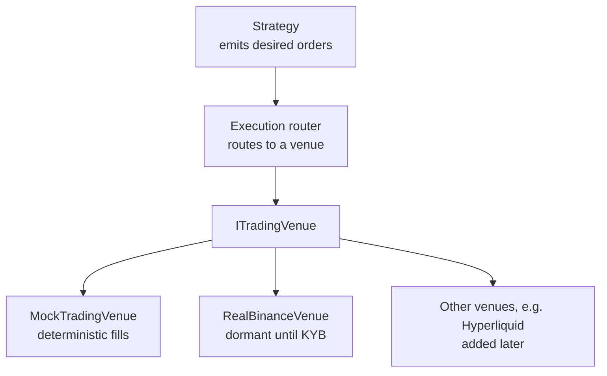

# 4. Execution & venue abstraction

## 4.1 The execution layer is the same one Phase 1 uses

The codebase already has the swap-seam shape we need. [Phase 0](../../../docs/SESSION_HISTORY.md) ships `IYieldProvider`; [Phase 1](../../../prompts/PHASE_1_PROMPT.md) adds `IHedgeVenue`. Phase 3 stat-arb adds `ITradingVenue`. Same posture: interface + mock-default + dormant real, factory-selected by env flag.



## 4.2 The interface

```typescript
// execution/trading-venue.interface.ts
export const TRADING_VENUE = Symbol('TRADING_VENUE');

export interface PlaceOrderRequest {
  symbol: string;            // e.g. 'BTC/USDT'
  side: 'buy' | 'sell';
  sizeUnits: bigint;         // 6-decimal asset units
  type: 'market' | 'limit';
  limitPriceMicros?: bigint; // ILS/USD micros for FX; for crypto, USDC micros
  idempotencyKey: string;
}

export interface OrderResult {
  externalRef: string;
  filledSizeUnits: bigint;
  avgFillPriceMicros: bigint;
  feeUnits: bigint;
}

export interface ITradingVenue {
  readonly venueId: string;
  place(req: PlaceOrderRequest): Promise<OrderResult>;
  cancel(externalRef: string): Promise<void>;
  fetchPosition(symbol: string): Promise<{ sizeUnits: bigint; avgPriceMicros: bigint }>;
  fetchBalance(): Promise<{ availableUnits: bigint }>;
}
```

Mirrors `IHedgeVenue`'s shape (`venueId`, idempotency-key replay safety, bigint-only quantities). Errors mirror `HedgeVenueNotConfiguredError` / `HedgeVenueUnhealthyError`.

## 4.3 Order types — the minimum useful set

For pairs trading and OU strategies you can get a long way with:

- **Market orders.** Always fill, but at unknown price. Use for time-critical exits (stop-out).
- **Marketable limit orders.** Limit price at or through the touch — usually fills immediately, but caps your slippage. Default for entries.
- **Post-only limit orders.** Refuse to take liquidity. Earn maker rebates. Use for non-urgent entries when spread is wide enough.

Anything beyond these (icebergs, TWAP, VWAP) is execution-research territory and probably premature for the first year of stat arb.

## 4.4 The cost model is what makes the backtest honest

Three nested fidelity levels (echoing [STAT_ARB_PLAN.md §6](../../../docs/STAT_ARB_PLAN.md)):

### Level 1 — constant taker fee, zero slippage

```typescript
const fee = (notionalUnits * BigInt(takerBps)) / 10000n;
const fillPrice = midPrice; // pretend you got the mid
```

Useful only for first-pass sanity. Strategies that don't survive a 10bps round-trip at zero slippage are dead; this is the cheapest filter.

### Level 2 — constant fee + linear-in-size slippage

```typescript
const slippageBps = baseBps + (notionalUnits / avgDailyVolume) * impactBps;
```

Adequate for low-frequency strategies (daily-bar pairs trading). Tune `baseBps` and `impactBps` per venue from realised vs expected fills on small live runs.

### Level 3 — order-book reconstruction

Replay the actual book at each bar. Walk the levels to fill the requested size. Honest, expensive in data, **required** for high-frequency strategies and cross-venue arb where the spread *is* the strategy. Not required for the §2/§3 strategies in this course.

## 4.5 Execution router

The router's job is one of three behaviours:

1. **Single-venue.** Route every order to one venue. Default for v1.
2. **Best-execution.** Quote the size across venues; route to the best fill price net of fees.
3. **Split.** Slice the order across venues to limit any one venue's impact.

```typescript
// execution/router.ts
export class ExecutionRouter {
  constructor(private readonly venues: ITradingVenue[]) {}
  async place(req: PlaceOrderRequest): Promise<OrderResult> {
    if (this.venues.length === 1) return this.venues[0].place(req);
    // best-execution or split logic here
    // ...
  }
}
```

Best-execution and split are deferred — they pay off only when you actually have multiple venues live. Build single-venue first, add multi-venue when the second venue is provisioned.

## 4.6 Idempotency, replays, partial fills

Three failure modes the venue layer has to handle:

1. **Network blip mid-place.** You don't know if the order landed. Send the same idempotency key on retry; venue dedups. (Most exchanges support `clientOrderId` for this — confirm per venue.)
2. **Partial fill, then disconnect.** Reconnect, fetch by `clientOrderId`, reconcile fills.
3. **Replay after restart.** On process restart, load open `clientOrderId`s from the DB and re-fetch their state from the venue. Do not assume "we know" any order state from memory alone.

The append-only ledger pattern from `treasury_movements` (write-on-confirmation, never UPDATE / DELETE) carries over: a new `prop_movements` table records every confirmed fill, with `(venue, idempotency_key)` UNIQUE for replay safety.

## 4.7 Code shape — the dormant real venue

Exactly the same posture as `RealOndoYieldProvider` and `RealHyperliquidHedgeVenue`:

```typescript
@Injectable()
export class RealBinanceTradingVenue implements ITradingVenue {
  readonly venueId = 'binance';
  async place(_req: PlaceOrderRequest): Promise<OrderResult> {
    throw new TradingVenueNotConfiguredError(this.venueId);
  }
  // ... all methods throw until KYB closes
}
```

The wire-up (real REST + WS handlers) only happens **after** legal formation ([PHASED_PLAN.md §Phase 2](../../../PHASED_PLAN.md)) and venue KYB. Engineering does not flip the mock-default flag.

## 4.8 Citations

- The interface-and-mock-default pattern is internal to this codebase (see [CLAUDE.md §7](../../../CLAUDE.md) "Mock-default discipline").
- Slippage modelling: **Almgren, R., & Chriss, N. (2001).** *Optimal execution of portfolio transactions.* Journal of Risk, 3, 5–40. The square-root market impact model.
- Order-book reconstruction: standard data vendors (Kaiko, Tardis, Polygon) provide L2 / L3 books; the replay machinery is custom per use case.
