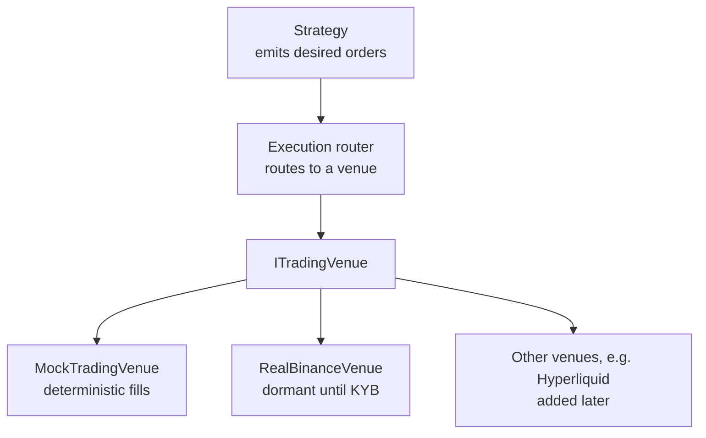

# 4. Execution & venue abstraction

!!! abstract "Where this chapter fits"
    **Feeds in from:** [§2 cointegration](02-cointegration.md) and [§3 OU process](03-ou-process.md) — every order vetted by this layer originates in those two chapters' signal/strategy code. [§3.4](03-ou-process.md#34-bertrams-optimal-thresholds-b10)'s Bertram thresholds and [§2.5](02-cointegration.md#25-z-score-entryexit)'s z-score thresholds define *when* to trade; this chapter defines *how*.
    **Feeds into:** [§5 risk](05-risk.md) (the execution router is downstream of the risk layer — see [§5.7](05-risk.md#57-code-shape-how-risk-wires-in) for the wiring); [§6.4](06-backtesting.md#64-calibrating-the-fee-slippage-model-the-audit-loop) (the fee/slippage model is *defined* here and *calibrated* in §6.4); [§7.2](07-production.md#72-the-minimum-capital-phase-making-sure-the-friction-is-right) (min-capital phase is the calibration loop for these models against live fills).
    **Code shape:** [Appendix A.1 — swap-seam](appendix-a-code-shapes.md#a1-the-swap-seam-pattern-interface-mock-default-dormant-real), [A.4 — append-only ledger](appendix-a-code-shapes.md#a4-append-only-ledger-recap-from-treasury_movements), [A.8 — factory selector](appendix-a-code-shapes.md#a8-the-factory-selector).

## 4.1 Market microstructure — the absolute minimum

Before we discuss order types, fees, and venue abstractions, a brief grounding in the market microstructure vocabulary the rest of the chapter uses without re-introducing. If you already know what a limit-order book, a maker, and a taker are, skip to §4.2.

**The limit-order book (LOB).** Every modern electronic exchange — every centralised crypto exchange, every perp DEX, every equity exchange — runs on essentially the same data structure: a *limit-order book*. The book is two sorted lists of orders:

- The **bid** side: buy orders, sorted descending by price. The highest bid is the *best bid* — the most anyone is currently willing to pay.
- The **ask** side: sell orders, sorted ascending by price. The lowest ask is the *best ask* — the least anyone is currently willing to accept.

The gap between the best bid and the best ask is the *spread* (a confusingly-named term; in this chapter "spread" means *bid-ask spread* unless otherwise specified — distinct from the stat-arb *spread* in §2). The midpoint of the best bid and best ask is the *mid price* and is the conventional reference price for the asset at any given instant.

**Makers and takers.** When a new order enters the book, one of two things can happen:

- If the order is a **limit order** at a price that doesn't immediately match anything in the book — e.g. a buy limit at $99 when the best ask is $100 — the order *rests on the book*, adding to the bid side. The trader who placed the order is called a *maker* because they have added liquidity.
- If the order is at a price that matches a resting order — e.g. a buy limit at $100 when the best ask is $100, or a *market* order which has no price limit — the order *crosses the book* and matches against the resting liquidity. The trader who placed the order is called a *taker* because they have removed liquidity.

Every venue has a fee schedule that distinguishes maker from taker. The pattern, almost universally:

- **Takers pay a fee.** Typically 2 to 10 basis points (bps; 1 bp = 0.01%) on top-tier centralised exchanges, sometimes more on smaller venues. The fee is usually charged in the quote currency.
- **Makers either pay a smaller fee or earn a rebate.** "Rebate" means the exchange pays *you* for resting orders, on the theory that resting orders make the book deeper and more attractive to other traders. Top-tier CEX rebates are typically -1 to -2 bps; high-volume tiers on some venues go to -5 or -10 bps.

The maker/taker fee differential is the load-bearing concept for everything in §4.5 (entry-passive / exit-aggressive). If you only ever take liquidity, you pay the full taker fee on every round-trip; if you can place entries as makers and only take on exits, you cut your fee bill by 30–50%.

**Slippage and market impact.** When you place a market order — or any order large enough to consume more than one level of the book — you don't get filled at the best bid or best ask. You get filled at a *weighted average* of the prices on the levels you consumed:

1. The first units fill at the best price.
2. Once that level is exhausted, the next units fill at the second-best price.
3. And so on, until your order is fully filled.

The difference between the price you expected to fill at (typically the mid, or the best bid/ask) and the price you actually filled at is *slippage*. Slippage has two distinct components:

- **Spread cost.** Even for an infinitesimally small market order, you cross the spread — you buy at the ask and sell at the bid, paying half the spread relative to the mid in each direction. For a top-of-book trader on a deep market this is a few basis points.
- **Market impact.** For larger orders, you walk through multiple levels and pay progressively worse prices. This is impact. It grows roughly proportionally to order size for small sizes (linear regime) and faster than linearly for large sizes (square-root regime; see Almgren-Chriss).

**Order types.** Every venue offers some subset of:

- **Market order.** Buy or sell *now*, at whatever prices the book offers. Always fills (if the book has liquidity), but at unknown price. Use when you need to be done immediately.
- **Limit order.** Buy or sell at a specified price or better. Rests on the book if not immediately matched. Use when you can wait for your price.
- **Marketable limit order.** A limit order placed *at or through the touch* — i.e. a buy limit at or above the best ask, or a sell limit at or below the best bid. Usually fills immediately like a market order, but caps your worst-case slippage at the limit price. The defensive default for entries.
- **Post-only limit order.** A limit order that refuses to take liquidity. If the order would cross the spread when placed, the venue cancels it instead of executing it. Guarantees maker status. Use when you can't tolerate paying the taker fee.

These four order types are sufficient for everything in this chapter. Real exchanges offer dozens more (icebergs, TWAP, VWAP, stop-limit, trailing-stop, etc.) but those are execution-research territory and probably premature until your basic strategy is profitable.

**Latency.** The time between when you decide to place an order and when the order is matched on the venue. For a colocated low-latency strategy this is microseconds; for a strategy running off your laptop, it's hundreds of milliseconds. Most retail and small-fund stat-arb strategies live in the "tens to hundreds of milliseconds" regime, which is fine for daily and intraday strategies but inadequate for sub-second strategies (where the book has moved by the time your order arrives). The order types and the cost models in this chapter are all calibrated for the "tens to hundreds of ms" regime; if you ever need sub-second execution, the whole architecture changes.

## 4.2 The execution layer's job

The execution layer sits between the strategy (which says "I want to sell 100 ETH and buy $200,000 of BTC") and the venue (which has a specific API and a specific order-book state). Its responsibilities:

1. **Order placement.** Translate a logical "open spread" decision into the right concrete order types on the right venues with the right idempotency keys.
2. **Fill tracking.** Watch fills come back, reconcile partial fills, retry on transient errors.
3. **Cost modelling.** Provide a deterministic cost function that the backtest and live runner share, so backtest P&L predicts live P&L.
4. **Venue abstraction.** Hide the venue's API quirks behind a stable interface so the strategy code doesn't change when the venue changes.

This is the same swap-seam shape that the rest of the codebase uses for external dependencies: an interface, a deterministic mock that is the default, and a real implementation that is dormant until configuration flips. The pattern is documented in [Appendix A.1](appendix-a-code-shapes.md#a1-the-swap-seam-pattern-interface-mock-default-dormant-real); the rationale is that the mock is what runs in tests and during shadow-mode operation (§7.1), while the real implementation is only switched on after operational and legal preconditions are met.



## 4.3 The interface

```typescript
// execution/trading-venue.interface.ts
export const TRADING_VENUE = Symbol('TRADING_VENUE');

export interface PlaceOrderRequest {
  symbol: string;            // e.g. 'BTC/USDT'
  side: 'buy' | 'sell';
  sizeUnits: bigint;         // 6-decimal asset units
  type: 'market' | 'limit';
  limitPriceMicros?: bigint; // ILS/USD micros for FX; for crypto, USDC micros
  idempotencyKey: string;
}

export interface OrderResult {
  externalRef: string;
  filledSizeUnits: bigint;
  avgFillPriceMicros: bigint;
  feeUnits: bigint;
}

export interface ITradingVenue {
  readonly venueId: string;
  place(req: PlaceOrderRequest): Promise<OrderResult>;
  cancel(externalRef: string): Promise<void>;
  fetchPosition(symbol: string): Promise<{ sizeUnits: bigint; avgPriceMicros: bigint }>;
  fetchBalance(): Promise<{ availableUnits: bigint }>;
}
```

A few choices in this interface that look small but matter:

- **`sizeUnits` and `limitPriceMicros` are `bigint`.** All money math is done in integer units rather than floats. This is what prevents floating-point error from accumulating into the ledger. The convention is 6-decimal scaling: $1 unit of USDC = 1{,}000{,}000n bigint units. The same convention applies to prices.
- **`idempotencyKey` is required on every order.** This is what makes the place call safe to retry. If the network blips mid-send and you don't know whether the order landed, you retry with the same key and the venue dedups. The venue's `clientOrderId` field is typically how this is wired (see §4.7).
- **`fetchPosition` and `fetchBalance` are separate calls.** Some venues bundle them; the interface keeps them split so individual specs can mock one without the other.
- **`venueId` is a readonly field on the venue, not a parameter.** The venue knows its own identity. The router uses this to log which venue routed each order.

Errors mirror the pattern used elsewhere: `TradingVenueNotConfiguredError` (real venue without credentials), `TradingVenueUnhealthyError` (transient venue failure), and any specific venue-side error codes surfaced verbatim for diagnosis.

## 4.4 Order types — the minimum useful set

For pairs trading and OU strategies you can get a long way with just three order types:

- **Market orders.** Always fill (assuming sufficient book depth), but at unknown price. Use for time-critical exits and stop-outs where the cost of not getting out is much larger than the cost of paying the spread.
- **Marketable limit orders.** A limit order placed at or through the touch — at or above the best ask for a buy, at or below the best bid for a sell. Usually fills immediately like a market order, but caps your worst-case slippage at the limit price. Default for entries.
- **Post-only limit orders.** Refuse to take liquidity. Earn maker rebates. Use for non-urgent entries when the spread is wide enough that you can afford to wait for your price.

Anything beyond these (icebergs, TWAP, VWAP, stop-limit) is execution-research territory and probably premature for the first year of a stat-arb book. The exception is *cross-margin* features on perp venues — those affect risk and margining, not order routing, and they're covered in §5.

## 4.5 The cost model is what makes the backtest honest

Backtests lie about transaction costs by default. The dominant reason a strategy "works" in a backtest and dies in production is that the backtest assumed too-cheap fills. Building the cost model with appropriate fidelity is the single highest-leverage thing you can do to make backtest P&L predict live P&L.

Three nested fidelity levels:

### Level 1 — constant taker fee, zero slippage

```typescript
const fee = (notionalUnits * BigInt(takerBps)) / 10000n;
const fillPrice = midPrice; // pretend you got the mid
```

Useful only as a first-pass sanity check. Strategies that don't survive a 10bps round-trip at zero slippage are dead; this is the cheapest filter for "the strategy needs a substantially better cost model than zero". Treat a Level-1 backtest result as "is the strategy *capable* of being profitable" — not "is the strategy profitable."

### Level 2 — constant fee + linear-in-size slippage

```typescript
const slippageBps = baseBps + (notionalUnits / avgDailyVolume) * impactBps;
```

The baseline for low-frequency strategies (daily-bar pairs trading and similar). The parameters `baseBps` and `impactBps` are tuned per venue, per liquidity tier, from realised vs expected fills on small live runs. This is the calibration loop documented in [§6.4](06-backtesting.md#64-calibrating-the-fee-slippage-model-the-audit-loop): ship the strategy in shadow mode, log every order's modelled vs actual fill price, fit the parameters to match the realised distribution.

A defensible starting point for parameters, before you've calibrated against live fills:

- `baseBps`: 1–3 bps for top-tier CEX, 5–10 bps for perp DEXs, 10–20 bps for smaller venues. Captures the spread cost on a top-of-book trade plus the venue's typical taker fee.
- `impactBps`: 10–30 bps at 1% of average daily volume (so the linear coefficient is `impactBps / 0.01`). Calibrated by walking a synthetic order through historical L2 snapshots and measuring the realised average fill price as a function of order size.

### Level 3 — order-book reconstruction

Replay the actual book at each bar. Walk the levels to fill the requested size. Honest, but expensive in data (you need L2 / L3 snapshots, which are larger by 2–3 orders of magnitude than OHLCV) and **required** for high-frequency strategies and cross-venue arb where the spread *is* the strategy. Not required for the §2/§3 strategies in this course on daily or 5-minute bars, but worth building eventually as a calibration target — you can validate the Level-2 parameters against Level-3 ground truth for a representative sample of historical orders.

A note about data sources for L2 reconstruction: standard vendors (Kaiko, Tardis, Polygon for equities) provide L2 / L3 books historically; the replay machinery is custom per use case. Storage is the bottleneck: a full year of L2 snapshots on a single instrument can be tens of gigabytes. Most teams sample (every 100ms is plenty for daily strategies) or only collect L2 for the specific instruments in the active book.

## 4.6 Passive vs aggressive entry/exit — the asymmetry

A pattern that holds across pairs trading, OU mean-reversion, and most stat-arb strategies, but rarely shows up in the textbook formulations: **entries should be passive; exits should be aggressive.** The asymmetry comes from the difference in what each side of the trade is *betting on*.

When the spread has just moved to your entry threshold (e.g. $z_t = +2$ on a short-spread setup), you're making a wager on *further* mean-reversion. The current move could continue widening for a few more bars before reverting. You don't lose much by entering at $z = +2.05$ instead of $z = +2.00$ — in fact, if the spread keeps widening, you'd rather have a better entry. **The cost of a slightly-late entry is small; the cost of a slightly-bad fill price is permanent.** Conclusion: place a post-only limit order at or just inside the threshold; let the market come to you. If it doesn't fill, the trade simply doesn't happen, which is a benign outcome — you've avoided a setup that might have been weaker than it looked.

The exit side is mechanically inverted. Once $z_t$ crosses your exit threshold (e.g. $|z_t| < 0.5$ from [§2.5](02-cointegration.md#25-z-score-entryexit)), the trade is *done*. Your edge has fully materialised; any further price action is dilution. The cost of a slightly-late exit *isn't* the small slippage of crossing the spread — it's the **drift back through your exit threshold** before you've gotten out. A spread that reverts to $|z| = 0.3$ and then re-widens to $|z| = 0.8$ has burned half your edge in one bar. **You want out *now*, at any reasonable fill, not at the optimal post-only level you'll never reach.** Conclusion: market or marketable-limit orders on exit. Take liquidity. Pay the spread. The fee differential is dwarfed by the cost of giving the trade back.

The same logic applies to **stop-outs**. A stop-out fires when the spread has moved 4σ against you — the cointegration is plausibly breaking. Hesitating to "save the spread" is the failure mode that turns a 4σ stop into an 8σ disaster. Stop-outs are *always* aggressive: market order, regardless of fee impact, regardless of slippage. The decision to stop has already been made by the time the order fires; the only remaining question is *how fast you can flatten*.

This entry-passive / exit-aggressive asymmetry interacts directly with venue fee structures:

| Order type | Fee impact | Typical use |
|---|---|---|
| **Post-only limit at threshold** | Maker rebate (typically -1 to -2 bps on top-tier CEXs; -5 to -10 bps on Hyperliquid for high-volume tiers). | Entries when spread is at threshold; not in a rush. |
| **Marketable limit just through the touch** | Taker fee (typically +2 to +10 bps depending on venue / tier). | Entries when spread is *deep* past threshold (you're already late; don't delay further). |
| **Market order** | Taker fee + variable slippage walking the book. | Exits, stop-outs, and any time the spread is moving against you faster than your limit can chase. |

For a strategy entering on $|z| = 2$ and exiting on $|z| = 0.5$, the entry side typically captures the maker rebate while the exit pays the taker fee — net fee impact is the *difference*, not the sum. For a top-tier CEX with a -1 bps maker and +5 bps taker on each leg of a 2-leg trade, the round-trip is $(5 - (-1)) \times 2 \text{ legs} = 12$ bps when executed correctly, vs $(5 + 5) \times 2 = 20$ bps if both sides take liquidity. **That's a 40% fee reduction from getting the asymmetry right.** Over a year of high-frequency stat-arb that's the difference between an unprofitable and a marginal strategy.

A common practitioner mistake is to **invert the asymmetry under stress**. When a trade is winning fast, you're tempted to leave a passive limit at the exit threshold to capture an extra basis point. When a trade is losing, you're tempted to wait one more bar to enter the stop. Both of those temptations cost more than they save in expectation. The discipline is mechanical: entries always start as post-only limits and only upgrade to taker on a timeout (e.g. "if not filled within $N$ bars, cancel and reassess — don't chase"); exits always fire as market or marketable-limit orders the bar the exit threshold trips.

One refinement: **chase logic on entries**. If your post-only limit doesn't fill but the spread keeps widening past your threshold, the *better* trade is still available, just at a deeper entry. Re-place the post-only at the new touch — don't anchor on the original threshold. Cap the chase at, say, $|z| = 3$; anything further than that means the regime may be breaking, and you should sit out rather than enter.

The Almgren-Chriss (**AC01**) market-impact model formalises this entire intuition: the linear-in-rate impact term makes urgent execution quadratically more expensive than patient execution, so passive entries are cheap *in expectation* even after accounting for the option of non-fill. The closed-form result is in Almgren & Chriss (2001) §3; the practitioner version is the four-paragraph rule above.

## 4.7 Execution router

The router's job is one of three behaviours:

1. **Single-venue.** Route every order to one venue. Default for v1.
2. **Best-execution.** Quote the size across venues; route to the best fill price net of fees.
3. **Split.** Slice the order across venues to limit any one venue's impact.

```typescript
// execution/router.ts
export class ExecutionRouter {
  constructor(private readonly venues: ITradingVenue[]) {}
  async place(req: PlaceOrderRequest): Promise<OrderResult> {
    if (this.venues.length === 1) return this.venues[0].place(req);
    // best-execution or split logic here
    // ...
  }
}
```

Best-execution and split are deferred — they pay off only when you actually have multiple venues live. Build single-venue first, add multi-venue when the second venue is provisioned. The premature optimisation here is real: a "best-execution" router that picks between two venues that fill identically and one venue that fills 1bp better is doing a great deal of work for no benefit.

## 4.8 Idempotency, replays, partial fills

Three failure modes the venue layer has to handle, in order of likelihood and consequence:

1. **Network blip mid-place.** You sent an order, the network failed, and you don't know whether the order landed. The fix is *idempotency*: send the same `clientOrderId` (or equivalent) on retry; the venue dedups. Most exchanges support this — confirm per venue and verify the dedup window is long enough for your worst-case retry interval (typically a few seconds is plenty; some venues have shorter windows).
2. **Partial fill, then disconnect.** Your order partially filled before the network died. On reconnect, fetch by `clientOrderId`, reconcile the realised fills against your local state, and either let the remainder continue or cancel it depending on the strategy's intent.
3. **Replay after restart.** On process restart, load open `clientOrderId`s from the DB and re-fetch their state from the venue. Do not assume "we know" any order state from memory alone — memory was wiped at restart, and any order whose state was only in memory is now lost. The DB is the source of truth.

The append-only ledger pattern from the rest of the codebase carries over here: a new `prop_movements` table records every confirmed fill, with `(venue, idempotency_key)` UNIQUE for replay safety. Full schema sketch in [Appendix A.4](appendix-a-code-shapes.md#a4-append-only-ledger-recap-from-treasury_movements). The point of the append-only pattern is that the ledger is the *primary record*: rebuilding the strategy's view of the world from the ledger is always possible, and any in-memory state is just a cache.

## 4.9 Code shape — the dormant real venue

The dormant-real pattern: ship the real venue class, but have every method throw `NotConfiguredError` until the appropriate flag is flipped and the credentials are populated. This way the class is exercised by tests (verifying it does throw the right error in the unconfigured state) without ever risking an accidental real-venue API call during development:

```typescript
@Injectable()
export class RealBinanceTradingVenue implements ITradingVenue {
  readonly venueId = 'binance';
  async place(_req: PlaceOrderRequest): Promise<OrderResult> {
    throw new TradingVenueNotConfiguredError(this.venueId);
  }
  // ... all methods throw until KYB closes
}
```

The wire-up (real REST handlers, WebSocket order-update consumers, position-reconciliation logic) only happens after legal formation closes for the operating entity and venue KYB onboarding is complete. The discipline of keeping the real implementation dormant until those preconditions are met — and *not* flipping the flag in a development branch "just to test the wiring" — is what prevents an accidental production order at the wrong moment.

## 4.10 Citations

- **AC01**: Almgren, R., & Chriss, N. (2001). *Optimal execution of portfolio transactions.* Journal of Risk, 3, 5–40. The square-root market impact model. Formal grounding for the entry-passive / exit-aggressive asymmetry in §4.6.
- Order-book reconstruction: standard data vendors (Kaiko, Tardis, Polygon) provide L2 / L3 books; the replay machinery is custom per use case.
- Market microstructure background: **Harris, L. (2003).** *Trading and Exchanges: Market Microstructure for Practitioners.* Oxford University Press. The canonical practitioner reference for the §4.1 vocabulary.
- The interface-and-mock-default pattern is a standard testing pattern; see **Meszaros, G. (2007).** *xUnit Test Patterns.* Addison-Wesley.
