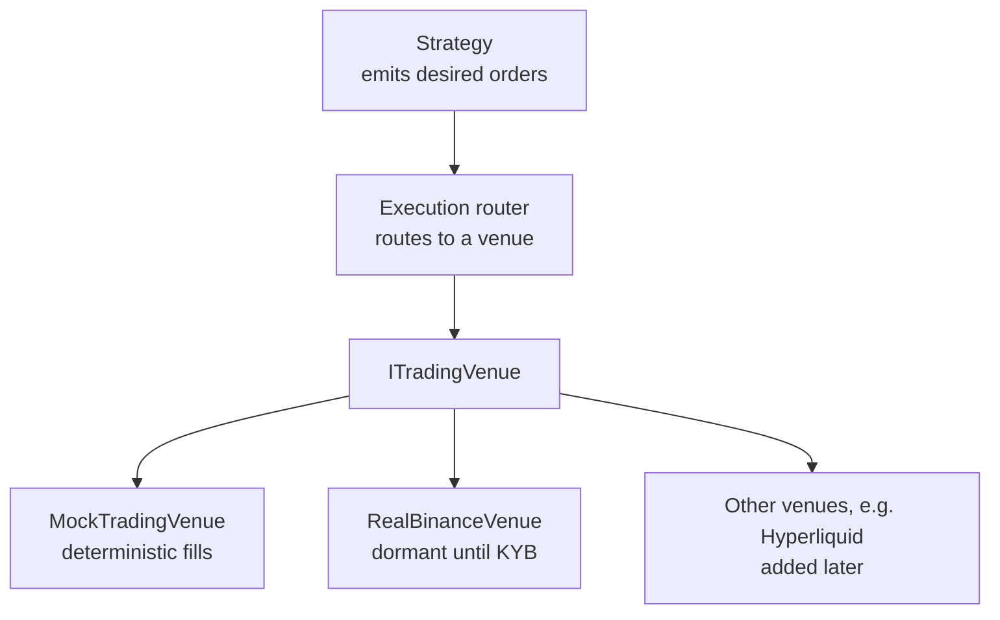

# 4. Execution & venue abstraction

## 4.1 The execution layer is the same one Phase 1 uses

The codebase already has the swap-seam shape we need. [Phase 0](../../../docs/SESSION_HISTORY.md) ships `IYieldProvider`; [Phase 1](../../../prompts/PHASE_1_PROMPT.md) adds `IHedgeVenue`. Phase 3 stat-arb adds `ITradingVenue`. Same posture: interface + mock-default + dormant real, factory-selected by env flag.



## 4.2 The interface

```typescript
// execution/trading-venue.interface.ts
export const TRADING_VENUE = Symbol('TRADING_VENUE');

export interface PlaceOrderRequest {
  symbol: string;            // e.g. 'BTC/USDT'
  side: 'buy' | 'sell';
  sizeUnits: bigint;         // 6-decimal asset units
  type: 'market' | 'limit';
  limitPriceMicros?: bigint; // ILS/USD micros for FX; for crypto, USDC micros
  idempotencyKey: string;
}

export interface OrderResult {
  externalRef: string;
  filledSizeUnits: bigint;
  avgFillPriceMicros: bigint;
  feeUnits: bigint;
}

export interface ITradingVenue {
  readonly venueId: string;
  place(req: PlaceOrderRequest): Promise<OrderResult>;
  cancel(externalRef: string): Promise<void>;
  fetchPosition(symbol: string): Promise<{ sizeUnits: bigint; avgPriceMicros: bigint }>;
  fetchBalance(): Promise<{ availableUnits: bigint }>;
}
```

Mirrors `IHedgeVenue`'s shape (`venueId`, idempotency-key replay safety, bigint-only quantities). Errors mirror `HedgeVenueNotConfiguredError` / `HedgeVenueUnhealthyError`.

## 4.3 Order types — the minimum useful set

For pairs trading and OU strategies you can get a long way with:

- **Market orders.** Always fill, but at unknown price. Use for time-critical exits (stop-out).
- **Marketable limit orders.** Limit price at or through the touch — usually fills immediately, but caps your slippage. Default for entries.
- **Post-only limit orders.** Refuse to take liquidity. Earn maker rebates. Use for non-urgent entries when spread is wide enough.

Anything beyond these (icebergs, TWAP, VWAP) is execution-research territory and probably premature for the first year of stat arb.

## 4.4 The cost model is what makes the backtest honest

Three nested fidelity levels (echoing [STAT_ARB_PLAN.md §6](../../../docs/STAT_ARB_PLAN.md)):

### Level 1 — constant taker fee, zero slippage

```typescript
const fee = (notionalUnits * BigInt(takerBps)) / 10000n;
const fillPrice = midPrice; // pretend you got the mid
```

Useful only for first-pass sanity. Strategies that don't survive a 10bps round-trip at zero slippage are dead; this is the cheapest filter.

### Level 2 — constant fee + linear-in-size slippage

```typescript
const slippageBps = baseBps + (notionalUnits / avgDailyVolume) * impactBps;
```

Adequate for low-frequency strategies (daily-bar pairs trading). Tune `baseBps` and `impactBps` per venue from realised vs expected fills on small live runs.

### Level 3 — order-book reconstruction

Replay the actual book at each bar. Walk the levels to fill the requested size. Honest, expensive in data, **required** for high-frequency strategies and cross-venue arb where the spread *is* the strategy. Not required for the §2/§3 strategies in this course.

## 4.5 Passive vs aggressive entry/exit — the asymmetry

A pattern that holds across pairs trading, OU mean-reversion, and most stat-arb strategies, but rarely shows up in the textbook formulations: **entries should be passive; exits should be aggressive.** The asymmetry comes from the difference in what each side of the trade is *betting on*.

When the spread has just moved to your entry threshold (e.g. $z_t = +2$ on a short-spread setup), you're making a wager on *further* mean-reversion. The current move could continue widening for a few more bars before reverting. You don't lose much by entering at $z = +2.05$ instead of $z = +2.00$ — in fact, if the spread keeps widening, you'd rather have a better entry. **The cost of a slightly-late entry is small; the cost of a slightly-bad fill price is permanent.** Conclusion: place a post-only limit order at or just inside the threshold; let the market come to you. If it doesn't fill, the trade simply doesn't happen, which is a benign outcome — you've avoided a setup that might have been weaker than it looked.

The exit side is mechanically inverted. Once $z_t$ crosses your exit threshold (e.g. $|z_t| < 0.5$ from §2.5), the trade is *done*. Your edge has fully materialised; any further price action is dilution. The cost of a slightly-late exit *isn't* the small slippage of crossing the spread — it's the **drift back through your exit threshold** before you've gotten out. A spread that revertss to $|z| = 0.3$ and then re-widens to $|z| = 0.8$ has burned half your edge in one bar. **You want out *now*, at any reasonable fill, not at the optimal post-only level you'll never reach.** Conclusion: market or marketable-limit orders on exit. Take liquidity. Pay the spread. The fee differential is dwarfed by the cost of giving the trade back.

The same logic applies to **stop-outs**. A stop-out fires when the spread has moved 4σ against you — the cointegration is plausibly breaking. Hesitating to "save the spread" is the failure mode that turns a 4σ stop into an 8σ disaster. Stop-outs are *always* aggressive: market order, regardless of fee impact, regardless of slippage. The decision to stop has already been made by the time the order fires; the only remaining question is *how fast you can flatten*.

This entry-passive / exit-aggressive asymmetry interacts directly with venue fee structures:

| Order type | Fee impact | Typical use |
|---|---|---|
| **Post-only limit at threshold** | Maker rebate (typically -1 to -2 bps on top-tier CEXs; -5 to -10 bps on Hyperliquid for high-volume tiers). | Entries when spread is at threshold; not in a rush. |
| **Marketable limit just through the touch** | Taker fee (typically +2 to +10 bps depending on venue / tier). | Entries when spread is *deep* past threshold (you're already late; don't delay further). |
| **Market order** | Taker fee + variable slippage walking the book. | Exits, stop-outs, and any time the spread is moving against you faster than your limit can chase. |

For a strategy entering on $|z| = 2$ and exiting on $|z| = 0.5$, the entry side typically captures the maker rebate while the exit pays the taker fee — net fee impact is the *difference*, not the sum. For a top-tier CEX with a -1 bps maker and +5 bps taker on each leg of a 2-leg trade, the round-trip is $(5 - (-1)) \times 2 \text{ legs} = 12$ bps when executed correctly, vs $(5 + 5) \times 2 = 20$ bps if both sides take liquidity. **That's a 40% fee reduction from getting the asymmetry right.** Over a year of high-frequency stat-arb that's the difference between an unprofitable and a marginal strategy.

A common practitioner mistake is to **invert the asymmetry under stress**. When a trade is winning fast, you're tempted to leave a passive limit at the exit threshold to capture an extra basis point. When a trade is losing, you're tempted to wait one more bar to enter the stop. Both of those temptations cost more than they save in expectation. The discipline is mechanical: entries always start as post-only limits and only upgrade to taker on a timeout (e.g. "if not filled within $N$ bars, cancel and reassess — don't chase"); exits always fire as market or marketable-limit orders the bar the exit threshold trips.

One refinement: **chase logic on entries**. If your post-only limit doesn't fill but the spread keeps widening past your threshold, the *better* trade is still available, just at a deeper entry. Re-place the post-only at the new touch — don't anchor on the original threshold. Cap the chase at, say, $|z| = 3$; anything further than that means the regime may be breaking, and you should sit out rather than enter.

The Almgren-Chriss (**AC01**) market-impact model formalises this entire intuition: the linear-in-rate impact term makes urgent execution quadratically more expensive than patient execution, so passive entries are cheap *in expectation* even after accounting for the option of non-fill. The closed-form result is in Almgren & Chriss (2001) §3; the practitioner version is the four-paragraph rule above.

## 4.6 Execution router

The router's job is one of three behaviours:

1. **Single-venue.** Route every order to one venue. Default for v1.
2. **Best-execution.** Quote the size across venues; route to the best fill price net of fees.
3. **Split.** Slice the order across venues to limit any one venue's impact.

```typescript
// execution/router.ts
export class ExecutionRouter {
  constructor(private readonly venues: ITradingVenue[]) {}
  async place(req: PlaceOrderRequest): Promise<OrderResult> {
    if (this.venues.length === 1) return this.venues[0].place(req);
    // best-execution or split logic here
    // ...
  }
}
```

Best-execution and split are deferred — they pay off only when you actually have multiple venues live. Build single-venue first, add multi-venue when the second venue is provisioned.

## 4.7 Idempotency, replays, partial fills

Three failure modes the venue layer has to handle:

1. **Network blip mid-place.** You don't know if the order landed. Send the same idempotency key on retry; venue dedups. (Most exchanges support `clientOrderId` for this — confirm per venue.)
2. **Partial fill, then disconnect.** Reconnect, fetch by `clientOrderId`, reconcile fills.
3. **Replay after restart.** On process restart, load open `clientOrderId`s from the DB and re-fetch their state from the venue. Do not assume "we know" any order state from memory alone.

The append-only ledger pattern from `treasury_movements` (write-on-confirmation, never UPDATE / DELETE) carries over: a new `prop_movements` table records every confirmed fill, with `(venue, idempotency_key)` UNIQUE for replay safety.

## 4.8 Code shape — the dormant real venue

Exactly the same posture as `RealOndoYieldProvider` and `RealHyperliquidHedgeVenue`:

```typescript
@Injectable()
export class RealBinanceTradingVenue implements ITradingVenue {
  readonly venueId = 'binance';
  async place(_req: PlaceOrderRequest): Promise<OrderResult> {
    throw new TradingVenueNotConfiguredError(this.venueId);
  }
  // ... all methods throw until KYB closes
}
```

The wire-up (real REST + WS handlers) only happens **after** legal formation ([PHASED_PLAN.md §Phase 2](../../../PHASED_PLAN.md)) and venue KYB. Engineering does not flip the mock-default flag.

## 4.9 Citations

- The interface-and-mock-default pattern is internal to this codebase (see [CLAUDE.md §7](../../../CLAUDE.md) "Mock-default discipline").
- **AC01**: Almgren, R., & Chriss, N. (2001). *Optimal execution of portfolio transactions.* Journal of Risk, 3, 5–40. The square-root market impact model. Formal grounding for the entry-passive / exit-aggressive asymmetry in §4.5.
- Order-book reconstruction: standard data vendors (Kaiko, Tardis, Polygon) provide L2 / L3 books; the replay machinery is custom per use case.
