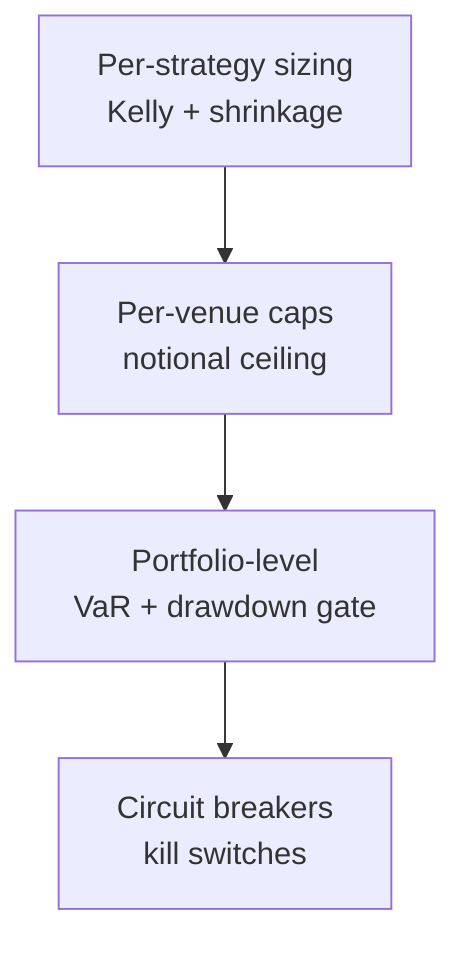
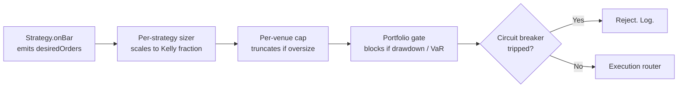

# 5. Risk, sizing, circuit breakers

## 5.1 The three risk layers

Risk isn't a single check. It's three nested layers, each catching a different failure mode:



- **Per-strategy** sizes individual bets so no one trade ruins the strategy.
- **Per-venue** caps total exposure to any single venue so no one venue ruins the book.
- **Portfolio-level** caps total exposure so no one bad day ruins the desk.
- **Circuit breakers** are the panic-stop when something the model didn't see is happening.

Each layer must be tight enough that the next one rarely fires. If your portfolio drawdown gate is tripping daily, your per-strategy Kelly is wrong.

## 5.2 Per-strategy: fractional Kelly with shrinkage

The full-Kelly fraction for a single bet is:

$$ f^* = \frac{\mu - r_f}{\sigma^2} $$

where $\mu$ is expected return, $r_f$ is the risk-free rate, $\sigma$ is the standard deviation of returns. Mathematically optimal for **growth** — but assumes you know $\mu$ exactly. You don't.

**Shrinkage:** Take a fraction of Kelly (typically $0.25 \cdot f^*$, sometimes called "quarter-Kelly"). Justification:

- Your backtest's $\mu$ is upward-biased (survivorship + selection).
- The full-Kelly drawdown is brutal — in expectation, half the strategy lifetime is spent at $<$ 50% of peak NAV.
- Quarter-Kelly gives up ~25% of growth in exchange for far smoother equity.

```typescript
// risk/kelly.ts
export function fractionalKelly(
  expectedReturn: number,
  variance: number,
  riskFreeRate: number,
  fraction = 0.25,
): number {
  const fullKelly = (expectedReturn - riskFreeRate) / variance;
  return fraction * fullKelly;
}
```

**Empirical $\mu$ and $\sigma$ from backtest.** Use a robust estimator: trimmed mean over the in-sample window, or a Bayesian shrinkage estimator if you have a prior. **Don't use the raw backtest mean** — it embeds the survivorship of the strategy you chose to deploy.

## 5.3 Per-venue caps

A single number per venue:

$$ \text{cap}_v = \min(\text{absoluteCap}, k \cdot \text{venueDailyVolume}_v) $$

with $k$ typically 1–2%. Rationale: even at 2% of daily volume your impact is felt; above that your fills will be statistically worse than backtest assumes. Caps are a hard floor — strategies that try to size above the cap have their orders truncated, not rejected, with an alert.

Venue ordering for solvency risk (consistent with [PHASED_PLAN.md §Phase 1](../../../PHASED_PLAN.md)):

| Venue | Solvency tier | Notes |
|---|---|---|
| Top-3 CEX (Binance, OKX, Bybit) | A | Largest, well-capitalised, but not zero-risk (cf. FTX) |
| Hyperliquid | A− | Highest TVL among perps DEXs; fully on-chain |
| Coinbase, Kraken | A | Smaller liquidity but US-regulated |
| Drift | B | Smaller perp DEX |
| GMX | B− | Smaller, design has historical exploit surface |
| Anywhere else | C+ | Cap aggressively |

These are tiers, not blacklists. Even Tier-A venues should not hold more than ~30% of working capital.

## 5.4 Portfolio-level: VaR & drawdown gate

**VaR (Value at Risk).** "With 95% / 99% confidence, daily loss won't exceed X." Compute two ways and take the worse:

1. **Historical VaR:** $\text{P\&L}_t$ over the last $N$ days; take the 5th / 1st percentile.
2. **Parametric VaR:** assume normal returns; $\text{VaR}_{95} = 1.65 \cdot \sigma_{\text{daily}}$, $\text{VaR}_{99} = 2.33 \cdot \sigma_{\text{daily}}$. Underestimates fat tails; that's why you take the worse of the two.

VaR is **monitoring**, not a hard limit. Cap exposure to keep VaR under a budget you've decided (e.g. 1% of NAV at 99%).

**Drawdown gate.** A hard limit. If the portfolio is down N% peak-to-trough (intraday or rolling), trading stops. New entries blocked; open positions closed (or held at operator discretion). N typically 3–5%.

```typescript
// risk/drawdown-gate.ts
export class DrawdownGate {
  private peakNav = 0n;
  constructor(private readonly maxDrawdownBps: bigint) {}

  check(currentNav: bigint): boolean {
    if (currentNav > this.peakNav) this.peakNav = currentNav;
    const drawdown = ((this.peakNav - currentNav) * 10_000n) / this.peakNav;
    return drawdown <= this.maxDrawdownBps;
  }
}
```

**Critically: the gate's state lives in the DB, not memory.** A process restart that resets `peakNav` to zero would silently disable the gate. Persist on every NAV update.

## 5.5 Circuit breakers

Specific events that bypass the normal risk machinery. Mirror the circuit-breaker list from [PHASED_PLAN.md §Phase 1](../../../PHASED_PLAN.md) and [PHASE_1_PROMPT.md](../../../prompts/PHASE_1_PROMPT.md):

| Gate | Trips on | Effect | Reset |
|---|---|---|---|
| Funding spike | Funding rate > 100 bps | Close affected venue positions; pause new opens on that venue | Manual after funding normalises |
| Venue health | `fetchHealth().healthy === false` | Pause all activity on the venue | Manual after venue self-clears |
| Data staleness | Feed quiet > 30s (live) | Pause strategies depending on that feed | Auto when feed resumes |
| Cointegration decay | Pair's ADF $p > 0.10$ for 2 days | Close the pair | Pair re-passes the test |
| Drawdown | Portfolio drawdown > 5% | Stop everything | Manual after operator review |

**Reset discipline.** Auto-resets are tempting and dangerous. The default for "soft" gates (data staleness) can be auto. For "hard" gates (drawdown, venue health) require an operator action. The cost of a false-positive reset is much higher than the cost of a few minutes of paused trading.

## 5.6 The kill switch

A single function — operator-callable — that:

1. Cancels all open orders across all venues.
2. Closes all positions at market.
3. Writes a `KILL_SWITCH` movement to `prop_movements` for the audit trail.
4. Sets a persistent "halted" flag that blocks all subsequent strategy invocations until cleared.

This exists separately from the circuit breakers. Circuit breakers are automated; the kill switch is the human override. They should never be needed; they will be.

## 5.7 Code shape — how risk wires in

The strategy never holds the keys to risk. Strategy emits desired orders; risk layer transforms them.



```typescript
export class RiskLayer {
  async vet(orders: Order[], ctx: RiskContext): Promise<Order[]> {
    if (this.killSwitch.isHalted()) return [];
    if (!this.drawdownGate.check(ctx.currentNav)) return [];
    if (!this.circuitBreaker.allows(ctx)) return [];
    return orders
      .map((o) => this.sizer.scale(o, ctx))
      .map((o) => this.venueCap.cap(o, ctx))
      .filter((o) => o.sizeUnits > 0n);
  }
}
```

Each step is independently testable. Each rejection is logged. Risk does not silently swallow orders without recording why.

## 5.8 Citations

- **Kelly, J. L. (1956).** *A new interpretation of information rate.* Bell System Technical Journal, 35, 917–926. Original Kelly.
- **Thorp, E. O. (2006).** *The Kelly criterion in blackjack, sports betting, and the stock market.* In *Handbook of Asset and Liability Management*. The shrinkage argument.
- **MacLean, L. C., Thorp, E. O., & Ziemba, W. T. (Eds.) (2011).** *The Kelly Capital Growth Investment Criterion.* World Scientific. Comprehensive.
- VaR methodology: **Jorion, P. (2006).** *Value at Risk: The New Benchmark for Managing Financial Risk* (3rd ed.). McGraw-Hill.
- The drawdown gate and kill switch are operational practice; no canonical citation. The argument for persisting their state across restarts is from incident write-ups across multiple desks (no single citable source).
