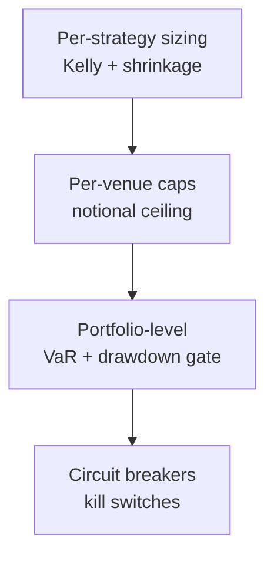
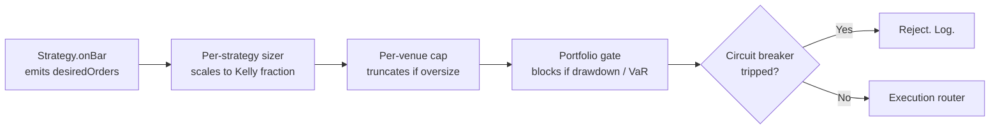

# 5. Risk, sizing, circuit breakers

!!! abstract "Where this chapter fits"
    **Feeds in from:** [§2 cointegration](02-cointegration.md) and [§3 OU process](03-ou-process.md) (the strategies whose orders this chapter sizes and gates); [§2.8](02-cointegration.md#28-universe-construction-from-infinite-candidate-pairs-to-a-tractable-book) (the effective-$N$ argument feeds directly into [§5.2](#52-per-strategy-fractional-kelly-with-shrinkage)'s Kelly framing).
    **Feeds into:** [§4 execution](04-execution.md) (orders only reach the execution router after the risk layer accepts them; the wiring is in [§5.7](#57-code-shape-how-risk-wires-in)); [§6.5](06-backtesting.md#65-deflated-sharpe-ratio-the-multiple-testing-aware-sharpe) (the DSR is the multiple-testing-aware sizing input that complements the Kelly framing here); [§7.3](07-production.md#73-the-capital-ramp-curve-concrete-dollar-amounts) (capital-ramp gates are operational expressions of the same drawdown and venue-cap discipline).
    **Code shape:** [Appendix A.6 — risk-layer pipeline](appendix-a-code-shapes.md#a6-the-risk-layer-pipeline).

## 5.1 The three risk layers

Risk isn't a single check. It's three nested layers, each catching a different failure mode, with a fourth layer of automated circuit breakers and a final manual kill-switch override:



- **Per-strategy** sizes individual bets so no one trade ruins the strategy. This is where the Kelly criterion (§5.2) lives.
- **Per-venue** caps total exposure to any single venue so no one venue's failure ruins the book. This is where the venue-tier discipline (§5.3) lives.
- **Portfolio-level** caps total exposure so no one bad day ruins the desk. This is where VaR monitoring and the drawdown gate (§5.4) live.
- **Circuit breakers** are the panic-stop when something the model didn't see is happening. Funding spikes, venue health failures, data staleness, cointegration decay — each one fires automatically when a specific named condition trips. See §5.5.
- **Kill switch** is the human-callable override. When even the circuit breakers haven't caught it, an operator can flatten everything in one call. See §5.6.

The layers are nested in the diagram for a reason: an order is sized down by the Kelly sizer, then truncated by the venue cap, then either allowed or blocked by the portfolio gate, then either allowed or blocked by the circuit breakers, then placed. Each layer is designed to be tight enough that the next one *rarely* fires. If your portfolio drawdown gate is tripping daily, your per-strategy Kelly is wrong; if your circuit breakers are tripping daily, your strategies are picking fights with regime changes. The whole system is supposed to be quiet most of the time.

## 5.2 Per-strategy: fractional Kelly with shrinkage

The Kelly criterion is the bet-sizing rule that *maximises the expected log-growth rate of wealth*. For a single bet with expected excess return $\mu - r_f$ (where $r_f$ is the risk-free rate) and return variance $\sigma^2$, the optimal fraction of capital to bet is:

$$ f^* = \frac{\mu - r_f}{\sigma^2} $$

**Derivation sketch.** If you bet a fraction $f$ of your wealth on an investment with random return $R$, your wealth after one period is $W(1 + fR)$. Taking the log to get the per-period log-growth rate and then the expectation gives $\mathbb{E}[\log(1 + fR)]$. Taylor-expand around $f = 0$, take the derivative, set to zero, and the $f$ that maximises log-growth turns out to be $\mu / \sigma^2$ (for a near-zero risk-free rate) — the Kelly fraction. The full derivation is in Kelly (1956); Thorp (2006) gives a readable practitioner version.

**The catch.** Kelly is mathematically optimal *if you know $\mu$ and $\sigma$ exactly*. You don't. Your backtest gives you *estimates* of $\mu$ and $\sigma$, and those estimates are themselves random — they were noisier on this particular history than they will be on the future. If your true edge is smaller than your estimate (the survivorship-and-selection bias in §6.6 is a sober reason to expect this), full-Kelly sizing overbets and the resulting drawdowns are punishing.

**Fractional Kelly.** The conservative practitioner runs a fraction of the Kelly-recommended size. The textbook default is **quarter-Kelly** ($f = 0.25 \cdot f^*$). The argument:

- Your backtest's $\mu$ is upward-biased (survivorship + selection — see §6.6). The realised $\mu$ in live trading is almost always smaller than the backtest's.
- The full-Kelly drawdown is brutal — in expectation, the strategy spends half its lifetime at less than 50% of peak NAV. That's mathematically true; it's also psychologically unsurvivable for most operators and unacceptable for most outside investors.
- Quarter-Kelly gives up roughly 25% of the *theoretical* growth rate in exchange for *far* smoother equity. The math is in MacLean, Thorp & Ziemba (2011) — the expected log-growth penalty of quarter-Kelly relative to full-Kelly is much smaller than the variance reduction.

```typescript
// risk/kelly.ts
export function fractionalKelly(
  expectedReturn: number,
  variance: number,
  riskFreeRate: number,
  fraction = 0.25,
): number {
  const fullKelly = (expectedReturn - riskFreeRate) / variance;
  return fraction * fullKelly;
}
```

**Worked numerical example.** Suppose a strategy's backtest gives expected return $\mu = 0.15$ (15% annualised) and standard deviation $\sigma = 0.20$ (20% annualised), with risk-free rate $r_f = 0.05$. Then:

- Full Kelly: $f^* = (0.15 - 0.05) / 0.20^2 = 0.10 / 0.04 = 2.5$. That is, full Kelly says "lever up to 2.5× of your wealth on this bet." That's a *lot* of leverage and not a defensible production sizing.
- Quarter Kelly: $0.25 \times 2.5 = 0.625$, or 62.5% of capital. Still significant, but the implied drawdowns are an order of magnitude better than full Kelly.
- In practice, you'd also bound the sizing from above by absolute caps (e.g. "no single strategy gets more than 20% of NAV regardless of Kelly recommendation") because the Kelly formula is local — it doesn't know about the portfolio you're embedded in.

**Empirical $\mu$ and $\sigma$ from backtest.** Use a robust estimator: trimmed mean over the in-sample window, or a Bayesian shrinkage estimator if you have a prior. **Don't use the raw backtest mean** — it embeds the survivorship of the strategy you chose to deploy. The standard fix is to shrink the backtest's mean toward a prior of "zero edge" by an amount proportional to the estimate's standard error. A strategy whose backtest mean is statistically indistinguishable from zero should be sized as if its edge is zero, regardless of what the point estimate says.

!!! note "Practitioner note (from RohOnChain archive — Fundamental Law thread)"
    Roan's "50 weak signals" thread ([archive](_archive/roan-fundamental-law-active-mgmt-2026-05-26.md), claim #5) offers a sharper functional form for the Kelly shrinkage:

    $$ f_{\text{empirical}} = f_{\text{Kelly}} \cdot (1 - \text{CV}_{\text{edge}}) $$

    where $\text{CV}_{\text{edge}}$ is the coefficient of variation of the *edge estimate itself* — i.e. how uncertain you are about your IC. When your edge estimate is precise (low CV), shrinkage is light; when the estimate is noisy (high CV), shrinkage is aggressive. This is sharper than the generic 0.25 multiplier because it adapts to the actual standard error of your IC measurement. The generic Tier-A version (Thorp 2006 on fractional Kelly) gives "use 0.25 of full Kelly because you don't really know μ" as an aphorism; the practitioner version operationalises it.

    **Course default stays at 0.25** because measuring $\text{CV}_{\text{edge}}$ reliably is hard in the small-sample regime that early-stage live trading starts in. The CV-shrinkage form becomes the upgrade path once a strategy has 6+ months of live data with statistically-meaningful per-trade edge measurements.

## 5.3 Per-venue caps

The Kelly recommendation in §5.2 says how much capital to put on a given *strategy*. The per-venue cap is the *upper bound* on how much of that recommendation can land on any *single* venue. The rationale is independent of edge: even a profitable strategy on a profitable venue can be ruined by venue failure (FTX in 2022 is the canonical example), so you cap each venue's share of working capital regardless of how good the per-strategy math looks.

A single number per venue:

$$ \text{cap}_v = \min(\text{absoluteCap}, k \cdot \text{venueDailyVolume}_v) $$

with $k$ typically 1–2%. The rationale is twofold: at $k > 2\%$ of daily volume, your market impact is noticeable to other participants and your fills will be statistically worse than the backtest assumes; and at any reasonable size, you don't want to be the single largest source of one venue's liquidity. Caps are a hard floor — strategies that try to size above the cap have their orders **truncated, not rejected**, with an alert: the strategy gets less size than it asked for and the operator gets a notification.

Venue ordering for solvency risk. The tiers below are a defensible starting taxonomy for crypto; for equities the tier structure is different (regulated brokers vs prop trading shops vs dark pools):

| Venue | Solvency tier | Notes |
|---|---|---|
| Top-3 CEX (Binance, OKX, Bybit) | A | Largest, well-capitalised, but not zero-risk (cf. FTX). Treat as tier-A but cap at ≤30% of working capital. |
| Hyperliquid | A− | Highest TVL among perps DEXs; fully on-chain. No counterparty risk on the protocol level but on-chain venue risk (oracle, governance, exploit) remains. |
| Coinbase, Kraken | A | Smaller liquidity but US-regulated. Stronger legal recourse in a failure scenario. |
| Drift | B | Smaller perp DEX. Solid track record but smaller TVL means slippage and capacity are tighter. |
| GMX | B− | Smaller, design has historical exploit surface. |
| Anywhere else | C+ | Cap aggressively — never more than a few percent of working capital. |

These are tiers, not blacklists. Even Tier-A venues should not hold more than ~30% of working capital. The point of the tiering is that the cap *as a fraction of working capital* should be smaller for lower tiers, even if the same venue is offering better fees or better liquidity.

!!! note "Practitioner note (from RohOnChain archive — Markov Hedge Fund Method)"
    Roan's framework ([archive](_archive/roan-markov-hedge-fund-method-2026-05-26.md), claim #3) suggests a second per-asset filter that's orthogonal to the venue-cap above: the asset's **long-run stationary regime distribution**. If a fitted Markov model's stationary distribution gives that asset a Bear-share above some threshold (e.g. $\pi_{\text{Bear}} > 0.40$), the asset is structurally tail-heavy and should be sized down regardless of which venue you hold it on:

    ```python
    bear_baseline = stationary_distribution['bear']
    size_multiplier = max(0, 1.0 - bear_baseline)   # heavier-bear baseline → smaller bets
    ```

    The hard variant — `if bear_baseline > 0.40: size = 0` — is a "this asset is too tail-heavy to trade" kill. Maps to Hamilton (1989) on unconditional regime probabilities; the *operationalisation as a sizing input* is the practitioner contribution.

## 5.4 Portfolio-level: VaR & drawdown gate

The first two layers (per-strategy sizing, per-venue caps) are *local* — each one looks at one strategy or one venue in isolation. The portfolio-level layer is where you measure aggregate exposure and gate against scenarios where multiple strategies lose money on the same day.

**VaR (Value at Risk).** A single number that summarises portfolio-level tail risk: "with 95% / 99% confidence, daily loss won't exceed X." Two standard ways to compute VaR — both should be computed and the *worse* of the two used as the operative number:

1. **Historical VaR.** Take the realised daily P&L over the last $N$ days; take the 5th percentile (for 95% VaR) or 1st percentile (for 99% VaR). The advantage is that it makes no distributional assumption — it tells you what actually happened. The disadvantage is that it only sees what happened, not what *could* have happened — if your sample doesn't contain a regime change, the VaR understates the tail.
2. **Parametric VaR.** Assume normal returns; then $\text{VaR}_{95} = 1.65 \cdot \sigma_{\text{daily}}$ and $\text{VaR}_{99} = 2.33 \cdot \sigma_{\text{daily}}$. The advantage is that it scales smoothly with $\sigma$ and doesn't depend on the exact contents of your sample. The disadvantage is that financial returns have fat tails — the normal-distribution assumption *systematically* underestimates the 99th percentile.

The reason you take the worse of the two: historical VaR catches realised tail behaviour that parametric VaR's normal-distribution assumption misses; parametric VaR catches tail risk that hasn't shown up in your sample yet. Either alone is biased; the max of the two is closer to honest.

**VaR is monitoring, not a hard limit.** You don't *enforce* a VaR cap on every order — VaR moves slowly and is a portfolio-level statistic. You *budget* against VaR: decide ahead of time what 95% / 99% VaR you're willing to run (e.g. 1% of NAV at 99%) and adjust sizing across strategies to stay under that budget. The actual hard limit is the drawdown gate below.

**Drawdown gate.** The hard portfolio-level limit. The peak-to-trough decline of the portfolio NAV is tracked continuously; if it exceeds a published threshold (typically 3–5%), the gate trips: new entries are blocked, and open positions are either closed or held at operator discretion depending on the gate's configuration. The point is to limit the magnitude of any drawdown to a survivable size — both financially and operationally.

```typescript
// risk/drawdown-gate.ts
export class DrawdownGate {
  private peakNav = 0n;
  constructor(private readonly maxDrawdownBps: bigint) {}

  check(currentNav: bigint): boolean {
    if (currentNav > this.peakNav) this.peakNav = currentNav;
    const drawdown = ((this.peakNav - currentNav) * 10_000n) / this.peakNav;
    return drawdown <= this.maxDrawdownBps;
  }
}
```

**Critically: the gate's state lives in the DB, not memory.** A process restart that resets `peakNav` to zero would silently disable the gate — the next NAV reading would be the new "peak" and no drawdown could ever be detected. The standard pattern is to persist `peakNav` on every NAV update and reload it on every process start. The drawdown gate is the kind of thing that *must* survive restarts to be useful.

**Choosing the drawdown threshold.** The standard 3–5% range is empirically calibrated: tighter than ≈ 3% means the gate trips on normal market noise; looser than ≈ 5% means the gate doesn't catch losses until they're material. Within that band, the choice is a function of (a) how aggressively you want to compound vs how much you fear catastrophic drawdowns and (b) what your investors or your own risk tolerance can stomach. A book with outside investors usually publishes a 5% drawdown gate; a book trading only own capital can run 7% or so without an audit-trail problem.

## 5.5 Circuit breakers

Specific events that bypass the normal risk machinery. Each circuit breaker is a published, named condition with a published response and a published reset rule. The point of explicit circuit breakers is that the failure modes are *known in advance*, the responses are *automatic*, and the reset is *deliberate*:

| Gate | Trips on | Effect | Reset |
|---|---|---|---|
| Funding spike | Funding rate > 100 bps | Close affected venue positions; pause new opens on that venue | Manual after funding normalises |
| Venue health | `fetchHealth().healthy === false` | Pause all activity on the venue | Manual after venue self-clears |
| Data staleness | Feed quiet > 30s (live) | Pause strategies depending on that feed | Auto when feed resumes |
| Cointegration decay | Pair's ADF $p > 0.10$ for 2 days ([§2.9](02-cointegration.md#29-spread-staleness-diagnostics-knowing-when-a-cointegrated-pair-has-broken)) | Close the pair | Pair re-passes the test |
| OU $\theta$ floor | Fitted $\theta < \theta_{\min}$ ([§3.6](03-ou-process.md#36-reading-the-ou-fit-diagnostics-in-practice)) | Close OU positions on that spread; pause new entries | $\theta$ recovers above floor on next refit |
| Drawdown | Portfolio drawdown > 5% | Stop everything | Manual after operator review |

**Reset discipline.** Auto-resets are tempting and dangerous. The default for "soft" gates (data staleness — the feed was down for 35 seconds, it's back, resume trading) can reasonably be auto. For "hard" gates (drawdown gate tripped, venue health failed) the reset requires an explicit operator action, with a brief written reason, logged to the audit trail. The cost of a false-positive reset — a strategy that should have stayed paused but didn't — is much higher than the cost of a few minutes of unnecessarily-paused trading.

**Why circuit breakers and not just sizing?** Because some failures are not graceful. A venue WebSocket that goes silent isn't a "smaller edge"; it's "no edge, and possibly the venue is failing." A cointegration whose ADF $p$ has climbed to 0.15 isn't a "less-cointegrated pair"; it's "this pair probably broke, the spread you're long can keep going against you for weeks." Circuit breakers exist for situations where the right response isn't "size down" but "stop entirely until a human looks at it."

## 5.6 The kill switch

A single function — operator-callable — that:

1. Cancels all open orders across all venues.
2. Closes all positions at market.
3. Writes a `KILL_SWITCH` movement to the append-only ledger for the audit trail.
4. Sets a persistent "halted" flag that blocks all subsequent strategy invocations until cleared.

This exists separately from the circuit breakers. Circuit breakers are automated and fire on named conditions; the kill switch is the human override for *unknown* conditions — the situations the model didn't anticipate. They should never be needed; they will be. The cost of having one and never using it is negligible; the cost of not having one when something genuinely unexpected happens (a malicious actor on the team, a venue that's behaving strangely without tripping any health check, a regulatory announcement that changes your strategy's legality overnight) is unbounded.

The kill-switch flag is persistent in the same way the drawdown gate's `peakNav` is persistent: it lives in the DB, survives restart, and clearing it is an explicit, logged operator action.

## 5.7 Code shape — how risk wires in

The strategy never holds the keys to risk. Strategy emits desired orders; risk layer transforms them through a series of validators and sizers before any order reaches a venue:



```typescript
export class RiskLayer {
  async vet(orders: Order[], ctx: RiskContext): Promise<Order[]> {
    if (this.killSwitch.isHalted()) return [];
    if (!this.drawdownGate.check(ctx.currentNav)) return [];
    if (!this.circuitBreaker.allows(ctx)) return [];
    return orders
      .map((o) => this.sizer.scale(o, ctx))
      .map((o) => this.venueCap.cap(o, ctx))
      .filter((o) => o.sizeUnits > 0n);
  }
}
```

Each step is independently testable. Each rejection is logged with a reason (`kill-switch`, `drawdown-gate`, `circuit-breaker:funding-spike`, `venue-cap-zero`, etc.). Risk does not silently swallow orders — every order that doesn't reach the execution router has a logged reason somewhere, and a daily-checklist item (§7.5) reviews the previous day's rejections.

## 5.8 Citations

- **Kelly, J. L. (1956).** *A new interpretation of information rate.* Bell System Technical Journal, 35, 917–926. Original Kelly.
- **Thorp, E. O. (2006).** *The Kelly criterion in blackjack, sports betting, and the stock market.* In *Handbook of Asset and Liability Management*. The shrinkage argument.
- **MacLean, L. C., Thorp, E. O., & Ziemba, W. T. (Eds.) (2011).** *The Kelly Capital Growth Investment Criterion.* World Scientific. Comprehensive.
- **J06** — VaR methodology: **Jorion, P. (2006).** *Value at Risk: The New Benchmark for Managing Financial Risk* (3rd ed.). McGraw-Hill.
- **GK99**: Grinold, R., & Kahn, R. (1999). *Active Portfolio Management* (2nd ed.). McGraw-Hill. Chapter 6 — the Fundamental Law of Active Management that underpins the §5.2 Practitioner-note Kelly-with-edge-uncertainty form.
- **H89**: Hamilton, J. D. (1989). *A new approach to the economic analysis of nonstationary time series and the business cycle.* Econometrica, 57(2), 357–384. — Stationary-distribution-as-sizing-input rationale for the §5.3 Practitioner-note callout.
- **Tier C — RohOnChain archive**: [`_archive/roan-markov-hedge-fund-method-2026-05-26.md`](_archive/roan-markov-hedge-fund-method-2026-05-26.md); [`_archive/roan-fundamental-law-active-mgmt-2026-05-26.md`](_archive/roan-fundamental-law-active-mgmt-2026-05-26.md). Practitioner sources for the two callouts in §5.2 and §5.3.
- The drawdown gate and kill switch are operational practice; no canonical citation. The argument for persisting their state across restarts is from incident write-ups across multiple desks (no single citable source).
