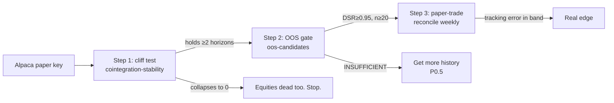

# 10. Stat-arb in equities

!!! abstract "Where this chapter fits"
    **Feeds in from:** [§2 — cointegration](02-cointegration.md) (the Engle-Granger test and the spread definition reused verbatim); [§3 — OU](03-ou-process.md) (half-life and Bertram bands); [§5 — risk & sizing](05-risk.md) (the dollar-neutral construction is sharpened here); [§6 — backtesting honestly](06-backtesting.md) (the deflated-Sharpe gate is what an equities pair must clear).
    **Feeds into:** [§9 — testing in Meridian](09-testing-in-meridian.md) (the Alpaca paper-trading walkthrough); the engine's `scripts/cointegration-stability.ts` and `scripts/oos-candidates.ts`.
    **Code shape:** `src/stat-arb/feed/alpaca/` (the only new code — one feed, one venue), `src/stat-arb/signal/`, `src/stat-arb/historical-replay-venue.ts` (the equities cost model).

This chapter is the one that matters if you want a mean-reversion book that actually makes money. Everything in §1–§9 was developed on crypto, where it is *easy to wire* (a public REST endpoint, no account) but *structurally hard to profit* — the cointegration you measure on a short window mostly evaporates on a long one (the "cointegration cliff," §10.1). Equities are the opposite: harder to wire (an account, market hours, corporate actions, short-borrow) but the cointegration is **structural** — it comes from two firms sharing the same cash-flow drivers, and that does not evaporate when you lengthen the window. This is where the whole apparatus of §2–§6 earns its keep.

We will be unusually explicit about two things the rest of the course glosses: (1) the difference between the hedge ratio that lives in your *signal* and the hedge ratio that should live in your *sizing* — the Meridian engine, as built today, conflates them, and you need to know exactly when that is harmless and when it costs you money; and (2) the equities cost stack, which is dominated not by commission (zero) or spread (tiny on large caps) but by **short-borrow financing** and **dividends on the short leg** — costs that simply do not exist in spot crypto and that decide whether an equities pair is tradable.

---

## 10.1 Why equities — the structural-cointegration thesis

Recall the failure mode the desk hit on crypto (the research journal calls it the *cointegration cliff*). Scan a basket of crypto tokens over 30 days and the Engle-Granger test (§2.2) reports dozens of "cointegrated" pairs. Lengthen the window to 90 days and most are gone; at 180–365 days almost none survive. A spread you can only see for a few weeks is not a spread — it is transient correlation, and trading it is trading noise that happens to have lined up.

Why does crypto cointegrate spuriously? Because almost every token's price is, to first order, *beta to Bitcoin*. Two tokens that both load heavily on the BTC factor will look correlated, and over a short window their ratio will look stationary — but there is no economic mechanism tying their *relative* value to a fixed level. The common factor (BTC) is itself a random walk; the "spread" is the difference of two noisy loadings on a random walk, and nothing pulls it back to a mean. It is correlation without a restoring force.

Same-sector equities are different, and the difference is economic, not statistical. Consider Coca-Cola (KO) and PepsiCo (PEP). Both are global beverage and snack businesses selling to the same consumers, buying the same commodity inputs (sugar, aluminium, PET, transport fuel), exposed to the same FX baskets, and priced off the same discount-rate environment. The *common factor* — "the staples sector's cash-flow outlook" — moves both stocks together. But their *relative* valuation is anchored by a real mechanism: if PEP got persistently cheap relative to KO with no change in fundamentals, a capital allocator would rotate from KO into PEP until the relationship re-tightened. That allocator behaviour is the restoring force. It is slow (it works on a multi-day to multi-week horizon, not a microsecond one) but it is real, and it is *why the spread has a mean to revert to.*

!!! note "The one-line thesis"
    Crypto pairs share a **random-walk factor** (BTC) → the spread has correlation but no restoring force → cointegration is a short-window artifact.
    Same-sector equity pairs share a **cash-flow factor** (the sector) → the spread is anchored by relative-value capital flows → cointegration is structural and persists across horizons.

This is the thesis the engine lets you *test* rather than assert. `scripts/cointegration-stability.ts STAB_SOURCE=alpaca` runs the exact cliff probe from the crypto journal on equity baskets at 30/90/180-day horizons. The question it answers is binary and falsifiable: **do same-sector equity baskets hold their cointegrated-pair count across horizons where crypto collapsed to zero?** If yes, the equities pivot is real and you proceed to the OOS gate. If no, equities are also a dead end and you have learned it in an afternoon, not a quarter. (At time of writing this run is the open hand-off — it needs an Alpaca paper key; §10.7.)

## 10.2 The factor model behind a sector spread

The cointegration of §2 is the *level-space* statement. Underneath it is a *return-space* factor model that makes the economics explicit and tells you how to hedge. We build it here because the hedge ratio falls straight out of it.

Write the one-period return of stock $i$ as a single-factor decomposition:

$$ r_{i,t} = \alpha_i + \beta_i\, F_t + \varepsilon_{i,t} $$

where $F_t$ is the **common factor** (the sector return, or the market return if you prefer a broader factor), $\beta_i$ is firm $i$'s loading on that factor, $\alpha_i$ is a small drift, and $\varepsilon_{i,t}$ is the **idiosyncratic** return — firm-specific, mean-zero, and (this is the whole game) *stationary and mean-reverting*. The idiosyncratic part is the news that is about firm $i$ alone: a product recall, a management change, a single analyst downgrade. It moves the stock away from where the sector says it should be, and then — if the firm is fundamentally sound — it reverts.

Now form a long/short portfolio: long \$1 of A, short \$$h$ of B. Its one-period return is

$$ r_{p,t} = r_{A,t} - h\, r_{B,t} = (\alpha_A - h\alpha_B) + (\beta_A - h\beta_B)\,F_t + (\varepsilon_{A,t} - h\,\varepsilon_{B,t}). $$

Choose the hedge ratio that kills the factor term:

$$ h^\star = \frac{\beta_A}{\beta_B} \quad\Longrightarrow\quad r_{p,t} = \text{const} + \big(\varepsilon_{A,t} - h^\star\,\varepsilon_{B,t}\big). $$

With the factor cancelled, the portfolio return is **pure idiosyncratic** — exactly the stationary, mean-reverting component. Its cumulative sum is the tradable spread. This is the Avellaneda–Lee (2010) construction (**AL10**), the canonical statistical-arbitrage model for US equities, and it is *why* a same-sector long/short is mean-reverting: you have algebraically removed the random-walk part and left only the part with a restoring force.

The link to §2's cointegrating $\beta$: the Engle-Granger regression $\ln A_t = \alpha + \beta \ln B_t + \varepsilon_t$ estimates the level-space hedge ratio. Under a single common stochastic trend, that $\beta$ converges to the same $h^\star = \beta_A/\beta_B$ — the cointegrating vector *is* the factor-neutralising ratio, seen in levels instead of returns. So when the engine fits $\beta$ by cointegration (§2.2) and forms the log-spread

$$ S_t = \ln A_t - \beta \ln B_t \qquad \text{(\texttt{src/stat-arb/signal/spread.ts})} $$

it is constructing the factor-neutral spread of AL10. Good. The signal is correct. The subtlety — and it is a real one — is in the *sizing*, which is the next section.

## 10.3 Hedge ratio: the signal/sizing split (read this twice)

Here is the thing the rest of the course lets slide and that you must not. There are **two** places a hedge ratio shows up, and they are not automatically the same number in the code.

1. **In the signal.** The spread $S_t = \ln A_t - \beta \ln B_t$ uses the cointegrating $\beta$. This is what the z-score is computed on; it decides *when* to trade. The engine does this correctly — `BollingerPairsStrategy.onBar` calls `logSpread(closesA, closesB, beta)` with the fitted (and periodically re-fitted) $\beta$.

2. **In the sizing.** When the engine opens a position it places **equal dollar notional on each leg**:

    ```ts
    // src/stat-arb/strategies/bollinger-pairs-strategy.ts — entry
    orders.push({ symbol: symA, side: 'SELL', notionalUnits: n, reason: 'OPEN_SHORT' });
    orders.push({ symbol: symB, side: 'BUY',  notionalUnits: n, reason: 'OPEN_SHORT' });
    ```

    Both legs get the same `n`. The sizing hedge ratio is therefore **fixed at 1**, regardless of the fitted $\beta$.

Why does this matter? Go back to the portfolio return. The spread you are *trying* to capture is

$$ dS_t = r_{A,t} - \beta\, r_{B,t}. $$

A position that is long \$$N$ of A and short \$$N$ of B (equal dollar, $h=1$) earns, per bar,

$$ \text{P\&L} \approx N\,(r_{A,t} - r_{B,t}) = N\,dS_t \;+\; \underbrace{N(\beta - 1)\,r_{B,t}}_{\text{residual exposure}}. $$

The residual term $N(\beta-1)\,r_{B,t}$ is the price of the simplification. Decompose it with the factor model: $r_{B} = \beta_B F + \varepsilon_B$, so the residual is $N(\beta-1)(\beta_B F + \varepsilon_B)$ — a slug of **directional factor exposure** $N(\beta-1)\beta_B F$ plus some extra idiosyncratic B. That factor exposure is *not* mean-reverting; it is the sector's random walk leaking back into a book you believed was market-neutral.

When is this harmless? When $\beta \approx 1$. And here is the good news for equities specifically: for two firms in the *same sub-industry* with *similar factor loadings* ($\beta_A \approx \beta_B$), the cointegrating ratio $\beta \approx \beta_A/\beta_B \approx 1$, and equal-dollar sizing is very nearly the right hedge. This is part of why same-sector pairs are forgiving. KO/PEP, V/MA, UNP/CSX — these sit near $\beta = 1$ and equal-dollar costs you almost nothing.

When does it bite? When the two names have genuinely different factor loadings — a high-beta semiconductor (NVDA) against a low-beta one (TXN), or a money-center bank against a rate-sensitive regional. There the fitted $\beta$ can sit at 0.6 or 1.5, and equal-dollar sizing leaves you 30–50% of a leg in naked sector exposure. On a quiet day you will not notice. On a sector-wide move you will, and it will not look like the spread P&L your backtest promised.

!!! warning "Known engine limitation — and the correct fix"
    The Meridian engine sizes **equal-dollar per leg** (hedge ratio 1) while running the signal off the fitted $\beta$. This is a dollar-neutral approximation that is accurate only near $\beta=1$.

    The textbook-correct construction is **β-weighted dollar-neutral**: long \$$N$ of A, short \$$\beta N$ of B, so the executed position actually tracks $dS = r_A - \beta r_B$ with no residual. If you extend the engine for a wide-$\beta$ universe, this is the one-line change — scale the short leg's notional by `beta`. Until then: **restrict the equity universe to same-sub-industry pairs whose fitted $\beta$ stays inside roughly $[0.8, 1.25]$**, where equal-dollar is a good approximation, and treat any pair with $\beta$ far from 1 as out-of-model. The `cointegration-stability.ts` output prints the fitted $\beta$ for every surviving pair precisely so you can apply this filter by eye.

### Dollar-neutral is not the same as market-neutral

One more distinction, because it trips up newcomers. A pair can be *dollar-neutral* (equal long and short notional) and still carry **market beta**. The book's net beta to the market index is

$$ \beta_{\text{net}} = N\,\beta_A^{\text{mkt}} - N\,\beta_B^{\text{mkt}} = N\,(\beta_A^{\text{mkt}} - \beta_B^{\text{mkt}}). $$

This is zero only if the two names have equal *market* betas — a different object from the cointegrating $\beta$ of §10.2 (which is the loading on the *sector/relative* factor, not the broad market). Same-sector pairs tend to have similar market betas, so an equal-dollar same-sector book is *approximately* market-neutral as a happy side-effect — but if you ever pair across sub-industries with different market sensitivities, you are running a market bet you did not intend. Same-sector discipline is what keeps all three notions of "neutral" approximately aligned at once.

## 10.4 The equities cost stack — where the money actually goes

On crypto spot, the round-trip cost is dominated by the **taker fee** (≈5 bps/leg) and that fee lives in the entry decision (the fee gate, §1.3 and `signal/fee-gate.ts`). On equities the cost structure is completely different, and getting it wrong is the single most common way a backtested equities pair fails live.

Here is the full stack, in the order it matters, with the exact way the engine charges each one (`src/stat-arb/historical-replay-venue.ts`).

### (a) Commission — zero

Alpaca (and most modern US retail-routed brokers) is **commission-free** on equities. The engine sets the per-fill taker fee to 0 for the equities path (`OOS_TAKER_FEE_BPS` defaults to 0 when `OOS_SOURCE=alpaca`). Do not carry a crypto-style 5-bps fee assumption into an equities model — it is simply wrong, and it will make you reject pairs that are actually tradable. (This was a real bug in the OOS harness: the *strategy's* entry fee-gate was defaulting to the crypto 5 bps even on the equities path. It has been fixed — the entry gate now uses the equity per-fill cost, the half-spread; see §10.4(b) and the `OOS_STRAT_FEE_BPS` note in `scripts/oos-candidates.ts`.)

### (b) Half-spread — small on large caps, charged on every fill

A taker fill never executes at the mid; it crosses half the bid-ask spread. The engine worsens every fill by a half-spread fraction:

$$ \text{fill} = \text{mid}\times\big(1 \pm \delta_{\text{half-spread}}\big),\qquad \text{BUY pays up }(+),\ \text{SELL receives less }(-). $$

For S&P-100-scale names the spread is ~1–2 bps, so $\delta_{\text{half-spread}} \approx 0.5\text{–}1$ bp. The equities default is **1 bp** (`OOS_HALF_SPREAD_BPS=1`). A round trip is four fills (open A, open B, close A, close B), so the spread cost of a complete trade is ≈ **4 bps of per-leg notional** — small, but not zero, and it is the floor the *entry gate* now compares expected reversion against on the equities path.

### (c) Market impact — negligible at size for large caps, but watch the feed

The engine adds linear impact on top of the half-spread:

$$ \delta_{\text{adverse}} = \min\!\Big(\delta_{\text{half-spread}} + \lambda\cdot\frac{\text{notional}}{\text{ADV}},\ 500\text{ bps}\Big), $$

where ADV is the average dollar volume per bar (`mean(volume × close)`) and $\lambda$ is the impact at 100% participation (default 10 bps). The participation $\text{notional}/\text{ADV}$ is the lever. For a megacap trading billions a day, a \$100k order is a rounding error of ADV → impact ≈ 0. This is a genuine *advantage* of equities over thin crypto alts (where impact killed the "winners" in the journal): large-cap ADV is so deep that you can size up before impact bites, which raises the impact-optimal $N^\star$ (§5).

!!! warning "IEX-feed ADV is understated → impact is conservative"
    The free Alpaca data tier is the **IEX** tape, ~2–3% of consolidated volume. The engine computes ADV from whatever bars it loads, so on the IEX feed ADV is ~30–50× too small and the impact term comes out **too high**. This is conservative (it will never make a pair look *better* than it is), so it is safe for a go/no-go gate — but do not read the absolute impact number as real. Full-tape (SIP) volume is a paid add-on; you do not need it to test the thesis.

### (d) Short-borrow financing — the dominant equities cost

This is the one with no crypto-spot analogue, and the one equities stat-arb lives or dies on. When you short a stock you borrow it, and you pay a **borrow fee** (annualised) for the duration you hold the short. The engine charges it as a hold-duration cost on the **covering buy** (the BUY that closes a short):

$$ \text{carry} = \text{shortNotional}\times r_{\text{borrow}}\times \frac{\text{barsHeld}\times \text{barSeconds}}{365\times 24\times 3600}. $$

`r_borrow` is `borrowBpsPerYear / 10000`; `barSeconds` converts the holding period (in bars) into a fraction of a year. The equities default is **50 bps/yr** (`OOS_BORROW_BPS_YEAR=50`) — the easy-to-borrow large-cap rate (D'Avolio 2002 documents ~0.25–0.6%/yr "general collateral" for liquid names). The point of the parameter is what happens when a name is *not* easy to borrow:

| Borrow regime | Annual rate | Carry on \$100k short held 23 trading days |
|---|---|---|
| Easy-to-borrow large cap (default) | 0.50%/yr | ≈ \$30 (≈ 3 bps of the leg) |
| Moderately tight | 5%/yr | ≈ \$300 (≈ 30 bps) |
| Hard-to-borrow | 30%/yr | ≈ \$1,900 (≈ 190 bps) |
| Special / recall risk | 100%+/yr | ≈ \$6,300+ (≈ 630 bps) |

A 23-day hold is roughly one half-life for a daily-bar large-cap pair (§10.6). At the easy-to-borrow rate the carry is a few bps — trivial against a ~150–180 bp gross capture. At a hard-to-borrow rate it eats the entire edge and then some. **This is the structural reason equities stat-arb must restrict itself to easy-to-borrow large caps**: the eight `EQUITY_PRESETS` (banks, energy, rails, megacap-tech, payments, staples, pharma, semis) are all deep, liquid, GC-borrowable names for exactly this reason. IBKR exposes per-name borrow rates; Alpaca flags hard-to-borrow. Before sizing any short, check the rate.

!!! note "A subtlety in the engine's borrow clock"
    The engine counts borrow over **bars held**, and on daily bars each bar is `barSeconds = 86400` (one calendar day). But equity bars are *trading* days, so a 5-bar hold spans ~7 calendar days, and borrow accrues on *calendar* days (you pay over the weekend). The engine therefore slightly *understates* borrow on daily bars (it misses weekends/holidays). To stay conservative, bump `OOS_BORROW_BPS_YEAR` by ~40% (the trading-to-calendar-day ratio, 365/252 ≈ 1.45) or feed calendar-day `barSeconds`. For easy-to-borrow names the absolute error is a bp or two; for tight names it matters.

### (e) Dividends on the short leg — a discrete cost and a signal hazard

When you are short a stock across its **ex-dividend date**, you owe the lender the dividend. For a single quarterly dividend of ~0.7% of price on a \$100k short, that is a **~70 bp** cash debit on the short leg on one specific day. Two things follow:

- **Net pair cost.** Over a full holding period straddling both names' ex-div dates, the *net* dividend cost is the *differential* yield, $\text{(yield}_A - \text{yield}_B)$ per dollar per year — small for same-sector similar-yield pairs (KO ~3.0% vs PEP ~2.7% → ~0.3%/yr differential). The backtest, run on `adjustment=all` (total-return) prices, already bakes this in: dividends are reinvested into the adjusted series, so realized P&L includes them.
- **Signal hazard.** The bigger danger is not the net cost but the **discrete spread jump** on a single-leg ex-div date. On `adjustment=all` data this is smoothed; on *raw* prices (what live execution actually trades) the short leg gaps down by the dividend on the ex-date, which the z-score reads as a sudden spread move — a false signal. This is one of several reasons `adjustment=all` is non-negotiable for the *research* series (§10.5) while you must separately track *raw* dividend cash flows for live P&L reconciliation.

### (f) The break-even, with equity numbers

Combine (a)–(d) into the fee-gate condition (§1.3, `signal/fee-gate.ts`). A trade entered at $|z|$ and exited at $z_{\text{exit}}$ captures, in log-spread units, $(|z|-z_{\text{exit}})\cdot\sigma_{\text{spread}}$ per dollar per leg. It is structurally profitable only when

$$ (|z| - z_{\text{exit}})\cdot \sigma_{\text{spread}} \;\ge\; k\cdot\Big[\underbrace{4\,\delta_{\text{half-spread}}}_{\text{spread, 4 fills}} + \underbrace{r_{\text{borrow}}\cdot \tfrac{\text{hold}}{\text{year}}}_{\text{carry over the hold}}\Big] $$

with $k\ge 1$ a margin of safety (the engine's `minEdgeMultiple`, default 1.5). The half-spread piece is the per-fill floor the **entry gate** enforces in real time; the borrow piece is a *hold-duration* cost and so is judged in **realized P&L** by the backtest/OOS gate rather than at entry (the engine keeps these separate by design — see the `STRAT_FEE_BPS` note in §10.4(a)). Impact is added at the fill. For an easy-to-borrow large-cap pair the right-hand side is on the order of **single-digit to low-tens of bps**; the gross capture at $z=2$, $z_{\text{exit}}=0.5$ on a $\sigma_{\text{spread}}\approx 1\%$ daily pair is ~150 bps. The per-trade economics are *fine*. The binding constraint is elsewhere — trade count — which is §10.6.

## 10.5 Data correctness: hours, splits, dividends, survivorship

Equities break three assumptions that crypto let you ignore. Each one is a way to fake a backtest.

**Market hours.** Equities trade ~6.5 hours a day (regular session, RTH), not 24/7. The spread does not exist overnight, over weekends, or on holidays — but it *gaps* across those closures. The Alpaca feed is session-bounded, and the engine's `alignMany()` (used by `cointegration-stability.ts` and `oos-candidates.ts`) inner-joins both legs on their common timestamps, so non-common bars (one leg halted, an early close) are dropped cleanly. Do not try to model overnight as if it were 26 contiguous 15-minute bars; it is not. This is also why **daily bars are the natural unit** for structural equity cointegration (§10.6).

**Splits and dividends — `adjustment=all`, non-negotiable.** A stock that does a 4:1 split sees its raw price drop 75% overnight. On unadjusted data that is a -75% "return" that fabricates a spread break and a spurious cointegration (or destroys a real one). The `AlpacaDataClient` requests `adjustment=all` (split *and* dividend adjusted) for every research/backtest series — this is hard-coded, not a flag, for exactly this reason. Live *execution* trades raw prices (via the latest-trade endpoint), so the live path and the research path use deliberately different price series; reconcile them on dividend dates.

**Survivorship bias.** The eight `EQUITY_PRESETS` are *today's* sector constituents. A backtest run over them is implicitly conditioned on "these firms survived to today" — it cannot see the bank that failed in 2023, the energy name that was acquired, the retailer that delisted. Survivorship bias inflates backtested returns (the losers are invisible). The honest fix is a **point-in-time universe**: the set of names that were sector members *as of each historical date*, including ones later delisted/merged. The engine does not yet have this (it is flagged as the open P0.5 data-frontier item), so treat any equities backtest as an **upper bound** until a point-in-time universe is wired. The `coverage` block the OOS gate prints carries this caveat explicitly.

**Mergers and acquisitions.** If one leg of your pair gets acquired, its price snaps to the deal terms and stops mean-reverting — the spread collapses or freezes. That is **risk arbitrage**, a different game with a binary payoff, and it will show up in a stat-arb backtest as either a huge spurious win (you happened to be long the target) or a stop-out. Screen out names in active deals; a same-sector pair where consolidation is likely (regional banks, for instance) carries this tail risk structurally.

## 10.6 Half-life, trading frequency, and the trade-count constraint

This is the section that explains why equities stat-arb is *harder to validate* than it looks, even when the thesis is true.

Structural equity spreads revert on a **multi-day to multi-week** horizon — that is the timescale of the relative-value capital flows that anchor them (§10.1). So the honest bar size is **daily**, and the half-life is measured in trading days. Using the engine's formula (§2.4, `cointegration.ts`), with the AR(1)/ADF coefficient $\phi$ on daily bars:

$$ \text{half-life} = \frac{\ln 2}{|\phi|}\ \text{bars (days)}. $$

A tight large-cap pair typically fits $\rho = 1+\phi \approx 0.95\text{–}0.98$ on daily data, i.e. a half-life of roughly **15–35 trading days**. That is a perfectly good, structurally-sound reversion speed. But now count the trades. With a ~23-day half-life and the engine's round-trip proxy of ~2 half-lives per trade (`net-edge-scorer.ts`, `roundTripFactor = 2`), a single pair completes on the order of

$$ \text{trades/year} \approx \frac{252\ \text{trading days}}{2 \times 23} \approx 5.5 \text{ round trips/year}. $$

**Five or six trades a year.** That is the entire problem. The deflated-Sharpe gate (§6.5, `research/deflated-sharpe.ts`) requires **n ≥ 20 out-of-sample trades** before it will return anything but `INSUFFICIENT`, because with fewer than ~20 observations the Sharpe estimator's own sampling error (the PSR denominator $\sqrt{1 - \text{skew}\cdot SR + \frac{\text{kurt}-1}{4}SR^2}\,/\,\sqrt{n-1}$) is too wide to distinguish edge from luck. At 5–6 trades/year/pair, getting to 20 OOS trades needs **3–4 years of history per pair**, or pooling across several pairs in the same basket, or a finer bar.

This is precisely the lesson the research journal records from crypto: the ai-data z-score candidate was not killed because its per-trade edge was negative — it was killed by **too few OOS trades plus the selection-bias haircut**. Equities inherit the same constraint, and on daily bars it is *more* binding because the reversion is slower. Your options, in order of preference:

1. **More history.** Backfill 3–5 years of daily bars (the open P0.5 item). This is the cleanest fix and the reason "more history" is the binding data-frontier task, not "more method."
2. **Pool within a basket.** The OOS harness pools the OOS trades of the top-$K$ discovered pairs in a class before computing the pooled Sharpe, so a basket of 5 pairs at 5 trades/year/pair reaches n ≈ 25/year. Pooling is legitimate *if* the pairs are genuinely independent draws of the same edge; it is cheating if they are the same trade in disguise (highly correlated pairs).
3. **Finer bars — with suspicion.** Dropping to hourly or 15-minute bars multiplies the trade count, but intraday "equity cointegration" is often microstructure (lead-lag, ETF-arb, quote noise), not the structural relative-value reversion you actually want. If you go intraday, the burden of proof on the *stability* run (does it persist across horizons?) goes up, not down.

!!! example "Worked half-life example (KO/PEP, illustrative daily numbers)"
    Suppose the daily-bar ADF fit gives $\phi = -0.03$ ($\rho = 0.97$). Then half-life $= \ln 2 / 0.03 \approx 23$ trading days. With $\sigma_{\text{spread}} \approx 1.0\%$ (daily log-spread vol), entry $z=2.0$, exit $z=0.5$:

    - **Gross capture/trade** $\approx (2.0-0.5)\times 1.0\% = 1.5\% = 150$ bps of per-leg notional.
    - **Costs/trade:** spread $4\times 1\text{bp}=4$ bp; impact ≈ 0 (megacap); borrow $0.50\%/\text{yr}\times 23/252 \approx 4.6$ bp; net dividend differential ≈ a bp or two. Total ≈ **10 bps**.
    - **Net/trade** ≈ 140 bps — *if the spread reverts cleanly.* It does not always: some entries widen further before reverting (the variance of the per-trade P&L is large), so the **realized Sharpe**, not the expected gross, is what the gate judges.
    - **Trades/year/pair** ≈ 5.5 → **n ≥ 20 needs ~4 years of daily history** (or basket pooling). On 30–90 days of history the gate will (correctly) say `INSUFFICIENT`, and that verdict is the gate working, not failing.

The takeaway: for equities the per-trade math is the *easy* part. The hard part is assembling enough independent OOS observations to prove the edge survives the deflated-Sharpe haircut. Plan the data before you plan the strategy.

## 10.7 The gated workflow in Meridian

Everything above is wired behind the existing swap seams (§4, §7 of `CLAUDE.md`): the *only* new code for equities is one feed (`AlpacaDataClient` / `AlpacaBarFeed` / `AlpacaPriceSource`) and one venue (`AlpacaPaperVenue`). The signals, the OOS gate, the deflated Sharpe, the scanner, the risk gates, and the live loop are reused unchanged. The validation path is three steps.

**Prerequisite — an Alpaca paper key.** Create a free Alpaca *paper* account, generate paper API keys, and put them in `.env`:

```bash
ALPACA_KEY_ID=PK...your-paper-key...
ALPACA_SECRET=...your-paper-secret...
# data URL / paper-trading URL / feed=iex all default correctly
```

**Step 1 — the cliff test (is the cointegration structural?).** Daily bars, multiple horizons:

```bash
STAB_SOURCE=alpaca STAB_INTERVAL=1d STAB_HORIZONS=30,90,180 \
  STAB_PRESETS=equity-banks,equity-rails,equity-staples,equity-megacap-tech \
  npx ts-node -r tsconfig-paths/register scripts/cointegration-stability.ts
```

Read the output as a persistence table: a class whose surviving-pair count **holds across 90/180 days** carries structural cointegration; a class that collapses to 0 is noise (the crypto result). Note the fitted $\beta$ printed per pair and keep only those near 1 (§10.3).

**Step 2 — the OOS gate (does a survivor pay, net of all costs?).** Walk-forward with $\beta$ re-fit per train window, net of fee + spread + impact + short-borrow:

```bash
OOS_SOURCE=alpaca OOS_PRESET=equity-staples OOS_DAYS=365 OOS_INTERVAL=1d \
  OOS_TRAIN=120 OOS_TEST=40 OOS_ENTRY=2.0,2.5 \
  npx ts-node -r tsconfig-paths/register scripts/oos-candidates.ts
```

The verdict column is `PASS` only when **DSR ≥ 0.95 and n ≥ 20 OOS trades**; `INSUFFICIENT` means too few trades (go get more history — §10.6); `NOISE`/`INCONCLUSIVE` mean the edge does not survive the haircut. The equity cost defaults (0 bps fee, 1 bp half-spread, 50 bps/yr borrow, entry-gate floor = half-spread) are baked in and overridable via the `OOS_*` env vars documented in the script header.

**Step 3 — paper-trade the gated basket.** Run the live loop on Alpaca paper and reconcile realized fills against the backtest weekly:

```bash
FEED_SOURCE=alpaca EXECUTION_MODE=paper MOCK_TRADING_ENABLED=false npm run start:dev
# → /demo; equity presets appear in the scanner when an Alpaca key is set.
```

Forward paper-trade the *gated* basket for 4–8 weeks; if the realized tracking error against the backtest stays inside threshold, the edge is real in the only sense that counts.



## 10.8 Pitfalls specific to equities (checklist)

- **Wide-β pairs under equal-dollar sizing** (§10.3) — residual factor exposure masquerading as spread P&L. Keep $\beta \in [0.8, 1.25]$ until β-weighted sizing is wired.
- **Hard-to-borrow shorts** (§10.4d) — carry silently eats the edge; recall risk can force a cover at the worst moment. Easy-to-borrow large caps only.
- **Ex-dividend spread jumps** (§10.4e) — `adjustment=all` for research, raw-price dividend tracking for live; never run the signal on raw single-leg prices.
- **Survivorship bias** (§10.5) — every backtest on today's constituents is an upper bound until a point-in-time universe exists.
- **M&A / risk-arb contamination** (§10.5) — screen out names in active deals; consolidation-prone sectors carry a structural tail.
- **Too few OOS trades** (§10.6) — the daily-bar reversion is slow; budget years of history or pool a basket, and trust the `INSUFFICIENT` verdict.
- **Intraday cointegration** (§10.6) — usually microstructure, not structure; raise the burden of proof, don't lower it.
- **IEX-feed ADV** (§10.4c) — impact numbers are conservative, not real; fine for a gate, misleading as an absolute.
- **Earnings gaps** — a scheduled earnings release is an idiosyncratic shock that can blow the spread wide on one leg; either flatten across earnings or size for the gap.

## 10.9 Sources

- **AL10** — Avellaneda, M. & Lee, J.-H. (2010), *Statistical Arbitrage in the US Equities Market*, Quantitative Finance 10(7). The canonical factor-model construction of an equities stat-arb spread (§10.2–§10.3). Tier A.
- **GGR06** — Gatev, E., Goetzmann, W. & Rouwenhorst, K. G. (2006), *Pairs Trading: Performance of a Relative-Value Arbitrage Rule*, Review of Financial Studies 19(3). The foundational empirical study of equity pairs trading, including the distance method and the survivorship/transaction-cost caveats. Tier A.
- **EG87** — Engle, R. & Granger, C. (1987), *Co-integration and Error Correction*, Econometrica 55(2). The cointegration test reused from §2. Tier A.
- **DAV02** — D'Avolio, G. (2002), *The Market for Borrowing Stock*, Journal of Financial Economics 66(2–3). The empirical reference for short-borrow rates and the easy/hard-to-borrow distinction (§10.4d). Tier A.
- **KL07** — Khandani, A. & Lo, A. (2007/2011), *What Happened to the Quants in August 2007?*, Journal of Investment Management / JFM. The cautionary tale of crowded mean-reversion books deleveraging together — the systemic tail of this whole strategy family. Tier A.
- **BLdP14** — Bailey, D. & López de Prado, M. (2014), *The Deflated Sharpe Ratio*, Journal of Portfolio Management 40(5). The selection-bias haircut the OOS gate applies (§10.6). Tier A. See also §6.
- **Engine code** — `src/stat-arb/feed/alpaca/`, `src/stat-arb/signal/{spread,cointegration,ou,fee-gate,z-score}.ts`, `src/stat-arb/historical-replay-venue.ts` (cost model), `src/stat-arb/research/deflated-sharpe.ts`, `scripts/cointegration-stability.ts`, `scripts/oos-candidates.ts`. The chapter's formulas are the ones these files implement; where the engine simplifies (equal-dollar sizing, §10.3; the borrow clock, §10.4d), the text says so.
